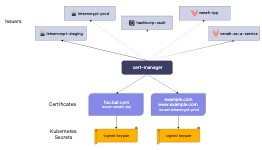
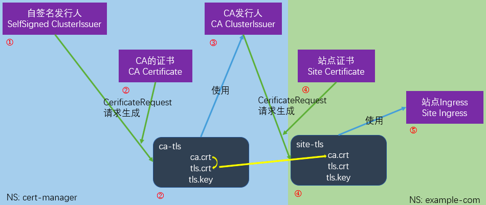

# 手动生成证书

在使用客户端证书认证的场景下，你可以通过 easyrsa、 openssl 或 cfssl 等工具以手工方式生成证书。

## easyrsa

easyrsa 支持以手工方式为你的集群生成证书。

1. 下载、解压、初始化打过补丁的 easyrsa3。

```shell
curl -LO https://storage.googleapis.com/kubernetes-release/easy-rsa/easy-rsa.tar.gz
tar xzf easy-rsa.tar.gz
cd easy-rsa-master/easyrsa3
./easyrsa init-pki

```
2. 生成新的证书颁发机构（CA）。参数 --batch 用于设置自动模式； 参数 --req-cn 用于设置新的根证书的通用名称（CN）。


```shell
./easyrsa --batch "--req-cn=${MASTER_IP}@`date +%s`" build-ca nopass

```

3. 生成服务器证书和秘钥。

参数 --subject-alt-name 设置 API 服务器的 IP 和 DNS 名称。 MASTER_CLUSTER_IP 用于 API 服务器和控制器管理器，通常取 CIDR 的第一个 IP， 由 --service-cluster-ip-range 的参数提供。 参数 --days 用于设置证书的过期时间。 下面的示例假定你的默认 DNS 域名为 cluster.local。

```shell
./easyrsa --subject-alt-name="IP:${MASTER_IP},"\
"IP:${MASTER_CLUSTER_IP},"\
"DNS:kubernetes,"\
"DNS:kubernetes.default,"\
"DNS:kubernetes.default.svc,"\
"DNS:kubernetes.default.svc.cluster,"\
"DNS:kubernetes.default.svc.cluster.local" \
--days=10000 \
build-server-full server nopass

```

4. 拷贝文件 pki/ca.crt、pki/issued/server.crt 和 pki/private/server.key 到你的目录中。

5. 在 API 服务器的启动参数中添加以下参数：

```shell
--client-ca-file=/yourdirectory/ca.crt
--tls-cert-file=/yourdirectory/server.crt
--tls-private-key-file=/yourdirectory/server.key
```

## openssl 

openssl 支持以手工方式为你的集群生成证书。

1. 生成一个 2048 位的 ca.key 文件

```shell
openssl genrsa -out ca.key 2048
```
2. 在 ca.key 文件的基础上，生成 ca.crt 文件（用参数 -days 设置证书有效期）

```shell
openssl req -x509 -new -nodes -key ca.key -subj "/CN=${MASTER_IP}" -days 10000 -out ca.crt
```

3. 生成一个 2048 位的 server.key 文件：

```shell
openssl genrsa -out server.key 2048

```

4. 创建一个用于生成证书签名请求（CSR）的配置文件。 保存文件（例如：csr.conf）前，记得用真实值替换掉尖括号中的值（例如：<MASTER_IP>）。 注意：MASTER_CLUSTER_IP 就像前一小节所述，它的值是 API 服务器的服务集群 IP。 下面的例子假定你的默认 DNS 域名为 cluster.local。

```shell

[ req ]
default_bits = 2048
prompt = no
default_md = sha256
req_extensions = req_ext
distinguished_name = dn

[ dn ]
C = <country>
ST = <state>
L = <city>
O = <organization>
OU = <organization unit>
CN = <MASTER_IP>

[ req_ext ]
subjectAltName = @alt_names

[ alt_names ]
DNS.1 = kubernetes
DNS.2 = kubernetes.default
DNS.3 = kubernetes.default.svc
DNS.4 = kubernetes.default.svc.cluster
DNS.5 = kubernetes.default.svc.cluster.local
IP.1 = <MASTER_IP>
IP.2 = <MASTER_CLUSTER_IP>

[ v3_ext ]
authorityKeyIdentifier=keyid,issuer:always
basicConstraints=CA:FALSE
keyUsage=keyEncipherment,dataEncipherment
extendedKeyUsage=serverAuth,clientAuth
subjectAltName=@alt_names

```

5. 基于上面的配置文件生成证书签名请求：

```shell
openssl req -new -key server.key -out server.csr -config csr.conf
```

6. 基于 ca.key、ca.crt 和 server.csr 等三个文件生成服务端证书：

```shell
openssl x509 -req -in server.csr -CA ca.crt -CAkey ca.key \
    -CAcreateserial -out server.crt -days 10000 \
    -extensions v3_ext -extfile csr.conf -sha256
```

7. 查看证书签名请求：

```shell
openssl req  -noout -text -in ./server.csr
```
8. 查看证书：

```shell
openssl x509  -noout -text -in ./server.crt
```

## cfssl

cfssl 是另一个用于生成证书的工具。

1. 下载、解压并准备如下所示的命令行工具

```shell
curl -L https://github.com/cloudflare/cfssl/releases/download/v1.5.0/cfssl_1.5.0_linux_amd64 -o cfssl
chmod +x cfssl
curl -L https://github.com/cloudflare/cfssl/releases/download/v1.5.0/cfssljson_1.5.0_linux_amd64 -o cfssljson
chmod +x cfssljson
curl -L https://github.com/cloudflare/cfssl/releases/download/v1.5.0/cfssl-certinfo_1.5.0_linux_amd64 -o cfssl-certinfo
chmod +x cfssl-certinfo
```

2. 创建一个目录，用它保存所生成的构件和初始化 cfssl：

```shell
mkdir cert
cd cert
../cfssl print-defaults config > config.json
../cfssl print-defaults csr > csr.json
```

3. 创建一个 JSON 配置文件来生成 CA 文件，例如：ca-config.json：

```json
{
  "signing": {
    "default": {
      "expiry": "8760h"
    },
    "profiles": {
      "kubernetes": {
        "usages": [
          "signing",
          "key encipherment",
          "server auth",
          "client auth"
        ],
        "expiry": "8760h"
      }
    }
  }
}
```

4. 创建一个 JSON 配置文件，用于 CA 证书签名请求（CSR），例如：ca-csr.json。 确认用你需要的值替换掉尖括号中的值。

```json
{
  "CN": "kubernetes",
  "key": {
    "algo": "rsa",
    "size": 2048
  },
  "names":[{
    "C": "<country>",
    "ST": "<state>",
    "L": "<city>",
    "O": "<organization>",
    "OU": "<organization unit>"
  }]
}
```
5. 生成 CA 秘钥文件（ca-key.pem）和证书文件（ca.pem）：

```shell
../cfssl gencert -initca ca-csr.json | ../cfssljson -bare ca
```
6. 创建一个 JSON 配置文件，用来为 API 服务器生成秘钥和证书，例如：server-csr.json。 确认用你需要的值替换掉尖括号中的值。MASTER_CLUSTER_IP 是为 API 服务器 指定的服务集群 IP，就像前面小节描述的那样。 以下示例假定你的默认 DNS 域名为cluster.local。

```json
{
  "CN": "kubernetes",
  "hosts": [
    "127.0.0.1",
    "<MASTER_IP>",
    "<MASTER_CLUSTER_IP>",
    "kubernetes",
    "kubernetes.default",
    "kubernetes.default.svc",
    "kubernetes.default.svc.cluster",
    "kubernetes.default.svc.cluster.local"
  ],
  "key": {
    "algo": "rsa",
    "size": 2048
  },
  "names": [{
    "C": "<country>",
    "ST": "<state>",
    "L": "<city>",
    "O": "<organization>",
    "OU": "<organization unit>"
  }]
}
```
7. 为 API 服务器生成秘钥和证书，默认会分别存储为server-key.pem 和 server.pem 两个文件。

```shell
../cfssl gencert -ca=ca.pem -ca-key=ca-key.pem \
     --config=ca-config.json -profile=kubernetes \
     server-csr.json | ../cfssljson -bare server

```


## 分发自签名的 CA 证书

客户端节点可能不认可自签名 CA 证书的有效性。 对于非生产环境，或者运行在公司防火墙后的环境，你可以分发自签名的 CA 证书到所有客户节点，并刷新本地列表以使证书生效。

在每一个客户节点，执行以下操作：

```shell

sudo cp ca.crt /usr/local/share/ca-certificates/kubernetes.crt
sudo update-ca-certificates

```

```shell
Updating certificates in /etc/ssl/certs...
1 added, 0 removed; done.
Running hooks in /etc/ca-certificates/update.d....
done.

```

# cert manager

## get started 
1. 文档

```shell
https://cert-manager.io/docs/getting-started/
```
2. install

```shell
kubectl apply -f https://github.com/cert-manager/cert-manager/releases/download/v1.11.0/cert-manager.yaml
```

3. 架构




## Ingress & cert-manager




Kubernetes环境
开发机器已配置hosts，域名site.example.com指向Ingress对外ip
站点已部署至k8s，Ingress开NodePort端口http 30080、https 30443，即现在可通过 http://site.example.com:30080 访问到nginx站点


1. 创建自签名发行者 

```yaml
# selfsigned-issuer.issuer.yaml
# 参考：https://cert-manager.io/docs/configuration/selfsigned/
apiVersion: cert-manager.io/v1
kind: Issuer
metadata:
  name: selfsigned-issuer
  namespace: cert-manager
spec:
  selfSigned: {}

```

2. 生成CA证书

```yaml

# ca-example-com.certificate.cert-manager.yaml
# 参考：https://cert-manager.io/docs/usage/certificate/
# api参考：https://cert-manager.io/docs/reference/api-docs/#cert-manager.io/v1alpha3.Certificate
apiVersion: cert-manager.io/v1
kind: Certificate
metadata:
  name: ca-example-com ###
  namespace: cert-manager ### 修改为cert-manager的namespace，以让ClusterIssuer的CA Issuer可以使用此证书
spec:
  # Secret names are always required.
  secretName: ca-example-com-tls ### Secret名字
  duration: 2160h # 90d
  renewBefore: 360h # 15d
  subject:
    organizations:
    - Example Inc. ###
  # The use of the common name field has been deprecated since 2000 and is
  # discouraged from being used.
  commonName: ca.example.com ###
  isCA: true ### 修改为true，isCA将将此证书标记为对证书签名有效。这会将cert sign自动添加到usages列表中。
  privateKey:
    algorithm: RSA
    encoding: PKCS1
    size: 2048
  #usages: ### 注释了usages，使用情况是证书要求的x509使用情况的集合。默认为digital signature，key encipherment如果未指定。
  #  - server auth
  #  - client auth
  # At least one of a DNS Name, URI, or IP address is required.
  dnsNames:
  - ca.example.com ###
  #uris: ### 注释了uris、ipAddresses
  #- spiffe://cluster.local/ns/sandbox/sa/example
  #ipAddresses:
  #- 192.168.0.5
  # Issuer references are always required.
  issuerRef:
    name: selfsigned-issuer ### 指定为自签名发行人
    # We can reference ClusterIssuers by changing the kind here.
    # The default value is Issuer (i.e. a locally namespaced Issuer)
    kind: Issuer
    # This is optional since cert-manager will default to this value however
    # if you are using an external issuer, change this to that issuer group.
    group: cert-manager.io

```

>
>  ###为相对于参考的修改项
>  我们将要把CA Issuer创建为 ClusterIssuer，因 ClusterIssuer 只能访问cert-manager下的Secret，所以这个CA Certificate创建在此名字空间下，其Secret也会被创建在此名字空间下。当然也可以更改ClusterIssuer默认可访问的名字空间，参考：https://cert-manager.io/docs/faq/cluster-resource/

3、创建CA发行者（ClusterIssuer）

```yaml

# ca-issuer.clusterissuer.yaml
# 参考：https://cert-manager.io/docs/configuration/ca/
apiVersion: cert-manager.io/v1
kind: ClusterIssuer ### ClusterIssuer
metadata:
  name: ca-issuer
  namespace: cert-manager ### ClusterIssuer下namespace无效
spec:
  ca:
    secretName: ca-example-com-tls ###

```

> ###为相对于参考的修改项
> CA Issuer创建为ClusterIssuer，可为其他名字空间的Certificate发行证书

4. 生成网站证书 

```yaml

# site-example-com.certificate.example-com.yaml
# 参考：https://cert-manager.io/docs/usage/certificate/
# api参考：https://cert-manager.io/docs/reference/api-docs/#cert-manager.io/v1alpha3.Certificate
apiVersion: cert-manager.io/v1
kind: Certificate
metadata:
  name: site-example-com ###
  namespace: example-com ### 站点所在名字空间
spec:
  # Secret names are always required.
  secretName: site-example-com-tls ### Secret名字
  duration: 2160h # 90d
  renewBefore: 360h # 15d
  subject:
    organizations:
    - Example Inc. ###
  # The use of the common name field has been deprecated since 2000 and is
  # discouraged from being used.
  commonName: site.example.com ###
  isCA: false
  privateKey:
    algorithm: RSA
    encoding: PKCS1
    size: 2048
  #usages: ### 注释了usages，使用情况是证书要求的x509使用情况的集合。默认为digital signature，key encipherment如果未指定。
  #  - server auth
  #  - client auth
  # At least one of a DNS Name, URI, or IP address is required.
  dnsNames:
  - site.example.com ###
  #uris: ### 注释了uris、ipAddresses
  #- spiffe://cluster.local/ns/sandbox/sa/example
  #ipAddresses:
  #- 192.168.0.5
  # Issuer references are always required.
  issuerRef:
    name: ca-issuer ### 使用CA Issuer
    # We can reference ClusterIssuers by changing the kind here.
    # The default value is Issuer (i.e. a locally namespaced Issuer)
    kind: ClusterIssuer ### CA Issuer是ClusterIssuer
    # This is optional since cert-manager will default to this value however
    # if you are using an external issuer, change this to that issuer group.
    group: cert-manager.io

```

5. 将网站证书配置到Ingress

```yaml

# site-example-com.ingress.example-com.yaml
# 参考：https://kubernetes.io/zh/docs/concepts/services-networking/ingress/#tls
kind: Ingress
apiVersion: extensions/v1beta1
metadata:
  name: site-example-com
  namespace: example-com
  annotations:
    kubernetes.io/ingress.class: nginx
spec:
  tls:
    - hosts:
        - site.example.com
      secretName: site-example-com-tls
  rules:
    - host: site.example.com
      http:
        paths:
          - path: /
            pathType: ImplementationSpecific
            backend:
              serviceName: nginx
              servicePort: 80


```

6. 将CA证书安装至本地

获取CA证书——ca-example-com-tls.secret.cert-manager里的tls.crt文件

# go 操作证书


