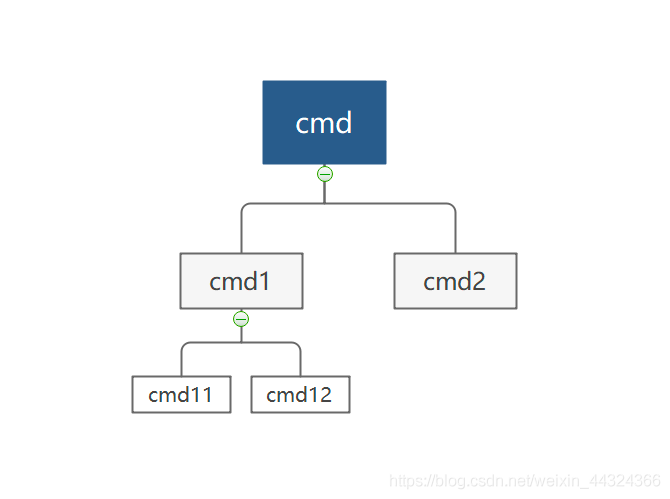

# cobra

## get started 

URL :  https://github.com/spf13/cobra

cobra包提供以下功能：

- 轻松创建基于子命令的 CLI：如app server、app fetch等。
- 自动添加-h,--help等帮助性Flag
- 自动生成命令和Flag的帮助信息
- 创建完全符合 POSIX 的Flag(标志)（包括长、短版本）
- 支持嵌套子命令
- 支持全局、本地和级联Flag
- 智能建议（app srver... did you mean app server?）
- 为应用程序自动生成 shell 自动完成功能（bash、zsh、fish、powershell）
- 为应用程序自动生成man page
- 命令别名，可以在不破坏原有名称的情况下进行更改
- 支持灵活自定义help、usege等。
- 无缝集成viper构建12-factor应用

cobra中主要概念
- commands：表示执行动作
- arguments：表示执行参数
- flags结构： 表示执行标识符

```shell

#appname command  arguments
docker pull alpine:latest
#appname command flag
docker ps -a
#appname command flag argument
git commit -m "msg"

```

## install 

```shell

go get -u github.com/spf13/cobra@latest
go install github.com/spf13/cobra-cli@latest

```
```go

import "github.com/spf13/cobra"

```

## 初始化项目

```shell
cobra-cli init
go mod tidy
```

### 查看目录结构
```shell
(base) ➜  cobra git:(main) ✗ tree 
.
├── LICENSE
├── cmd
│    └── root.go
├── go.mod
├── go.sum
└── main.go

```

### 添加子命令

现在我们添加 wget, ping , time 子命令

```shell
go run main.go --help

```


```shell
(base) ➜  cobra git:(main) ✗ go run main.go
A longer description that spans multiple lines and likely contains
examples and usage of using your application. For example:

Cobra is a CLI library for Go that empowers applications.
This application is a tool to generate the needed files
to quickly create a Cobra application.

Usage:
  cobra [command]

Available Commands:
  completion  Generate the autocompletion script for the specified shell
  help        Help about any command
  ping        A brief description of your command
  time        A brief description of your command
  wget        A brief description of your command


```

## 为Command添加选项(flags)

- 选项(flag)用来控制 command 的具体行为， 根据选项作用范围，可以分为两类：
  - persistent
  - local

- 对于 persistent 类型的选项，即可以设置给该 command ， 用可以设置给该 command 的子 command, 对于全局性选项比较适合设置成 persistent, 比如控制输出的 verbose 选项 

```go
var Verbose bool
rootCmd.PersistentFlags().BoolVarP(&Verbose, "verbose", "v", false, "verbose output")

```

- local 类型的选项只能设置给当前指定的 command , 比如下面定义的 source 选项， 该选项不能指定给 rootCmd以外其他 command

```go
var Source string
rootCmd.Flags().StringVarP(&Source, "source", "s", "", "source directory for read from")

```

## 命令执行的参数

- 以常见的 ls 命令， 其命令的格式为：

```shell
ls [OPTION] ... [FILE] ... 
```

- 其中的 OPTION 对应cobra 的 flags,  以 - 或者 -- 开头
- 而 FILE 是对应参数 (arguments) 或者 位置参数
- 一般规则参数在所有的选项后面， 上面 。。。 表示多个选项和多个参数

## 验证方法

cobra 提供一些验证方法：

- NoArgs : 如果存在任何位置参数，该命令报错
- ArbitraryArgs: 该命令会接受任何位置参数
- OnlyValidArgs: 如果有任何位置参数不在命令的 ValidArgs 字段中该命令报错
- MinimumNArgs(int): 至少有 N 个位置参数，否则报错
- MaximumNArgs(int): 至多有 N 个位置参数，否则报错
- ExactArgs(int): 必须有 N 个位置参数， 否则报错
- ExactValidArgs(int):必须有 N个位置参数， 而且都在命令ValidArgs 字段中，否则报错
- RangeArgs(min, max): 如果位置参数的个数不在区间 min 和  max 之间报错

```go

/*
Copyright © 2023 NAME HERE <EMAIL ADDRESS>

*/
package cmd

import (
	"fmt"
	"strings"

	"github.com/spf13/cobra"
)

var echoTimes int

// timeCmd represents the time command
var timeCmd = &cobra.Command{
	Use:   "time",
	Short: "Echo anything to the screen more time",
	Long: `echo things multiple times back to the user by providing
a count and a string
`,
    Example: "cobra time -t 3 hello",
    Args: cobra.MinimumNArgs(1),
    PersistentPreRun: func(cmd *cobra.Command, args []string) {
		fmt.Println("[step_1] PersistentPreRun:")
	},
	PreRun: func(cmd *cobra.Command, args []string) {
		fmt.Println("[step_2] PreRun:")
	},
	Run: func(cmd *cobra.Command, args []string) {
		fmt.Println("[step_3] Run:")
		for i:=0; i<echoTimes;i++ {
			fmt.Println("Echo:" + strings.Join(args, " "))
		}
	},

	PostRun: func(cmd *cobra.Command, args []string) {
		fmt.Println("[step_4] PostRun:")
	},

	PersistentPostRun: func(cmd *cobra.Command, args []string) {
		fmt.Println("[step_5] PersistentPostRun:")
	},
}

func init() {
	rootCmd.AddCommand(timeCmd)
	timeCmd.Flags().IntVarP(&echoTimes, "times", "t", 1, "times to echo input")
	// Here you will define your flags and configuration settings.

	// Cobra supports Persistent Flags which will work for this command
	// and all subcommands, e.g.:
	// timeCmd.PersistentFlags().String("foo", "", "A help for foo")

	// Cobra supports local flags which will only run when this command
	// is called directly, e.g.:
	// timeCmd.Flags().BoolP("toggle", "t", false, "Help message for toggle")
}


```


## 命令执行

1. 执行次序

* PersistentPreRun()
* PreRun()
* Run()
* PostRun()
* PersistentPostRun()

2. 命令

```go
 // The *Run functions are executed in the following order:
    //   * PersistentPreRun()
    //   * PreRun()
    //   * Run()
    //   * PostRun()
    //   * PersistentPostRun()
    // All functions get the same args, the arguments after the command name.
    //
    // PersistentPreRun: children of this command will inherit and execute.
    PersistentPreRun func(cmd *Command, args []string)
    // PersistentPreRunE: PersistentPreRun but returns an error.
    PersistentPreRunE func(cmd *Command, args []string) error
    // PreRun: children of this command will not inherit.
    PreRun func(cmd *Command, args []string)
    // PreRunE: PreRun but returns an error.
    PreRunE func(cmd *Command, args []string) error
    // Run: Typically the actual work function. Most commands will only implement this.
    Run func(cmd *Command, args []string)
    // RunE: Run but returns an error.
    RunE func(cmd *Command, args []string) error
    // PostRun: run after the Run command.
    PostRun func(cmd *Command, args []string)
    // PostRunE: PostRun but returns an error.
    PostRunE func(cmd *Command, args []string) error
    // PersistentPostRun: children of this command will inherit and execute after PostRun.
    PersistentPostRun func(cmd *Command, args []string)
    // PersistentPostRunE: PersistentPostRun but returns an error.
    PersistentPostRunE func(cmd *Command, args []string) error


```

输出

```shell

./cobra time -t 3 hello  

[step_1] PersistentPreRun:
[step_2] PreRun:
[step_3] Run:
Echo:hello
Echo:hello
Echo:hello
[step_4] PostRun:
[step_5] PersistentPostRun:


```

## cobra子命令用法



```go
rootCmd.AddCommand(timeCmd)

```


## 从环境变量，配置文件， 命令行参数读取 Flags

1. PersistentPreRun, 初始化从配置文件和环境变量读取
```go
var timeCmd = &cobra.Command{
	Use:   "time",
	Short: "Echo anything to the screen more time",
	Long: `echo things multiple times back to the user by providing
a count and a string
`,
    Example: "cobra time -t 3 hello",
    Args: cobra.MinimumNArgs(1),
    PersistentPreRun: func(cmd *cobra.Command, args []string) {
		fmt.Println("[step_1] PersistentPreRun:")
		initialize(cmd)
	},
	PreRun: func(cmd *cobra.Command, args []string) {
		fmt.Println("[step_2] PreRun:")
	},
	Run: func(cmd *cobra.Command, args []string) {
		fmt.Println("[step_3] Run:")
		fmt.Printf("echoTime:%d, echoSeceond:%d\n", echoTimes, echoSeconds)
		for i:=0; i<echoTimes;i++ {
			fmt.Println("Echo:" + strings.Join(args, " "))
		}
	},

	PostRun: func(cmd *cobra.Command, args []string) {
		fmt.Println("[step_4] PostRun:")
	},

	PersistentPostRun: func(cmd *cobra.Command, args []string) {
		fmt.Println("[step_5] PersistentPostRun:")
	},
}


```

2. 读取方法
```go


func initialize(cmd *cobra.Command) error {
	v := viper.New()

	// When we bind flags to environment variables expect that the
	// environment variables are prefixed, e.g. a flag like --number
	// binds to an environment variable DUBBO_NUMBER. This helps
	// avoid conflicts.
	v.SetEnvPrefix(envPrefix)

	// Environment variables can't have dashes in them, so bind them to their equivalent
	// keys with underscores, e.g. --favorite-color to DUBBO_FAVORITE_COLOR
	v.SetEnvKeyReplacer(strings.NewReplacer("-", "_"))

	// Bind to environment variables
	// Works great for simple config names, but needs help for names
	// like --favorite-color which we fix in the bindFlags function
	v.AutomaticEnv()

	// Bind the current command's flags to viper
	bindFlags(cmd, v)

	return nil
}

// Bind each cobra flag to its associated viper configuration (config file and environment variable)
func bindFlags(cmd *cobra.Command, v *viper.Viper) {
	cmd.Flags().VisitAll(func(f *pflag.Flag) {
		// Determine the naming convention of the flags when represented in the config file
		configName := f.Name
		// If using camelCase in the config file, replace hyphens with a camelCased string.
		// Since viper does case-insensitive comparisons, we don't need to bother fixing the case, and only need to remove the hyphens.
		if replaceHyphenWithCamelCase {
			configName = strings.ReplaceAll(f.Name, "-", "")
		}

		// Apply the viper config value to the flag when the flag is not set and viper has a value
		if !f.Changed && v.IsSet(configName) {
			val := v.Get(configName)
			cmd.Flags().Set(f.Name, fmt.Sprintf("%v", val))
		}
	})
}

```

3. 获取Flags

```go

timeCmd.Flags().IntVarP(&echoSeconds, "second-slash", "s", 0, "times to echo second")


```


