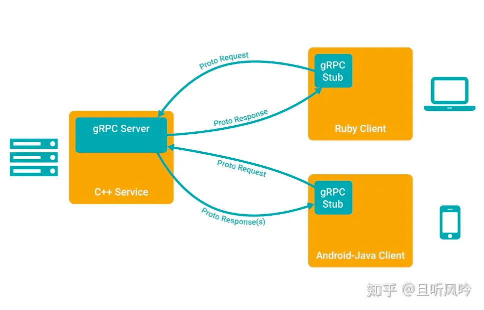
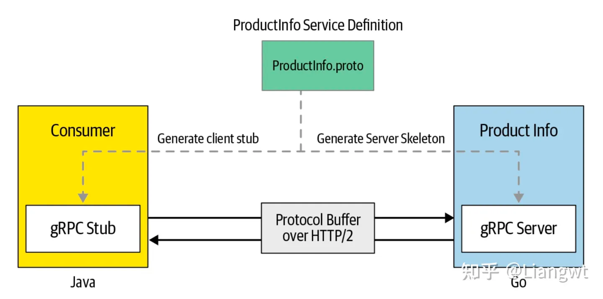

# gRPC是什么



大致请求流程:

1. 客户端（gRPC Stub）调用 A 方法，发起 RPC 调用。
2. 对请求信息使用 Protobuf 进行对象序列化压缩（IDL）。
3. 服务端（gRPC Server）接收到请求后，解码请求体，进行业务逻辑处理并返回。
4. 对响应结果使用 Protobuf 进行对象序列化压缩（IDL）。
5. 客户端接受到服务端响应，解码请求体。回调被调用的 A 方法，唤醒正在等待响应（阻塞）的客户端调用并返回响应结果。

# install

## protoc install
```shell
Linux, using apt or apt-get, for example:
$ apt install -y protobuf-compiler
$ protoc --version  # Ensure compiler version is 3+


MacOS, using Homebrew:
$ brew install protobuf
$ protoc --version  # Ensure compiler version is 3+
```

## golang插件

```shell
$ go install google.golang.org/protobuf/cmd/protoc-gen-go@v1.28
$ go install google.golang.org/grpc/cmd/protoc-gen-go-grpc@v1.2
```

# protobuf基础

gRPC是谷歌开源的一款高性能、支持多种开发语言的服务框架，对于一个rpc我们关注如下几方面：

序列化协议。gRPC使用protobuf，首先使用protobuf定义服务，然后使用这个文件来生成客户端和服务端的代码。因为pb是跨语言的，因此即使服务端和客户端语言并不一致也是可以互相序列化和反序列化的

网络传输层。gRPC使用http2.0协议，http2.0相比于HTTP 1.x ，大幅度的提升了 web 性能。



## Protobuf IDL

所以先来介绍下protobuf的idl怎么写。protobuf最新版本为proto3，

在这里你可以看到详细的文档说明：https://protobuf.dev/programming-guides/proto3/

### syntax 声明

proto3 需要在文件开头声明语法版本为 proto3，如果不用 syntax 声明会被认为使用 proto2 语法

```shell
syntax = "proto3";
```

### 设置包名 - package

用 package 声明当前 proto 文件的包名，声明包名后，其它 proto 文件通过 package name 引用包内的定义。

```shell
package foo.bar;

message Open { ... }
```
其它 proto 文件通过 package name 引用：

```shell
message Foo {
  required foo.bar.Open open = 1;
}
```

没有用 option go_package = “XXX” 指定生成的 Go 代码所在路径时，默认使用 package name 作为生成代码的 package。


### 配置项 - option

google/protobuf/descriptor.proto 列出了所有支持的 option 以及作用。

option 分为file-level、message-level 和 field-level 三种级别，分别在不同的位置使用。

- File-level options

file 级别的 options 用法：

```shell

option go_package = "google.golang.org/protobuf/types/descriptorpb";
option java_package = "com.google.protobuf";
option java_outer_classname = "DescriptorProtos";
option csharp_namespace = "Google.Protobuf.Reflection";
option objc_class_prefix = "GPB";
option cc_enable_arenas = true;

// descriptor.proto must be optimized for speed because reflection-based
// algorithms don't work during bootstrapping.
option optimize_for = SPEED;
```

- message-level options

message 级别的 option 用法：

```shell
message Foo {
  option message_set_wire_format = true;
  extensions 4 to max;
}
```

- field-level options

field 级别的 option 用法：

```shell

repeated int32 samples = 4 [packed = true];
optional int32 old_field = 6 [deprecated=true];

```

- 自定义 options

可以通过扩展 google.protobuf.XXXOptions 增加自定义的 option：

```shell
import "google/protobuf/descriptor.proto";

extend google.protobuf.MessageOptions {   
  optional string my_option = 51234;       // 自定义 message-level option
}

message MyMessage {
  option (my_option) = "Hello world!";
}
```

### package 引用

用 import 导入目标文件：

```shell
import "myproject/other_protos.proto";
```

### import public

A 文件通过 import public 引用 B 文件后，只需引用 A 文件就可以直接使用 B 文件中的定义。

import public 不支持 java，生成 java 代码时不能使用该功能。

```shell
// new.proto
// All definitions are moved here

// old.proto
// This is the proto that all clients are importing.
import public "new.proto";
import "other.proto";

// client.proto
import "old.proto";
// You use definitions from old.proto and new.proto, but not other.proto

```

### 引用其它 message

```shell
message SearchResponse {
  repeated Result results = 1;
}

message Result {
  string url = 1;
  string title = 2;
  repeated string snippets = 3;
}
```

### 引用嵌套定义 message

```shell
message SearchResponse {
  message Result {
    required string url = 1;
    optional string title = 2;
    repeated string snippets = 3;
  }
  repeated Result result = 1;
}

// 引用 SearchResponse 中定义的 Result
message SomeOtherMessage {
  optional SearchResponse.Result result = 1;
}
```

### RPC Service 接口定义

rpc 接口定义方法：

```shell
service SearchService {
  rpc Search(SearchRequest) returns (SearchResponse);
}
```

### stream 类型输入和输出

gRPC Service definition 对 stream 的用法做了简单介绍，stream 表示支持 a sequence of messages，按照作用位置可以把 rpc 接口分为四类。

```shell
// 请求和响应都是一个 message
rpc SayHello(HelloRequest) returns (HelloResponse);     
// 请求是一个 message，响应是多个 message
rpc LotsOfReplies(HelloRequest) returns (stream HelloResponse);
// 请求是多个 message，响应是一个 message
rpc LotsOfGreetings(stream HelloRequest) returns (HelloResponse);
// 请求和响应都是多个 message
rpc BidiHello(stream HelloRequest) returns (stream HelloResponse);
```


### 定义消息

protobuf里最基本的类型就是message，每一个messgae都会有一个或者多个字段(field)，其中字段包含如下元素


- 类型：类型不仅可以是标量类型（int、string等），也可以是复合类型（enum等），也可以是其他message
- 字段名：字段名比较推荐的是使用下划线/分隔名称
- 字段编号：一个messgae内每一个字段编号都必须唯一的，在编码后其实传递的是这个编号而不是字段名
- 字段规则：消息字段可以是以下字段之一
  - singular：格式正确的消息可以有零个或一个字段（但不能超过一个）。使用 proto3 语法时，如果未为给定字段指定其他字段规则，则这是默认字段规则
  - optional：与 singular 相同，不过您可以检查该值是否明确设置
  - repeated：在格式正确的消息中，此字段类型可以重复零次或多次。系统会保留重复值的顺序
  - map：这是一个成对的键值对字段
- 保留字段：为了避免再次使用到已移除的字段可以设定保留字段。如果任何未来用户尝试使用这些字段标识符，编译器就会报错

field 的编号：

> - field 编号发布后不能再更改
> - 编号 1～15 用一个字节描述，编号 16～2047 用两个字节
> - 编号最小值是 1，最大 2^29-1
> - 19000～19999 用于内部实现，不能使用

注意事项 ：

> - 不要修改 field 的编号
> - field 可以删除，但是 field num 不能再次分配给其它 field

### 标量值类

支持的类型：Scalar Value Types

```shell
double
float
int32
int64
uint32
uint64
sint32: 对负数的编码更高效
sint64: 对负数的编码更高效
fixed32：永远 4 字节，对应大于 2^28 的数值编码更高效
fixed64：永远 8 字节，对应大于 2^56 的数值编码更高效
sfixed32： 永远 4 字节
sfixed64： 永远 8 字节
bool：
string：UTF-8 或者 7-bit ASCII Text
bytes：
```

### 数组

```shell
message SearchResponse {
  repeated Result results = 1;
}

message Result {
  string url = 1;
  string title = 2;
  repeated string snippets = 3;
}
```

### 枚举

- enum 可以独立定义，也可以在 message 内部定义：

```shell
message SearchRequest {
  required string query = 1;
  optional int32 page_number = 2;
  optional int32 result_per_page = 3 [default = 10];
  enum Corpus {
    UNIVERSAL = 0;
    WEB = 1;
    IMAGES = 2;
    LOCAL = 3;
    NEWS = 4;
    PRODUCTS = 5;
    VIDEO = 6;
  }
  optional Corpus corpus = 4 [default = UNIVERSAL];
}
```

- enum 别名

```shell
enum EnumAllowingAlias {
  // 枚举值存在重复时，如果不指定 allow_alias=true，会报错
  option allow_alias = true;
  EAA_UNSPECIFIED = 0;
  EAA_STARTED = 1;
  EAA_RUNNING = 1;
  EAA_FINISHED = 2;
}

```

- enum 保留值

可以保留部分枚举数值，max 表示最大值：

```shell
enum Foo {
  reserved 2, 15, 9 to 11, 40 to max;   // 用 max 表示最大值
  reserved "FOO", "BAR";                // 同一行中数值和名称不能混用
}
```

### 嵌套类型 - Nested Types

```shell
message SearchResponse {
  message Result {
    string url = 1;
    string title = 2;
    repeated string snippets = 3;
  }
  repeated Result results = 1;
}
```

可以多层嵌套，位于不同层中的 message 可以重名：

```shell

message Outer {                  // Level 0
  message MiddleAA {  // Level 1
    message Inner {   // Level 2
      int64 ival = 1;
      bool  booly = 2;
    }
  }
  message MiddleBB {  // Level 1
    message Inner {   // Level 2
      int32 ival = 1;
      bool  booly = 2;
    }
  }
}
```

### 任意类型 - Any

Any 用于装载任意类型的 message，它是 protbuf 内置的类型，位于 google/protobuf/any.proto 文件：

```shell
message Any {
  string type_url = 1;
  bytes value = 2;
}
```

Any 有两个 filed：

- type_url 是 message 的类型标识符，默认为 type.googleapis.com/packagename.messagename。
- value 是序列化后值

> [how to use protobuf.any in golang](https://stackoverflow.com/questions/64055785/how-to-use-protobuf-any-in-golang) 中提到，
> Go 可以用 “google.golang.org/protobuf/types/known/anypb” 中的 MarshalFrom() /UnmarshalTo()/UnmarshalNew() 将其它 message 转换成 Any 类型以及在转回。

```go
import "testing"
import "proto_code_go/proto_gen/demo"
import "google.golang.org/protobuf/types/known/anypb"
import "google.golang.org/protobuf/proto"

func TestPackAny(t *testing.T) {
    person := &demo.Person{
        Name: "lijiaocn.com",
    }
    any := &anypb.Any{
        TypeUrl: "",
        Value:   nil,
    }
    if err := anypb.MarshalFrom(any, person, proto.MarshalOptions{}); err != nil {
        t.Errorf("anypb.MarshalFrom fail: err=%v", err)
    } else {
        t.Logf("%v", any)
    }

    anotherPersion, err := anypb.UnmarshalNew(any, proto.UnmarshalOptions{})
    if err != nil {
        t.Errorf("anypb.UnMarshalNew fail: err=%v", err)
    } else {
        t.Logf("%v", anotherPersion.ProtoReflect().Descriptor().FullName())
    }
}
```

### 联合类型 - oneof

oneof 中不可以直接使用 map 和 repeated，在 proto2 中还要求不能使用 requried、optional。


```shell

message SampleMessage {
  oneof test_oneof {
     // 不可以直接使用 map 和 repeated
     string name = 4;  
     // SubMessage 内部的 field 可以用 requried、optional、repeated 修饰 
     SubMessage sub_message = 9;   
  }
}
```

### 哈希类型 - map

```shell
map<key_type, value_type> map_field = N;
```

map 的注意事项：

- key_type 不能是 float 和 bytes
- value_type 不能是 map
- map 不能用 repeated, optional, required 修饰
- map 内的 key-value 顺序是不保证的

# Reference
* https://www.zhihu.com/column/c_1600178812372598784?utm_id=0
* https://blog.csdn.net/weixin_43143310/article/details/125064588
* https://www.lijiaocn.com/%E7%BC%96%E7%A8%8B/2022/11/29/protobuf-v3.html


# Protoc 

```shell
$ protoc --help
Usage: protoc [OPTION] PROTO_FILES

  -IPATH, --proto_path=PATH   指定搜索路径
  --plugin=EXECUTABLE:
  
  ....
 
  --cpp_out=OUT_DIR           Generate C++ header and source.
  --csharp_out=OUT_DIR        Generate C# source file.
  --java_out=OUT_DIR          Generate Java source file.
  --js_out=OUT_DIR            Generate JavaScript source.
  --objc_out=OUT_DIR          Generate Objective C header and source.
  --php_out=OUT_DIR           Generate PHP source file.
  --python_out=OUT_DIR        Generate Python source file.
  --ruby_out=OUT_DIR          Generate Ruby source file
  
   @<filename>                proto文件的具体位置
```

```shell

protoc --proto_path=src --go_out=out --go_opt=paths=source_relative foo.proto bar/baz.proto
```

注意: 
> protoc-gen-go要求pb文件必须指定go包的路径，即
>
> option go_package = "ecommerce/";

--go_out  :指定go代码生成的基本路径

--go_opt：设定插件参数

protoc-gen-go提供了 --go_opt 来为其指定参数，并可以设置多个

1、如果使用 paths=import , 生成的文件会按go_package路径来生成，当然是在--go_out目录下，即

$go_out/$go_package/pb_filename.pb.go

2、如果使用 paths=source_relative ， 就在当前pb文件同路径下生成代码。注意pb的目录也被包含进去了。即
$go_out/$pb_filedir/$pb_filename.pb.go


## grpc go插件

在google.golang.org/protobuf中，protoc-gen-go纯粹用来生成pb序列化相关的文件，不再承载gRPC代码生成功能。

生成gRPC相关代码需要安装grpc-go相关的插件protoc-gen-go-grpc

```shell
$ go install google.golang.org/grpc/cmd/protoc-gen-go-grpc@latest
```

执行code gen命令

```shell
$ protoc --go_out=. --go_opt=paths=source_relative \
--go-grpc_out=. --go-grpc_opt=paths=source_relative \
order.proto 

```

- --go-grpc_out : 指定grpc go代码生成的基本路径

- --go-grpc_opt: 和protoc-gen-go类似，protoc-gen-go-grpc提供 --go-grpc_opt 来指定参数，并可以设置多个

- 命令会产生如下文件: order_grpc.pb.go


## 同时生成 gen-go, gen-go-grpc

```shell
 protoc -I order/  --go_out=. --go-grpc_out=. order.proto

```

# GRPC 四种传输模式

## 项目
- 项目目录： dev/grpc/basic
- 项目文件：
```shell
├── client
│   └── main.go
├── go.mod
├── go.sum
├── order
│   ├── order.pb.go
│   ├── order.proto
│   └── order_grpc.pb.go
└── server
    ├── main.go
    └── order.go

```
- Proto

```shell
syntax = "proto3";

package order;


option go_package = "order/";
option java_multiple_files = true;

import "google/protobuf/wrappers.proto";
import "google/protobuf/timestamp.proto";

message Order {
  string id = 1;
  repeated string items = 2;
  string description = 3;
  float price = 4;
  string destination = 5;

  enum AddressType {
    HOME = 0;
    WORK = 1;
  }

  message Address {
    string address = 1;
    AddressType type = 2;
  }

  repeated Address addresses = 6;

  google.protobuf.Timestamp last_updated = 7;

}

message CombinedShipment {
  string id = 1;
  string status = 2;
  repeated Order orderList = 3;
}

service OrderManagement {
  rpc addOrder(Order) returns (google.protobuf.StringValue);
  rpc getOrder(google.protobuf.StringValue) returns (Order);
  rpc searchOrders(google.protobuf.StringValue) returns (stream Order);
  rpc updateOrders(stream Order) returns (google.protobuf.StringValue);
  rpc processOrders(stream google.protobuf.StringValue)
      returns (stream CombinedShipment);
}

```

- 生成代码

```shell
 protoc -I order/  --go_out=. --go-grpc_out=. order.proto
```

- 服务端数据

```go
var (
	_      pb.OrderManagementServer = &OrderManagementImpl{}
	orders                          = make(map[string]pb.Order, 0)
)

```

## 单向调用 

- 服务端实现

```go

// AddOrder Simple RPC
func (s *OrderManagementImpl) AddOrder(ctx context.Context, orderReq *pb.Order) (*wrapperspb.StringValue, error) {
	log.Println("AddOrder:")
	log.Printf("Order Added. ID : %v", orderReq.Id)
	orders[orderReq.Id] = *orderReq
	return &wrapperspb.StringValue{Value: "Order Added: " + orderReq.Id}, nil
}

// GetOrder Simple RPC
func (s *OrderManagementImpl) GetOrder(ctx context.Context, orderId *wrapperspb.StringValue) (*pb.Order, error) {
	log.Println("GetOrder:")
	ord, exists := orders[orderId.Value]
	if exists {
		return &ord, status.New(codes.OK, "").Err()
	}

	return nil, status.Errorf(codes.NotFound, "Order does not exist. : ", orderId)
}
```

- 客户端

```go

func UnaryRPC(c pb.OrderManagementClient, ctx context.Context) {
	// Add Order
	order := pb.Order{Id: "101", Items: []string{"iPhone XS", "Mac Book Pro"}, Destination: "San Jose, CA", Price: 2300.00}
	res, err := c.AddOrder(ctx, &order)
	if err != nil {
		panic(err)
	}

	log.Print("AddOrder Response -> ", res.Value)

	// Get Order
	retrievedOrder, err := c.GetOrder(ctx, &wrapperspb.StringValue{Value: "101"})
	if err != nil {
		panic(err)
	}

	log.Print("GetOrder Response -> : ", retrievedOrder)

	// Add Order
	order = pb.Order{Id: "102", Items: []string{"Oppo", "Vivo"}, Destination: "Tom, Shanghai", Price: 1300.00}
	res, err = c.AddOrder(ctx, &order)
	if err != nil {
		panic(err)
	}

	log.Print("AddOrder Response -> ", res.Value)

	// Get Order
	retrievedOrder, err = c.GetOrder(ctx, &wrapperspb.StringValue{Value: "102"})
	if err != nil {
		panic(err)
	}

	log.Print("GetOrder Response -> : ", retrievedOrder)

}

```

- tproxy

```shell
 tproxy -p 9008 -r localhost:9009 -t grpc
```


- 可以观察GRPC调用协议情况

1. 调用 AddOrder 和 GetOrder 分别用stream:1 和 stream:3

```shell
(base) ➜  GolandProjects tproxy -p 9008 -r localhost:9009 -t grpc
20:05:31.766 Listening on 127.0.0.1:9008...
20:05:47.199 [1] Accepted from: 127.0.0.1:52784
20:05:47.202 [1] Connected to server: 127.0.0.1:9009

20:05:47.203 from CLIENT [1]
grpc:(http2:preface)
00000000  50 52 49 20 2a 20 48 54  54 50 2f 32 2e 30 0d 0a  |PRI * HTTP/2.0..|
00000010  0d 0a 53 4d 0d 0a 0d 0a                           |..SM....|

20:05:47.203 from SERVER [1]
grpc:(http2:settings max_frame_size:16384)
00000000  00 00 06 04 00 00 00 00  00 00 05 00 00 40 00     |.............@.|
grpc:(http2:settings:ack)
00000000  00 00 00 04 01 00 00 00  00                       |.........|

20:05:47.203 from CLIENT [1]
grpc:(http2:settings)
00000000  00 00 00 04 00 00 00 00  00                       |.........|

20:05:47.203 from SERVER [1]
grpc:(http2:window_update window_size_increment:57)
00000000  00 00 04 08 00 00 00 00  00 00 00 00 39           |............9|
grpc:(http2:ping 02041010090e0707)
00000000  00 00 08 06 00 00 00 00  00 02 04 10 10 09 0e 07  |................|
00000010  07                                                |.|

20:05:47.203 from CLIENT [1]
grpc:(http2:settings:ack)
00000000  00 00 00 04 01 00 00 00  00                       |.........|
grpc:(http2:headers stream:1 end_headers)
00000000  00 00 4e 01 04 00 00 00  01 83 86 45 97 60 f6 48  |..N........E.`.H|
00000010  5b 17 d5 64 85 b3 40 ea  1c c5 a4 b5 25 81 c9 26  |[..d..@.....%..&|
00000020  ab 24 2d 9f 41 8a 08 9d  5c 0b 81 70 dc 7c 00 7b  |.$-.A...\..p.|.{|
00000030  5f 8b 1d 75 d0 62 0d 26  3d 4c 4d 65 64 7a 8d 9a  |_..u.b.&=LMedz..|
00000040  ca c8 b4 c7 60 2b b4 d2  e1 5a 42 f7 40 02 74 65  |....`+...ZB.@.te|
00000050  86 4d 83 35 05 b1 1f                              |.M.5...|

:method: POST
:scheme: http
:path: /order.OrderManagement/addOrder
:authority: 127.0.0.1:9008
content-type: application/grpc
user-agent: grpc-go/1.44.1-dev
te: trailers

20:05:47.204 from CLIENT [1]
grpc:(http2:data stream:1 len:57 end_stream)
00000000  00 00 39 00 01 00 00 00  01 00 00 00 00 34 0a 03  |..9..........4..|
00000010  31 30 31 12 09 69 50 68  6f 6e 65 20 58 53 12 0c  |101..iPhone XS..|
00000020  4d 61 63 20 42 6f 6f 6b  20 50 72 6f 25 00 c0 0f  |Mac Book Pro%...|
00000030  45 2a 0f 0a 0d 54 6f 6d  2c 20 53 68 61 6e 67 68  |E*...Tom, Shangh|
00000040  61 69                                             |ai|

#1: 101
#2:
  #13: (fixed64)
#2: Mac Book Pro
#4: (fixed32)
#5:
  #1: Tom, Shanghai

20:05:47.204 from CLIENT [1]
grpc:(http2:ping:ack 02041010090e0707)
00000000  00 00 08 06 01 00 00 00  00 02 04 10 10 09 0e 07  |................|
00000010  07                                                |.|

20:05:47.204 from SERVER [1]
grpc:(http2:headers stream:1 end_headers)
00000000  00 00 0e 01 04 00 00 00  01 88 5f 8b 1d 75 d0 62  |.........._..u.b|
00000010  0d 26 3d 4c 4d 65 64                              |.&=LMed|

:status: 200
content-type: application/grpc

grpc:(http2:data stream:1 len:23)
00000000  00 00 17 00 00 00 00 00  01 00 00 00 00 12 0a 10  |................|
00000010  4f 72 64 65 72 20 41 64  64 65 64 3a 20 31 30 31  |Order Added: 101|
grpc:(http2:headers stream:1 end_stream)
00000000  00 00 18 01 05 00 00 00  01 40 88 9a ca c8 b2 12  |.........@......|
00000010  34 da 8f 01 30 40 89 9a  ca c8 b5 25 42 07 31 7f  |4...0@.....%B.1.|
00000020  00                                                |.|

grpc-status: 0
grpc-message:

20:05:47.204 from CLIENT [1]
grpc:(http2:window_update window_size_increment:23)
00000000  00 00 04 08 00 00 00 00  00 00 00 00 17           |.............|
grpc:(http2:ping 02041010090e0707)
00000000  00 00 08 06 00 00 00 00  00 02 04 10 10 09 0e 07  |................|
00000010  07                                                |.|
grpc:(http2:headers stream:3 end_headers)
00000000  00 00 1f 01 04 00 00 00  03 83 86 45 97 60 f6 48  |...........E.`.H|
00000010  5b 17 d5 64 85 b3 40 ea  1c c5 a4 b5 25 89 8a 9d  |[..d..@.....%...|
00000020  56 48 5b 3f c2 c1 c0 bf                           |VH[?....|
grpc:(http2:data stream:3 len:10 end_stream)
00000000  00 00 0a 00 01 00 00 00  03 00 00 00 00 05 0a 03  |................|
00000010  31 30 31                                          |101|

#1: 101

20:05:47.204 from SERVER [1]
grpc:(http2:ping:ack 02041010090e0707)
00000000  00 00 08 06 01 00 00 00  00 02 04 10 10 09 0e 07  |................|
00000010  07                                                |.|
grpc:(http2:window_update window_size_increment:10)
00000000  00 00 04 08 00 00 00 00  00 00 00 00 0a           |.............|
grpc:(http2:ping 02041010090e0707)
00000000  00 00 08 06 00 00 00 00  00 02 04 10 10 09 0e 07  |................|
00000010  07                                                |.|
grpc:(http2:headers stream:3 end_headers)
00000000  00 00 02 01 04 00 00 00  03 88 c0                 |...........|
grpc:(http2:data stream:3 len:57)
00000000  00 00 39 00 00 00 00 00  03 00 00 00 00 34 0a 03  |..9..........4..|
00000010  31 30 31 12 09 69 50 68  6f 6e 65 20 58 53 12 0c  |101..iPhone XS..|
00000020  4d 61 63 20 42 6f 6f 6b  20 50 72 6f 25 00 c0 0f  |Mac Book Pro%...|
00000030  45 2a 0f 0a 0d 54 6f 6d  2c 20 53 68 61 6e 67 68  |E*...Tom, Shangh|
00000040  61 69                                             |ai|
grpc:(http2:headers stream:3 end_stream)
00000000  00 00 02 01 05 00 00 00  03 bf be                 |...........|

20:05:47.204 from SERVER [1]
grpc:(http2:ping:ack 02041010090e0707)
00000000  00 00 08 06 01 00 00 00  00 02 04 10 10 09 0e 07  |................|
00000010  07                                                |.|

20:05:47.204 from CLIENT [1]
grpc:(http2:ping:ack 02041010090e0707)
00000000  00 00 08 06 01 00 00 00  00 02 04 10 10 09 0e 07  |................|
00000010  07                                                |.|
grpc:(http2:window_update window_size_increment:57)
00000000  00 00 04 08 00 00 00 00  00 00 00 00 39           |............9|
grpc:(http2:ping 02041010090e0707)
00000000  00 00 08 06 00 00 00 00  00 02 04 10 10 09 0e 07  |................|
00000010  07                                                |.|

20:05:47.205 [1] CLIENT error, read: connection reset by peer
20:05:47.205 [1] Client connection closed
20:05:47.205 [1] Server connection closed

```

## 客户端流模式
- 服务端

在这段程序中，我们对每一个 Recv 都进行了处理

当发现 io.EOF (流关闭) 后，需要将最终的响应结果发送给客户端，同时关闭正在另外一侧等待的 Recv


```go
func (s *OrderManagementImpl) UpdateOrders(stream pb.OrderManagement_UpdateOrdersServer) error {
	log.Println("UpdateOrders:")
	ordersStr := "Updated Order IDs : "
	for {
		order, err := stream.Recv()
		if err == io.EOF {
			// Finished reading the order stream.
			return stream.SendAndClose(
				&wrapperspb.StringValue{Value: "Orders processed " + ordersStr})
		}
		// Update order
		orders[order.Id] = *order

		log.Println("Order ID ", order.Id, ": Updated")
		ordersStr += order.Id + ", "
	}
}
```

- tproxy观察结果

客户端请求全部在同一 stream:1 

```shell
(base) ➜  GolandProjects tproxy -p 9008 -r localhost:9009 -t grpc
20:13:02.839 Listening on 127.0.0.1:9008...
20:13:15.072 [1] Accepted from: 127.0.0.1:53651
20:13:15.073 [1] Connected to server: 127.0.0.1:9009

20:13:15.073 from CLIENT [1]
grpc:(http2:preface)
00000000  50 52 49 20 2a 20 48 54  54 50 2f 32 2e 30 0d 0a  |PRI * HTTP/2.0..|
00000010  0d 0a 53 4d 0d 0a 0d 0a                           |..SM....|

20:13:15.073 from CLIENT [1]
grpc:(http2:settings)
00000000  00 00 00 04 00 00 00 00  00                       |.........|

20:13:15.073 from SERVER [1]
grpc:(http2:settings max_frame_size:16384)
00000000  00 00 06 04 00 00 00 00  00 00 05 00 00 40 00     |.............@.|

20:13:15.073 from SERVER [1]
grpc:(http2:settings:ack)
00000000  00 00 00 04 01 00 00 00  00                       |.........|

20:13:15.073 from CLIENT [1]
grpc:(http2:settings:ack)
00000000  00 00 00 04 01 00 00 00  00                       |.........|
grpc:(http2:headers stream:1 end_headers)
00000000  00 00 50 01 04 00 00 00  01 83 86 45 99 60 f6 48  |..P........E.`.H|
00000010  5b 17 d5 64 85 b3 40 ea  1c c5 a4 b5 25 8b 6b 90  |[..d..@.....%.k.|
00000020  69 2e ab 24 2d 88 41 8a  08 9d 5c 0b 81 70 dc 7c  |i..$-.A...\..p.||
00000030  00 7b 5f 8b 1d 75 d0 62  0d 26 3d 4c 4d 65 64 7a  |.{_..u.b.&=LMedz|
00000040  8d 9a ca c8 b4 c7 60 2b  b4 d2 e1 5a 42 f7 40 02  |......`+...ZB.@.|
00000050  74 65 86 4d 83 35 05 b1  1f                       |te.M.5...|

:method: POST
:scheme: http
:path: /order.OrderManagement/updateOrders
:authority: 127.0.0.1:9008
content-type: application/grpc
user-agent: grpc-go/1.44.1-dev
te: trailers

20:13:15.073 from CLIENT [1]
grpc:(http2:data stream:1 len:57)
00000000  00 00 39 00 00 00 00 00  01 00 00 00 00 34 0a 03  |..9..........4..|
00000010  31 30 31 12 04 4f 70 70  6f 12 06 73 61 6d 75 6e  |101..Oppo..samun|
00000020  67 1a 08 41 20 77 69 74  68 20 42 25 00 00 16 45  |g..A with B%...E|
00000030  2a 10 0a 0e 4d 69 6b 65  2c 20 53 68 61 6e 67 68  |*...Mike, Shangh|
00000040  61 69                                             |ai|
grpc:(http2:data stream:1 len:68)
00000000  00 00 44 00 00 00 00 00  01 00 00 00 00 3f 0a 03  |..D..........?..|
00000010  31 30 32 12 09 69 50 68  6f 6e 65 20 58 53 12 0c  |102..iPhone XS..|
00000020  4d 61 63 20 42 6f 6f 6b  20 50 72 6f 1a 08 43 20  |Mac Book Pro..C |
00000030  77 69 74 68 20 44 25 00  40 1c 45 2a 10 0a 0c 53  |with D%.@.E*...S|
00000040  61 6d 2c 20 42 65 69 6a  69 6e 67 10 01           |am, Beijing..|
grpc:(http2:data stream:1 len:0 end_stream)
00000000  00 00 00 00 01 00 00 00  01                       |.........|

20:13:15.074 from CLIENT [1]
grpc:(http2:ping:ack 02041010090e0707)
00000000  00 00 08 06 01 00 00 00  00 02 04 10 10 09 0e 07  |................|
00000010  07                                                |.|

20:13:15.075 [1] Client connection closed
20:13:15.075 [1] Server connection closed
20:13:15.073 from SERVER [1]
grpc:(http2:window_update window_size_increment:57)
00000000  00 00 04 08 00 00 00 00  00 00 00 00 39           |............9|
grpc:(http2:ping 02041010090e0707)
00000000  00 00 08 06 00 00 00 00  00 02 04 10 10 09 0e 07  |................|
00000010  07                                                |.|

20:13:15.075 from CLIENT [1]
grpc:(http2:window_update window_size_increment:54)
00000000  00 00 04 08 00 00 00 00  00 00 00 00 36           |............6|
grpc:(http2:ping 02041010090e0707)
00000000  00 00 08 06 00 00 00 00  00 02 04 10 10 09 0e 07  |................|
00000010  07                                                |.|

20:13:15.075 from SERVER [1]
grpc:(http2:headers stream:1 end_headers)
00000000  00 00 0e 01 04 00 00 00  01 88 5f 8b 1d 75 d0 62  |.........._..u.b|
00000010  0d 26 3d 4c 4d 65 64                              |.&=LMed|

:status: 200
content-type: application/grpc

grpc:(http2:data stream:1 len:54)
00000000  00 00 36 00 00 00 00 00  01 00 00 00 00 31 0a 2f  |..6..........1./|
00000010  4f 72 64 65 72 73 20 70  72 6f 63 65 73 73 65 64  |Orders processed|
00000020  20 55 70 64 61 74 65 64  20 4f 72 64 65 72 20 49  | Updated Order I|
00000030  44 73 20 3a 20 31 30 31  2c 20 31 30 32 2c 20     |Ds : 101, 102, |
grpc:(http2:headers stream:1 end_stream)
00000000  00 00 18 01 05 00 00 00  01 40 88 9a ca c8 b2 12  |.........@......|
00000010  34 da 8f 01 30 40 89 9a  ca c8 b5 25 42 07 31 7f  |4...0@.....%B.1.|
00000020  00                                                |.|

grpc-status: 0
grpc-message:
```

- 客户端

```go
func clientStream(c pb.OrderManagementClient, ctx context.Context) {
	stream, err := c.UpdateOrders(ctx)
	if err != nil {
		panic(err)
	}

	if err := stream.Send(&pb.Order{
		Id:          "101",
		Items:       []string{"Oppo", "samung"},
		Description: "A with B",
		Price:       2400,
		Addresses: []*pb.Order_Address{
			{
				Address: "Mike, Shanghai",
				Type:    pb.Order_HOME,
			},
		},
	}); err != nil {
		panic(err)
	}

	if err := stream.Send(&pb.Order{
		Id:          "102",
		Items:       []string{"iPhone XS", "Mac Book Pro"},
		Description: "C with D",
		Price:       2500,
		Addresses: []*pb.Order_Address{
			{
				Address: "Sam, Beijing",
				Type:    pb.Order_WORK,
			},
		},
	}); err != nil {
		panic(err)
	}

	res, err := stream.CloseAndRecv()
	if err != nil {
		panic(err)
	}

	log.Printf("Update Orders Res : %s", res)
}
```

## 服务端流模式

- 服务端

```go
func (c *orderManagementClient) SearchOrders(ctx context.Context, in *wrapperspb.StringValue, opts ...grpc.CallOption) (OrderManagement_SearchOrdersClient, error) {
	stream, err := c.cc.NewStream(ctx, &OrderManagement_ServiceDesc.Streams[0], "/order.OrderManagement/searchOrders", opts...)
	if err != nil {
		return nil, err
	}
	x := &orderManagementSearchOrdersClient{stream}
	if err := x.ClientStream.SendMsg(in); err != nil {
		return nil, err
	}
	if err := x.ClientStream.CloseSend(); err != nil {
		return nil, err
	}
	return x, nil
}

```

- 客户端

```go

func serverStream(c pb.OrderManagementClient, ctx context.Context) {
	stream, err := c.SearchOrders(ctx, &wrapperspb.StringValue{Value: "iPhone"})
	if err != nil {
		panic(err)
	}

	for {
		order, err := stream.Recv()
		if err == io.EOF {
			break
		}
		log.Println("Search Result: ", order)
	}
}
```

- tproxy观察结果

```shell
(base) ➜  GolandProjects tproxy -p 9008 -r localhost:9009 -t grpc
20:17:39.052 Listening on 127.0.0.1:9008...
20:17:58.767 [1] Accepted from: 127.0.0.1:54195
20:17:58.768 [1] Connected to server: 127.0.0.1:9009

20:17:58.769 from CLIENT [1]
grpc:(http2:preface)
00000000  50 52 49 20 2a 20 48 54  54 50 2f 32 2e 30 0d 0a  |PRI * HTTP/2.0..|
00000010  0d 0a 53 4d 0d 0a 0d 0a                           |..SM....|

20:17:58.769 from CLIENT [1]
grpc:(http2:settings)
00000000  00 00 00 04 00 00 00 00  00                       |.........|

20:17:58.769 from SERVER [1]
grpc:(http2:settings max_frame_size:16384)
00000000  00 00 06 04 00 00 00 00  00 00 05 00 00 40 00     |.............@.|

20:17:58.769 from SERVER [1]
grpc:(http2:settings:ack)
00000000  00 00 00 04 01 00 00 00  00                       |.........|

20:17:58.769 from CLIENT [1]
grpc:(http2:settings:ack)
00000000  00 00 00 04 01 00 00 00  00                       |.........|
grpc:(http2:headers stream:1 end_headers)
00000000  00 00 50 01 04 00 00 00  01 83 86 45 99 60 f6 48  |..P........E.`.H|
00000010  5b 17 d5 64 85 b3 40 ea  1c c5 a4 b5 25 84 14 76  |[..d..@.....%..v|
00000020  12 7d 56 48 5b 11 41 8a  08 9d 5c 0b 81 70 dc 7c  |.}VH[.A...\..p.||
00000030  00 7b 5f 8b 1d 75 d0 62  0d 26 3d 4c 4d 65 64 7a  |.{_..u.b.&=LMedz|
00000040  8d 9a ca c8 b4 c7 60 2b  b4 d2 e1 5a 42 f7 40 02  |......`+...ZB.@.|
00000050  74 65 86 4d 83 35 05 b1  1f                       |te.M.5...|

:method: POST
:scheme: http
:path: /order.OrderManagement/searchOrders
:authority: 127.0.0.1:9008
content-type: application/grpc
user-agent: grpc-go/1.44.1-dev
te: trailers

20:17:58.769 from CLIENT [1]
grpc:(http2:data stream:1 len:13 end_stream)
00000000  00 00 0d 00 01 00 00 00  01 00 00 00 00 08 0a 06  |................|
00000010  69 50 68 6f 6e 65                                 |iPhone|

#1: iPhone

20:17:58.769 from SERVER [1]
grpc:(http2:window_update window_size_increment:13)
00000000  00 00 04 08 00 00 00 00  00 00 00 00 0d           |.............|
grpc:(http2:ping 02041010090e0707)
00000000  00 00 08 06 00 00 00 00  00 02 04 10 10 09 0e 07  |................|
00000010  07                                                |.|

20:17:58.769 from SERVER [1]
grpc:(http2:headers stream:1 end_headers)
00000000  00 00 0e 01 04 00 00 00  01 88 5f 8b 1d 75 d0 62  |.........._..u.b|
00000010  0d 26 3d 4c 4d 65 64                              |.&=LMed|

:status: 200
content-type: application/grpc

grpc:(http2:data stream:1 len:68)
00000000  00 00 44 00 00 00 00 00  01 00 00 00 00 3f 0a 03  |..D..........?..|
00000010  31 30 32 12 09 69 50 68  6f 6e 65 20 58 53 12 0c  |102..iPhone XS..|
00000020  4d 61 63 20 42 6f 6f 6b  20 50 72 6f 1a 08 43 20  |Mac Book Pro..C |
00000030  77 69 74 68 20 44 25 00  40 1c 45 2a 10 0a 0c 53  |with D%.@.E*...S|
00000040  61 6d 2c 20 42 65 69 6a  69 6e 67 10 01           |am, Beijing..|
grpc:(http2:headers stream:1 end_stream)
00000000  00 00 18 01 05 00 00 00  01 40 88 9a ca c8 b2 12  |.........@......|
00000010  34 da 8f 01 30 40 89 9a  ca c8 b5 25 42 07 31 7f  |4...0@.....%B.1.|
00000020  00                                                |.|

grpc-status: 0
grpc-message:

20:17:58.769 from CLIENT [1]
grpc:(http2:ping:ack 02041010090e0707)
00000000  00 00 08 06 01 00 00 00  00 02 04 10 10 09 0e 07  |................|
00000010  07                                                |.|

20:17:58.770 from CLIENT [1]
grpc:(http2:window_update window_size_increment:68)
00000000  00 00 04 08 00 00 00 00  00 00 00 00 44           |............D|
grpc:(http2:ping 02041010090e0707)
00000000  00 00 08 06 00 00 00 00  00 02 04 10 10 09 0e 07  |................|
00000010  07                                                |.|

20:17:58.770 from SERVER [1]
grpc:(http2:ping:ack 02041010090e0707)
00000000  00 00 08 06 01 00 00 00  00 02 04 10 10 09 0e 07  |................|
00000010  07                                                |.|

20:17:58.770 [1] CLIENT error, read: connection reset by peer
20:17:58.770 [1] Client connection closed
20:17:58.770 [1] Server connection closed
```


## 双向流模式

- 服务端

```go

// ProcessOrders process orders
func (s *OrderManagementImpl) ProcessOrders(stream pb.OrderManagement_ProcessOrdersServer) error {
	log.Println("ProcessOrders:")
	batchMarker := 1
	var combinedShipmentMap = make(map[string]pb.CombinedShipment)
	for {
		orderId, err := stream.Recv()
		if err == io.EOF {
			for _, shipment := range combinedShipmentMap {
				if err := stream.Send(&shipment); err != nil {
					return err
				}
			}
			return nil
		}
		if err != nil {
			log.Println(err)
			return err
		}

		destination := orders[orderId.GetValue()].Addresses[0].Address
		shipment, found := combinedShipmentMap[destination]

		if found {
			ord := orders[orderId.GetValue()]
			shipment.OrderList = append(shipment.OrderList, &ord)
			combinedShipmentMap[destination] = shipment
		} else {
			comShip := pb.CombinedShipment{Id: "cmb - " + (orders[orderId.GetValue()].Addresses[0].Address), Status: "Processed!"}
			ord := orders[orderId.GetValue()]
			comShip.OrderList = append(shipment.OrderList, &ord)
			combinedShipmentMap[destination] = comShip
			log.Print(len(comShip.OrderList), comShip.GetId())
		}

		if batchMarker == orderBatchSize {
			for _, comb := range combinedShipmentMap {
				log.Printf("Shipping : %v -> %v", comb.Id, len(comb.OrderList))
				if err := stream.Send(&comb); err != nil {
					return err
				}
			}
			batchMarker = 0
			combinedShipmentMap = make(map[string]pb.CombinedShipment)
		} else {
			batchMarker++
		}
	}
}
```

- 客户端

```go

func bidirectionalStream(c pb.OrderManagementClient, ctx context.Context) {
	stream, err := c.ProcessOrders(ctx)
	if err != nil {
		panic(err)
	}

	go func() {
		if err := stream.Send(&wrapperspb.StringValue{Value: "101"}); err != nil {
			panic(err)
		}

		if err := stream.Send(&wrapperspb.StringValue{Value: "102"}); err != nil {
			panic(err)
		}

		if err := stream.CloseSend(); err != nil {
			panic(err)
		}
	}()

	for {
		combinedShipment, err := stream.Recv()
		if err == io.EOF {
			break
		}
		log.Println("Combined shipment : ", combinedShipment.OrderList)
	}
}
```

- tproxy观察结果

客户端和服务端在同一个 stream:1

```shell
(base) ➜  GolandProjects tproxy -p 9008 -r localhost:9009 -t grpc
20:21:30.708 Listening on 127.0.0.1:9008...
20:21:41.480 [1] Accepted from: 127.0.0.1:54609
20:21:41.481 [1] Connected to server: 127.0.0.1:9009

20:21:41.481 from CLIENT [1]
grpc:(http2:preface)
00000000  50 52 49 20 2a 20 48 54  54 50 2f 32 2e 30 0d 0a  |PRI * HTTP/2.0..|
00000010  0d 0a 53 4d 0d 0a 0d 0a                           |..SM....|

20:21:41.481 from CLIENT [1]
grpc:(http2:settings)
00000000  00 00 00 04 00 00 00 00  00                       |.........|

20:21:41.481 from SERVER [1]
grpc:(http2:settings max_frame_size:16384)
00000000  00 00 06 04 00 00 00 00  00 00 05 00 00 40 00     |.............@.|

20:21:41.481 from SERVER [1]
grpc:(http2:settings:ack)
00000000  00 00 00 04 01 00 00 00  00                       |.........|

20:21:41.481 from CLIENT [1]
grpc:(http2:settings:ack)
00000000  00 00 00 04 01 00 00 00  00                       |.........|

20:21:41.482 from CLIENT [1]
grpc:(http2:headers stream:1 end_headers)
00000000  00 00 51 01 04 00 00 00  01 83 86 45 9a 60 f6 48  |..Q........E.`.H|
00000010  5b 17 d5 64 85 b3 40 ea  1c c5 a4 b5 25 8a ec 39  |[..d..@.....%..9|
00000020  0a 84 6a b2 42 d8 8f 41  8a 08 9d 5c 0b 81 70 dc  |..j.B..A...\..p.|
00000030  7c 00 7b 5f 8b 1d 75 d0  62 0d 26 3d 4c 4d 65 64  ||.{_..u.b.&=LMed|
00000040  7a 8d 9a ca c8 b4 c7 60  2b b4 d2 e1 5a 42 f7 40  |z......`+...ZB.@|
00000050  02 74 65 86 4d 83 35 05  b1 1f                    |.te.M.5...|

:method: POST
:scheme: http
:path: /order.OrderManagement/processOrders
:authority: 127.0.0.1:9008
content-type: application/grpc
user-agent: grpc-go/1.44.1-dev
te: trailers

20:21:41.482 from CLIENT [1]
grpc:(http2:data stream:1 len:10)
00000000  00 00 0a 00 00 00 00 00  01 00 00 00 00 05 0a 03  |................|
00000010  31 30 31                                          |101|
grpc:(http2:data stream:1 len:10)
00000000  00 00 0a 00 00 00 00 00  01 00 00 00 00 05 0a 03  |................|
00000010  31 30 32                                          |102|
grpc:(http2:data stream:1 len:0 end_stream)
00000000  00 00 00 00 01 00 00 00  01                       |.........|

20:21:41.483 from CLIENT [1]
grpc:(http2:ping:ack 02041010090e0707)
00000000  00 00 08 06 01 00 00 00  00 02 04 10 10 09 0e 07  |................|
00000010  07                                                |.|

20:21:41.483 [1] Client connection closed
20:21:41.483 [1] Server connection closed
20:21:41.483 from CLIENT [1]
grpc:(http2:window_update window_size_increment:93)
00000000  00 00 04 08 00 00 00 00  00 00 00 00 5d           |............]|
grpc:(http2:ping 02041010090e0707)
00000000  00 00 08 06 00 00 00 00  00 02 04 10 10 09 0e 07  |................|
00000010  07                                                |.|

20:21:41.482 from SERVER [1]
grpc:(http2:window_update window_size_increment:10)
00000000  00 00 04 08 00 00 00 00  00 00 00 00 0a           |.............|
grpc:(http2:ping 02041010090e0707)
00000000  00 00 08 06 00 00 00 00  00 02 04 10 10 09 0e 07  |................|
00000010  07                                                |.|

20:21:41.483 from SERVER [1]
grpc:(http2:headers stream:1 end_headers)
00000000  00 00 0e 01 04 00 00 00  01 88 5f 8b 1d 75 d0 62  |.........._..u.b|
00000010  0d 26 3d 4c 4d 65 64                              |.&=LMed|

:status: 200
content-type: application/grpc

grpc:(http2:data stream:1 len:93)
00000000  00 00 5d 00 00 00 00 00  01 00 00 00 00 58 0a 14  |..]..........X..|
00000010  63 6d 62 20 2d 20 4d 69  6b 65 2c 20 53 68 61 6e  |cmb - Mike, Shan|
00000020  67 68 61 69 12 0a 50 72  6f 63 65 73 73 65 64 21  |ghai..Processed!|
00000030  1a 34 0a 03 31 30 31 12  04 4f 70 70 6f 12 06 73  |.4..101..Oppo..s|
00000040  61 6d 75 6e 67 1a 08 41  20 77 69 74 68 20 42 25  |amung..A with B%|
00000050  00 00 16 45 2a 10 0a 0e  4d 69 6b 65 2c 20 53 68  |...E*...Mike, Sh|
00000060  61 6e 67 68 61 69                                 |anghai|
grpc:(http2:data stream:1 len:102)
00000000  00 00 66 00 00 00 00 00  01 00 00 00 00 61 0a 12  |..f..........a..|
00000010  63 6d 62 20 2d 20 53 61  6d 2c 20 42 65 69 6a 69  |cmb - Sam, Beiji|
00000020  6e 67 12 0a 50 72 6f 63  65 73 73 65 64 21 1a 3f  |ng..Processed!.?|
00000030  0a 03 31 30 32 12 09 69  50 68 6f 6e 65 20 58 53  |..102..iPhone XS|
00000040  12 0c 4d 61 63 20 42 6f  6f 6b 20 50 72 6f 1a 08  |..Mac Book Pro..|
00000050  43 20 77 69 74 68 20 44  25 00 40 1c 45 2a 10 0a  |C with D%.@.E*..|
00000060  0c 53 61 6d 2c 20 42 65  69 6a 69 6e 67 10 01     |.Sam, Beijing..|
grpc:(http2:headers stream:1 end_stream)
00000000  00 00 18 01 05 00 00 00  01 40 88 9a ca c8 b2 12  |.........@......|
00000010  34 da 8f 01 30 40 89 9a  ca c8 b5 25 42 07 31 7f  |4...0@.....%B.1.|
00000020  00                                                |.|

grpc-status: 0
grpc-message:

```


# GRPC metadata 和 拦截器传递

# GRPC 错误处理

# GRPC 认证

# GRPC安全

# GRPC超时

