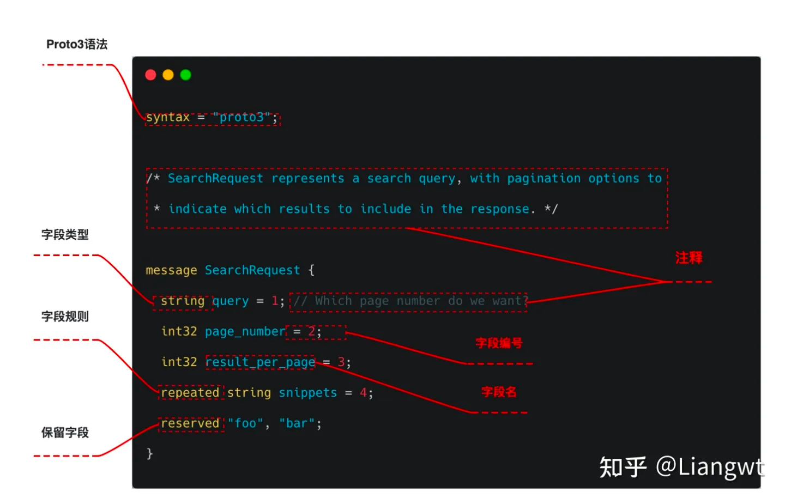

# gRPC是什么


大致请求流程:

1. 客户端（gRPC Stub）调用 A 方法，发起 RPC 调用。
2. 对请求信息使用 Protobuf 进行对象序列化压缩（IDL）。
3. 服务端（gRPC Server）接收到请求后，解码请求体，进行业务逻辑处理并返回。
4. 对响应结果使用 Protobuf 进行对象序列化压缩（IDL）。
5. 客户端接受到服务端响应，解码请求体。回调被调用的 A 方法，唤醒正在等待响应（阻塞）的客户端调用并返回响应结果。

# install

```shell
$ go install google.golang.org/protobuf/cmd/protoc-gen-go@v1.28
$ go install google.golang.org/grpc/cmd/protoc-gen-go-grpc@v1.2
```

# protobuf基础

gRPC是谷歌开源的一款高性能、支持多种开发语言的服务框架，对于一个rpc我们关注如下几方面：

序列化协议。gRPC使用protobuf，首先使用protobuf定义服务，然后使用这个文件来生成客户端和服务端的代码。因为pb是跨语言的，因此即使服务端和客户端语言并不一致也是可以互相序列化和反序列化的

网络传输层。gRPC使用http2.0协议，http2.0相比于HTTP 1.x ，大幅度的提升了 web 性能。


## Protobuf IDL

所以先来介绍下protobuf的idl怎么写。protobuf最新版本为proto3，

在这里你可以看到详细的文档说明：https://protobuf.dev/programming-guides/proto3/

### syntax 声明

proto3 需要在文件开头声明语法版本为 proto3，如果不用 syntax 声明会被认为使用 proto2 语法

```shell
syntax = "proto3";
```

### 设置包名 - package

用 package 声明当前 proto 文件的包名，声明包名后，其它 proto 文件通过 package name 引用包内的定义。

```shell
package foo.bar;

message Open { ... }
```
其它 proto 文件通过 package name 引用：

```shell
message Foo {
  required foo.bar.Open open = 1;
}
```

没有用 option go_package = “XXX” 指定生成的 Go 代码所在路径时，默认使用 package name 作为生成代码的 package。


### 配置项 - option

google/protobuf/descriptor.proto 列出了所有支持的 option 以及作用。

option 分为file-level、message-level 和 field-level 三种级别，分别在不同的位置使用。

- File-level options

file 级别的 options 用法：

```shell

option go_package = "google.golang.org/protobuf/types/descriptorpb";
option java_package = "com.google.protobuf";
option java_outer_classname = "DescriptorProtos";
option csharp_namespace = "Google.Protobuf.Reflection";
option objc_class_prefix = "GPB";
option cc_enable_arenas = true;

// descriptor.proto must be optimized for speed because reflection-based
// algorithms don't work during bootstrapping.
option optimize_for = SPEED;
```

- message-level options

message 级别的 option 用法：

```shell
message Foo {
  option message_set_wire_format = true;
  extensions 4 to max;
}
```

- field-level options

field 级别的 option 用法：

```shell

repeated int32 samples = 4 [packed = true];
optional int32 old_field = 6 [deprecated=true];

```

- 自定义 options

可以通过扩展 google.protobuf.XXXOptions 增加自定义的 option：

```shell
import "google/protobuf/descriptor.proto";

extend google.protobuf.MessageOptions {   
  optional string my_option = 51234;       // 自定义 message-level option
}

message MyMessage {
  option (my_option) = "Hello world!";
}
```

### package 引用

用 import 导入目标文件：

```shell
import "myproject/other_protos.proto";
```

### import public

A 文件通过 import public 引用 B 文件后，只需引用 A 文件就可以直接使用 B 文件中的定义。

import public 不支持 java，生成 java 代码时不能使用该功能。

```shell
// new.proto
// All definitions are moved here

// old.proto
// This is the proto that all clients are importing.
import public "new.proto";
import "other.proto";

// client.proto
import "old.proto";
// You use definitions from old.proto and new.proto, but not other.proto

```

### 引用其它 message

```shell
message SearchResponse {
  repeated Result results = 1;
}

message Result {
  string url = 1;
  string title = 2;
  repeated string snippets = 3;
}
```

### 引用嵌套定义 message

```shell
message SearchResponse {
  message Result {
    required string url = 1;
    optional string title = 2;
    repeated string snippets = 3;
  }
  repeated Result result = 1;
}

// 引用 SearchResponse 中定义的 Result
message SomeOtherMessage {
  optional SearchResponse.Result result = 1;
}
```

### RPC Service 接口定义

rpc 接口定义方法：

```shell
service SearchService {
  rpc Search(SearchRequest) returns (SearchResponse);
}
```

### stream 类型输入和输出

gRPC Service definition 对 stream 的用法做了简单介绍，stream 表示支持 a sequence of messages，按照作用位置可以把 rpc 接口分为四类。

```shell
// 请求和响应都是一个 message
rpc SayHello(HelloRequest) returns (HelloResponse);     
// 请求是一个 message，响应是多个 message
rpc LotsOfReplies(HelloRequest) returns (stream HelloResponse);
// 请求是多个 message，响应是一个 message
rpc LotsOfGreetings(stream HelloRequest) returns (HelloResponse);
// 请求和响应都是多个 message
rpc BidiHello(stream HelloRequest) returns (stream HelloResponse);
```


### 定义消息

protobuf里最基本的类型就是message，每一个messgae都会有一个或者多个字段(field)，其中字段包含如下元素




- 类型：类型不仅可以是标量类型（int、string等），也可以是复合类型（enum等），也可以是其他message
- 字段名：字段名比较推荐的是使用下划线/分隔名称
- 字段编号：一个messgae内每一个字段编号都必须唯一的，在编码后其实传递的是这个编号而不是字段名
- 字段规则：消息字段可以是以下字段之一
  - singular：格式正确的消息可以有零个或一个字段（但不能超过一个）。使用 proto3 语法时，如果未为给定字段指定其他字段规则，则这是默认字段规则
  - optional：与 singular 相同，不过您可以检查该值是否明确设置
  - repeated：在格式正确的消息中，此字段类型可以重复零次或多次。系统会保留重复值的顺序
  - map：这是一个成对的键值对字段
- 保留字段：为了避免再次使用到已移除的字段可以设定保留字段。如果任何未来用户尝试使用这些字段标识符，编译器就会报错

field 的编号：

> - field 编号发布后不能再更改
> - 编号 1～15 用一个字节描述，编号 16～2047 用两个字节
> - 编号最小值是 1，最大 2^29-1
> - 19000～19999 用于内部实现，不能使用

注意事项 ：

> - 不要修改 field 的编号
> - field 可以删除，但是 field num 不能再次分配给其它 field

### 标量值类

支持的类型：Scalar Value Types

```shell
double
float
int32
int64
uint32
uint64
sint32: 对负数的编码更高效
sint64: 对负数的编码更高效
fixed32：永远 4 字节，对应大于 2^28 的数值编码更高效
fixed64：永远 8 字节，对应大于 2^56 的数值编码更高效
sfixed32： 永远 4 字节
sfixed64： 永远 8 字节
bool：
string：UTF-8 或者 7-bit ASCII Text
bytes：
```

### 数组

```shell
message SearchResponse {
  repeated Result results = 1;
}

message Result {
  string url = 1;
  string title = 2;
  repeated string snippets = 3;
}
```

### 枚举

- enum 可以独立定义，也可以在 message 内部定义：

```shell
message SearchRequest {
  required string query = 1;
  optional int32 page_number = 2;
  optional int32 result_per_page = 3 [default = 10];
  enum Corpus {
    UNIVERSAL = 0;
    WEB = 1;
    IMAGES = 2;
    LOCAL = 3;
    NEWS = 4;
    PRODUCTS = 5;
    VIDEO = 6;
  }
  optional Corpus corpus = 4 [default = UNIVERSAL];
}
```

- enum 别名

```shell
enum EnumAllowingAlias {
  // 枚举值存在重复时，如果不指定 allow_alias=true，会报错
  option allow_alias = true;
  EAA_UNSPECIFIED = 0;
  EAA_STARTED = 1;
  EAA_RUNNING = 1;
  EAA_FINISHED = 2;
}

```

- enum 保留值

可以保留部分枚举数值，max 表示最大值：

```shell
enum Foo {
  reserved 2, 15, 9 to 11, 40 to max;   // 用 max 表示最大值
  reserved "FOO", "BAR";                // 同一行中数值和名称不能混用
}
```

### 嵌套类型 - Nested Types

```shell
message SearchResponse {
  message Result {
    string url = 1;
    string title = 2;
    repeated string snippets = 3;
  }
  repeated Result results = 1;
}
```

可以多层嵌套，位于不同层中的 message 可以重名：

```shell

message Outer {                  // Level 0
  message MiddleAA {  // Level 1
    message Inner {   // Level 2
      int64 ival = 1;
      bool  booly = 2;
    }
  }
  message MiddleBB {  // Level 1
    message Inner {   // Level 2
      int32 ival = 1;
      bool  booly = 2;
    }
  }
}
```

### 任意类型 - Any

Any 用于装载任意类型的 message，它是 protbuf 内置的类型，位于 google/protobuf/any.proto 文件：

```shell
message Any {
  string type_url = 1;
  bytes value = 2;
}
```

Any 有两个 filed：

- type_url 是 message 的类型标识符，默认为 type.googleapis.com/packagename.messagename。
- value 是序列化后值

> [how to use protobuf.any in golang](https://stackoverflow.com/questions/64055785/how-to-use-protobuf-any-in-golang) 中提到，
> Go 可以用 “google.golang.org/protobuf/types/known/anypb” 中的 MarshalFrom() /UnmarshalTo()/UnmarshalNew() 将其它 message 转换成 Any 类型以及在转回。

```go
import "testing"
import "proto_code_go/proto_gen/demo"
import "google.golang.org/protobuf/types/known/anypb"
import "google.golang.org/protobuf/proto"

func TestPackAny(t *testing.T) {
    person := &demo.Person{
        Name: "lijiaocn.com",
    }
    any := &anypb.Any{
        TypeUrl: "",
        Value:   nil,
    }
    if err := anypb.MarshalFrom(any, person, proto.MarshalOptions{}); err != nil {
        t.Errorf("anypb.MarshalFrom fail: err=%v", err)
    } else {
        t.Logf("%v", any)
    }

    anotherPersion, err := anypb.UnmarshalNew(any, proto.UnmarshalOptions{})
    if err != nil {
        t.Errorf("anypb.UnMarshalNew fail: err=%v", err)
    } else {
        t.Logf("%v", anotherPersion.ProtoReflect().Descriptor().FullName())
    }
}
```

### 联合类型 - oneof

oneof 中不可以直接使用 map 和 repeated，在 proto2 中还要求不能使用 requried、optional。


```shell

message SampleMessage {
  oneof test_oneof {
     // 不可以直接使用 map 和 repeated
     string name = 4;  
     // SubMessage 内部的 field 可以用 requried、optional、repeated 修饰 
     SubMessage sub_message = 9;   
  }
}
```

### 哈希类型 - map

```shell
map<key_type, value_type> map_field = N;
```

map 的注意事项：

- key_type 不能是 float 和 bytes
- value_type 不能是 map
- map 不能用 repeated, optional, required 修饰
- map 内的 key-value 顺序是不保证的

# Reference
* https://www.zhihu.com/column/c_1600178812372598784?utm_id=0
* https://blog.csdn.net/weixin_43143310/article/details/125064588
* https://www.lijiaocn.com/%E7%BC%96%E7%A8%8B/2022/11/29/protobuf-v3.html