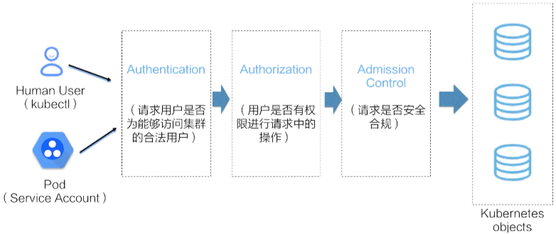

# API 访问控制
Kubernetes 主要通过 API Server 对外提供服务，Kubernetes 对于访问API用户提供了相应的安全控制。
API 访问需要经过的三个步骤，它们分别是：认证、授权和准入。

主要核心流程：

subject(主体)----->认证[解决用户是谁的问题]----->授权[解决用户能做什么的问题]------>准入控制[用户能对那些资源对象做操作问题]



# 认证

认证（Authentication）是指用户是否可以登录 Kubernetes，即是否可以向 API Server 发送请求。
在 Kubernetes 中，有两类用户：
• Normal Users：外部用户
• Service Accounts：内部用户


## Normal Users
Normal Users 独立于 Kubernetes，不归其管理，这类用户可以是：
• 可以分发 private keys 的管理员（真人）
• 提供用户服务的第三方厂商，比如 Google Accounts
• 保存用户名和密码的列表文件

如果用户都不在 Kubernetes 中，是如何进行认证的呢？
对于一般的应用系统来说，用户提供用户名和密码，服务端收到过后会在数据库中进行检查是否存在并有效，如果有就表示鉴权成功，反之失败。
那对于 Kubernetes 来说，是如何实现的呢？
尽管无法通过 API 调用来添加普通用户，Kubernetes 通过证书来进行用户认证。也就是说，不管任何用户，只要能提供有效的证书就能通过 Kubernetes 用户认证。
通过用户认证过后，Kubernetes 会把证书中的 CN 作为用户名（比如证书中”/CN=joker“，则用户名就是 Joker），把 Organization 作为用户组，然后由用户名和用户组绑定的 Role 来决定用户的权限。

## Service Accounts
Service Accounts 由 Kubernetes 管理，它们被绑定到特定的 namespace，通过 API Server 自己创建，也可以通过调用 API 来创建，比如使用 kubectl 客户端工具。
与 Normal Users 不同，Service Accounts 存在对应的 Kubernetes 对象，当创建 Service Accounts，会创建相应的 Secret，里面保存对应的密码信息。当创建的 Pod 指定了一个 Service Account，其 Secret 会被 Mount 到 Pod 中，Pod 中的进程就可以访问 Kubernetes API 了

## 认证策略

Kubernetes 有以下几种鉴权方法：
* 客户端证书
* 令牌
* 身份认证代理
* 身份认证 Webhoook

当 HTTP 请求发送到 API Server 时，Kubernetes 会从 Request 中关联以下信息：
* Username: 用户名，用来辨识最终用户的字符串， 例如：kube-admin 或者 jane@example.com
* UID：用户 ID，代表用户的唯一 ID
* Groups：用户组，代表逻辑相关的一组用户，常见的值可能是 system:masters 或者 devops-team 等
* Extra Fields，附加字段，一组额外的键-值映射，键是字符串，值是一组字符串； 用来保存一些鉴权组件可能觉得有用的额外信息

> 需要注意情况： 
> 1. 多种鉴权方法以插件形式同时启用，只要有一个鉴权方法鉴权成功即通过验证，其它就不再鉴权。
> 2. api-server 不保证鉴权方法的顺序。
> 3. 所有鉴权成功的用户都会加到组 "system:authenticated" 中。

### X509 客户证书

#### CSR，全称为：Certificate Signing Request，证书请求文件的缩写。

1. 创建key 和 csr
```sh
openssl genrsa -out devuser.key 2048

openssl req -new  \
 -subj "/C=CN/ST=Beijing/L=Beijing/O=dev/OU=Personal/CN=devuser" \
 -key devuser.key \
 -out devuser.csr
 
```
> 注意
> x509 common name[CN] 对应账号用户名, Orginization [O] 对应是组

2. base64加密csr

```sh
cat devuser.csr | base64 | tr -d "\n"
```

3. 创建签署请求

```sh
cat <<EOF | kubectl apply -f -
apiVersion: certificates.k8s.io/v1
kind: CertificateSigningRequest
metadata:
  name: devuser
spec:
  request: $(cat devuser.csr | base64 | tr -d "\n")
  signerName: kubernetes.io/kube-apiserver-client
  expirationSeconds: 86400  # one day
  usages:
  - client auth
EOF
```
4. 检查 csr

```shell
kubectl get csr

NAME      AGE     SIGNERNAME                            REQUESTOR          REQUESTEDDURATION   CONDITION
devuser   8s      kubernetes.io/kube-apiserver-client   kubernetes-admin   24h                 Pending
```

5. 管理员确认 csr

```sh
kubectl certificate approve devuser
```

6. 查看 csr

```sh
kubectl get csr/devuser -o yaml
```

7. 抽取 crt

```sh
kubectl get csr devuser -o jsonpath='{.status.certificate}'| base64 -d > devuser.crt
```

8.  设置kubectl 客户端认证凭证

```sh
kubectl config set-credentials devuser --client-key=devuser.key --client-certificate=devuser.crt --embed-certs=true
```

```shell
kubectl  get pods --user=devuser

Error from server (Forbidden): pods is forbidden: User "devuser" cannot list resource "pods" in API group "" in the namespace "default"

```

9. 配置完成后配置文件会多出一个user, 创建 role 和 rolebinding

```sh
kubectl create role developer --verb=create --verb=get --verb=list --verb=update --verb=delete --resource=pods
kubectl create rolebinding developer-binding-devuser --role=developer --user=devuser
```


10. 查看Pod
```shell
kubectl get pods --user=devuser
```


### 令牌

启动apiserver时通过--basic-auth-file参数启用BasicAuth认证。
AUTH_FILE（Static Password file）是一个CSV文件，文件格式为：

```shell
password,user,uid,"group1,group2,group3"
```

发起请求时在HTTP中添加头即可：

```shell
Authorization: Basic BASE64ENCODED(USER:PASSWORD)
```


### 身份认证代理

### HTTP Basic 认证机制

# 鉴权

# 准入控制

# 审计

