# install

## projects
- https://apisix.apache.org/zh/
- https://github.com/apache/apisix.git
- https://github.com/apache/apisix-docker.git
- https://github.com/apache/apisix-ingress-docker.git
- https://github.com/apache/apisix-ingress-controller.git
- https://github.com/apache/apisix-helm-chart.git
- https://github.com/apache/apisix-dashboard.git
- https://github.com/apache/apisix-go-plugin-runner.git

## blog
- https://www.apiseven.com/blog

## docker

```
git clone https://github.com/apache/apisix-docker.git
cd apisix-docker/example

```
- Linux
```sh 
docker-compose -p docker-apisix up -d
```
- ARM/M1

```shell
docker-compose -p docker-apisix -f docker-compose-arm64.yml up -d
```

## 安装 etcd
- linux
```shell
ETCD_VERSION='3.5.4'
wget https://github.com/etcd-io/etcd/releases/download/v${ETCD_VERSION}/etcd-v${ETCD_VERSION}-linux-amd64.tar.gz
tar -xvf etcd-v${ETCD_VERSION}-linux-amd64.tar.gz && \
  cd etcd-v${ETCD_VERSION}-linux-amd64 && \
  sudo cp -a etcd etcdctl /usr/bin/
nohup etcd >/tmp/etcd.log 2>&1 &
```
- macOs
```shell
brew install etcd
brew services start etcd
```
- Etcd https://etcd.io/

# 架构

适用于超大规模、复杂的业务系统
Apache APISIX 作为云原生架构的开源 API 网关，可以为海量 API 和微服务提供安全可靠的动态、高性能、可扩展的管理平台。

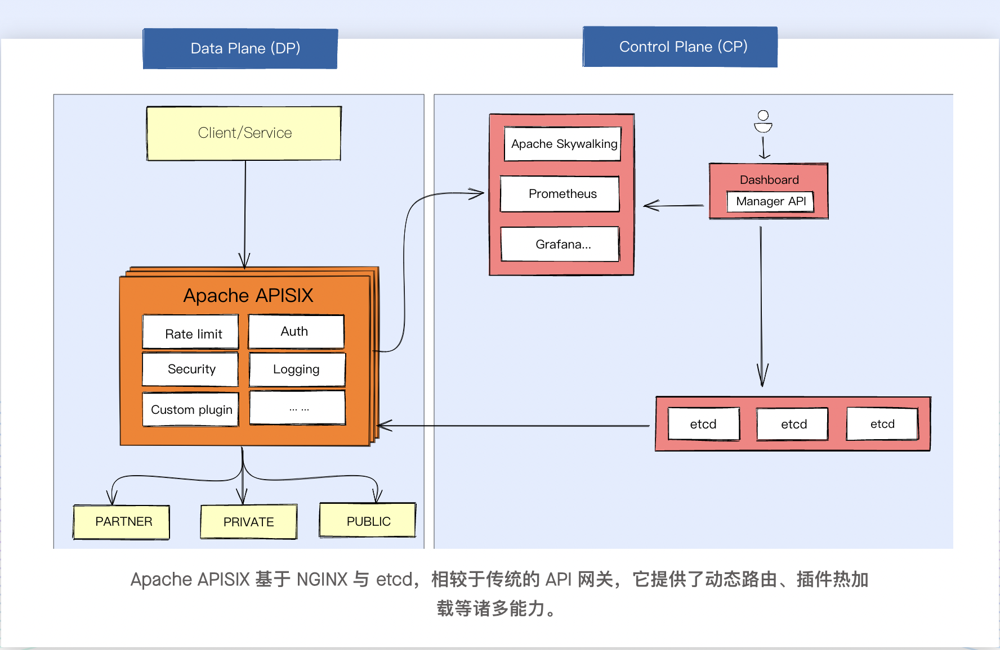

- 特点
* Apache APISIX 基于 NGINX 与 etcd，相较于传统的 API 网关，它提供了动态路由、插件热加载等诸多能力。
* 控制面和数据面分离
* Apache APISIX Dashboard 可以让用户尽可能直观、便捷地通过可视化界面操作 Apache APISIX。
* 可视化配置
* Apache APISIX 基于 Radixtree Route 和 etcd 提供路由极速匹配与配置快速同步的能力。从路由到插件，所有的设计和实现都是为了极速性能和超低延迟。
* 高可用与可扩展性 ：Apache APISIX 提供了自定义插件的能力，你可以在 Balancer 阶段使用自定义负载均衡算法，并使用自定义路由算法对路由进行精细化控制
* Apache APISIX 提供了配置热更新、插件热加载能力，在不重新启动实例的情况下可快速更新配置，这能够节省开发时间并降低服务压力。同时，健康检查、服务熔断以及其它功能可以让系统始终保持稳定、可靠。
* Apache APISIX 提供了多平台解决方案，它不但支持在裸机运行，也支持在 Kubernetes 中使用。它支持 HTTP 到 gRPC 的转换、WebSockets、gRPC、Dubbo、MQTT 代理和包括 ARM64 在内的多个平台，无需担心供应商对基础设施技术的锁定。

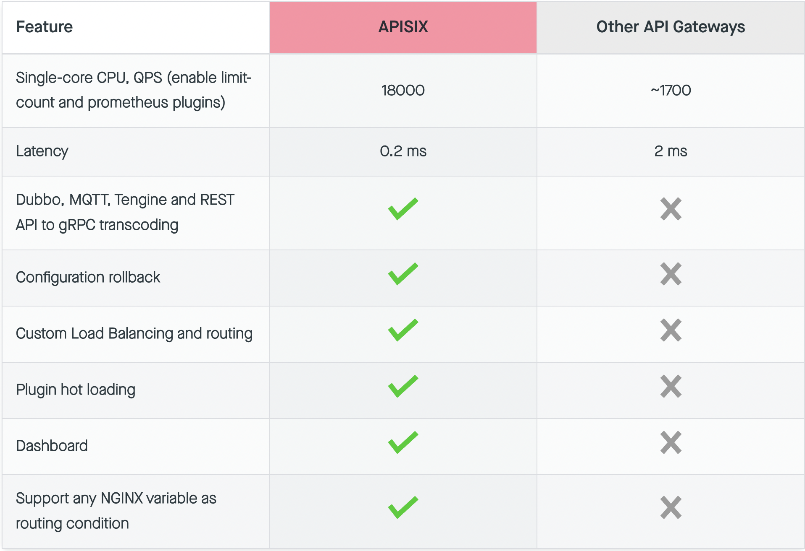

- Apisix横向对比
最终在以下项目中进行了全面的横向对比，可以看到不管是在企业级的长期规划还是短期规划中。
- 
  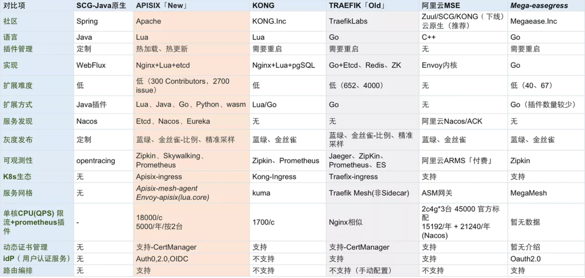

## 案例CASE
* [APISIX 在众安保险的应用实践](https://apisix.apache.org/zh/blog/2022/03/02/zhongan-usercase-with-apache-apisix/)
* [APISIX 在「还呗」的技术实践](https://apisix.apache.org/zh/blog/2022/09/30/huanbei-in-apache-apisix/)
* [APISIX 助力中东社交软件，实现本地化部署](https://apisix.apache.org/zh/blog/2022/06/14/beeto-with-apache-apisix/)
* [智慧交通系统网新电气，如何基于 APISIX 迭代数字智联平台](https://apisix.apache.org/zh/blog/2022/12/09/insigma-with-apache-apisix/)

## 架构图

### 软件架构 

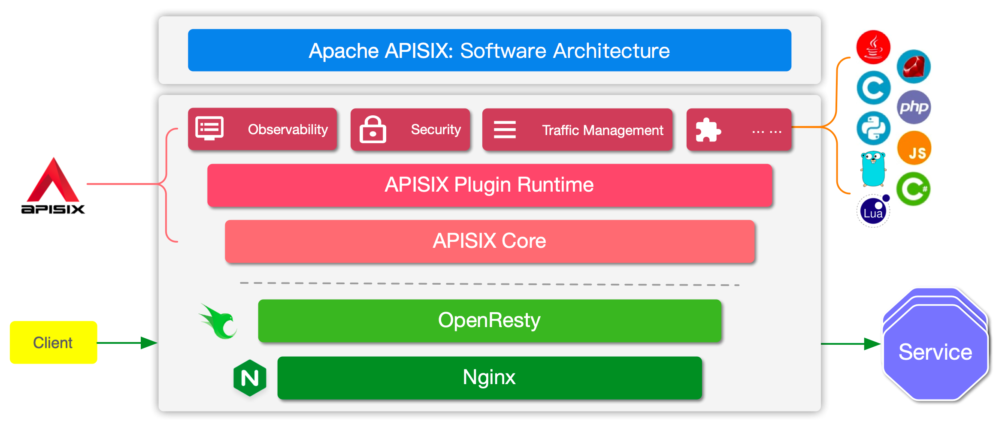

### 插件加载流程

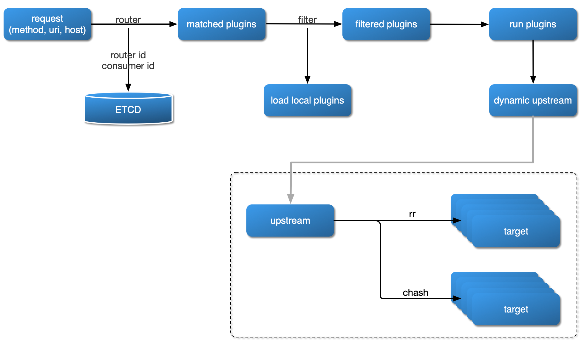

### 插件内部结构

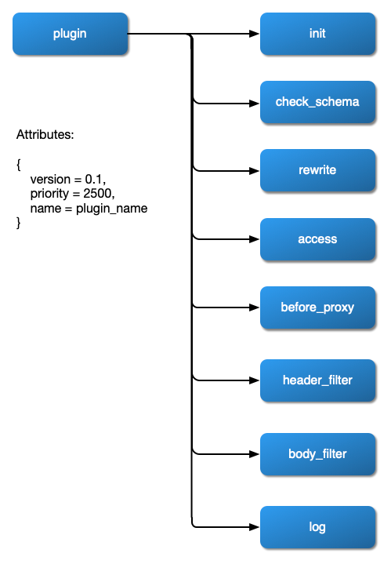


## 核心配置

```shell

apisix:
  node_listen: 9080              # APISIX listening port
  enable_ipv6: false

  enable_control: true
  control:
    ip: "0.0.0.0"
    port: 9092

deployment:
  admin:
    allow_admin:               # http://nginx.org/en/docs/http/ngx_http_access_module.html#allow
      - 0.0.0.0/0              # We need to restrict ip access rules for security. 0.0.0.0/0 is for test.

    admin_key:
      - name: "admin"
        key: edd1c9f034335f136f87ad84b625c8f1
        role: admin                 # admin: manage all configuration data

      - name: "viewer"
        key: 4054f7cf07e344346cd3f287985e76a2
        role: viewer

  etcd:
    host:                           # it's possible to define multiple etcd hosts addresses of the same etcd cluster.
      - "http://etcd:2379"          # multiple etcd address
    prefix: "/apisix"               # apisix configurations prefix
    timeout: 30                     # 30 seconds

plugin_attr:
  prometheus:
    export_addr:
      ip: "0.0.0.0"
      port: 9091

```
1. 修改admin key

```shell
deployment:
  admin:
    admin_key
      -
        name: "admin"
        key: newsupersecurekey  # 请修改 key 的值
        role: admin
```
2. admin API

```shell
curl http://127.0.0.1:9180/apisix/admin/routes?api_key=newsupersecurekey -i
```
3. dashboar


```shell

conf:
  listen:
    host: 0.0.0.0     # `manager api` listening ip or host name
    port: 9000          # `manager api` listening port
  allow_list:           # If we don't set any IP list, then any IP access is allowed by default.
    - 0.0.0.0/0
  etcd:
    endpoints:          # supports defining multiple etcd host addresses for an etcd cluster
      - "http://etcd:2379"
                          # yamllint disable rule:comments-indentation
                          # etcd basic auth info
    # username: "root"    # ignore etcd username if not enable etcd auth
    # password: "123456"  # ignore etcd password if not enable etcd auth
    mtls:
      key_file: ""          # Path of your self-signed client side key
      cert_file: ""         # Path of your self-signed client side cert
      ca_file: ""           # Path of your self-signed ca cert, the CA is used to sign callers' certificates
    # prefix: /apisix     # apisix config's prefix in etcd, /apisix by default
  log:
    error_log:
      level: warn       # supports levels, lower to higher: debug, info, warn, error, panic, fatal
      file_path:
        logs/error.log  # supports relative path, absolute path, standard output
                        # such as: logs/error.log, /tmp/logs/error.log, /dev/stdout, /dev/stderr
    access_log:
      file_path:
        logs/access.log  # supports relative path, absolute path, standard output
                         # such as: logs/access.log, /tmp/logs/access.log, /dev/stdout, /dev/stderr
                         # log example: 2020-12-09T16:38:09.039+0800	INFO	filter/logging.go:46	/apisix/admin/routes/r1	{"status": 401, "host": "127.0.0.1:9000", "query": "asdfsafd=adf&a=a", "requestId": "3d50ecb8-758c-46d1-af5b-cd9d1c820156", "latency": 0, "remoteIP": "127.0.0.1", "method": "PUT", "errs": []}
  security:
      # access_control_allow_origin: "http://httpbin.org"
      # access_control_allow_credentials: true          # support using custom cors configration
      # access_control_allow_headers: "Authorization"
      # access_control-allow_methods: "*"
      # x_frame_options: "deny"
      content_security_policy: "default-src 'self'; script-src 'self' 'unsafe-eval' 'unsafe-inline'; style-src 'self' 'unsafe-inline'; frame-src *"  # You can set frame-src to provide content for your grafana panel.

authentication:
  secret:
    secret              # secret for jwt token generation.
                        # NOTE: Highly recommended to modify this value to protect `manager api`.
                        # if it's default value, when `manager api` start, it will generate a random string to replace it.
  expire_time: 3600     # jwt token expire time, in second
  users:                # yamllint enable rule:comments-indentation
    - username: admin   # username and password for login `manager api`
      password: admin
    - username: user
      password: user

plugins:                          # plugin list (sorted in alphabetical order)
  - api-breaker
  - authz-keycloak
  - basic-auth
  - batch-requests
  - consumer-restriction
  - cors
  # - dubbo-proxy
  - echo
  # - error-log-logger
  # - example-plugin
  - fault-injection
  - grpc-transcode
  - hmac-auth
  - http-logger
  - ip-restriction
  - jwt-auth
  - kafka-logger
  - key-auth
  - limit-conn
  - limit-count
  - limit-req
  # - log-rotate
  # - node-status
  - openid-connect
  - prometheus
  - proxy-cache
  - proxy-mirror
  - proxy-rewrite
  - redirect
  - referer-restriction
  - request-id
  - request-validation
  - response-rewrite
  - serverless-post-function
  - serverless-pre-function
  # - skywalking
  - sls-logger
  - syslog
  - tcp-logger
  - udp-logger
  - uri-blocker
  - wolf-rbac
  - zipkin
  - server-info
  - traffic-split

```

登录URL ： http://127.0.0.1:9000/，(http://192.168.64.17:9000/) 账号密码 admin/admin

# 快速入门

## 概念介绍#
1. 上游#
Upstream 也称为上游，上游是对虚拟主机的抽象，即应用层服务或节点的抽象。
上游的作用是按照配置规则对服务节点进行负载均衡，它的地址信息可以直接配置到路由或服务上。当多个路由或服务引用同一个上游时，可以通过创建上游对象，在路由或服务中使用上游的 ID 方式引用上游，减轻维护压力。

2. 路由#
Route 也称为路由，是 APISIX 中最基础和最核心的资源对象。
APISIX 可以通过路由定义规则来匹配客户端请求，根据匹配结果加载并执行相应的插件，最后把请求转发给到指定的上游服务。 
路由中主要包含三部分内容：匹配规则、插件配置和上游信息。

3. 服务#
Service 也称为服务，是某类 API 的抽象（也可以理解为一组 Route 的抽象）。它通常与上游服务抽象是一一对应的，Route 与 Service 之间，通常是 N:1 的关系。

## 创建上游

```shell

curl "http://127.0.0.1:9180/apisix/admin/upstreams/1" \
-H "X-API-KEY: edd1c9f034335f136f87ad84b625c8f1" -X PUT -d '
{
  "type": "roundrobin",
  "nodes": {
    "httpbin.org:80": 1
  }
}'
```

## 创建路由

```shell
curl "http://127.0.0.1:9180/apisix/admin/routes/1" \
-H "X-API-KEY: edd1c9f034335f136f87ad84b625c8f1" -X PUT -d '
{
  "methods": ["GET"],
  "host": "example.com",
  "uri": "/anything/*",
  "upstream_id": "1"
}'

```

## 测试路由
```shell
curl -i -X GET "http://127.0.0.1:9080/anything?foo1=bar1&foo2=bar2" -H "Host: example.com"

```
# 概念

## Upstream

Upstream 是虚拟主机抽象，对给定的多个服务节点按照配置规则进行负载均衡。Upstream 的地址信息可以直接配置到 Route（或 Service) 上，当 Upstream 有重复时，就需要用"引用"方式避免重复了。

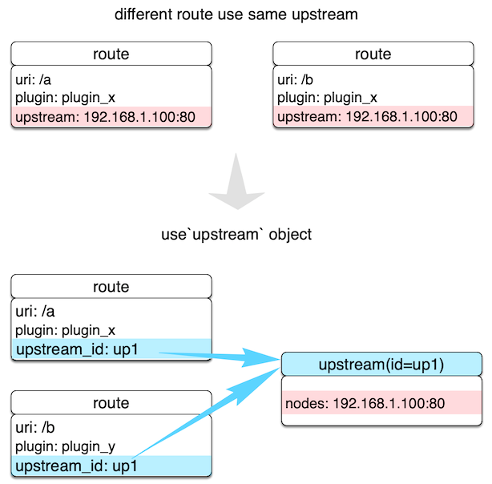

如上图所示，通过创建 Upstream 对象，在 Route 用 ID 方式引用，就可以确保只维护一个对象的值了。
Upstream 的配置可以被直接绑定在指定 Route 中，也可以被绑定在 Service 中，不过 Route 中的配置优先级更高。这里的优先级行为与 Plugin 非常相似。


Upstream 资源请求地址：/apisix/admin/upstreams/{id}

### 请求方法 {#upstream-request-methods}

| 名称   | 请求 URI                             | 请求 body | 描述                                                                                                                                                               |
| ------ | ----------------------------------- | --------- | ---------------------------------------------------------------------------------------------------------------------------------------------------------------- |
| GET    | /apisix/admin/upstreams/{id}        | 无        | 获取资源。                                                                                                                                                        |
| PUT    | /apisix/admin/upstreams/{id}        | {...}     | 创建指定 id 的资源。                                                                                                                                               |
| POST   | /apisix/admin/upstreams             | {...}     | 创建资源，id 由后台服务自动生成。                                                                                                                                 |
| DELETE | /apisix/admin/upstreams/{id}        | 无        | 删除资源。                                                                                                                                                        |
| PATCH  | /apisix/admin/upstreams/{id}        | {...}     | 标准 PATCH，修改已有 Upstream 的部分属性，其他不涉及的属性会原样保留；如果需要删除某个属性，可将该属性的值设置为 `null`；**注意**：当需要修改属性的值为数组时，该属性将全量更新。|
| PATCH  | /apisix/admin/upstreams/{id}/{path} | {...}     | SubPath PATCH，通过 `{path}` 指定 Upstream 需要更新的属性，全量更新该属性的数据，其他不涉及的属性会原样保留。                                                            |

### body 请求参数 {#upstream-body-request-methods}

APISIX 的 Upstream 除了基本的负载均衡算法选择外，还支持对上游做主被动健康检查、重试等逻辑。详细信息如下：

| 名称           | 必选项                                           | 类型           | 描述                                                                                                                                                                                                                                                                                                                                                        | 示例                                             |
| -------------- |-----------------------------------------------| -------------- | ----------------------------------------------------------------------------------------------------------------------------------------------------------------------------------------------------------------------------------------------------------------------------------------------------------------------------------------------------------- | ------------------------------------------------ |
| type           | 否                                             | 枚举           | 负载均衡算法，默认值是`roundrobin`。                                                                                                                                                                                                                                                                                                                                                           |                                      |     |
| nodes          | 是，与 `service_name` 二选一。                       | Node           | 哈希表或数组。当它是哈希表时，内部元素的 key 是上游机器地址列表，格式为`地址 +（可选的）端口`，其中地址部分可以是 IP 也可以是域名，比如 `192.168.1.100:80`、`foo.com:80`等。对于哈希表的情况，如果 key 是 IPv6 地址加端口，则必须用中括号将 IPv6 地址括起来。`value` 则是节点的权重。当它是数组时，数组中每个元素都是一个哈希表，其中包含 `host`、`weight` 以及可选的 `port`、`priority`。`nodes` 可以为空，这通常用作占位符。客户端命中这样的上游会返回 `502`。                                        | `192.168.1.100:80`, `[::1]:80`                               |
| service_name   | 是，与 `nodes` 二选一。                              | string         | 服务发现时使用的服务名，请参考 [集成服务发现注册中心](./discovery.md)。                                                                                                                                                                                                                                                                                            | `a-bootiful-client`                              |
| discovery_type | 是，与 `service_name` 配合使用。                      | string         | 服务发现类型，请参考 [集成服务发现注册中心](./discovery.md)。                                                                                                                                                                                                                                                                                                      | `eureka`                                         |
| key            | 条件必需                                          | 匹配类型       | 该选项只有类型是 `chash` 才有效。根据 `key` 来查找对应的节点 `id`，相同的 `key` 在同一个对象中，则返回相同 id。目前支持的 NGINX 内置变量有 `uri, server_name, server_addr, request_uri, remote_port, remote_addr, query_string, host, hostname, arg_***`，其中 `arg_***` 是来自 URL 的请求参数，详细信息请参考 [NGINX 变量列表](http://nginx.org/en/docs/varindex.html)。 |                                                  |
| checks         | 否                                             | health_checker | 配置健康检查的参数，详细信息请参考 [health-check](health-check.md)。                                                                                                                                                                                                                                                                                               |                                                  |
| retries        | 否                                             | 整型           | 使用 NGINX 重试机制将请求传递给下一个上游，默认启用重试机制且次数为后端可用的节点数量。如果指定了具体重试次数，它将覆盖默认值。当设置为 `0` 时，表示不启用重试机制。                                                                                                                                                                                                 |                                                  |
| retry_timeout  | 否                                             | number         | 限制是否继续重试的时间，若之前的请求和重试请求花费太多时间就不再继续重试。当设置为 `0` 时，表示不启用重试超时机制。                                                                                                                                                                                                 |                                                  |
| timeout        | 否                                             | 超时时间对象   | 设置连接、发送消息、接收消息的超时时间，以秒为单位。                                                                                                                                                                                                                                                                                                      |                                                  |
| hash_on        | 否                                             | 辅助           | `hash_on` 支持的类型有 `vars`（NGINX 内置变量），`header`（自定义 header），`cookie`，`consumer`，默认值为 `vars`。                                                                                                                                                                                                                                           |
| name           | 否                                             | 辅助           | 标识上游服务名称、使用场景等。                                                                                                                                                                                                                                                                                                                              |                                                  |
| desc           | 否                                             | 辅助           | 上游服务描述、使用场景等。                                                                                                                                                                                                                                                                                                                                  |                                                  |
| pass_host      | 否                                             | 枚举           | 请求发给上游时的 `host` 设置选型。 [`pass`，`node`，`rewrite`] 之一，默认是 `pass`。`pass`: 将客户端的 host 透传给上游； `node`: 使用 `upstream` node 中配置的 `host`； `rewrite`: 使用配置项 `upstream_host` 的值。                                                                                                                                                                        |                                                  |
| upstream_host  | 否                                             | 辅助           | 指定上游请求的 host，只在 `pass_host` 配置为 `rewrite` 时有效。                                                                                                                                                                                                                                                                                                                  |                                                  |
| scheme         | 否                                             | 辅助           | 跟上游通信时使用的 scheme。对于 7 层代理，可选值为 [`http`, `https`, `grpc`, `grpcs`]。对于 4 层代理，可选值为 [`tcp`, `udp`, `tls`]。默认值为 `http`，详细信息请参考下文。                                                                                                                                                                                                                                                           |
| labels         | 否                                             | 匹配规则       | 标识附加属性的键值对。                                                                                                                                                                                                                                                                                                                                        | {"version":"v2","build":"16","env":"production"} |
| create_time    | 否                                             | 辅助           | epoch 时间戳，单位为秒。如果不指定则自动创建。                                                                                                                                                                                                                                                                                                               | 1602883670                                       |
| update_time    | 否                                             | 辅助           | epoch 时间戳，单位为秒。如果不指定则自动创建。                                                                                                                                                                                                                                                                                                               | 1602883670                                       |
| tls.client_cert    | 否，不能和 `tls.client_cert_id` 一起使用               | https 证书           | 设置跟上游通信时的客户端证书，详细信息请参考下文。                                                                        | |
| tls.client_key	 | 否，不能和 `tls.client_cert_id` 一起使用               | https 证书私钥           | 设置跟上游通信时的客户端私钥，详细信息请参考下文。                                                                                                                                                                                                                                                                                                              | |
| tls.client_cert_id | 否，不能和 `tls.client_cert`、`tls.client_key` 一起使用 | SSL           | 设置引用的 SSL id，详见 [SSL](#ssl)。                                                                                                                                                                                                                                                                                                              | |
|keepalive_pool.size  | 否                                             | 辅助 | 动态设置 `keepalive` 指令，详细信息请参考下文。 |
|keepalive_pool.idle_timeout  | 否                                             | 辅助 | 动态设置 `keepalive_timeout` 指令，详细信息请参考下文。 |
|keepalive_pool.requests  | 否                                             | 辅助 | 动态设置 `keepalive_requests` 指令，详细信息请参考下文。 |

`type` 详细信息如下：

- `roundrobin`: 带权重的 Round Robin。
- `chash`: 一致性哈希。
- `ewma`: 选择延迟最小的节点，请参考 [EWMA_chart](https://en.wikipedia.org/wiki/EWMA_chart)。
- `least_conn`: 选择 `(active_conn + 1) / weight` 最小的节点。此处的 `active connection` 概念跟 NGINX 的相同，它是当前正在被请求使用的连接。
- 用户自定义的 balancer，需要可以通过 `require("apisix.balancer.your_balancer")` 来加载。

`hash_on` 详细信息如下：

- 设为 `vars` 时，`key` 为必传参数，目前支持的 NGINX 内置变量有 `uri, server_name, server_addr, request_uri, remote_port, remote_addr, query_string, host, hostname, arg_***`，其中 `arg_***` 是来自 URL 的请求参数。详细信息请参考 [NGINX 变量列表](http://nginx.org/en/docs/varindex.html)。
- 设为 `header` 时，`key` 为必传参数，其值为自定义的 Header name，即 "http\_`key`"。
- 设为 `cookie` 时，`key` 为必传参数，其值为自定义的 cookie name，即 "cookie\_`key`"。请注意 cookie name 是**区分大小写字母**的。例如：`cookie_x_foo` 与 `cookie_X_Foo` 表示不同的 `cookie`。
- 设为 `consumer` 时，`key` 不需要设置。此时哈希算法采用的 `key` 为认证通过的 `consumer_name`。
- 如果指定的 `hash_on` 和 `key` 获取不到值时，使用默认值：`remote_addr`。

以下特性需要 APISIX 运行于 [APISIX-Base](./FAQ.md#如何构建-APISIX-Base-环境？)：

- `scheme` 可以设置成 `tls`，表示 `TLS over TCP`。
- `tls.client_cert/key` 可以用来跟上游进行 mTLS 通信。他们的格式和 SSL 对象的 `cert` 和 `key` 一样。
- `tls.client_cert_id` 可以用来指定引用的 SSL 对象。只有当 SSL 对象的 `type` 字段为 client 时才能被引用，否则请求会被 APISIX 拒绝。另外，SSL 对象中只有 `cert` 和 `key` 会被使用。
- `keepalive_pool` 允许 Upstream 有自己单独的连接池。它下属的字段，比如 `requests`，可以用于配置上游连接保持的参数。

Upstream 对象 JSON 配置示例：

```shell
{
    "id": "1",                  # id
    "retries": 1,               # 请求重试次数
    "timeout": {                # 设置连接、发送消息、接收消息的超时时间，每项都为 15 秒
        "connect":15,
        "send":15,
        "read":15
    },
    "nodes": {"host:80": 100},  # 上游机器地址列表，格式为`地址 + 端口`
                                # 等价于 "nodes": [ {"host":"host", "port":80, "weight": 100} ],
    "type":"roundrobin",
    "checks": {},               # 配置健康检查的参数
    "hash_on": "",
    "key": "",
    "name": "upstream-xxx",     # upstream 名称
    "desc": "hello world",      # upstream 描述
    "scheme": "http"            # 跟上游通信时使用的 scheme，默认是 `http`
}
```

## Route

Route 就是路由，通过定义一些规则来匹配客户端的请求，然后根据匹配结果加载并执行相应的插件，并把请求转发给到指定 Upstream。 Route 中主要包含三部分内容：匹配规则（比如 uri、host、remote_addr 等），插件配置（限流限速等）和上游信息。 请看下图示例，是一些 Route 规则的实例，当某些属性值相同时，图中用相同颜色标识。

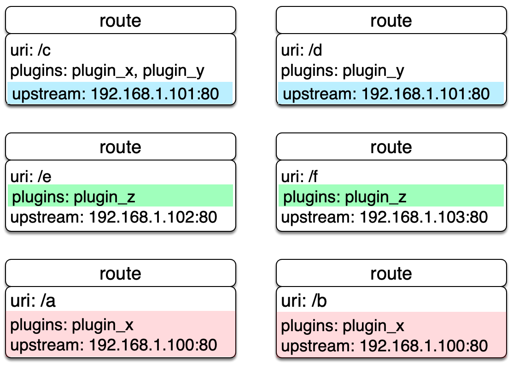

我们直接在 Route 中完成所有参数的配置，优点是容易设置，每个 Route 都相对独立自由度比较高。但当我们的 Route 有比较多的重复配置（比如启用相同的插件配置或上游信息），一旦我们要更新这些相同属性时，就需要遍历所有 Route 并进行修改，给后期管理维护增加不少复杂度。

上面提及重复的缺点在 APISIX 中独立抽象了 [Service] 两个概念来解决。

[Route API](https://apisix.apache.org/zh/docs/apisix/admin-api/#route-uri)

路由资源请求地址：/apisix/admin/routes/{id}?ttl=0

### 请求方法 {#route-request-methods}

| 名称   | 请求 URI                          | 请求 body  | 描述                                                                                                 |
| ------ | -------------------------------- | --------- | ----------------------------------------------------------------------------------------------------------------------------------------------- |
| GET    | /apisix/admin/routes             | 无        | 获取资源列表。                                                                                                                              |
| GET    | /apisix/admin/routes/{id}        | 无        | 获取资源。                                                                                                                                         |
| PUT    | /apisix/admin/routes/{id}        | {...}     | 根据 id 创建资源。                                                                                                                        |
| POST   | /apisix/admin/routes             | {...}     | 创建资源，id 将会自动生成。                                                                                                                      |
| DELETE | /apisix/admin/routes/{id}        | 无        | 删除指定资源。                                                                                                                                                |
| PATCH  | /apisix/admin/routes/{id}        | {...}     | 标准 PATCH，修改指定 Route 的部分属性，其他不涉及的属性会原样保留；如果你需要删除某个属性，可以将该属性的值设置为 `null`；当需要修改属性的值为数组时，该属性将全量更新。 |
| PATCH  | /apisix/admin/routes/{id}/{path} | {...}     | SubPath PATCH，通过 `{path}` 指定 Route 要更新的属性，全量更新该属性的数据，其他不涉及的属性会原样保留。两种 PATCH 的区别，请参考使用示例。                         |


### body 请求参数 {#route-request-body-parameters}

| 名称             | 必选项                            | 类型     | 描述                                                                                                                                                                                                                                                                                    | 示例值                                                 |
| ---------------- | -------------------------------- | -------- |---------------------------------------------------------------------------------------------------------------------------------------------------------------------------------------------------------------------------------------------------------------------------------------| ---------------------------------------------------- |
| uri              | 是，与 `uris` 二选一。       | 匹配规则 | 除了如 `/foo/bar`、`/foo/gloo` 这种全量匹配外，使用不同 [Router](terminology/router.md) 还允许更高级匹配，更多信息请参考 [Router](terminology/router.md)。                                                                                                                                                 | "/hello"                                             |
| uris             | 是，不能与 `uri` 二选一。        | 匹配规则 | 非空数组形式，可以匹配多个 `uri`。                                                                                                                                                                                                                                                               | ["/hello", "/world"]                                 |
| plugins          | 否                               | Plugin   | Plugin 配置，请参考 [Plugin](terminology/plugin.md)。                                                                                                                                                                                                                                            |                                                      |
| script           | 否                               | Script   | Script 配置，请参考 [Script](terminology/script.md)。                                                                                                                                                                                                                                            |                                                      |
| upstream         | 否                               | Upstream | Upstream 配置，请参考 [Upstream](terminology/upstream.md)。                                                                                                                                                                                                                              |                                                      |
| upstream_id      | 否                               | Upstream | 需要使用的 Upstream id，请参考 [Upstream](terminology/upstream.md)。                                                                                                                                                                                                                     |                                                      |
| service_id       | 否                               | Service  | 需要绑定的 Service id，请参考 [Service](terminology/service.md)。                                                                                                                                                                                                                        |                                                      |
| plugin_config_id | 否，不能与 Script 共同使用。      | Plugin   | 需要绑定的 Plugin Config id，请参考 [Plugin Config](terminology/plugin-config.md)。                                                                                                                                                                                                           |                                                      |
| name             | 否                               | 辅助     | 路由名称。                                                                                                                                                                                                                                                                                | route-test                                          |
| desc             | 否                               | 辅助     | 路由描述信息。                                                                                                                                                                                                                                                                     | 用来测试的路由。                                            |
| host             | 否，与 `hosts` 二选一。      | 匹配规则 | 当前请求域名，比如 `foo.com`；也支持泛域名，比如 `*.foo.com`。                                                                                                                                                                                                                                            | "foo.com"                                            |
| hosts            | 否，与 `host` 二选一。       | 匹配规则 | 非空列表形态的 `host`，表示允许有多个不同 `host`，匹配其中任意一个即可。                                                                                                                                                                                                                                           | ["foo.com", "\*.bar.com"]                            |
| remote_addr      | 否，与 `remote_addrs` 二选一。| 匹配规则 | 客户端请求的 IP 地址。支持 IPv4 地址，如：`192.168.1.101` 以及 CIDR 格式的支持 `192.168.1.0/24`；支持 IPv6 地址匹配，如 `::1`，`fe80::1`，`fe80::1/64` 等。                                                                                                                                                 | "192.168.1.0/24"                                     |
| remote_addrs     | 否，与 `remote_addr` 二选一。| 匹配规则 | 非空列表形态的 `remote_addr`，表示允许有多个不同 IP 地址，符合其中任意一个即可。                                                                                                                                                                                                                                     | ["127.0.0.1", "192.0.0.0/8", "::1"]                  |
| methods          | 否                               | 匹配规则 | 如果为空或没有该选项，则表示没有任何 `method` 限制。你也可以配置一个或多个的组合：`GET`，`POST`，`PUT`，`DELETE`，`PATCH`，`HEAD`，`OPTIONS`，`CONNECT`，`TRACE`，`PURGE`。                                                                                                                                                                    | ["GET", "POST"]                                      |
| priority         | 否                               | 匹配规则 | 如果不同路由包含相同的 `uri`，则根据属性 `priority` 确定哪个 `route` 被优先匹配，值越大优先级越高，默认值为 `0`。                                                                                                                                                                                                                  | priority = 10                                        |
| vars             | 否                               | 匹配规则 | 由一个或多个`[var, operator, val]`元素组成的列表，类似 `[[var, operator, val], [var, operator, val], ...]]`。例如：`["arg_name", "==", "json"]` 则表示当前请求参数 `name` 是 `json`。此处 `var` 与 NGINX 内部自身变量命名是保持一致的，所以也可以使用 `request_uri`、`host` 等。更多细节请参考 [lua-resty-expr](https://github.com/api7/lua-resty-expr)。 | [["arg_name", "==", "json"], ["arg_age", ">", 18]]   |
| filter_func      | 否                               | 匹配规则 | 用户自定义的过滤函数。可以使用它来实现特殊场景的匹配要求实现。该函数默认接受一个名为 `vars` 的输入参数，可以用它来获取 NGINX 变量。                                                                                                                                                                                                               | function(vars) return vars["arg_name"] == "json" end |
| labels           | 否                               | 匹配规则 | 标识附加属性的键值对。                                                                                                                                                                                                                                                                            | {"version":"v2","build":"16","env":"production"}     |
| timeout          | 否                               | 辅助     | 为 Route 设置 Upstream 连接、发送消息和接收消息的超时时间（单位为秒）。该配置将会覆盖在 Upstream 中配置的 [timeout](#upstream) 选项。                                                                                                                                                                                               | {"connect": 3, "send": 3, "read": 3}              |
| enable_websocket | 否                               | 辅助     | 当设置为 `true` 时，启用 `websocket`(boolean), 默认值为 `false`。                                                                                                                                                                                                                                                |                                                      |
| status           | 否                               | 辅助     | 当设置为 `1` 时，启用该路由，默认值为 `1`。                                                                                                                                                                                                                                                                       | `1` 表示启用，`0` 表示禁用。                           |
| create_time      | 否                               | 辅助     | epoch 时间戳，单位为秒。如果不指定则自动创建。                                                                                                                                                                                                                                                            | 1602883670                                           |
| update_time      | 否                               | 辅助     |  epoch 时间戳，单位为秒。如果不指定则自动创建。                                                                                                                                                                                                                                                            | 1602883670                                           |


> 注意
> - 对于同一类参数比如 `uri`与 `uris`，`upstream` 与 `upstream_id`，`host` 与 `hosts`，`remote_addr` 与 `remote_addrs` 等，是不能同时存在，二者只能选择其一。如果同时启用，则会出现异常。
> - 在 `vars` 中，当获取 Cookie 的值时，Cookie name 是**区分大小写字母**的。例如：`var = cookie_x_foo` 与 `var  = cookie_X_Foo` 表示不同的 `cookie`。


Route 对象 JSON 配置示例：

```shell
{
    "id": "1",                            # id，非必填
    "uris": ["/a","/b"],                  # 一组 URL 路径
    "methods": ["GET","POST"],            # 可以填多个方法
    "hosts": ["a.com","b.com"],           # 一组 host 域名
    "plugins": {},                        # 指定 route 绑定的插件
    "priority": 0,                        # apisix 支持多种匹配方式，可能会在一次匹配中同时匹配到多条路由，此时优先级高的优先匹配中
    "name": "路由 xxx",
    "desc": "hello world",
    "remote_addrs": ["127.0.0.1"],        # 一组客户端请求 IP 地址
    "vars": [["http_user", "==", "ios"]], # 由一个或多个 [var, operator, val] 元素组成的列表
    "upstream_id": "1",                   # upstream 对象在 etcd 中的 id ，建议使用此值
    "upstream": {},                       # upstream 信息对象，建议尽量不要使用
    "timeout": {                          # 为 route 设置 upstream 的连接、发送消息、接收消息的超时时间。
        "connect": 3,
        "send": 3,
        "read": 3
    },
    "filter_func": ""                     # 用户自定义的过滤函数，非必填
}
```


## Service

Service 是某类 API 的抽象（也可以理解为一组 Route 的抽象）。它通常与上游服务抽象是一一对应的，Route 与 Service 之间，通常是 N:1 的关系，参看下图。

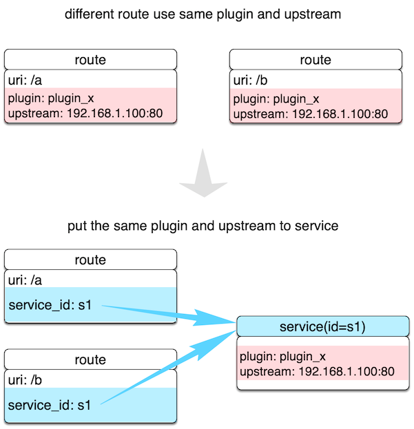

不同 Route 规则同时绑定到一个 Service 上，这些 Route 将具有相同的上游和插件配置，减少冗余配置。

> 注意
> - 当 Route 和 Service 都开启同一个插件时，Route 中的插件参数会优先于 Service 被使用。

[Service API](https://apisix.apache.org/zh/docs/apisix/admin-api/#service)


服务资源请求地址：/apisix/admin/services/{id}

### 请求方法  {#service-request-methods}

| 名称   | 请求 URI                          | 请求 body | 描述                                                                                                                                                               |
| ------ | ---------------------------------- | --------- | ---------------------------------------------------------------------------------------------------------------------------------------------------------------- |
| GET    | /apisix/admin/services             | 无        | 获取资源列表。                                                                                                                                                      |
| GET    | /apisix/admin/services/{id}        | 无        | 获取资源。                                                                                                                                                         |
| PUT    | /apisix/admin/services/{id}        | {...}     | 创建指定 id 资源。                                                                                                                                                  |
| POST   | /apisix/admin/services             | {...}     | 创建资源，id 由后台服务自动生成。                                                                                                                                    |
| DELETE | /apisix/admin/services/{id}        | 无        | 删除资源。                                                                                                                                                          |
| PATCH  | /apisix/admin/services/{id}        | {...}     | 标准 PATCH，修改已有 Service 的部分属性，其他不涉及的属性会原样保留；如果你要删除某个属性，将该属性的值设置为 null 即可删除；**注意**：当需要修改属性的值为数组时，该属性将全量更新。|
| PATCH  | /apisix/admin/services/{id}/{path} | {...}     | SubPath PATCH，通过 {path} 指定 Service 需要更新的属性，全量更新该属性的数据，其他不涉及的属性会原样保留。                                                                |

### body 请求参数 {#service-request-body-parameters}

| 名称             | 必选项                   | 类型     | 描述                                                             | 示例                                             |
| ---------------- | ----------------------- | -------- | ---------------------------------------------------------------- | ------------------------------------------------ |
| plugins          | 否                      | Plugin   | Plugin 配置，请参考 [Plugin](terminology/plugin.md)。               |                                                  |
| upstream         | 与 `upstream_id` 二选一。  | Upstream | Upstream 配置，请参考 [Upstream](terminology/upstream.md)。         |                                                  |
| upstream_id      | 与 `upstream` 二选一。    | Upstream | 需要使用的 upstream id，请参考 [Upstream](terminology/upstream.md)。|                                                  |
| name             | 否                     | 辅助     | 服务名称。                                                      |                                             |
| desc             | 否                     | 辅助     | 服务描述。                                                          |                                                  |
| labels           | 否                     | 匹配规则 | 标识附加属性的键值对。                                                 | {"version":"v2","build":"16","env":"production"} |
| enable_websocket | 否                     | 辅助     | `websocket`(boolean) 配置，默认值为 `false`。                       |                                                  |
| hosts            | 否                     | 匹配规则 | 非空列表形态的 `host`，表示允许有多个不同 `host`，匹配其中任意一个即可。| ["foo.com", "\*.bar.com"]                        |
| create_time      | 否                     | 辅助     | epoch 时间戳，单位为秒。如果不指定则自动创建。                         | 1602883670                                       |
| update_time      | 否                     | 辅助     | epoch 时间戳，单位为秒。如果不指定则自动创建。                           | 1602883670                                       |

Service 对象 JSON 配置示例：

```shell
{
    "id": "1",                # id
    "plugins": {},            # 指定 service 绑定的插件
    "upstream_id": "1",       # upstream 对象在 etcd 中的 id ，建议使用此值
    "upstream": {},           # upstream 信息对象，不建议使用
    "name": "test svc",       # service 名称
    "desc": "hello world",    # service 描述
    "enable_websocket": true, # 启动 websocket 功能
    "hosts": ["foo.com"]
}
```

## Plugin

Plugin 表示将在 HTTP 请求/响应生命周期期间执行的插件配置。
### 配置
Plugin 配置可直接绑定在 Route 上，也可以被绑定在 Service 或 Consumer上。而对于同一个插件的配置，只能有一份是有效的，配置选择优先级总是 Consumer > Route > Service。

### 插件列表
在 conf/config.yaml 中，可以声明本地 APISIX 节点都支持哪些插件。这是个白名单机制，不在该白名单的插件配置，都将会被自动忽略。这个特性可用于临时关闭或打开特定插件，应对突发情况非常有效。 如果你想在现有插件的基础上新增插件，注意需要拷贝 conf/config-default.yaml 的插件节点内容到 conf/config.yaml 的插件节点中。

插件列表和优先级

```shell
plugins:                          # plugin list (sorted by priority)
  - real-ip                        # priority: 23000
  - ai                             # priority: 22900
  - client-control                 # priority: 22000
  - proxy-control                  # priority: 21990
  - request-id                     # priority: 12015
  - zipkin                         # priority: 12011
  #- skywalking                    # priority: 12010
  #- opentelemetry                 # priority: 12009
  - ext-plugin-pre-req             # priority: 12000
  - fault-injection                # priority: 11000
  - mocking                        # priority: 10900
  - serverless-pre-function        # priority: 10000
  #- batch-requests                # priority: 4010
  - cors                           # priority: 4000
  - ip-restriction                 # priority: 3000
  - ua-restriction                 # priority: 2999
  - referer-restriction            # priority: 2990
  - csrf                           # priority: 2980
  - uri-blocker                    # priority: 2900
  - request-validation             # priority: 2800
  - openid-connect                 # priority: 2599
  - cas-auth                       # priority: 2597
  - authz-casbin                   # priority: 2560
  - authz-casdoor                  # priority: 2559
  - wolf-rbac                      # priority: 2555
  - ldap-auth                      # priority: 2540
  - hmac-auth                      # priority: 2530
  - basic-auth                     # priority: 2520
  - jwt-auth                       # priority: 2510
  - key-auth                       # priority: 2500
  - consumer-restriction           # priority: 2400
  - forward-auth                   # priority: 2002
  - opa                            # priority: 2001
  - authz-keycloak                 # priority: 2000
  #- error-log-logger              # priority: 1091
  - body-transformer               # priority: 1080
  - proxy-mirror                   # priority: 1010
  - proxy-cache                    # priority: 1009
  - proxy-rewrite                  # priority: 1008
  - workflow                       # priority: 1006
  - api-breaker                    # priority: 1005
  - limit-conn                     # priority: 1003
  - limit-count                    # priority: 1002
  - limit-req                      # priority: 1001
  #- node-status                   # priority: 1000
  - gzip                           # priority: 995
  - server-info                    # priority: 990
  - traffic-split                  # priority: 966
  - redirect                       # priority: 900
  - response-rewrite               # priority: 899
  - kafka-proxy                    # priority: 508
  #- dubbo-proxy                   # priority: 507
  - grpc-transcode                 # priority: 506
  - grpc-web                       # priority: 505
  - public-api                     # priority: 501
  - prometheus                     # priority: 500
  - datadog                        # priority: 495
  - elasticsearch-logger           # priority: 413
  - echo                           # priority: 412
  - loggly                         # priority: 411
  - http-logger                    # priority: 410
  - splunk-hec-logging             # priority: 409
  - skywalking-logger              # priority: 408
  - google-cloud-logging           # priority: 407
  - sls-logger                     # priority: 406
  - tcp-logger                     # priority: 405
  - kafka-logger                   # priority: 403
  - rocketmq-logger                # priority: 402
  - syslog                         # priority: 401
  - udp-logger                     # priority: 400
  - file-logger                    # priority: 399
  - clickhouse-logger              # priority: 398
  - tencent-cloud-cls              # priority: 397
  - inspect                        # priority: 200
  #- log-rotate                    # priority: 100
  # <- recommend to use priority (0, 100) for your custom plugins
  - example-plugin                 # priority: 0
  #- gm                            # priority: -43
  - aws-lambda                     # priority: -1899
  - azure-functions                # priority: -1900
  - openwhisk                      # priority: -1901
  - openfunction                   # priority: -1902
  - serverless-post-function       # priority: -2000
  - ext-plugin-post-req            # priority: -3000
  - ext-plugin-post-resp           # priority: -4000

```
### 插件执行

- 插件的配置可以被直接绑定在指定 Route 中，也可以被绑定在 Service 中，不过 Route 中的插件配置优先级更高。
- 一个插件在一次请求中只会执行一次，即使被同时绑定到多个不同对象中（比如 Route 或 Service）。 
- 插件运行先后顺序是根据插件自身的优先级来决定的，例如：
```shell
local _M = {
version = 0.1,
priority = 0, -- 这个插件的优先级为 0
name = plugin_name,
schema = schema,
metadata_schema = metadata_schema,
}
```

### 热加载

APISIX 的插件是热加载的，不管你是新增、删除还是修改插件，都不需要重启服务。

只需要通过 admin API 发送一个 HTTP 请求即可：

```shell
curl http://127.0.0.1:9080/apisix/admin/plugins/reload -H 'X-API-KEY: edd1c9f034335f136f87ad84b625c8f1' -X PUT

```
> 注意：
> - 如果你已经在路由规则里配置了某个插件（比如在 route 的 plugins 字段里面添加了它），然后禁用了该插件，在执行路由规则的时候会跳过这个插件。

[Plugin API](https://apisix.apache.org/zh/docs/apisix/admin-api/#plugin)


### 请求地址 {#plugin-uri}

Plugin 资源请求地址：/apisix/admin/plugins/{plugin_name}

### 请求方法 {#plugin-request-methods}

| 名称        | 请求 URI                            | 请求 body | 描述          |
| ----------- | ----------------------------------- | ---------- | ------------- |
| GET         | /apisix/admin/plugins/list          | 无         | 获取资源列表。  |
| GET         | /apisix/admin/plugins/{plugin_name} | 无         | 获取资源。      |
| GET         | /apisix/admin/plugins?all=true      | 无         | 获取所有插件的所有属性。 |
| GET         | /apisix/admin/plugins?all=true&subsystem=stream| 无 | 获取所有 Stream 插件的属性。|

### 使用示例 {#plugin-example}

获取插件  (`{plugin_name}`)  数据结构的 JSON 对象。

- 获取插件列表

    ```shell
    curl "http://127.0.0.1:9180/apisix/admin/plugins/list" \
    -H 'X-API-KEY:edd1c9f034335f136f87ad84b625c8f1'
    ```

    ```shell
    ["zipkin","request-id",...]
    ```

- 获取指定插件的属性

    ```shell
    curl "http://127.0.0.1:9180/apisix/admin/plugins/key-auth" \
    -H 'X-API-KEY:edd1c9f034335f136f87ad84b625c8f1'
    ```

    ```json
    {"$comment":"this is a mark for our injected plugin schema","properties":{"header":{"default":"apikey","type":"string"},"hide_credentials":{"default":false,"type":"boolean"},"_meta":{"properties":{"filter":{"type":"array","description":"filter determines whether the plugin needs to be executed at runtime"},"disable":{"type":"boolean"},"error_response":{"oneOf":[{"type":"string"},{"type":"object"}]},"priority":{"type":"integer","description":"priority of plugins by customized order"}},"type":"object"},"query":{"default":"apikey","type":"string"}},"type":"object"}
    ```

> 注意 :
> - 可以使用 `/apisix/admin/plugins?all=true` 接口获取所有插件的所有属性，每个插件包括 `name`，`priority`，`type`，`schema`，`consumer_schema` 和 `version`。
> - 默认情况下，该接口只返回 HTTP 插件。如果你需要获取 Stream 插件，需要使用 `/apisix/admin/plugins?all=true&subsystem=stream`。

## Plugin Config

在很多情况下，我们在不同的路由中会使用相同的插件规则，此时就可以通过 Plugin Config 来设置这些规则。Plugin Config 属于一组通用插件配置的抽象。

plugins 的配置可以通过 Admin API /apisix/admin/plugin_configs 进行单独配置，在路由中使用 plugin_config_id 与之进行关联。

对于同一个插件的配置，只能有一个是有效的，优先级为 Consumer > Route > Plugin Config > Service。


你可以使用 Plugin Config 资源创建一组可以在路由间复用的插件。

### 请求地址 {#plugin-config-uri}

[Plugin Config Api](https://apisix.apache.org/zh/docs/apisix/admin-api/#plugin-config)


Plugin Config 资源请求地址：/apisix/admin/plugin_configs/{id}

### 请求方法 {#plugin-config-request-methods}

| 名称   | 请求 URI                                 | 请求 body | 描述                                                                                                                                                                                     |
| ------ | ---------------------------------------- | --------- | ---------------------------------------------------------------------------------------------------------------------------------------------------------------------------------------- |
| GET    | /apisix/admin/plugin_configs             | 无        | 获取资源列表。                                                                                                                                                                             |
| GET    | /apisix/admin/plugin_configs/{id}        | 无        | 获取资源。                                                                                                                                                                                 |
| PUT    | /apisix/admin/plugin_configs/{id}        | {...}     | 根据 id 创建资源。                                                                                                                                                                         |
| DELETE | /apisix/admin/plugin_configs/{id}        | 无        | 删除资源。                                                                                                                                                                                 |
| PATCH  | /apisix/admin/plugin_configs/{id}        | {...}     | 标准 PATCH，修改已有 Plugin Config 的部分属性，其他不涉及的属性会原样保留；如果你要删除某个属性，将该属性的值设置为 null 即可删除；**注意**：当需要修改属性的值为数组时，该属性将全量更新。 |
| PATCH  | /apisix/admin/plugin_configs/{id}/{path} | {...}     | SubPath PATCH，通过 {path} 指定 Plugin Config 要更新的属性，全量更新该属性的数据，其他不涉及的属性会原样保留。                                                                           |

### body 请求参数 {#plugin-config-body-request-parameters}

| 名称      | 必选项  | 类型 | 描述        | 示例值 |
|---------  |---------|----|-----------|----|
|plugins    | 是      |Plugin| 更多信息请参考 [Plugin](terminology/plugin.md)。||
|desc       | 否 | 辅助 | 标识描述、使用场景等。 |customer xxxx|
|labels     | 否 | 辅助 | 标识附加属性的键值对。 |{"version":"v2","build":"16","env":"production"}|
|create_time| 否 | 辅助 | epoch 时间戳，单位为秒，如果不指定则自动创建。 |1602883670|
|update_time| 否 | 辅助 | epoch 时间戳，单位为秒，如果不指定则自动创建。 |1602883670|

## Global Rules

Global Rule 可以设置全局运行的插件，设置为全局规则的插件将在所有路由级别的插件之前优先运行。

### 请求地址 {#global-rule-uri}

Global Rule 资源请求地址：/apisix/admin/global_rules/{id}

### 请求方法 {#global-rule-request-methods}

| 名称   | 请求 URI                               | 请求 body | 描述                                                                                                                                                                                   |
| ------ | -------------------------------------- | --------- | -------------------------------------------------------------------------------------------------------------------------------------------------------------------------------------- |
| GET    | /apisix/admin/global_rules             | 无        | 获取资源列表。                                                                                                                                                                           |
| GET    | /apisix/admin/global_rules/{id}        | 无        | 获取资源。                                                                                                                                                                               |
| PUT    | /apisix/admin/global_rules/{id}        | {...}     | 将创建指定 id 的资源。                                                                                                                                                                   |
| DELETE | /apisix/admin/global_rules/{id}        | 无        | 删除资源。                                                                                                                                                                               |
| PATCH  | /apisix/admin/global_rules/{id}        | {...}     | 标准 PATCH，修改已有 Global Rule 的部分属性，其他不涉及的属性会原样保留；如果你要删除某个属性，将该属性的值设置为 null 即可删除；**注意**：当需要修改属性的值为数组时，该属性将全量更新。       |
| PATCH  | /apisix/admin/global_rules/{id}/{path} | {...}     | SubPath PATCH，通过 `{path}` 指定 Global Rule 要更新的属性，全量更新该属性的数据，其他不涉及的属性会原样保留。                                                                             |

### body 请求参数  {#global-rule-body-request-parameters}

| 名称        | 必选项 | 类型   | 描述                                               | 示例值       |
| ----------- | ------ | ------ | ------------------------------------------------- | ---------- |
| plugins     | 是     | Plugin | 插件配置。详细信息请参考 [Plugin](terminology/plugin.md)。 |            |
| create_time | 否     | 辅助   | epoch 时间戳，单位为秒，如果不指定则自动创建。     | 1602883670 |
| update_time | 否     | 辅助   | epoch 时间戳，单位为秒，如果不指定则自动创建。     | 1602883670 |


## Consumer

对于 API 网关通常可以用请求域名、客户端 IP 地址等字段识别到某类请求方， 然后进行插件过滤并转发请求到指定上游，但有时候这个深度不够。

|    字段    | 必选 |                                                               说明                                                                |
|----------|----|---------------------------------------------------------------------------------------------------------------------------------|
| username | 是  | Consumer 名称。                                                                                                                    |
| plugins  | 否  | 该 Consumer 对应的插件配置，它的优先级是最高的：Consumer \> Route \> Service。对于具体插件配置，可以参考 [Plugins] 章节。 |

在 APISIX 中，识别 Consumer 的过程如下图：


* 授权认证：比如有 [key-auth] 等。
* 获取 consumer_name：通过授权认证，即可自然获取到对应的 Consumer name，它是 Consumer 对象的唯一识别标识。
* 获取 Consumer 上绑定的 Plugin 或 Upstream 信息：完成对不同 Consumer 做不同配置的效果。

概括一下，Consumer 是某类服务的消费者，需与用户认证体系配合才能使用。 比如不同的 Consumer 请求同一个 API，网关服务根据当前请求用户信息，对应不同的 Plugin 或 Upstream 配置。

此外，大家也可以参考 [key-auth] 认证授权插件的调用逻辑，辅助大家来进一步理解 Consumer 概念和使用。

如何对某个 Consumer 开启指定插件，可以看下面例子：

1. 创建 Consumer ，指定认证插件 key-auth ，并开启特定插件 limit-count

```shell
$ curl http://127.0.0.1:9080/apisix/admin/consumers -H 'X-API-KEY: edd1c9f034335f136f87ad84b625c8f1' -X PUT -d '
{
"username": "jack",
"plugins": {
  "key-auth": {
     "key": "auth-one"
  },
 "limit-count": {
     "count": 2,
    "time_window": 60,
    "rejected_code": 503,
    "key": "remote_addr"
  }
 }
}'
```

2. 创建 Router，设置路由规则和启用插件配置

```shell
$ curl http://127.0.0.1:9080/apisix/admin/routes/1 -H 'X-API-KEY: edd1c9f034335f136f87ad84b625c8f1' -X PUT -d '
{
  "plugins": {
   "key-auth": {}
  },
  "upstream": {
    "nodes": {
      "127.0.0.1:1980": 1
     },
    "type": "roundrobin"
  },
 "uri": "/hello"
}'
```
3. 发测试请求，前两次返回正常，没达到限速阈值

```shell
$ curl http://127.0.0.1:9080/hello -H 'apikey: auth-one' -I

$ curl http://127.0.0.1:9080/hello -H 'apikey: auth-one' -I
```

4. 第三次测试返回 503，请求被限制

```shell
$ curl http://127.0.0.1:9080/hello -H 'apikey: auth-one' -I
   HTTP/1.1 503 Service Temporarily Unavailable
   ...
```

5. 结合 [consumer-restriction] 插件，限制 jack 对该 route 的访问 , 设置黑名单，禁止jack访问该API

```shell
 $ curl http://127.0.0.1:9080/apisix/admin/routes/1 -H 'X-API-KEY: edd1c9f034335f136f87ad84b625c8f1' -X PUT -d '
   {
    "plugins": {
      "key-auth": {},
      "consumer-restriction": {
       "blacklist": [
         "jack"
        ]
      }
    },
    "upstream": {
       "nodes": {
        "127.0.0.1:1980": 1
       },
    "type": "roundrobin"
    },
    "uri": "/hello"
   }'


```
6. 反复测试，均返回 403，jack被禁止访问

```shell
$ curl http://127.0.0.1:9080/hello -H 'apikey: auth-one' -I
HTTP/1.1 403
...

```


### 请求地址 {#consumer-uri}

[Consumer API](https://apisix.apache.org/zh/docs/apisix/admin-api/#consumer)

Consumer 资源请求地址：/apisix/admin/consumers/{username}

### 请求方法 {#consumer-request-methods}

| 名称   | 请求 URI                           | 请求 body | 描述          |
| ------ | ---------------------------------- | --------- | ------------- |
| GET    | /apisix/admin/consumers            | 无        | 获取资源列表。|
| GET    | /apisix/admin/consumers/{username} | 无        | 获取资源。    |
| PUT    | /apisix/admin/consumers            | {...}     | 创建资源。    |
| DELETE | /apisix/admin/consumers/{username} | 无        | 删除资源。    |

### body 请求参数 {#consumer-body-request-methods}

| 名称        | 必选项 | 类型     | 描述                                                                                                                             | 示例值                                             |
| ----------- | ----- | ------- | ------------------------------------------------------------------------------------------------------------------------------- | ------------------------------------------------ |
| username    | 是   | 辅助     | Consumer 名称。                                                                                                                  |                                                  |
| group_id    | 否   | 辅助     | Consumer Group 名称。                                                                                                            |                                                  |
| plugins     | 否   | Plugin   | 该 Consumer 对应的插件配置，它的优先级是最高的：Consumer > Route > Plugin Config > Service。对于具体插件配置，请参考 [Plugins](#plugin)。     |                                                  |
| desc        | 否   | 辅助     | consumer 描述。                                                                                                                  |                                                  |
| labels      | 否   | 匹配规则  | 标识附加属性的键值对。                                                                                                             | {"version":"v2","build":"16","env":"production"} |
| create_time | 否   | 辅助     | epoch 时间戳，单位为秒。如果不指定则自动创建。                                                                                       | 1602883670                                       |
| update_time | 否   | 辅助     | epoch 时间戳，单位为秒。如果不指定则自动创建。                                                                                       | 1602883670                                       |

Consumer 对象 JSON 配置示例：

```shell
{
    "plugins": {},          # 指定 consumer 绑定的插件
    "username": "name",     # 必填
    "desc": "hello world"   # consumer 描述
}
```

当认证插件与 Consumer 一起使用时，需要提供用户名、密码等信息；当认证插件与 Route 或 Service 绑定时，则不需要任何参数，因为此时 APISIX 是根据用户请求数据来判断用户对应的是哪个 Consumer。

:::note 注意

从 APISIX v2.2 版本开始，同一个 Consumer 可以绑定多个认证插件。

## Consumer Group

你可以使用该资源配置一组可以在 Consumer 间复用的插件。


### 请求地址 {#consumer-group-uri}

[Consumer Group API](https://apisix.apache.org/zh/docs/apisix/admin-api/#consumer-group)

Consumer Group 资源请求地址：/apisix/admin/consumer_groups/{id}

### 请求方法 {#consumer-group-request-methods}

| 名称   | 请求 URI                                  | 请求 body | 描述                                                                                                                                                                                     |
| ------ | ----------------------------------------- | --------- | ---------------------------------------------------------------------------------------------------------------------------------------------------------------------------------------- |
| GET    | /apisix/admin/consumer_groups             | 无        | 获取资源列表。                                                                                                                                                                             |
| GET    | /apisix/admin/consumer_groups/{id}        | 无        | 获取资源。                                                                                                                                                                                 |
| PUT    | /apisix/admin/consumer_groups/{id}        | {...}     | 将创建指定 id 的资源。                                                                                                                                                                        |
| DELETE | /apisix/admin/consumer_groups/{id}        | 无        | 删除资源。                                                                                                                                                                                 |
| PATCH  | /apisix/admin/consumer_groups/{id}        | {...}     | 标准 PATCH，修改已有 Consumer Group 的部分属性，其他不涉及的属性会原样保留；如果你要删除某个属性，将该属性的值设置为 null 即可删除；**注意**：当需要修改属性的值为数组时，该属性将全量更新。 |
| PATCH  | /apisix/admin/consumer_groups/{id}/{path} | {...}     | SubPath PATCH，通过 `{path}` 指定 Consumer Group 要更新的属性，全量更新该属性的数据，其他不涉及的属性会原样保留。                                                                           |

### body 请求参数  {#consumer-group-body-request-parameters}

| 名称      | 必选项  | 类型  | 描述                                          | 示例值 |
|--------- |--------- |------|----------------------------------------------- |------|
|plugins  | 是        |Plugin| 插件配置。详细信息请参考 [Plugin](terminology/plugin.md)。 |      |
|desc     | 否        | 辅助 | 标识描述、使用场景等。                          | Consumer 测试。|
|labels   | 否        | 辅助 | 标识附加属性的键值对。                          |{"version":"v2","build":"16","env":"production"}|
|create_time| 否      | 辅助 | epoch 时间戳，单位为秒，如果不指定则自动创建。 |1602883670|
|update_time| 否      | 辅助 | epoch 时间戳，单位为秒，如果不指定则自动创建。 |1602883670|


# APISIX+Dubbo+Nacos实践

## kind 环境安装

1. kind config 
```shell
kind: Cluster
apiVersion: kind.x-k8s.io/v1alpha4
# One control plane node and three "workers".
#
# While these will not add more real compute capacity and
# have limited isolation, this can be useful for testing
# rolling updates etc.
#
# The API-server and other control plane components will be
# on the control-plane node.
#
# You probably don't need this unless you are testing Kubernetes itself.
nodes:
- role: control-plane
- role: worker
- role: worker

```

2. setup kind 
```shell
APISIX_KUBECONFIG="${HOME}/.kube/config_apisix"
APISIX_CLUSTER_NAME="apisix"
kind create cluster --config=apisix/apisix_kind_config.yaml --kubeconfig "${APISIX_KUBECONFIG}" --name "${APISIX_CLUSTER_NAME}" --image kindest/node:v1.21.1

```
3. export kubeconfig

```shell
export KUBECONFIG="${HOME}/.kube/config_apisix"
```
4. install apisix & ingress controller

```shell
helm repo add apisix https://charts.apiseven.com && helm repo update && helm upgrade --install apisix apisix/apisix --create-namespace  --namespace apisix --set dashboard.enabled=true --set ingress-controller.enabled=true --set ingress-controller.config.apisix.serviceNamespace=apisix
```

```shell
1. Get the application URL by running these commands:
  export NODE_PORT=$(kubectl get --namespace apisix -o jsonpath="{.spec.ports[0].nodePort}" services apisix-gateway)
  export NODE_IP=$(kubectl get nodes --namespace apisix -o jsonpath="{.items[0].status.addresses[0].address}")
  echo http://$NODE_IP:$NODE_PORT
```
5. port forward

```shell
 sudo kubefwd svc -n apisix --kubeconfig="$KUBECONFIG"
  
```
6. install httpbin
```
kubectl apply  -f apisix/httpbin.yaml -n apisix
```
7. install dubbo + nacos + app busiz

```shell
kubectl apply -f apisix/dubbo/Namespace.yml
kubectl apply -f apisix/dubbo/All.yml
```
8. access apisix

```shell
http://apisix-dashboard
http://apisix-admin
http://apisix-gateway
```


## nacos

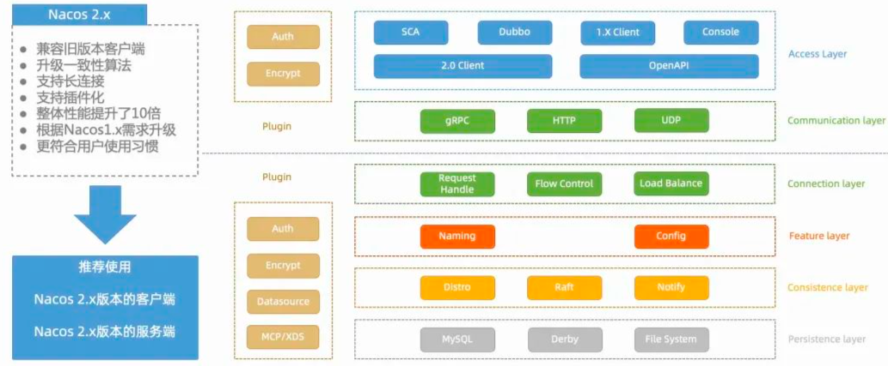

Nacos 2.X 架构层次如上图，它相比 Nacos 1.X 的最主要变化是：

1. 客户端和服务端之间绿色部分的通信层和连接层，增加了 gRPC 长链接协议，同时也将会补充客户端和服务端之间的流量控制和负载均衡。

2. 将增加一些可拓展的接口，实现一些插件，比如将来会实现的的配置加解密，多数据源支持；还有将目前的鉴权抽象成插件实现；还有现在的 MCP 和 XDS 协议的支持。

## 实践

### 问题
Dubbo 本身可以用 Nacos 做服务发现，进行服务调用；只要简单让网关从 Nacos 中获取到 Dubbo 的服务列表，然后按照 url 转发是不是就就行？

其实不是的，在实践中，通常会遇到下面 2 个主要问题：

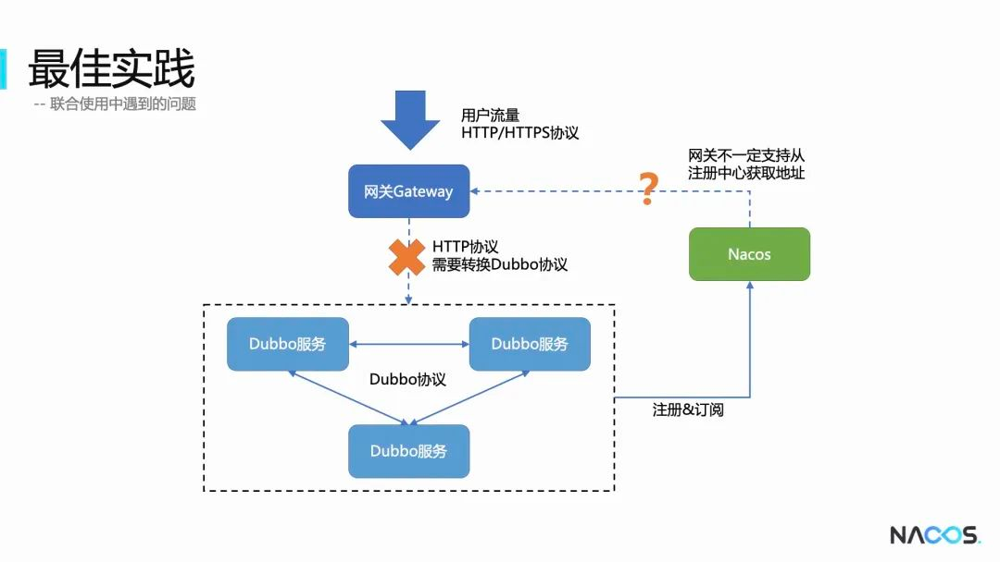

### 方案

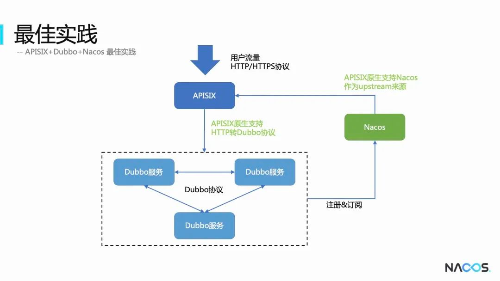

```shell 
https://github.com/KomachiSion/APISIX-Dubbo-Nacos
```

## 流量全链路灰度

- https://blog.csdn.net/alisystemsoftware/article/details/125855750

## 环境配置【待更新】

- 待更新


# reference
* https://oomspot.com/author/apache-apisix
* https://www.apiseven.com/apisix-devcon-2020/k8s-ingress

# argocd
* https://argoproj.github.io/argo-rollouts/features/traffic-management/apisix/


