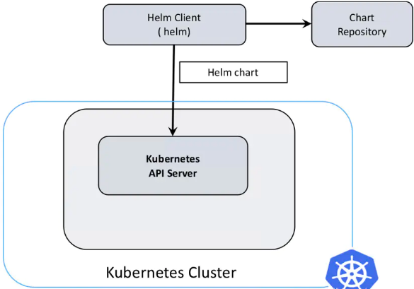
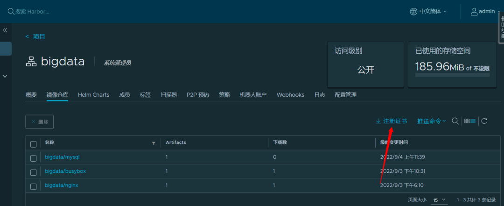
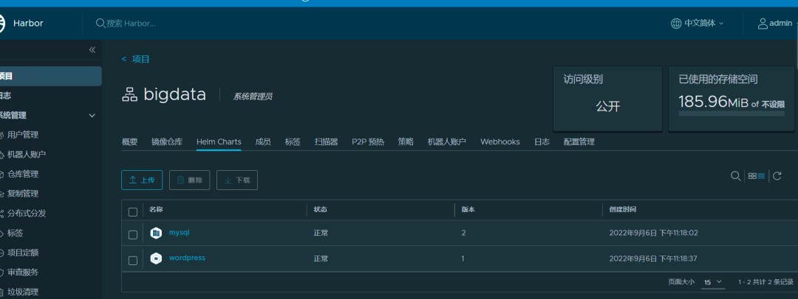

# helm

## 文档

1. [install](https://helm.sh/zh/docs/intro/install/)
2. [文档](https://helm.sh/zh/docs/intro/quickstart/)

## Helm charts 实践项目

1. [prometheus](https://prometheus-community.github.io/helm-charts)
2. [crane](https://gocrane.github.io/helm-charts)

## Helm 架构



## Helm 组件及相关术语

- Helm——Helm 是一个命令行下的客户端工具。主要用于 Kubernetes 应用程序 Chart 的创建、打包、发布以及创建和管理本地和远程的 Chart 仓库。
- Chart——Chart 代表着 Helm 包。它包含在 Kubernetes 集群内部运行应用程序，工具或服务所需的所有资源定义。你可以把它看作是 Homebrew formula，Apt dpkg，或 Yum RPM 在 Kubernetes 中的等价物。
- Release——Release 是运行在 Kubernetes 集群中的 chart 的实例。一个 chart 通常可以在同一个集群中安装多次。每一次安装都会创建一个新的 release。
- Repoistory——Repository（仓库） 是用来存放和共享 charts 的地方。它就像 Perl 的 CPAN 档案库网络 或是 Fedora 的 软件包仓库，只不过它是供 Kubernetes 包所使用的。


## helm 命令

Helm 针对 Kubernetes 的 Helm 包管理器。Helm 的一般操作：

- helm search: 搜索 chart
- helm pull: 下载 chart 到本地目录查看
- helm install: 安装 chart 到 Kubernetes
- helm list: 列出已发布的 chart
- helm template: 导出 chart 
- helm repo: helm 仓库管理

```shell
(base) ➜  k8s-learning git:(main) ✗ helm help
The Kubernetes package manager

Common actions for Helm:

- helm search:    search for charts
- helm pull:      download a chart to your local directory to view
- helm install:   upload the chart to Kubernetes
- helm list:      list releases of charts
   

Environment variables:

| Name                               | Description                                                                       |
|------------------------------------|-----------------------------------------------------------------------------------|
| $HELM_CACHE_HOME                   | set an alternative location for storing cached files.                             |
| $HELM_CONFIG_HOME                  | set an alternative location for storing Helm configuration.                       |
| $HELM_DATA_HOME                    | set an alternative location for storing Helm data.                                |
| $HELM_DEBUG                        | indicate whether or not Helm is running in Debug mode                             |
| $HELM_DRIVER                       | set the backend storage driver. Values are: configmap, secret, memory, postgres   |
| $HELM_DRIVER_SQL_CONNECTION_STRING | set the connection string the SQL storage driver should use.                      |
| $HELM_MAX_HISTORY                  | set the maximum number of helm release history.                                   |
| $HELM_NAMESPACE                    | set the namespace used for the helm operations.                                   |
| $HELM_NO_PLUGINS                   | disable plugins. Set HELM_NO_PLUGINS=1 to disable plugins.                        |
| $HELM_PLUGINS                      | set the path to the plugins directory                                             |
| $HELM_REGISTRY_CONFIG              | set the path to the registry config file.                                         |
| $HELM_REPOSITORY_CACHE             | set the path to the repository cache directory                                    |
| $HELM_REPOSITORY_CONFIG            | set the path to the repositories file.                                            |
| $KUBECONFIG                        | set an alternative Kubernetes configuration file (default "~/.kube/config")       |
| $HELM_KUBEAPISERVER                | set the Kubernetes API Server Endpoint for authentication                         |
| $HELM_KUBECAFILE                   | set the Kubernetes certificate authority file.                                    |
| $HELM_KUBEASGROUPS                 | set the Groups to use for impersonation using a comma-separated list.             |
| $HELM_KUBEASUSER                   | set the Username to impersonate for the operation.                                |
| $HELM_KUBECONTEXT                  | set the name of the kubeconfig context.                                           |
| $HELM_KUBETOKEN                    | set the Bearer KubeToken used for authentication.                                 |

Helm stores cache, configuration, and data based on the following configuration order:

- If a HELM_*_HOME environment variable is set, it will be used
- Otherwise, on systems supporting the XDG base directory specification, the XDG variables will be used
- When no other location is set a default location will be used based on the operating system

By default, the default directories depend on the Operating System. The defaults are listed below:

| Operating System | Cache Path                | Configuration Path             | Data Path               |
|------------------|---------------------------|--------------------------------|-------------------------|
| Linux            | $HOME/.cache/helm         | $HOME/.config/helm             | $HOME/.local/share/helm |
| macOS            | $HOME/Library/Caches/helm | $HOME/Library/Preferences/helm | $HOME/Library/helm      |
| Windows          | %TEMP%\helm               | %APPDATA%\helm                 | %APPDATA%\helm          |

Usage:
  helm [command]

Available Commands:
  cm-push     Please see https://github.com/chartmuseum/helm-push for usage
  completion  generate autocompletion scripts for the specified shell
  create      create a new chart with the given name
  dependency  manage a chart's dependencies
  env         helm client environment information
  get         download extended information of a named release
  help        Help about any command
  history     fetch release history
  install     install a chart
  lint        examine a chart for possible issues
  list        list releases
  package     package a chart directory into a chart archive
  plugin      install, list, or uninstall Helm plugins
  pull        download a chart from a repository and (optionally) unpack it in local directory
  repo        add, list, remove, update, and index chart repositories
  rollback    roll back a release to a previous revision
  search      search for a keyword in charts
  show        show information of a chart
  status      display the status of the named release
  template    locally render templates
  test        run tests for a release
  uninstall   uninstall a release
  upgrade     upgrade a release
  verify      verify that a chart at the given path has been signed and is valid
  version     print the client version information

Flags:
      --debug                       enable verbose output
  -h, --help                        help for helm
      --kube-apiserver string       the address and the port for the Kubernetes API server
      --kube-as-group stringArray   group to impersonate for the operation, this flag can be repeated to specify multiple groups.
      --kube-as-user string         username to impersonate for the operation
      --kube-ca-file string         the certificate authority file for the Kubernetes API server connection
      --kube-context string         name of the kubeconfig context to use
      --kube-token string           bearer token used for authentication
      --kubeconfig string           path to the kubeconfig file
  -n, --namespace string            namespace scope for this request
      --registry-config string      path to the registry config file (default "/Users/jun/Library/Preferences/helm/registry.json")
      --repository-cache string     path to the file containing cached repository indexes (default "/Users/jun/Library/Caches/helm/repository")
      --repository-config string    path to the file containing repository names and URLs (default "/Users/jun/Library/Preferences/helm/repositories.yaml")

Use "helm [command] --help" for more information about a command.

```

### 一、helm 仓库 (helm repo)

> 添加、列出、删除、更新和索引 chart 仓库。
> 

1. 添加 repo

```shell

helm repo add prometheus-community https://prometheus-community.github.io/helm-charts

```
2. 列出 repo 

```shell
helm repo list

NAME                    URL                                               
bitnami                 https://charts.bitnami.com/bitnami                
harbor                  https://helm.goharbor.io                          
jetstack                https://charts.jetstack.io                        
apisix                  https://charts.apiseven.com                       
prometheus-community    https://prometheus-community.github.io/helm-charts
grafana                 https://grafana.github.io/helm-charts             
crane                   https://finops-helm.pkg.coding.net/gocrane/gocrane
higress.io              https://higress.io/helm-charts    
```

3. 更新 repo

```shell
helm repo update prometheus-community
```
4. 删除 repo

```shell
helm repo remove prometheus-community
```

### 二、创建 chart

> 使用给定名称创建新的 chart，该命令创建 chart 目录和 chart 用到的公共文件目录。


比如'helm create foo'会创建一个目录结构看起来像这样：

```shell
(base) ➜ $ helm create foo
foo
├── Chart.yaml
├── charts
├── templates
│   ├── NOTES.txt
│   ├── _helpers.tpl
│   ├── deployment.yaml
│   ├── hpa.yaml
│   ├── ingress.yaml
│   ├── service.yaml
│   ├── serviceaccount.yaml
│   └── tests
│       └── test-connection.yaml
└── values.yaml

```

### 三、chart 包安装（helm install）

> 该命令用于安装 chart 包。安装参数必须是 chart 的引用，一个打包后的 chart 路径，未打包的 chart 目录或者是一个 URL。
>

要重写 chart 中的值，使用--values参数传递一个文件或者使用--set参数在命令行传递配置，强制使用字符串要用--set-string。当值本身对于命令行太长或者是动态生成的时候，可以使用--set-file设置独立的值。

```shell
helm repo add prometheus-community https://prometheus-community.github.io/helm-charts
helm install prometheus -n crane-system --version 19.6.1 \
    --set pushgateway.enabled=false \
    --set alertmanager.enabled=false \
    --set server.persistentVolume.enabled=false \
    -f https://raw.githubusercontent.com/gocrane/helm-charts/main/integration/prometheus/override_values.yaml \
    --create-namespace  prometheus-community/prometheus
   
```

### 四、管理 chart 依赖（helm dependency）

- Helm chart 将依赖存储在'charts/'。对于 chart 开发者，管理依赖比声明了所有依赖的'Chart.yaml'文件更容易。
- 依赖命令对该文件进行操作，使得存储在'charts/'目录的需要的依赖和实际依赖之间同步变得很容易。

比如  prometheus Chart.yaml 声明了四个依赖：

```shell
# Chart.yaml
dependencies:
- condition: alertmanager.enabled
  name: alertmanager
  repository: https://prometheus-community.github.io/helm-charts
  version: 0.24.*
- condition: kube-state-metrics.enabled
  name: kube-state-metrics
  repository: https://prometheus-community.github.io/helm-charts
  version: 4.30.*
- condition: prometheus-node-exporter.enabled
  name: prometheus-node-exporter
  repository: https://prometheus-community.github.io/helm-charts
  version: 4.8.*
- condition: prometheus-pushgateway.enabled
  name: prometheus-pushgateway
  repository: https://prometheus-community.github.io/helm-charts
  version: 2.0.*
```

- name 是 chart 名称，必须匹配 Chart.yaml 文件中名称。
- version 字段应该包含一个语义化的版本或版本范围。
- condition: 依赖条件
- repository：依赖对应 chart URL

仓库可以被定义为本地存储的依赖 chart 的目录路径。路径应该以"file://"前缀开头，比如：

```shell
# Chart.yaml
dependencies:
- name: nginx
  version: "1.2.3"
  repository: "file://../dependency_chart/nginx"
```

1. 列举指定 chart 的依赖

```shell
# helm dependency list CHART
helm dependency list prometheus

NAME                            VERSION REPOSITORY                                              STATUS  
alertmanager                    0.24.*  https://prometheus-community.github.io/helm-charts      unpacked
kube-state-metrics              4.30.*  https://prometheus-community.github.io/helm-charts      unpacked
prometheus-node-exporter        4.8.*   https://prometheus-community.github.io/helm-charts      unpacked
prometheus-pushgateway          2.0.*   https://prometheus-community.github.io/helm-charts      unpacked

```
2. 依赖升级

基于 Chart.yaml 内容升级 charts/

```shell
# helm dependency update CHART [flags]
helm dependency update prometheus
```

### 五、Helm 列表（helm list）

> 列举发布版本，该命令会列举出指定命名空间的所有发布版本
> 

- 列举发布版本，该命令会列举出指定命名空间的所有发布版本，(如果没有指定命名空间，会使用当前命名空间)。
- 默认情况下，只会列举出部署的或者失败的发布，像--uninstalled或者--all会修改默认行为。这些参数可以组合使用：--uninstalled --failed。
- 默认情况下，最多返回256项，使用--max限制数量，--max设置为0 不会返回所有结果，而是返回服务器默认值，可能要比 256 更多。同时使用--max和--offset参数可以翻页显示。

```shell
# -A显示所有
helm list --max=10 --offset=2 -A
```

### 六、升级版本（helm upgrade）

> 该命令将发布升级到新版的 chart。升级参数必须是发布和 chart。chart 参数可以是：chart引用('example/mariadb')，chart目录路径，打包的 chart 或者完整 URL。
> 对于 chart 引用，除非使用'--version'参数指定，否则会使用最新版本。
>

```shell
helm upgrade --set foo=bar --set foo=newbar redis ./redis
```

### 七、发布历史（helm history）

> 检索发布历史，打印给定版本的历史修订。默认会返回最大的256个历史版本。设置--max配置返回历史列表的最大长度。

```shell
$ helm history angry-bird
REVISION    UPDATED                     STATUS          CHART             APP VERSION     DESCRIPTION
1           Mon Oct 3 10:15:13 2016     superseded      alpine-0.1.0      1.0             Initial install
2           Mon Oct 3 10:15:13 2016     superseded      alpine-0.1.0      1.0             Upgraded successfully
3           Mon Oct 3 10:15:13 2016     superseded      alpine-0.1.0      1.0             Rolled back to 2
4           Mon Oct 3 10:15:13 2016     deployed        alpine-0.1.0      1.0    
```

### 八、回滚版本（helm rollback）

> 回滚发布到上一个版本，回滚命令的第一个参数是发布的名称，第二是修订（版本）号，如果省略此参数，会回滚到上一个版本。

```shell
# helm rollback <RELEASE> [REVISION] [flags]
# 先查看历史版本
helm history prometheus -n crane-system
# 不指定版本就回退上个版本
helm rollback prometheus 1 -n crane-system
helm rollback prometheus -n crane-system
```

### 九、拉取 chart（helm pull）

> 从仓库下载并（可选）在本地目录解压。
> 

```shell
# helm pull [chart URL | repo/chartname] [...] [flags]
# 仅下载
helm pull prometheus-community/prometheus
# 下载并解压到当前目录
helm pull prometheus-community/prometheus --untar
```

### 十、Helm 打包（helm package）

- 将 chart 目录打包到 chart 归档中，该命令将 chart 打包成一个 chart 版本包文件。如果给定路径，就会在该路径中查找 chart（必须包含 Chart.yaml 文件）然后将目录打包。
- 要签名一个 chart，使用--sign参数，在大多数场景中，也要提供--keyring path/to/secret/keys和--key keyname。

```shell
helm package prometheus
# Successfully packaged chart and saved it to: /Users/jun/go/src/github.com/2456868764/k8s-learning/helm/prometheus-19.6.1.tgz

```

> 如果想忽略 helm 中的文件，可以在.helmignore进行匹配，该.helmignore 文件支持 Unix shell 全局匹配，相对路径匹配和否定（以！前缀反向匹配）。每行仅考虑一种模式。示例如下：

```shell
# .helmignore
.git
*/temp*
*/*/temp*
temp?
```

### 十一、Helm template 解析和生成 yaml 文件

```shell
helm template prometheus prometheus \
  --namespace crane-system \
  --version 20.0.2 \
  --repo https://prometheus-community.github.io/helm-charts \
  -f -f https://raw.githubusercontent.com/gocrane/helm-charts/main/integration/prometheus/override_values.yaml \
  > "./prometheus.yaml"

```

### 十二、推送 chart 到 harbor（helm cm-push）

> 将 chart 推送到远程。
>

1. 在线安装

```shell
helm plugin install https://github.com/chartmuseum/helm-push
```
2. 离线安装

下载地址：https://github.com/chartmuseum/helm-push/tags

```shell
# 1、下载安装包
wget https://github.com/chartmuseum/helm-push/releases/tag/v0.10.3

# 2、查看helm的plugin路径：helm env
helm env

# 3、在该路径下创建helm-push文件夹，并将安装包拷贝到该文件夹下解压即可
mkdir /Users/jun/Library/helm/plugins/helm-push

wget https://github.com/chartmuseum/helm-push/releases/download/v0.10.3/helm-push_0.10.3_linux_amd64.tar.gz

tar zxvf ./helm-push_0.10.3_linux_amd64.tar.gz -C /Users/jun/Library/helm/plugins/helm-push/helm-push
```

3. 查看插件

```shell
helm plugin list
```

4. helm 增加 harbor repo

```shell
# chartrepo，固定参数，bigdata自定义项目
helm repo add local-harbor --username=admin --password=Harbor12345 https://myharbor.com/chartrepo/bigdata/ --ca-file /opt/k8s/helm/ca.crt
```

证书直接在 harbor 上下载



5. 示例演示

```shell
# 查看帮助
helm cm-push --help

# 推送，接【目录】
helm cm-push mysql/ local-harbor --ca-file /opt/k8s/helm/ca.crt

# 推送，接【压缩包】
helm cm-push wordpress-15.1.5.tgz local-harbor --ca-file /opt/k8s/helm/ca.crt

# 推送，指定版本，--version
helm cm-push mychart/ --version="1.2.3" local-harbor --ca-file /opt/k8s/helm/ca.crt

# 强制推送，--force
helm cm-push --force mychart-0.3.2.tgz local-harbor
```

查看



## 自定义 CRD 资源

- 在chart中创建一个名为 crds 的特殊目录来保存CRD。 这些CRD没有模板化，但是运行 helm install 时可以为chart默认安装。

- 如果CRD已经存在，会显示警告并跳过。如果希望跳过CRD安装步骤， 可以使用--skip-crds 参数。

- https://v3.helm.sh/zh/docs/chart_best_practices/custom_resource_definitions/


### 十三、搜索 hub（helm search hub）

在Artifact Hub或自己的 hub 实例中搜索 chart。

Artifact Hub 是基于 web 页面的应用，支持 CNCF 项目的查找、安装和发布包及配置项，包括了公开发布的 Helm chart。

它是 CNCF 的沙盒项目。可以访问 https://artifacthub.io/

```shell
# 不带参数，列出所有
helm search hub

# 指定chart
helm search hub mysql
```

### 十四、搜索仓库（helm search repo）

> 用 chart 中关键字搜索仓库，搜索会读取系统上配置的所有仓库，并查找匹配。搜索这些仓库会使用存储在系统中的元数据。它会展示找到最新稳定版本的 chart。
> 如果指定了--devel参数，输出会包括预发布版本。
> 

```shell
# Search for stable release versions matching the keyword "nginx"
$ helm search repo nginx

# Search for release versions matching the keyword "nginx", including pre-release versions
$ helm search repo nginx --devel

# Search for the latest stable release for nginx-ingress with a major version of 1
$ helm search repo nginx-ingress --version ^1.0.0

```


### 十五、验证 chart（helm lint）

> 该命令使用一个 chart 路径并运行一系列的测试来验证 chart 的格式是否正确。如果遇到引起 chart 安装失败的情况，会触发[ERROR]信息，如果遇到违反惯例或建议的问题，会触发[WARNING]。

```shell
# helm lint PATH [flags]
helm lint prometheus 

==> Linting prometheus
[ERROR] templates/: template: prometheus/templates/NOTES.txt:85:46: executing "prometheus/templates/NOTES.txt" at <index .Subcharts "prometheus-pushgateway">: error calling index: index of untyped nil

Error: 1 chart(s) linted, 1 chart(s) failed

```

### 十六、常用命令总结

```shell
helm version                            // 查看helm版本
helm create xxx                         // 创建一个xxx charts
helm lint ./xxx                         // 检查包的格式或信息是否有问题
helm install xxx1 ./xxx                 // 部署安装xxx，设置名称为xxx1
helm list                               // 列出已经部署的charts
helm history                            // 发布历史
helm upgrade                            // 更新版本
helm rollback                           // 回滚版本
helm package ./xxx                      // 打包charts
helm repo add --username admin --password password myharbor xxx  // 增加repo
helm uninstall xxx1                     // 卸载删除xxx1
helm pull                                // 拉取chart包
helm template                           // 解析并导出chart包
helm cm-push                            // 推送chart包
helm repo update                        // 更新仓库资源
helm search hub                         // 从 Artifact Hub 中查找并列出 helm charts。Artifact Hub中存放了大量不同的仓库
helm search repo                        // 从你添加（使用 helm repo add）到本地 helm 客户端中的仓库中进行查找。该命令基于本地数据进行搜索，无需连接互联网
```


## 构建自定义 chart

根据 crane 开源项目为样例 分析如何构建一个复杂项目的 helm charts

Crane 是一个基于 FinOps 的云资源分析与成本优化平台。它的愿景是在保证客户应用运行质量的前提下实现极致的降本。

- https://gocrane.io/zh-cn/ 
- https://gocrane.github.io/helm-charts

### 一、Chart 目录结构


## Reference
1. https://mp.weixin.qq.com/s/bas8C87govMwIjBRXSsnbQ
2. https://mp.weixin.qq.com/s/zlIXMawUTOsI9rEi1sr-UA