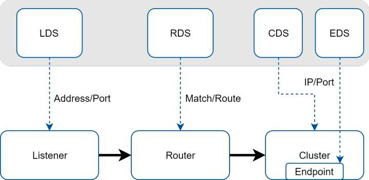
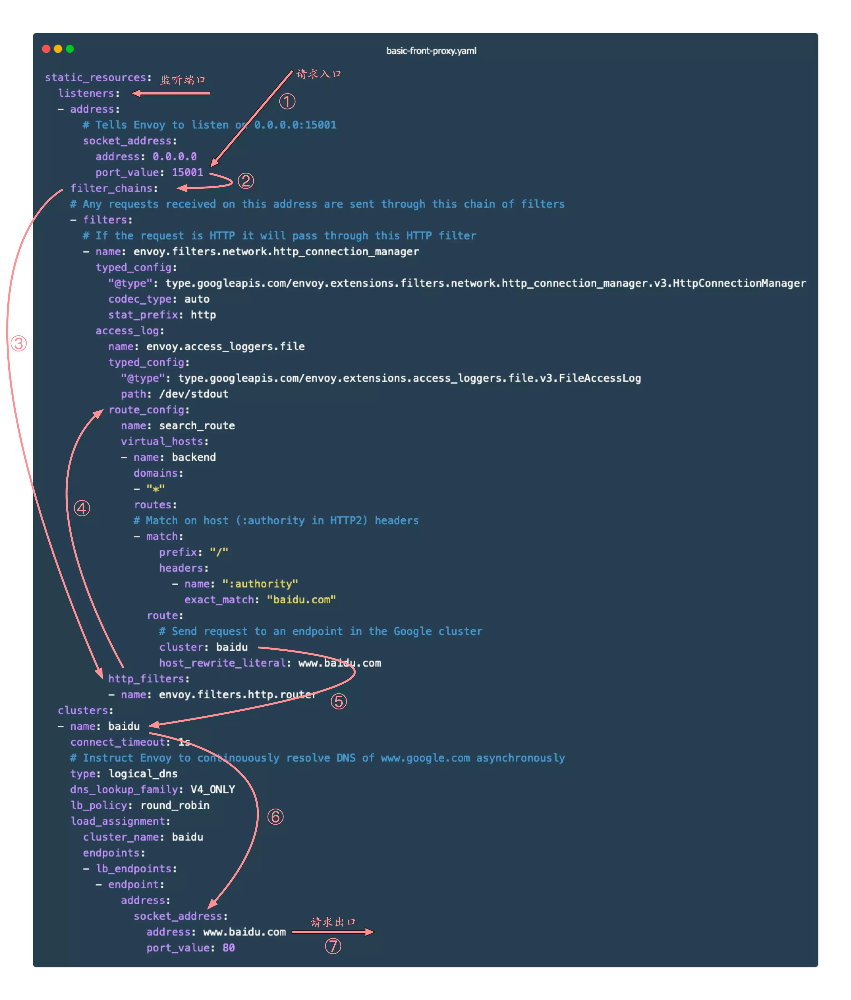

# quickstart
1. 网站和文档
```
https://www.envoyproxy.io/
https://www.envoyproxy.io/docs/envoy/latest/intro/what_is_envoy
```
2. func-e 安装和启动

```shell
sudo curl https://func-e.io/install.sh | bash -s -- -b /usr/local/bin
```
或者 https://github.com/tetratelabs/func-e/releases/tag/v1.1.4
下载对应的操作系统版本

```shell

func-e run -c /path/to/envoy_basic_front.yaml

func-e run --config-yaml "admin: {address: {socket_address: {address: '127.0.0.1', port_value: 9901}}}"

```
```shell
(base) ➜  ~ func-e run --config-yaml "admin: {address: {socket_address: {address: '127.0.0.1', port_value: 9901}}}"

looking up the latest Envoy version
downloading https://archive.tetratelabs.io/envoy/download/v1.25.0/envoy-v1.25.0-darwin-arm64.tar.xz
```

3. docker安装

社区提供的镜像位于 envoyproxy 中，常用的有：

- envoyproxy/envoy-alpine : 基于 alpine 的发行镜像
- envoyproxy/envoy-alpine-dev : 基于 alpine 的 Nightly 版本发行镜像
- envoyproxy/envoy : 基于 Ubuntu 的发行镜像
- envoyproxy/envoy-dev : 基于 Ubuntu 的 Nightly 版本发行镜像

```shell
docker pull envoyproxy/envoy:v1.25-latest
```
启动 Envoy 容器时，可以用本地的 envoy.yaml 覆盖镜像中的 envoy.yaml：

```shell
 docker run -d --network=host -v `pwd`/envoy_basic_front.yaml:/etc/envoy/envoy_basic_front.yaml envoyproxy/envoy:v1.25-latest
```

4. Centos  安装

```shell
sudo yum install yum-utils
sudo rpm --import 'https://rpm.dl.getenvoy.io/public/gpg.CF716AF503183491.key'
curl -sL 'https://rpm.dl.getenvoy.io/public/config.rpm.txt?distro=el&codename=7' > /tmp/tetrate-getenvoy-rpm-stable.repo
sudo yum-config-manager --add-repo '/tmp/tetrate-getenvoy-rpm-stable.repo'
sudo yum makecache --disablerepo='*' --enablerepo='tetrate-getenvoy-rpm-stable'
sudo yum install getenvoy-envoy
```
5. Ubuntu Linux 安装

```shell
sudo apt update
sudo apt install apt-transport-https gnupg2 curl lsb-release
curl -sL 'https://deb.dl.getenvoy.io/public/gpg.8115BA8E629CC074.key' | sudo gpg --dearmor -o /usr/share/keyrings/getenvoy-keyring.gpg
Verify the keyring - this should yield "OK"
echo a077cb587a1b622e03aa4bf2f3689de14658a9497a9af2c427bba5f4cc3c4723 /usr/share/keyrings/getenvoy-keyring.gpg | sha256sum --check
echo "deb [arch=amd64 signed-by=/usr/share/keyrings/getenvoy-keyring.gpg] https://deb.dl.getenvoy.io/public/deb/ubuntu $(lsb_release -cs) main" | sudo tee /etc/apt/sources.list.d/getenvoy.list
sudo apt update
sudo apt install -y getenvoy-envoy
```

7. MacOs 安装 

```shell
brew tap tetratelabs/getenvoy
brew install envoy
```

# Envoy核心功能

1. 核心功能

- 非侵入的架构 : Envoy 是一个独立进程，设计为伴随每个应用程序服务运行。所有的 Envoy 形成一个透明的通信网格，每个应用程序发送消息到本地主机或从本地主机接收消息，不需要知道网络拓扑，对服务的实现语言也完全无感知，这种模式也被称为 Sidecar。
- L3/L4/L7 架构 : 传统的网络代理，要么在 HTTP 层工作，要么在 TCP 层工作。在 HTTP 层的话，你将会从传输线路上读取整个 HTTP 请求的数据，对它做解析，查看 HTTP 头部和 URL，并决定接下来要做什么。随后，你将从后端读取整个响应的数据，并将其发送给客户端。但这种做法的缺点就是非常复杂和缓慢，更好的选择是下沉到 TCP 层操作：只读取和写入字节，并使用 IP 地址，TCP 端口号等来决定如何处理事务，但无法根据不同的 URL 代理到不同的后端。Envoy 支持同时在 3/4 层和 7 层操作，以此应对这两种方法各自都有其实际限制的现实。
- HTTP/2 支持 : 可以在 HTTP/2 和 HTTP/1.1 之间相互转换（双向），建议使用 HTTP/2。
- 服务发现和动态配置 : 与 Nginx 等代理的热加载不同，Envoy 可以通过 API 来实现其控制平面，控制平面可以集中服务发现，并通过 API 接口动态更新数据平面的配置，不需要重启数据平面的代理。不仅如此，控制平面还可以通过 API 将配置进行分层，然后逐层更新，例如：上游集群中的虚拟主机、HTTP 路由、监听的套接字等。
- gRPC 支持 : gRPC 它使用 HTTP/2 作为底层多路复用传输协议。Envoy 完美支持 HTTP/2，也可以很方便地支持 gRPC
- 特殊协议支持 : Envoy 支持对特殊协议在 L7 进行嗅探和统计，包括：MongoDB[2]、DynamoDB[3] 等。
- 可观测性 : Envoy 的主要目标是使网络透明，可以生成许多流量方面的统计数据，这是其它代理软件很难取代的地方，内置 stats 模块，可以集成诸如 prometheus/statsd 等监控方案。还可以集成分布式追踪系统，对请求进行追踪。

2. 特色

- 性能
  性能：除了大量功外， 还提供极高的 吞吐量和低尾延迟差异，同时消耗相对较少CPU和 RAM；
- 可扩展性
  Envoy 在L4 和L7 上提供丰富的可插拔过滤器功能，允许用户轻松添加新功能
- API可配置性
  Envoy提供了一组可由控制平面服务实现的管理 API，也称为 xDS API
  若控制平面实现了这些API ，则可以使用引导配置在整个基础架构中运行 Envoy 所有的配置更改都可通过管理服务器无缝地行动态传递，Envoy不需要重新启动
  于是，这使得 Envoy 成为一个通用数据平面，当与足够复杂的控制面相结合时可大大地降低整体操作性， Envoy已经成为现代服务网格和边缘关的 “ 通用数据平面 API ” ，包括Istio 、Ambassador和 Gloo 等项目
  
# 整体架构

## envoy 核心架构


Envoy 接收到请求后，会先走 FilterChain，通过各种 L3/L4/L7 Filter 对请求进行微处理，然后再路由到指定的集群，并通过负载均衡获取一个目标地址，最后再转发出去。

其中每一个环节可以静态配置，也可以动态服务发现，也就是所谓的 xDS

### 核心组件介绍：

- 下游（ DownstreamDownstream ）：

下游主机连接到 Envoy ，发送请求并接收响应它们是 Envoy 的客户端

- 上游（ Upstream）: 

上游主机接收来自 Envoy 的连接和请求并返回响应，它们是 Envoy 代理的后端服务器


- 监听器（ Listener）: 

监听器是能够由下游客户端连接的命名网络位置，例如端口或 unix 域套接字等， Envoy 会暴露一个或者多个listener监听downstream的请求。
- 集群 (Cluster ): 

服务提供方集群。Envoy 通过服务发现定位集群成员并获取服务。 具体请求到哪个集群成员是由负载均衡策略决定。
- 端点（ Endpoint）:

端点即上游主机，是一个或多集群的成员可通过 EDS 发现
- 路由 （ Router ）：

上下游之间的桥梁， Listener可以接收来自下游的连接，Cluster可以将流量发送给具体的上游服务，而Router则决定Listener在接收到下游连接和数据之后，应该将数据交给哪一个Cluster处理。

它定义了数据分发的规则。虽然说到Router大部分时候都可以默认理解为HTTP路由，但是Envoy支持多种协议，如Dubbo、Redis等，所以此处Router泛指所有用于桥接Listener和后端服务（不限定HTTP）的规则与资源集合。

Route对应的配置/资源发现服务称之为 RDS 发现。Router中最核心配置包含匹配规则和目标Cluster，此外，也可包含重试、分流、限流等等。

- 过滤器（ Filter ）: 

在 Envoy 中指的是一些“可插拔”和可组合的逻辑处理层。是 Envoy 核心逻辑处理单元。

### XDS关系

XDS 以及各个资源之间的关系下图所示。



## 配置文件

示例使用 Envoy 作为边缘代理，根据不同的路由配置将请求转发到百度和 httpbin。指定请求头 host: baidu.com 时会将请求转发到 www.baidu.com；指定请求头 host: httpbin.org 时会将请求转发到 httpbin.org。

envoy_basic_front.yaml 文件内容如下：

```yaml
admin:
  address:
    socket_address: { address: 127.0.0.1, port_value: 8081 }

static_resources:
  listeners:
    - name: listener_0
      address:
        socket_address: { address: 127.0.0.1, port_value: 8080 }
      filter_chains:
        - filters:
            - name: envoy.filters.network.http_connection_manager
              typed_config:
                "@type": type.googleapis.com/envoy.extensions.filters.network.http_connection_manager.v3.HttpConnectionManager
                stat_prefix: http
                codec_type: AUTO
                route_config:
                  name: local_route
                  virtual_hosts:
                    - name: backend_baidu
                      domains: ["baidu.com"]
                      routes:
                        - match:
                            prefix: "/"
                          route:
                            cluster: baidu
                    - name: backend_httpbin
                      domains: ["httpbin.org"]
                      routes:
                        - match:
                            prefix: "/"
                          route:
                            cluster: httpbin
                http_filters:
                  - name: envoy.filters.http.router
                    typed_config:
                      "@type": type.googleapis.com/envoy.extensions.filters.http.router.v3.Router
  clusters:
    - name: baidu
      connect_timeout: 0.25s
      type: LOGICAL_DNS
      lb_policy: ROUND_ROBIN
      load_assignment:
        cluster_name: baidu
        endpoints:
          - lb_endpoints:
              - endpoint:
                  address:
                    socket_address:
                      address: www.baidu.com
                      port_value: 80
    - name: httpbin
      connect_timeout: 0.25s
      type: LOGICAL_DNS
      lb_policy: ROUND_ROBIN
      load_assignment:
        cluster_name: httpbin
        endpoints:
          - lb_endpoints:
              - endpoint:
                  address:
                    socket_address:
                      address: httpbin.org
                      port_value: 80

```

可能会觉得它的配置太复杂了， 看 Envoy 是如何组织配置信息的，先简单解释一下其中的关键字段。

- listener : Envoy 的监听地址，就是真正干活的。Envoy 会暴露一个或多个 Listener 来监听客户端的请求。
- filter : 过滤器。在 Envoy 中指的是一些“可插拔”和可组合的逻辑处理层，是 Envoy 核心逻辑处理单元。
- route_config : 路由规则配置。即将请求路由到后端的哪个集群。
- cluster : 服务提供方集群。Envoy 通过服务发现定位集群成员并获取服务，具体路由到哪个集群成员由负载均衡策略决定。

结合关键字段， 可以看出 Envoy 的大致处理流程如下：




Envoy 内部对请求的处理流程其实跟我们上面脑补的流程大致相同，即对请求的处理流程基本是不变的，而对于变化的部分，即对请求数据的处理，全部抽象为 Filter，
- 请求的读写是 ReadFilter、WriteFilter，
- HTTP 请求数据的编解码是 StreamEncoderFilter、StreamDecoderFilter，
- TCP 的处理是 TcpProxyFilter，其继承自 ReadFilter，
- HTTP 的处理是 ConnectionManager，其也是继承自 ReadFilter 等等，
- 各个 Filter 最终会组织成一个 FilterChain，在收到请求后首先走 FilterChain，其次路由到指定集群并做负载均衡获取一个目标地址，然后转发出去。

### 启动 Envoy

```shell
envoy -c ./envoy_basic_front_proxy.yaml

```
打开一个新的 shell，使用 curl 访问 Envoy，并添加 Header 字段 host: baidu.com：
```shell

curl -s -o /dev/null -vvv -H 'Host: baidu.com' 127.0.0.1:8080
*   Trying 127.0.0.1...
* TCP_NODELAY set
* Connected to 127.0.0.1 (127.0.0.1) port 10000 (#0)
> GET / HTTP/1.1
> Host: baidu.com
> User-Agent: curl/7.64.1
> Accept: */*
>
< HTTP/1.1 200 OK
< accept-ranges: bytes
< cache-control: private, no-cache, no-store, proxy-revalidate, no-transform
< content-length: 2381
< content-type: text/html
< date: Wed, 08 Mar 2023 02:57:09 GMT
< etag: "588604c8-94d"
< last-modified: Mon, 23 Jan 2017 13:27:36 GMT
< pragma: no-cache
< server: envoy
< set-cookie: BDORZ=27315; max-age=86400; domain=.baidu.com; path=/
< x-envoy-upstream-service-time: 33
```

同理可以访问 httpbin.org：

```shell

curl  -s -v -H  "Host: httpbin.org" "http://127.0.0.1:8080/anything/get?foo=1"

* Connected to 127.0.0.1 (127.0.0.1) port 10000 (#0)
> GET /anything/get?foo=1 HTTP/1.1
> Host: httpbin.org
> User-Agent: curl/7.64.1
> Accept: */*
>
< HTTP/1.1 200 OK
< date: Wed, 08 Mar 2023 02:55:56 GMT
< content-type: application/json
< content-length: 417
< server: envoy
< access-control-allow-origin: *
< access-control-allow-credentials: true
< x-envoy-upstream-service-time: 904
<
{
"args": {
"foo": "1"
},
"data": "",
"files": {},
"form": {},
"headers": {
"Accept": "*/*",
"Host": "httpbin.org",
"User-Agent": "curl/7.64.1",
"X-Amzn-Trace-Id": "Root=1-6407f93b-08d089d12394a0ef3d6d6b12",
"X-Envoy-Expected-Rq-Timeout-Ms": "15000"
},
"json": null,
"method": "GET",
"origin": "114.93.15.90",
"url": "http://httpbin.org/anything/get?foo=1"
}
* Connection #0 to host 127.0.0.1 left intact
* Closing connection 0

```

envoy 管理界面

```shell
http://127.0.0.1:8081
http://127.0.0.1:8081/config_dump?resource=&mask=&name_regex=
```

### 配置文件结构

Envoy 的整体配置结构如下：

```json
{
  "node": "{...}",
  "static_resources": "{...}",
  "dynamic_resources": "{...}",
  "cluster_manager": "{...}",
  "hds_config": "{...}",
  "flags_path": "...",
  "stats_sinks": [],
  "stats_config": "{...}",
  "stats_flush_interval": "{...}",
  "watchdog": "{...}",
  "tracing": "{...}",
  "runtime": "{...}",
  "layered_runtime": "{...}",
  "admin": "{...}",
  "overload_manager": "{...}",
  "enable_dispatcher_stats": "...",
  "header_prefix": "...",
  "stats_server_version_override": "{...}",
  "use_tcp_for_dns_lookups": "..."
}
```
- node : 节点标识，配置的是 Envoy 的标记信息，management server 利用它来标识不同的 Envoy 实例。参考 core.Node
- static_resources : 定义静态配置，是 Envoy 核心工作需要的资源，由 Listener、Cluster 和 Secret 三部分组成。参考 config.bootstrap.v2.Bootstrap.StaticResources
- dynamic_resources : 定义动态配置，通过 xDS 来获取配置。可以同时配置动态和静态。
- cluster_manager : 管理所有的上游集群。它封装了连接后端服务的操作，当 Filter 认为可以建立连接时，便调用 cluster_manager 的 API 来建立连接。cluster_manager 负责处理负载均衡、健康检查等细节。
- hds_config : 健康检查服务发现动态配置。
- stats_sinks : 状态输出插件。可以将状态数据输出到多种采集系统中。一般通过 Envoy 的管理接口 /stats/prometheus 就可以获取 Prometheus 格式的指标，这里的配置应该是为了支持其他的监控系统。
- stats_config : 状态指标配置。
- stats_flush_interval : 状态指标刷新时间。
- watchdog : 看门狗配置。Envoy 内置了一个看门狗系统，可以在 Envoy 没有响应时增加相应的计数器，并根据计数来决定是否关闭 Envoy 服务。
- tracing : 分布式追踪相关配置。
- runtime : 运行时状态配置（已弃用）。
- layered_runtime : 层级化的运行时状态配置。可以静态配置，也可以通过 RTDS 动态加载配置。
- admin : 管理接口。
- overload_manager : 过载过滤器。
- header_prefix : Header 字段前缀修改。例如，如果将该字段设为 X-Foo，那么 Header 中的 x-envoy-retry-on 将被会变成 x-foo-retry-on。
- use_tcp_for_dns_lookups : 强制使用 TCP 查询 DNS。可以在 Cluster 的配置中覆盖此配置。


