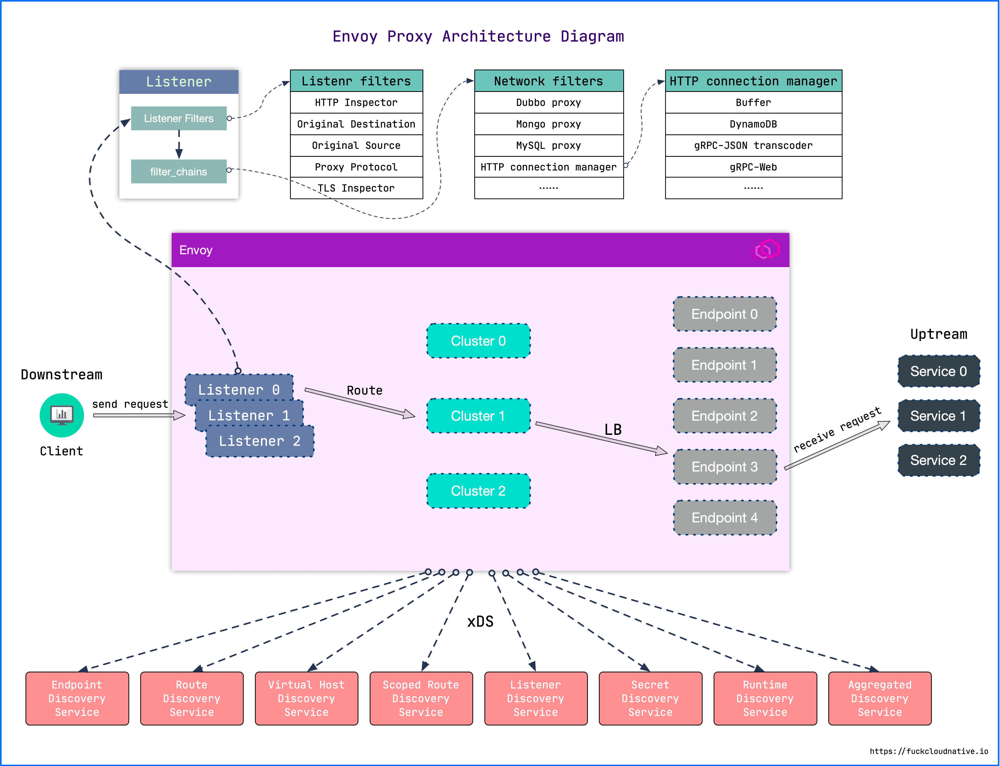
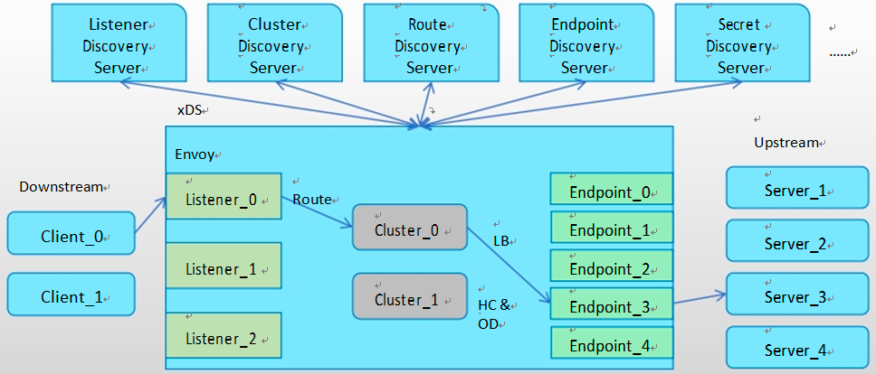
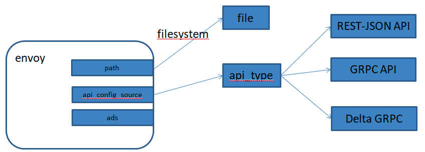

# quickstart
1. 网站和文档
```
https://www.envoyproxy.io/
https://www.envoyproxy.io/docs/envoy/latest/intro/what_is_envoy
```
2. func-e 安装和启动

```shell
sudo curl https://func-e.io/install.sh | bash -s -- -b /usr/local/bin
```
或者 https://github.com/tetratelabs/func-e/releases/tag/v1.1.4
下载对应的操作系统版本

```shell

func-e run -c /path/to/envoy_basic_front.yaml

func-e run --config-yaml "admin: {address: {socket_address: {address: '127.0.0.1', port_value: 9901}}}"

```
```shell
(base) ➜  ~ func-e run --config-yaml "admin: {address: {socket_address: {address: '127.0.0.1', port_value: 9901}}}"

looking up the latest Envoy version
downloading https://archive.tetratelabs.io/envoy/download/v1.25.0/envoy-v1.25.0-darwin-arm64.tar.xz
```

3. docker安装

社区提供的镜像位于 envoyproxy 中，常用的有：

- envoyproxy/envoy-alpine : 基于 alpine 的发行镜像
- envoyproxy/envoy-alpine-dev : 基于 alpine 的 Nightly 版本发行镜像
- envoyproxy/envoy : 基于 Ubuntu 的发行镜像
- envoyproxy/envoy-dev : 基于 Ubuntu 的 Nightly 版本发行镜像

```shell
docker pull envoyproxy/envoy:v1.25-latest
```
启动 Envoy 容器时，可以用本地的 envoy.yaml 覆盖镜像中的 envoy.yaml：

```shell
 docker run -d --network=host -v `pwd`/envoy_basic_front.yaml:/etc/envoy/envoy.yaml envoyproxy/envoy:v1.25-latest
```


4. Centos  安装

```shell
sudo yum install yum-utils
sudo rpm --import 'https://rpm.dl.getenvoy.io/public/gpg.CF716AF503183491.key'
curl -sL 'https://rpm.dl.getenvoy.io/public/config.rpm.txt?distro=el&codename=7' > /tmp/tetrate-getenvoy-rpm-stable.repo
sudo yum-config-manager --add-repo '/tmp/tetrate-getenvoy-rpm-stable.repo'
sudo yum makecache --disablerepo='*' --enablerepo='tetrate-getenvoy-rpm-stable'
sudo yum install getenvoy-envoy
```
5. Ubuntu Linux 安装

```shell
sudo apt update
sudo apt install apt-transport-https gnupg2 curl lsb-release
curl -sL 'https://deb.dl.getenvoy.io/public/gpg.8115BA8E629CC074.key' | sudo gpg --dearmor -o /usr/share/keyrings/getenvoy-keyring.gpg
Verify the keyring - this should yield "OK"
echo a077cb587a1b622e03aa4bf2f3689de14658a9497a9af2c427bba5f4cc3c4723 /usr/share/keyrings/getenvoy-keyring.gpg | sha256sum --check
echo "deb [arch=amd64 signed-by=/usr/share/keyrings/getenvoy-keyring.gpg] https://deb.dl.getenvoy.io/public/deb/ubuntu $(lsb_release -cs) main" | sudo tee /etc/apt/sources.list.d/getenvoy.list
sudo apt update
sudo apt install -y getenvoy-envoy
```

7. MacOs 安装 

```shell
brew tap tetratelabs/getenvoy
brew install envoy
```
8. 验证 yaml

```shell
envoy --mode validate -c ./envoy.yaml
```

# Envoy核心功能

1. 核心功能

- 非侵入的架构 : Envoy 是一个独立进程，设计为伴随每个应用程序服务运行。所有的 Envoy 形成一个透明的通信网格，每个应用程序发送消息到本地主机或从本地主机接收消息，不需要知道网络拓扑，对服务的实现语言也完全无感知，这种模式也被称为 Sidecar。
- L3/L4/L7 架构 : 传统的网络代理，要么在 HTTP 层工作，要么在 TCP 层工作。在 HTTP 层的话，你将会从传输线路上读取整个 HTTP 请求的数据，对它做解析，查看 HTTP 头部和 URL，并决定接下来要做什么。随后，你将从后端读取整个响应的数据，并将其发送给客户端。但这种做法的缺点就是非常复杂和缓慢，更好的选择是下沉到 TCP 层操作：只读取和写入字节，并使用 IP 地址，TCP 端口号等来决定如何处理事务，但无法根据不同的 URL 代理到不同的后端。Envoy 支持同时在 3/4 层和 7 层操作，以此应对这两种方法各自都有其实际限制的现实。
- HTTP/2 支持 : 可以在 HTTP/2 和 HTTP/1.1 之间相互转换（双向），建议使用 HTTP/2。
- 服务发现和动态配置 : 与 Nginx 等代理的热加载不同，Envoy 可以通过 API 来实现其控制平面，控制平面可以集中服务发现，并通过 API 接口动态更新数据平面的配置，不需要重启数据平面的代理。不仅如此，控制平面还可以通过 API 将配置进行分层，然后逐层更新，例如：上游集群中的虚拟主机、HTTP 路由、监听的套接字等。
- gRPC 支持 : gRPC 它使用 HTTP/2 作为底层多路复用传输协议。Envoy 完美支持 HTTP/2，也可以很方便地支持 gRPC
- 特殊协议支持 : Envoy 支持对特殊协议在 L7 进行嗅探和统计，包括：MongoDB[2]、DynamoDB[3] 等。
- 可观测性 : Envoy 的主要目标是使网络透明，可以生成许多流量方面的统计数据，这是其它代理软件很难取代的地方，内置 stats 模块，可以集成诸如 prometheus/statsd 等监控方案。还可以集成分布式追踪系统，对请求进行追踪。

2. 特色

- 性能
  性能：除了大量功外， 还提供极高的 吞吐量和低尾延迟差异，同时消耗相对较少CPU和 RAM；
- 可扩展性
  Envoy 在L4 和L7 上提供丰富的可插拔过滤器功能，允许用户轻松添加新功能
- API可配置性
  Envoy提供了一组可由控制平面服务实现的管理 API，也称为 xDS API
  若控制平面实现了这些API ，则可以使用引导配置在整个基础架构中运行 Envoy 所有的配置更改都可通过管理服务器无缝地行动态传递，Envoy不需要重新启动
  于是，这使得 Envoy 成为一个通用数据平面，当与足够复杂的控制面相结合时可大大地降低整体操作性， Envoy已经成为现代服务网格和边缘关的 “ 通用数据平面 API ” ，包括Istio 、Ambassador和 Gloo 等项目
  
# 整体架构

## envoy 核心架构



Envoy 接收到请求后，会先走 FilterChain，通过各种 L3/L4/L7 Filter 对请求进行微处理，然后再路由到指定的集群，并通过负载均衡获取一个目标地址，最后再转发出去。

其中每一个环节可以静态配置，也可以动态服务发现，也就是所谓的 xDS

### 核心组件介绍：

- 下游（ DownstreamDownstream ）：

下游主机连接到 Envoy ，发送请求并接收响应它们是 Envoy 的客户端

- 上游（ Upstream）: 

上游主机接收来自 Envoy 的连接和请求并返回响应，它们是 Envoy 代理的后端服务器


- 监听器（ Listener）: 

监听器是能够由下游客户端连接的命名网络位置，例如端口或 unix 域套接字等， Envoy 会暴露一个或者多个listener监听downstream的请求。
- 集群 (Cluster ): 

服务提供方集群。Envoy 通过服务发现定位集群成员并获取服务。 具体请求到哪个集群成员是由负载均衡策略决定。
- 端点（ Endpoint）:

端点即上游主机，是一个或多集群的成员可通过 EDS 发现
- 路由 （ Router ）：

上下游之间的桥梁， Listener可以接收来自下游的连接，Cluster可以将流量发送给具体的上游服务，而Router则决定Listener在接收到下游连接和数据之后，应该将数据交给哪一个Cluster处理。

它定义了数据分发的规则。虽然说到Router大部分时候都可以默认理解为HTTP路由，但是Envoy支持多种协议，如Dubbo、Redis等，所以此处Router泛指所有用于桥接Listener和后端服务（不限定HTTP）的规则与资源集合。

Route对应的配置/资源发现服务称之为 RDS 发现。Router中最核心配置包含匹配规则和目标Cluster，此外，也可包含重试、分流、限流等等。

- 过滤器（ Filter ）: 

在 Envoy 中指的是一些“可插拔”和可组合的逻辑处理层。是 Envoy 核心逻辑处理单元。

### XDS关系

XDS 以及各个资源之间的关系下图所示。


## 配置文件

示例使用 Envoy 作为边缘代理，根据不同的路由配置将请求转发到百度和 httpbin。指定请求头 host: baidu.com 时会将请求转发到 www.baidu.com；指定请求头 host: httpbin.org 时会将请求转发到 httpbin.org。

envoy_basic_front.yaml 文件内容如下：

```yaml
admin:
  address:
    socket_address: { address: 127.0.0.1, port_value: 8081 }

static_resources:
  listeners:
    - name: listener_0
      address:
        socket_address: { address: 127.0.0.1, port_value: 8080 }
      filter_chains:
        - filters:
            - name: envoy.filters.network.http_connection_manager
              typed_config:
                "@type": type.googleapis.com/envoy.extensions.filters.network.http_connection_manager.v3.HttpConnectionManager
                stat_prefix: http
                codec_type: AUTO
                route_config:
                  name: local_route
                  virtual_hosts:
                    - name: backend_baidu
                      domains: ["baidu.com"]
                      routes:
                        - match:
                            prefix: "/"
                          route:
                            cluster: baidu
                    - name: backend_httpbin
                      domains: ["httpbin.org"]
                      routes:
                        - match:
                            prefix: "/"
                          route:
                            cluster: httpbin
                http_filters:
                  - name: envoy.filters.http.router
                    typed_config:
                      "@type": type.googleapis.com/envoy.extensions.filters.http.router.v3.Router
  clusters:
    - name: baidu
      connect_timeout: 0.25s
      type: LOGICAL_DNS
      lb_policy: ROUND_ROBIN
      load_assignment:
        cluster_name: baidu
        endpoints:
          - lb_endpoints:
              - endpoint:
                  address:
                    socket_address:
                      address: www.baidu.com
                      port_value: 80
    - name: httpbin
      connect_timeout: 0.25s
      type: LOGICAL_DNS
      lb_policy: ROUND_ROBIN
      load_assignment:
        cluster_name: httpbin
        endpoints:
          - lb_endpoints:
              - endpoint:
                  address:
                    socket_address:
                      address: httpbin.org
                      port_value: 80

```

可能会觉得它的配置太复杂了， 看 Envoy 是如何组织配置信息的，先简单解释一下其中的关键字段。

- listener : Envoy 的监听地址，就是真正干活的。Envoy 会暴露一个或多个 Listener 来监听客户端的请求。
- filter : 过滤器。在 Envoy 中指的是一些“可插拔”和可组合的逻辑处理层，是 Envoy 核心逻辑处理单元。
- route_config : 路由规则配置。即将请求路由到后端的哪个集群。
- cluster : 服务提供方集群。Envoy 通过服务发现定位集群成员并获取服务，具体路由到哪个集群成员由负载均衡策略决定。

结合关键字段， 可以看出 Envoy 的大致处理流程如下：


Envoy 内部对请求的处理流程其实跟我们上面脑补的流程大致相同，即对请求的处理流程基本是不变的，而对于变化的部分，即对请求数据的处理，全部抽象为 Filter，
- 请求的读写是 ReadFilter、WriteFilter，
- HTTP 请求数据的编解码是 StreamEncoderFilter、StreamDecoderFilter，
- TCP 的处理是 TcpProxyFilter，其继承自 ReadFilter，
- HTTP 的处理是 ConnectionManager，其也是继承自 ReadFilter 等等，
- 各个 Filter 最终会组织成一个 FilterChain，在收到请求后首先走 FilterChain，其次路由到指定集群并做负载均衡获取一个目标地址，然后转发出去。

### 启动 Envoy

```shell
envoy -c ./envoy/envoy_basic_front_proxy.yaml

```
打开一个新的 shell，使用 curl 访问 Envoy，并添加 Header 字段 host: baidu.com：
```shell

curl -s -o /dev/null -vvv -H 'Host: baidu.com' 127.0.0.1:8080
*   Trying 127.0.0.1...
* TCP_NODELAY set
* Connected to 127.0.0.1 (127.0.0.1) port 10000 (#0)
> GET / HTTP/1.1
> Host: baidu.com
> User-Agent: curl/7.64.1
> Accept: */*
>
< HTTP/1.1 200 OK
< accept-ranges: bytes
< cache-control: private, no-cache, no-store, proxy-revalidate, no-transform
< content-length: 2381
< content-type: text/html
< date: Wed, 08 Mar 2023 02:57:09 GMT
< etag: "588604c8-94d"
< last-modified: Mon, 23 Jan 2017 13:27:36 GMT
< pragma: no-cache
< server: envoy
< set-cookie: BDORZ=27315; max-age=86400; domain=.baidu.com; path=/
< x-envoy-upstream-service-time: 33
```

同理可以访问 httpbin.org：

```shell

curl  -s -v -H  "Host: httpbin.org" "http://127.0.0.1:8080/anything/get?foo=1"

* Connected to 127.0.0.1 (127.0.0.1) port 10000 (#0)
> GET /anything/get?foo=1 HTTP/1.1
> Host: httpbin.org
> User-Agent: curl/7.64.1
> Accept: */*
>
< HTTP/1.1 200 OK
< date: Wed, 08 Mar 2023 02:55:56 GMT
< content-type: application/json
< content-length: 417
< server: envoy
< access-control-allow-origin: *
< access-control-allow-credentials: true
< x-envoy-upstream-service-time: 904
<
{
"args": {
"foo": "1"
},
"data": "",
"files": {},
"form": {},
"headers": {
"Accept": "*/*",
"Host": "httpbin.org",
"User-Agent": "curl/7.64.1",
"X-Amzn-Trace-Id": "Root=1-6407f93b-08d089d12394a0ef3d6d6b12",
"X-Envoy-Expected-Rq-Timeout-Ms": "15000"
},
"json": null,
"method": "GET",
"origin": "114.93.15.90",
"url": "http://httpbin.org/anything/get?foo=1"
}
* Connection #0 to host 127.0.0.1 left intact
* Closing connection 0

```

envoy 管理界面

Envoy 的一大特色是内置了管理页面，你可以通过 http://localhost:8081 访问。管理页面中 /cluster 菜单展示了上游 (Upstream) 集群端口的统计内容，stats 菜单则显示了更多端口的统计内容。
```shell
http://127.0.0.1:8081
http://127.0.0.1:8081/config_dump?resource=&mask=&name_regex=
```


### 配置文件结构

1. envoy启动时从Bootstrap配置文件中加载初始配置。

2. 支持静态和动态配置。 静态配置： 纯手工指定配置。 动态配置： xDS API加载配置

3. [v3 api 配置](https://cloudnative.to/envoy/api-v3/api.html) 

#### Envoy 的整体配置结构如下：

```json
{
  "node": "{...}",
  "static_resources": "{...}",
  "dynamic_resources": "{...}",
  "cluster_manager": "{...}",
  "hds_config": "{...}",
  "flags_path": "...",
  "stats_sinks": [],
  "stats_config": "{...}",
  "stats_flush_interval": "{...}",
  "watchdog": "{...}",
  "tracing": "{...}",
  "runtime": "{...}",
  "layered_runtime": "{...}",
  "admin": "{...}",
  "overload_manager": "{...}",
  "enable_dispatcher_stats": "...",
  "header_prefix": "...",
  "stats_server_version_override": "{...}",
  "use_tcp_for_dns_lookups": "..."
}
```
- node : 节点标识，配置的是 Envoy 的标记信息，management server 利用它来标识不同的 Envoy 实例。参考 core.Node
- static_resources : 定义静态配置，是 Envoy 核心工作需要的资源，由 Listener、Cluster 和 Secret 三部分组成。
- dynamic_resources : 定义动态配置，通过 xDS 来获取配置。可以同时配置动态和静态。
- cluster_manager : 管理所有的上游集群。它封装了连接后端服务的操作，当 Filter 认为可以建立连接时，便调用 cluster_manager 的 API 来建立连接。cluster_manager 负责处理负载均衡、健康检查等细节。
- hds_config : 健康检查服务发现动态配置。
- stats_sinks : 状态输出插件。可以将状态数据输出到多种采集系统中。一般通过 Envoy 的管理接口 /stats/prometheus 就可以获取 Prometheus 格式的指标，这里的配置应该是为了支持其他的监控系统。
- stats_config : 状态指标配置。
- stats_flush_interval : 状态指标刷新时间。
- watchdog : 看门狗配置。Envoy 内置了一个看门狗系统，可以在 Envoy 没有响应时增加相应的计数器，并根据计数来决定是否关闭 Envoy 服务。
- tracing : 分布式追踪相关配置。
- runtime : 运行时状态配置（已弃用）。
- layered_runtime : 层级化的运行时状态配置。可以静态配置，也可以通过 RTDS 动态加载配置。
- admin : 管理接口。
- overload_manager : 过载过滤器。
- header_prefix : Header 字段前缀修改。例如，如果将该字段设为 X-Foo，那么 Header 中的 x-envoy-retry-on 将被会变成 x-foo-retry-on。
- use_tcp_for_dns_lookups : 强制使用 TCP 查询 DNS。可以在 Cluster 的配置中覆盖此配置。


#### static_resources 静态配置

```json
{
  "listeners": [],
  "clusters": [],
  "secrets": []
}

```
由 Listener、Cluster 和 Secret 三部分组成。参考 config.bootstrap.v3.Bootstrap.StaticResources

#### dynamic_resources 动态配置，

通过 xDS 来获取配置

```json
{
  "lds_config": "{...}",
  "cds_config": "{...}",
  "ads_config": "{...}"
}
```

#### 侦听器 listener

侦听器（Listener）就是 Envoy 的监听地址，可以是端口或 Unix Socket。Envoy 在单个进程中支持任意数量的监听器。通常建议每台机器只运行一个 Envoy 实例，每个 Envoy 实例的监听器数量没有限制，这样可以简化操作，统计数据也只有一个来源，比较方便统计。目前 Envoy 支持监听 TCP 协议和 UDP 协议。

- TCP

每个监听器都可以配置多个过滤器链（Filter Chains），监听器会根据 filter_chain_match 中的匹配条件将流量转交到对应的过滤器链，其中每一个过滤器链都由一个或多个网络过滤器（Network filters）组成。这些过滤器用于执行不同的代理任务，如速率限制，TLS 客户端认证，HTTP 连接管理，MongoDB 嗅探，原始 TCP 代理等。

除了过滤器链之外，还有一种过滤器叫监听器过滤器（Listener filters），它会在过滤器链之前执行，用于操纵连接的元数据。这样做的目的是，无需更改 Envoy 的核心代码就可以方便地集成更多功能。例如，当监听的地址协议是 UDP 时，就可以指定 UDP 监听器过滤器。

- UDP

Envoy 的监听器也支持 UDP 协议，需要在监听器过滤器中指定一种 UDP 监听器过滤器（UDP listener filters）。目前有两种 UDP 监听器过滤器：UDP 代理（UDP proxy） 和 DNS 过滤器（DNSfilter）。UDP 监听器过滤器会被每个 worker 线程实例化，且全局生效。实际上，UDP 监听器（UDP Listener）配置了内核参数 SO_REUSEPORT，这样内核就会将 UDP 四元组相同的数据散列到同一个 worker 线程上。因此，UDP 监听器过滤器是允许面向会话（session）的。

每个侦听器可以包含多个L3/L4的过滤器，并对其进行独立配置

```shell
1.侦听器收到的连接请求将由其过滤器链中的各过滤器进行处理
2。Envoy侦听器构架支持大多数的不同proxy的任务
比如：
rate limiting
TLS client authentication
HTTP connection management
raw TCP proxy
......

```

侦听器（Listener）功能：

- 接收客户端请求的入口端点，通常由监听的套接字及调用的过滤器链所定义

- 代理类的过滤器负责路由请求，例如tcp_proxy和http_connection_manager等

监听器的配置结构如下：

```json
{
  "name": "...",
  "address": "{...}",
  "filter_chains": [],
  "per_connection_buffer_limit_bytes": "{...}",
  "metadata": "{...}",
  "drain_type": "...",
  "listener_filters": [],
  "listener_filters_timeout": "{...}",
  "continue_on_listener_filters_timeout": "...",
  "transparent": "{...}",
  "freebind": "{...}",
  "socket_options": [],
  "tcp_fast_open_queue_length": "{...}",
  "traffic_direction": "...",
  "udp_listener_config": "{...}",
  "api_listener": "{...}",
  "connection_balance_config": "{...}",
  "reuse_port": "...",
  "access_log": []
}
```

- name : 监听器名称。默认情况下，监听器名称的最大长度限制为 60 个字符。可以通过 --max-obj-name-len 命令行参数设置为所需的最大长度限制。
- address : 监听器的监听地址，支持网络 Socket 和 Unix Domain Socket（UDS） 两种类型。
- filter_chains : 过滤器链的配置。
- per_connection_buffer_limit_bytes : 监听器每个新连接读取和写入缓冲区大小的软限制。默认值是 1MB。
- listener_filters : 监听器过滤器在过滤器链之前执行，用于操纵连接的元数据。这样做的目的是，无需更改 Envoy 的核心代码就可以方便地集成更多功能。例如，当监听的地址协议是 UDP 时，就可以指定 UDP 监听器过滤器。
- listener_filters_timeout : 等待所有监听器过滤器完成操作的超时时间。一旦超时就会关闭 Socket，不会创建连接，除非将参数 continue_on_listener_filters_timeout 设为 true。默认超时时间是 15s，如果设为 0 则表示禁用超时功能。
- continue_on_listener_filters_timeout : 布尔值。用来决定监听器过滤器处理超时后是否创建连接，默认为 false。
- freebind : 布尔值。用来决定是否设置 Socket 的 IP_FREEBIND 选项。如果设置为 true，则允许监听器绑定到本地并不存在的 IP 地址上。默认不设置。
- socket_options : 额外的 Socket 选项。
- tcp_fast_open_queue_length : 控制 TCP 快速打开（TCP Fast Open，简称 TFO）。TFO 是对TCP 连接的一种简化握手手续的拓展，用于提高两端点间连接的打开速度。它通过握手开始时的 SYN 包中的 TFO cookie（一个 TCP 选项）来验证一个之前连接过的客户端。如果验证成功，它可以在三次握手最终的 ACK 包收到之前就开始发送数据，这样便跳过了一个绕路的行为，更在传输开始时就降低了延迟。该字段用来限制 TFO cookie 队列的长度，如果设为 0，则表示关闭 TFO。
- traffic_direction : 定义流量的预期流向。有三个选项：UNSPECIFIED、INBOUND 和 OUTBOUND，分别代表未定义、入站流量和出站流量，默认是 UNSPECIFIED。
- udp_listener_config : 如果 address 字段的类型是网络 Socket，且协议是 UDP，则使用该字段来指定 UDP 监听器。
- connection_balance_config : 监听器连接的负载均衡配置，目前只支持 TCP。
- reuse_port : 布尔值。用来决定是否设置 Socket 的 SO_REUSEPORT 选项。如果设置为 true，则会为每一个 worker 线程创建一个 Socket，在有大量连接的情况下，入站连接会均匀分布到各个 worker 线程中。如果设置为 false，所有的 worker 线程共享同一个 Socket。
- access_log : 日志相关的配置。

#### 集群 cluster service

- Envoy可配置任意数量的上游集群，并使用Cluster Manager进行管理。

> - 由集群管理器负责管理的各集群可以由用户静态配置，也可借助于CDS API动态获取；
> - 集群中的每个成员由endpoint进行标识，它可由用户静态配置，也可通过EDS或DNS服务 动态发现；
> - Static ：静态配置
> - Strict DNS：严格DNS，Envoy将持续和异步地解析指定的DNS目标，并将DNS结果中的返回的每 个IP地址视为上游集群中可用成员；
> - Logical DNS：逻辑DNS，集群仅使用在需要启动新连接时返回的第一个IP地址，而非严格获取 DNS查询的结果并假设它们构成整个上游集群；适用于必须通过DNS访问的大规模Web服务集群；
> - Original destination：当传入连接通过iptables的REDIRECT或TPROXY target或使用代理协议重定向 到Envoy时，可以使用原始目标集群；
> - Endpoint discovery service (EDS) ：EDS是一种基于GRPC或REST-JSON API的xDS 管理服务器获取集 群成员的服务发现方式；
> - Custom cluster ：Envoy还支持在集群配置上的cluster_type字段中指定使用自定义集群发现机制；

- 每个Cluster主要由集群名称，以及集群 中的端点（通常是提供服务的IP地址和 端口）所组成。

- Envoy Cluster支持纯静态定义方式来指 定端点，也允许以动态方式发现各端点， 甚至还支持自定义的发现机制。

- 支持用户定义多种高级功能，例如，负 载均衡策略、主动健康状态检查、被动 健康状态检查和断路器等。

```json

"transport_socket_matches": [],
"name": "...",
"alt_stat_name": "...",
"type": "...",
"cluster_type": "{...}", 
"eds_cluster_config": "{...}",
"connect_timeout": "{...}",
"per_connection_buffer_limit_bytes": "{...}",
"lb_policy": "...",
"load_assignment": "{...}",
"health_checks": [],
"max_requests_per_connection": "{...}",
"circuit_breakers": "{...}",
"upstream_http_protocol_options": "{...}", 
"common_http_protocol_options": "{...}",
"http_protocol_options": "{...}",
"http2_protocol_options": "{...}",
"typed_extension_protocol_options": "{...}",
"dns_refresh_rate": "{...}",
"dns_failure_refresh_rate": "{...}",
"respect_dns_ttl": "...",
"use_tcp_for_dns_lookups": "...",
"outlier_detection": "{...}",
"cleanup_interval": "{...}",
"upstream_bind_config": "{...}",
"lb_subset_config": "{...}",
"ring_hash_lb_config": "{...}",
"maglev_lb_config": "{...}",
"original_dst_lb_config": "{...}",
"least_request_lb_config": "{...}",
"common_lb_config": "{...}", 
"transport_socket": "{...}",
"metadata": "{...}",
"protocol_selection": "...",
"upstream_connection_options": "{...}",
"close_connections_on_host_health_failure": "...",
"ignore_health_on_host_removal": "...",
"filters": [],
"track_timeout_budgets": "...",
"upstream_config": "{...}",
"track_cluster_stats": "{...}",
"preconnect_policy": "{...}",
"connection_pool_per_downstream_connection": "..."
}
```

#### 过滤器

Envoy 进程中运行着一系列 Inbound/Outbound 监听器（Listener），Inbound 代理入站流量，Outbound 代理出站流量。Listener 的核心就是过滤器链（FilterChain），链中每个过滤器都能够控制流量的处理流程。过滤器链中的过滤器分为两个类别：

- 监听器过滤器（Listener Filters）: 它会在过滤器链之前执行，用于操纵连接的元数据。这样做的目的是，无需更改 Envoy 的核心代码就可以方便地集成更多功能。例如，当监听的地址协议是 UDP 时，就可以指定 UDP 监听器过滤器。
- 网络过滤器（Network Filters）: 工作在 L3/L4，是 Envoy 网络连接处理的核心，处理的是原始字节，分为 Read、Write 和 Read/Write 三类。
- HTTP 过滤器（HTTP Filters）: 工作在 L7，由特殊的网络过滤器 HTTP connection manager 管理，专门处理 HTTP1/HTTP2/gRPC 请求。它将原始字节转换成 HTTP 格式，从而可以对 HTTP 协议进行精确控制。
- cluster network Filter， 在Envoy 1.2之后引入， 作用于某个cluster。指向该cluster的四层流量首先需要在该cluster下的所有cluster network Filter完成处理之后才会发送出去。而在接收到来自上游服务的响应之后，首先也会由该cluster下的所有cluster network Filter处理后再继续传递给其他Filter或者下游客户端。


1、网络级(L3/L4)过滤器构成了Envoy连接处理的核心
```shell
1)过滤器API允许将不同的过滤器集混合、匹配并附加到给定的侦听器。  
2)有三种不同类型的网络过滤器: 
  Read:当Envoy从下游连接接收数据时，读取过滤器被调用。  
  Write:当Envoy正要将数据发送到下游连接时，会调用Write filter。  
  Read/Write:当Envoy从下游连接接收数据和将要向下游连接发送数据时，会调用读/写过滤器。  
3)网络级过滤器的API相对简单，因为最终过滤器只操作原始字节和少量连接事件。
4)链中的过滤器可能会停止，随后继续迭代进一步筛选。  
```
2、网络过滤器访问和操作L4连接上的原始数据，即TCP数据包
```shell
例如，TCP代理过滤器将客户端连接数据路由到上游主机，并生成连接统计信息等
```
3、Enovy内置了许多L3/L4过滤器
```shell
1.代理类：TCP Proxy、HTTP connection manager、Thrift Proxy、Mongo proxy、Dubbo Proxy、 ZooKeeper proxy、MySQL proxy和Redis proxy等，

2. 其它：Client TLS authentication、Rate limit、Role Based Access Control (RBAC) Network Filter 和Upstream Cluster from SNI 等；

```
4、HTTP connection manager
```shell
(1)HTTP connection manager自身是L3/L4 过路器，它能够将原始字节转换为HTTP级别消息 和事件（例如，headers和body等）
(2)它还处理所有HTTP连接和请求共有的功能，例如访问日志记录、请求ID生成和跟踪、 请求/响应头操作、路由表管理和统计信息等；
(3)与L3/L4过滤器堆栈相似，Envoy还支持在HTTP连接管理器中使用HTTP级过滤器堆栈； 
  HTTP过滤器在L7运行，它们访问和操作HTTP请求和响应；例如，gRPC-JSON Transcoder Filter为gRPC后端公开REST API，并将请求和响应转换为相应的格式；
  常用的HTTP过路器有Router、Rate limit 、Health check 、Gzip和Fault Injection等。
```


5、cluster network Filter

借助cluster network Filter，envoy可以实现任意协议之间的流量转换。 以HTTP和Dubbo为例：
* 当cluster A指向一个Dubbo服务时，可以为该cluster配置一个 HTTP2Dubbo的 cluster network Filter。之后，可以将HTTP请求发送给cluster A。
* cluster A下的 HTTP2Dubbo 会在四层将HTTP请求重新解析并且拼接编码出Dubbo请求的二进制序列并发送给上游Dubbo服务。在接收到Dubbo服务响应之后，又可以利用同样的方式将Dubbo响应转换为HTTP响应。
* 如此，cluster A可以完全被当作一个HTTP服务来治理，所有的细节都被屏蔽在cluster network Filter之中。其数据处理流程如下图所示


根据上面的分类，Envoy 过滤器的架构如下图所示：


## Envoy连接处理

Envoy通过侦听器监听套接字并接收客户端请求，而Envoy的所有工作线程会同时共同监听用户配置的所有套接字，对于某次连接请求，由内核负责将其派发至某个具体的工作线程处理; 随后，相关的工作线程基于特定的处理逻辑分别由相关组件依次完成连接管理。


## envoy动态配置

### envoy动态配置介绍

动态资源，是指由envoy通过xDS协议发现所需要的各项配置的机制，相关的配置信息保存 于称之为管理服务器（Management Server ）的主机上，经由xDS API向外暴露；下面是一个 纯动态资源的基础配置框架。

```json
{
"lds_config": "{...}",
"cds_config": "{...}",
"ads_config": "{...}"
}

```

Envoy支持三种类型的配置信息的动态发现机制，相关的发现服务及其相应的API联合起来 称为xDS API。

1. 基于文件系统发现：指定要监视的文件系统路径
2. 通过查询一到多个管理服务器（Management Server）发现：通过 DiscoveryRequest 协议报文发送请求，并要求服务方以 DiscoveryResponse 协议报文进行响应
   * gRPC服务：启动gRPC流 
   * REST服务：轮询REST-JSON URL

v3 xDS支持如下几种资源类型:

```shell

envoy.config.listener.v3.Listener
envoy.config.route.v3.RouteConfiguration
envoy.config.route.v3.ScopedRouteConfiguration
envoy.config.route.v3.VirtualHost
envoy.config.cluster.v3.Cluster
envoy.config.endpoint.v3.ClusterLoadAssignment
envoy.extensions.transport_sockets.tls.v3.Secret
envoy.service.runtime.v3.Runtime

```

#### xDS API介绍

Envoy对xDS API的管理由后端服务器实现，包括LDS、CDS、RDS、SRDS（Scoped Route）、VHDS （Virtual Host）、EDS、SDS、RTDS（Runtime ）等。

> 1. 所有这些API都提供了最终的一致性，并且彼此间不存在相互影响；
> 2. 部分更高级别的操作（例如执行服务的A/B部署）需要进行排序以防止流量被丢弃，因此，基于一个管理服务器提供多类API时还需要使用聚合发现服务（ADS ）API。
> 3. ADS API允许所有其他API通过来自单个管理服务器的单个gRPC双向流进行编组，从而允许对操作进行确定性排序

xDS的各API还支持增量传输机制，包括ADS



#### Bootstrap node

一个 Management Server 实例可能需要同时响应多个不同的Envoy实例的资源发现请求。

> * Management Server上的配置需要为适配到不同的Envoy实例
> * Envoy 实例请求发现配置时，需要在请求报文中上报自身的信息
>  - 例如id、cluster、metadata和locality等
>  - 这些配置信息定义在Bootstrap配置文件中
>

专用的顶级配置段“node{…}”中配置

```yaml
node:
  id: … # An opaque node identifier for the Envoy node. 
  cluster: … # Defines the local service cluster name where Envoy is running.
  metadata: {…} # Opaque metadata extending the node identifier. Envoy will pass this directly to the management server .
  locality: # Locality specifying where the Envoy instance is running.
    region: …
    zone: …
    sub_zone: …
  user_agent_name: … # Free-form string that identifies the entity requesting config. E.g . “envoy ” or “grpc”
  user_agent_version: … # Free-form string that identifies the version of the entity requesting config. E.g . “1.12.2” or “abcd1234” , or “SpecialEnvoyBuild ” 
  user_agent_build_version: # Structured version of the entity requesting config.
    version: …
    metadata: {…}
  extensions: [ ] # List of extensions and their versions supported by the node.
  client_features: [ ]
  listening_addresses: [ ] # Known listening ports on the node as a generic hint to the management server for filtering listeners to be returned

```

### API的流程

1、对于典型的HTTP路由方案，xDS API的Management Server 需要为其客户端（Envoy实例）配置的核心资源类型:Listener、RouteConfiguration、Cluster和ClusterLoadAssignment四个。每个Listener资源可以指向一个RouteConfiguration资源，该资源可以指向一个或多个Cluster资源，并且每个Cluster资源可以指向一个ClusterLoadAssignment资源。

2、Envoy实例在启动时请求加载所有Listener和Cluster资源，而后，再获取由这些Listener和 Cluster所依赖的RouteConfiguration和ClusterLoadAssignment配置；此种场景中，Listener资源和Cluster资源分别代表着客户端配置树上的“根（root）”配置，因而 可并行加载。

3、类型gRPC一类的非代理式客户端可以仅在启动时请求加载其感兴趣的Listener资源， 而后再加载这些特定Listener相关的RouteConfiguration资源；再然后，是这些 RouteConfiguration资源指向的Cluster资源，以及由这些Cluster资源依赖的 ClusterLoadAssignment资源；该种场景中，Listener资源是客户端整个配置树的“根”。

### Envoy的配置方式

Envoy的架构支持非常灵活的配置方式：简单部署场景可以使用纯静态配置，而更复 杂的部署场景则可以逐步添加需要的动态配置机制

```shell

1、纯静态配置：用户自行提供侦听器、过滤器链、集 群及HTTP路由（http代理场景），上游端点的发现仅可通过DNS服务进行，且配置的重新加载必须通过内置的热重启（ hot restart）完成

2、仅使用EDS：EDS提供的端点发现功能可有效规避DNS的限制（ 响应中的最大记录数等）

3、使用EDS和CDS：CDS能够让Envoy以优雅的方式添加、更新和删除上游集群，初始配置时， Envoy无须事先了解所有上游集群

4、EDS、CDS和RDS：动态发现路由配置；RDS与EDS、CDS一起使用时 ，为用户提供了构建复杂路由拓扑的能力（流量转移、蓝/绿部署等）

5、EDS、CDS、RDS和LDS：动态发现侦听器配置，包括内嵌的过滤器链；启用此四种发现服务后，除了较罕见的配置变动、证书轮替或更新Envoy程序之外，几乎无须再热重启Envoy

6、EDS、CDS、RDS、LDS和SDS：动态发现侦听器密钥相关的证书、 私钥及TLS会话票据， 以及对证书验证逻辑的配置（受信任的根证书和撤销机制等 ）

```

### Envoy资源的配置源(ConfigSource)

1、配置源（ConfigSource）用于指定资源配置数据的来源，用于为Listener、Cluster、Route、 Endpoint、Secret和VirtualHost等资源提供配置数据。

2、目前，Envoy支持的资源配置源只能是path、api_config_source或ads其中之一。

3、api_config_source或ads的数据来自于xDS API Server，即Management Server。





### 基于文件系统的订阅

```shell

1)Envoy将使用inotify（Mac OS X上的kqueue）来监视文件的更改，并在更新时解析文件中的DiscoveryResponse 报文
2)二进制protobufs，JSON，YAML和proto文本都是DiscoveryResponse 所支持的数据格式

提示
1)除了统计计数器和日志以外，没有任何机制可用于文件系统订阅ACK/NACK更新
2)若配置更新被拒绝，xDS API的最后一个有效配置将继续适用

```

1、基于eds实现Envoy基本全动态的配置方式

以EDS为例，Cluster为静态定义，其各Endpoint通过EDS动态发现

```yaml
# Cluster中的endpoint配置格式

clusters:
- name:
  ...
  eds_cluster_config:
    service_name:
    eds_config:
      path: ... # ConfigSource，支持使用path, api_config_source或ads三者之一；
```

cluster的配置

```yaml
# 类似如下纯静态格式的Cluster定义
clusters:
- name: webcluster1
  connect_timeout: 0.25s
  type: STATIC #类型为静态
  lb_policy: ROUND_ROBIN
  load_assignment:
    cluster_name: webcluster1
    endpoints:
    - lb_endpoints:
      - endpoint:
        address:
          socket_address:
            address: 172.21.0.3
            port_value: 8080

#使用了EDS的配置
clusters:
- name: webcluster1
  connect_timeout: 0.25s
  type: EDS #类型为EDS
  eds_cluster_config:
    service_name: webcluster1
    eds_config:
      path: '/etc/envoy/eds.yaml' # 指定订阅的文件路径
#提示：文件后缀名为conf，则资源要以json格式定义；文件后缀名为yaml，则资源需要以yaml格式定义；另外，动态配置中，各Envoy实例需要有惟的id标识


```

EDS的配置

1) 文件/etc/envoy/eds.yaml中以 Discovery Response 报文的格式给出响应实例，例如，下面的配置示例用于存在地址 172.21.0.3 某上游服务器可提供服务时

2) 响应报文需要以yaml格式给出

```yaml
resources:
  - "@type": type.googleapis.com/envoy.config.endpoint.v3.ClusterLoadAssignment
    cluster_name: webcluster
    endpoints:
    - lb_endpoints:
      - endpoint:
        address:
          socket_address:
            address: 172.21.0.3
            port_value: 8080
```

3) 测试

- 执行命令

```shell
cd ./eds-filesystem
sudo docker-compose up -d --build
```
- 检查docker 运行

```shell
sudo docker ps

CONTAINER ID   IMAGE                  COMMAND                  CREATED       STATUS       PORTS                                                                                         NAMES
c87a1782a38b   2dabae637bd2           "./httpbin"              3 hours ago   Up 3 hours   8080/tcp                                                                                      eds-filesystem_webserver2_1
bdfec256d456   2dabae637bd2           "./httpbin"              3 hours ago   Up 3 hours   8080/tcp                                                                                      eds-filesystem_webserver1_1
d60808d99cb8   eds-filesystem_envoy   "/docker-entrypoint.…"   3 hours ago   Up 3 hours   0.0.0.0:9091->9091/tcp, :::9091->9091/tcp, 10000/tcp, 0.0.0.0:8080->80/tcp, :::8080->80/tcp   eds-filesystem_envoy_1

```

- 检查 

```shell
curl http://127.0.0.1:9091/clusters

webcluster1::eds_service_name::webcluster1
webcluster1::172.21.0.3:8080::cx_active::0
webcluster1::172.21.0.3:8080::cx_connect_fail::0
webcluster1::172.21.0.3:8080::cx_total::4
webcluster1::172.21.0.3:8080::rq_active::0
webcluster1::172.21.0.3:8080::rq_error::0
webcluster1::172.21.0.3:8080::rq_success::351
webcluster1::172.21.0.3:8080::rq_timeout::0
webcluster1::172.21.0.3:8080::rq_total::351
webcluster1::172.21.0.3:8080::hostname::
webcluster1::172.21.0.3:8080::health_flags::healthy
webcluster1::172.21.0.3:8080::weight::1
webcluster1::172.21.0.3:8080::region::
webcluster1::172.21.0.3:8080::zone::
webcluster1::172.21.0.3:8080::sub_zone::
webcluster1::172.21.0.3:8080::canary::false
webcluster1::172.21.0.3:8080::priority::0
webcluster1::172.21.0.3:8080::success_rate::-1
webcluster1::172.21.0.3:8080::local_origin_success_rate::-1

```

```shell
curl http://127.0.0.1:8080/hostname

"bdfec256d456"

```

- 变更eds 输出，增加另外 EndPoint

```shell
# 进入 envoy 容器
sudo docker exec -it d60808d99cb8  /bin/sh

cd /etc/envoy
cp eds.v1.yaml eds.yaml
# envoy 重新加载配置
mv eds.yaml tmp.yaml
mv tmp.yaml eds.yaml

```

```shell
curl http://127.0.0.1:9091/clusters

webcluster1::eds_service_name::webcluster1
webcluster1::172.21.0.3:8080::cx_active::1
webcluster1::172.21.0.3:8080::cx_connect_fail::0
webcluster1::172.21.0.3:8080::cx_total::5
webcluster1::172.21.0.3:8080::rq_active::0
webcluster1::172.21.0.3:8080::rq_error::0
webcluster1::172.21.0.3:8080::rq_success::353
webcluster1::172.21.0.3:8080::rq_timeout::0
webcluster1::172.21.0.3:8080::rq_total::353
webcluster1::172.21.0.3:8080::hostname::
webcluster1::172.21.0.3:8080::health_flags::healthy
webcluster1::172.21.0.3:8080::weight::1
webcluster1::172.21.0.3:8080::region::
webcluster1::172.21.0.3:8080::zone::
webcluster1::172.21.0.3:8080::sub_zone::
webcluster1::172.21.0.3:8080::canary::false
webcluster1::172.21.0.3:8080::priority::0
webcluster1::172.21.0.3:8080::success_rate::-1
webcluster1::172.21.0.3:8080::local_origin_success_rate::-1
webcluster1::172.21.0.4:8080::cx_active::1
webcluster1::172.21.0.4:8080::cx_connect_fail::0
webcluster1::172.21.0.4:8080::cx_total::1
webcluster1::172.21.0.4:8080::rq_active::0
webcluster1::172.21.0.4:8080::rq_error::0
webcluster1::172.21.0.4:8080::rq_success::2
webcluster1::172.21.0.4:8080::rq_timeout::0
webcluster1::172.21.0.4:8080::rq_total::2
webcluster1::172.21.0.4:8080::hostname::
webcluster1::172.21.0.4:8080::health_flags::healthy
webcluster1::172.21.0.4:8080::weight::1
webcluster1::172.21.0.4:8080::region::
webcluster1::172.21.0.4:8080::zone::
webcluster1::172.21.0.4:8080::sub_zone::
webcluster1::172.21.0.4:8080::canary::false
webcluster1::172.21.0.4:8080::priority::0
webcluster1::172.21.0.4:8080::success_rate::-1
webcluster1::172.21.0.4:8080::local_origin_success_rate::-1
```

```shell
curl http://127.0.0.1:8080/hostname

# 轮询输出两个 EndPoint 主机名
"bdfec256d456"
"c87a1782a38b"

```


