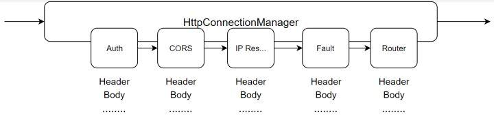

# http流量管理

## http的流程图

[http流量管理官方文档](https://cloudnative.to/envoy/intro/arch_overview/http/http.html)



## 路由

1、路由匹配(match)

- 基础匹配：prefix、path 和 safe_regex

- 高级匹配：headers 和 query_patameters

2、路由

- 路由(route) ：把请求报文转发到相应的集群

- 重定向(redirect) ： 把请求报文重定向到另一个域名或host主机

- 直接响应(direct_response)： 直接返回请求报文的应答


3、路由匹配

当 Envoy 匹配到一条路由时，它使用如下流程：

- HTTP 请求的 host 或 :authority 头部会和一个 虚拟主机 相匹配。

- 虚拟主机中的每一个 路由条目 都会按顺序地逐个被检查。 如果匹配到了，则使用此路由且不再做其它路由检查。

- 虚拟主机中的每一个 虚拟集群 都会独立地按顺序地被逐个检查。如果匹配到了，则使用此虚拟集群且不再做其它虚拟集群检查。


## HTTP连接管理

1、Envoy通过内置的L4过滤器HTTP连接管理器将原始字节转换为HTTP应用层协议级别的 消息和事件，例如 接收到的标头和主体等 ，以及处理所有HTTP连接和请求共有的功能 ， 包括访问日志、生成和跟踪请求ID， 请求/响应头处理、路由表管理和统计信息等。

> - 支持HTTP/1.1、WebSockets和HTTP/2，但不支持SPDY
> - 关联的路由表可静态配置，亦可经由 xDS API中的 RDS 动态生成；
> - 内建重试插件，可用于配置重试行为
    >   - Host Predicates
>   - Priority Predicates
> - 内建支持302重定向，它可以捕获302重定向响应，合成新请求后将其发送到新的路由匹配 ( match )所指定的上游端点，并将收到的响应作为对原始请求的响应返回客户端
> - 支持适用于HTTP连接及其组成流（constituent streams）的多种可配置超时机制
    >   - 连接级别：空闲超时和排空超时（GOAWAY）；
>   - 流级别：  空闲超时、每路由相关的上游端点超时和每路由相关的gRPC最大超时时长；
> - 基于自定义集群的动态转发代理；

2、HTTP协议相关的功能通过各HTTP过滤器实现 ，这些过滤器大体可分为编码器、 解码器和 编 / 解码器三类

> router （envoy.router ）是最常的过滤器之一 ，它基于路由表完成请求的转发或重定向,以及处理重试操作和生成统计信息等

## HTTP高级路由功能

Envoy基于HTTP router过滤器基于路由表完成多种高级路由机制，[http路由功能文档](https://cloudnative.to/envoy/intro/arch_overview/http/http_routing.html)
包括：

- 将域名映射到虚拟主机;
- path的前缀(prefix)匹配、精确匹配或正则表达式匹配； 虚拟主机级别的TLS重定向;
- path级别的path/host重定向;
- 由Envoy直接生成响应报文;
- 前缀重写;
- 显式host rewrite;
- prefix rewrite;
- 基于HTTP标头或路由配置的请求重试与请求超时； 基于运行时参数的流量迁移；
- 基于权重或百分比的跨集群流量分割;
- 基于任意标头匹配路由规则;
- 基于优先级的路由;
- 基于hash策略的路由;


## HTTP路由及配置基础

1、 路由配置中的顶级元素是虚拟主机

- 每个虚拟主机都有一个逻辑名称以及一组域名，请求报文中的主机头将根据此处的域名进行路由；
- 基于域名选择虚拟主机后，将基于配置的路由机制完成请求路由或进行重定向；
- 每个虚拟主机都有一个逻辑名称（name）以及一组域名（domains），请求报文中的主机头将根据此处的域名进行路由；
- 基于域名选择虚拟主机后，将基于配置的路由机制（routes）完成请求路由或进行重定向；

配置基础

```yaml

  listeners:
    - name: listener_0
      address:
        socket_address: { address: 127.0.0.1, port_value: 8080 }
      filter_chains:
        - filters:
            - name: envoy.filters.network.http_connection_manager
              typed_config:
                "@type": type.googleapis.com/envoy.extensions.filters.network.http_connection_manager.v3.HttpConnectionManager
                stat_prefix: http
                codec_type: AUTO
                route_config:
                  name: local_route
                  virtual_hosts:
                    - name: backend_baidu
                      domains: ["*"]       # 虚拟主机的域名，路由匹配时将请求报文中的host标头值与此处列表项进行匹配检测；
                      routes:              # 路由条目，匹配到当前虚拟主机的请求中的path匹配检测将针对各route中由match定义条件进行
                      - match:             # 常用内嵌字段 prefix|path|sate_regex|connect_matcher ，用于定义基于路径前缀、路径、正则表达式或连接匹配器四者之一定义匹配条件
                          prefix: "/"
                        route:             # 常用内嵌字段cluster|cluster_header|weighted_clusters ，基于集群 、请求报文中的集群标头 或加权集群 (流量分割)定义路由目标 ；
                          cluster: baidu
                        redirect: {…}        #重定向请求，但不可与route或direct_response一同使用；
                        direct_response: {…} #直接响应请求，不可与route和redirect一同使用；
                      virtual_clusters: []   #为此虚拟主机定义的用于收集统计信息的虚拟集群列表；
                http_filters:
                  - name: envoy.filters.http.router
                    typed_config:
                      "@type": type.googleapis.com/envoy.extensions.filters.http.router.v3.Router

```

2、 Route_Config虚拟主机是路由配置中的顶级元素，它可以通过virtual_hosts字段进行静态配置，也可基于VHDS进行动态发现。

3、 [Route_Config的配置](https://cloudnative.to/envoy/api-v3/config/route/v3/route.proto.html#envoy-v3-api-msg-config-route-v3-routeconfiguration)

```json

{
  "name": "...",
  "virtual_hosts": [],
  "vhds": "{...}",
  "internal_only_headers": [],
  "response_headers_to_add": [],
  "response_headers_to_remove": [],
  "request_headers_to_add": [],
  "request_headers_to_remove": [],
  "most_specific_header_mutations_wins": "...",
  "validate_clusters": "{...}"
}

```

[Virtual_Hosts的配置](https://cloudnative.to/envoy/api-v3/config/route/v3/route_components.proto.html#envoy-v3-api-msg-config-route-v3-virtualhost)


```json
{ 
"name": "...",
"domains": [],
"routes": [],
"require_tls": "...", 
"virtual_clusters": [],
"rate_limits": [],
"request_headers_to_add": [],
"request_headers_to_remove": [],
"response_headers_to_add": [],
"response_headers_to_remove": [],
"cors": "{...}",
"typed_per_filter_config": "{...}",
"include_request_attempt_count": "...",
"include_attempt_count_in_response": "...",
"retry_policy": "{...}",
"hedge_policy": "{...}",
"per_request_buffer_limit_bytes": "{...}"
}

```

## 路由配置示例

- 下面的配置重点说明match的基本匹配机制及不同的路由方式

```yaml

virtual_hosts: 
 - name: vh_001
   domains: ["ilinux.io", "*.ilinux.io", "ilinux.*"]
   routes:
   #精确匹配到"/service/blue"，路由到blue集群
   - match:
       path: "/service/blue"
       route:
         cluster: blue
   #正则匹配到 "^/service/.*blue$"，跳转到/service/blue,再转发到blue集群
   - match:
       safe_regex:
         google_re2: {}
         regex: "^/service/.*blue$"
     redirect:
         path_redirect: "/service/blue"
         
   #精确匹配到"/service/yellow"，则直接回复"This page will be provided soon later.\n" 
   - match:
       prefix: "/service/yellow"
       direct_response:
         status: 200
         body:
           inline_string: "This page will be provided soon later.\n" 
   #默认匹配转发到red集群     
   - match:
       prefix: "/"
     route:
       cluster: red
       
 - name: vh_002
   domains: ["*"]
   routes:
   #匹配到"/"，转发到gray集群
   - match:
     prefix: "/"
     route:
       cluster: gray

```

- 下面的配置则侧重基于标头和查询参数

```yaml

virtual_hosts:
- name: vh_001
  domains: ["*"]
  routes:
  #精确匹配到X-Canary，转发到demoappv12集群
  - match:
    prefix: "/"
    headers:
    - name: X-Canary
      exact_match: "true"
      route:
        cluster: demoappv12
  #查询匹配到"username"并且前缀匹配到"vip_"，转发到demoappv12集群
  - match:
    prefix: "/"
    query_parameters:
    - name: "username"
      string_match:
        prefix: "vip_"
      route:
        cluster: demoappv11
  #其它匹配转发到denoappv10
  - match:
      prefix: "/"
    route:
      cluster: demoappv10


```

## 将域名映射到虚拟主机

域名搜索顺序如下：

- 将请求报文中的host标头值依次与路由表中定义的各Virtualhost的domain属性值进行比较，并于第一次匹配时终止搜索；
- Domain search order
    - 精准匹配:  www.ilinux.io.
    - 左前缀匹配: *.ilinux.io or *-envoy.ilinux.io.
    - 右前缀匹配: ilinux.* or ilinux-*.
    - 通配符匹配:   * matching any domain.


## 路由基础配置

- match匹配

> - 基于prefix、path、safe_regex和connect_matchter 四者其中任何一个进行URL匹配。
> - 可额外根据headers 和query_parameters 完成报文匹配
> - 匹配的到报文可有三种路由机制
    >   - redirect
>   - direct_response
>   - route

- route

> - 支持cluster、weighted_clusters和cluster_header三者之一定义流量路由目标
> - 转发期间可根据prefix_rewrite和host_rewrite完成URL重写；
> - 还可以额外配置流量管理机制，例如：
    >   - 超时，重试：timeout、retry_policy
>   - 测试： request_mirror_policies
>   - 流控： rate_limits
>   - 访问控制：cors

## Envoy HTTP 路由配置

- [路由配置内容](https://cloudnative.to/envoy/api-v3/config/route/v3/route_components.proto.html#envoy-v3-api-msg-config-route-v3-route)

```json

{
  "name": "...",
  "match": "{...}",           # 定义匹配条件
  "route": "{...}",           # 定义流量路由目标，与 redirect 和 direct_response 互斥
  "redirect": "{...}",        # 将请求进行重定向，与 route 和 direct_response 互斥
  "direct_response": "{...}", # 用指定的内容直接响应请求，与 redirect 和 redirect 互斥
  "metadata": "{...}",        # 为路由机制提供额外的元数据，常用于 configuration、stats 和 logging 相关功能，则通常需要先定义相关的
  "decorator": "{...}",
  "typed_per_filter_config": "{...}",
  "request_headers_to_add": [],
  "request_headers_to_remove": [],
  "response_headers_to_add": [],
  "response_headers_to_remove": [],
  "tracing": "{...}",
  "per_request_buffer_limit_bytes": "{...}"
}


```

## [HTTP 头部操作](https://cloudnative.to/envoy/configuration/http/http_conn_man/headers.html)

HTTP 连接管理器在解码过程中（接收请求时）和编码过程中（发送响应时）都会操作多项 HTTP 头部。

- user-agent
- server
- x-client-trace-id
- x-envoy-downstream-service-cluster
- x-envoy-downstream-service-node
- x-envoy-external-address
- x-envoy-force-trace
- x-envoy-internal
- x-envoy-original-dst-host
- x-forwarded-client-cert
- x-forwarded-for
- x-forwarded-proto
- x-request-id
- x-ot-span-context
- x-b3-traceid
- x-b3-spanid
- x-b3-parentspanid
- x-b3-sampled
- x-b3-flags
- b3
- x-datadog-trace-id
- x-datadog-parent-id
- x-datadog-sampling-priority
- 自定义的请求/响应头部

## HTTP/1.1 头部大小写转换

- 在处理 HTTP/1.1 请求时，Envoy 会将头部键名都改成小写字母，以统一标准化。这种行为是符合 HTTP/1.1 标准的，但在实践中可能会给迁移已有系统带来问题，因为它们的某些头部是大小写敏感的。

- 为了支持此类场景，Envoy 允许配置头部格式规格，并在序列化头部键名时生效。如果需要为响应头部配置格式，请在 [http_protocol_options](https://cloudnative.to/envoy/api-v3/extensions/filters/network/http_connection_manager/v3/http_connection_manager.proto.html#envoy-v3-api-field-extensions-filters-network-http-connection-manager-v3-httpconnectionmanager-http-protocol-options) 中配置。如果需要为上游请求头部配置格式，请在 [Cluster](https://cloudnative.to/envoy/api-v3/config/cluster/v3/cluster.proto.html#envoy-v3-api-field-config-cluster-v3-cluster-http-protocol-options) 中配置。

