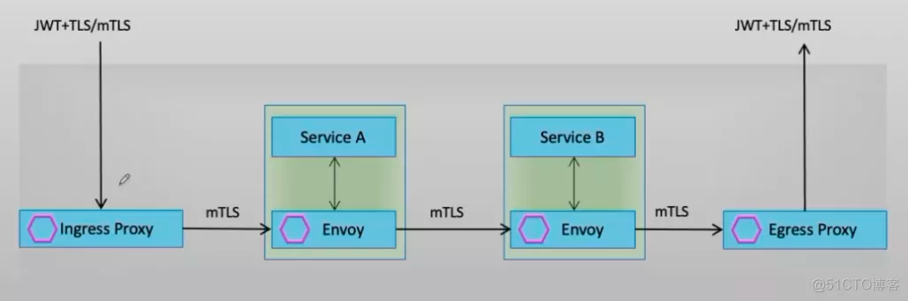

# envoy认证机制

## Service Mesh Authentication

- A service mesh provides the ability to do authentication between your services to ensure traffic flowing in your clusters is secure.
- There are 4 different authentication options available with a sidecar service mesh:
  - JWT Validation in Applications
  - JWT Validation at Ingress
  - Ingress TLS passthrough + JWT Validation at Sidecars
  - mTLS + JWT Validation




## Envoy的身份认证机制

Envoy支持两种类型的认证机制

- 传输认证：即服务间的认证，它基于双向TLS实现传输认证（即mTLS），包括双向认证、信道安全和证书自动管理；每个服务都需要有其用于服务间双向认证的标识，以实现此种认证机制；
- 用户认证：也称为终端用户认证，用于认证请求的最终用户或者设备；Envoy通过JWT（JSON Web Token）实现此类认证需求，以保护服务端的资源；
  - 客户端基于HTTP标头向服务端发送JWT
  - 服务端验证签名
  - envoy.filters.http.jwt_authn过滤器

## Envoy TLS

Envoy 支持侦听器中的TLS 终止以及与上游集群建立连接时的TLS发起。支持足以让 Envoy 执行现代 Web 服务的标准边缘代理职责，以及启动与具有高级 TLS 要求（TLS1.2、SNI 等）的外部服务的连接。Envoy 支持以下 TLS 功能：

- 可配置密码：每个 TLS 侦听器和客户端都可以指定它支持的密码。
- 客户端证书：除了服务器证书验证之外，上游/客户端连接还可以提供客户端证书。
- 证书验证和固定：证书验证选项包括基本链验证、主题名称验证和哈希固定。
- 证书吊销：Envoy 可以根据证书吊销列表 (CRL) 检查对等证书（如果提供的话） 。
- ALPN：TLS 监听器支持 ALPN。HTTP 连接管理器使用此信息（除了协议推断）来确定客户端使用的是 HTTP/1.1 还是 HTTP/2。
- SNI：服务器（侦听器）和客户端（上游）连接都支持 SNI。
- 会话恢复：服务器连接支持通过 TLS 会话票据恢复以前的会话（参见RFC 5077）。可以在热重启和并行 Envoy 实例之间执行恢复（通常在前端代理配置中有用）。
- BoringSSL 私钥方法：TLS 私钥操作（签名和解密）可以从扩展异步执行。这允许扩展 Envoy 以支持各种密钥管理方案（例如 TPM）和 TLS 加速。该机制使用 BoringSSL 私钥方法接口。
- OCSP 装订：在线证书装订协议响应可以装订到证书。

## Envoy TLS 底层实现

- 在底层使用BoringSSL作为SSL库；
- DownstreamTlsContexts支持多个TLS证书（多个证书需要属于同一类型，RSA或ECDSA），但 UpstreamTlsContexts目前仅支持单个证书
- 支持执行标准边缘代理任务，以及启动与具有高级TLS要求的外部服务（TLS1.2，SNI等）的连接；

## 启用证书验证

除非验证上下文指定一个或多个受信任的权威证书，否则不会启用上游和下游连接的证书验证。

示例配置

```yaml
static_resources:
  listeners:
  - name: listener_0
    address: {socket_address: {address: 127.0.0.1, port_value: 10000}}
    filter_chains:
    - filters:
      - name: envoy.filters.network.http_connection_manager
        typed_config:
          "@type": type.googleapis.com/envoy.extensions.filters.network.http_connection_manager.v3.HttpConnectionManager
          stat_prefix: ingress_http
          route_config:
            virtual_hosts:
            - name: default
              domains: ["*"]
              routes:
              - match: {prefix: "/"}
                route:
                  cluster: some_service
      transport_socket:
        name: envoy.transport_sockets.tls
        typed_config:
          "@type": type.googleapis.com/envoy.extensions.transport_sockets.tls.v3.DownstreamTlsContext
          common_tls_context:
            tls_certificates:
            - certificate_chain: {filename: "certs/servercert.pem"}
              private_key: {filename: "certs/serverkey.pem"}
            validation_context:
              trusted_ca:
                filename: certs/cacert.pem
  clusters:
  - name: some_service
    type: STATIC
    lb_policy: ROUND_ROBIN
    load_assignment:
      cluster_name: some_service
      endpoints:
      - lb_endpoints:
        - endpoint:
            address:
              socket_address:
                address: 127.0.0.1
                port_value: 1234
    transport_socket:
      name: envoy.transport_sockets.tls
      typed_config:
        "@type": type.googleapis.com/envoy.extensions.transport_sockets.tls.v3.UpstreamTlsContext
        common_tls_context:
          tls_certificates:
          - certificate_chain: {"filename": "certs/servercert.pem"}
            private_key: {"filename": "certs/serverkey.pem"}
            ocsp_staple: {"filename": "certs/server_ocsp_resp.der"}
          validation_context:
            match_typed_subject_alt_names:
            - san_type: DNS
              matcher:
                exact: "foo"
            trusted_ca:
              filename: /etc/ssl/certs/ca-certificates.crt

```

Linux 和 BSD 上系统 CA 包的常见路径

```shell
/etc/ssl/certs/ca-certificates.crt  （Debian/Ubuntu/Gentoo）
/etc/pki/ca-trust/extracted/pem/tls-ca-bundle.pem (CentOS/RHEL 7)
/etc/pki/tls/certs/ca-bundle.crt (Fedora/RHEL 6)
/etc/ssl/ca-bundle.pem (OpenSUSE)
/usr/local/etc/ssl/cert.pem (FreeBSD)
/etc/ssl/cert.pem (OpenBSD)

```

## 自定义证书验证器

- Envoy 还支持 envoy.tls.cert_validator 扩展类别中的自定义验证器，可以在 CertificateValidationContext上 进行配置。
- 例如，Envoy 可以配置为在单个侦听器或集群中使用多个信任包验证遵循 SPIFFE 规范的对等证书。

## 证书选择

DownstreamTlsContexts支持多个 TLS 证书。这些可能是 RSA 和 P-256 ECDSA 证书的混合。以下规则适用：

- 只能指定一个特定类型的证书（RSA 或 ECDSA）。
- 拒绝非 P-256 服务器 ECDSA 证书。
- 如果客户端支持 P-256 ECDSA，如果一个 P-256 ECDSA 证书存在于 DownstreamTlsContext
- 如果客户端仅支持 RSA 证书，则将选择 RSA 证书（如果存在于 DownstreamTlsContext中）。
- 否则，使用列出的第一个证书。如果客户端只支持 RSA 证书而服务器只有 ECDSA 证书，这将导致握手失败。
- 静态和 SDS 证书不能在给定的DownstreamTlsContext中混合使用。
- 所选证书必须遵守 OCSP 策略。如果没有找到这样的证书，则拒绝连接。

目前UpstreamTlsContexts仅支持单个 TLS 证书。

## Envoy中设定数字证书的方式

- 配置时，可以通过静态资源格式指定使用的TLS证书，也可以通过SDS动态获取TLS证书；
  - SDS可以简化证书管理
    - 各实例的证书可由SDS统一推送；
    - 证书过期后，SDS推送新证书至Envoy实例可立即生效而无需重启或重新部署；
  - 获取到所需要的证书之后侦听器方能就绪；不过，若因同SDS服务器的连接失败或收到其错误响应而无法获取证书，则侦听器会打开端口，但会重置连接请求；
  - Envoy同SDS服务器之间的通信必须使用安全连接；
  - SDS服务器需要实现gRPC服务SecretDiscoveryService，它遵循与其他xDS相同的协议；

- 设定数字证书的方式
  - 在 transport_sockets 配置段中，通过 tls_certificats 基于指定数据源直接加载证书及私钥
  - 在 static_resources 中定义出静态格式的 Secret 资源，而后在 transport_sockets 中的SDS配置里面通过指定Secret名称进行引用
  - 而通过 SDS 提供证书时，需要配置好 SDS 集群，并由 listener 或 cluster 在 transport_sockets 中通过 sds_config 引用；


## 配置Envoy Downstream TLS

- Envoy v3 API中移除了v2使用了tls_context，而改用Transport sockets扩展来支持TLS通信
  - 扩展的专用名称为envoy.transport_sockets.tls
  - 针对TLS终止和TLS始发，分别存在一种类型的专用配置
    - TLS始发：extensions.transport_sockets.tls.v3.UpstreamTlsContext
    - TLS终止：extensions.transport_sockets.tls.v3.DownstreamTlsContext
- DownstreamTlsContext与UpstreamTlsContext各自的配置中，均可定义连接参数、数字证书等，但前者还可强制要求客户端请求证书，从而进行mutual TLS会话
- Listener中的Transport sockets定义在filter_chains配置段中，与“filters[ ]”位于同一级别

```yaml
listeners: 
- name: ...
  address: {...}
  ......
  filter_chains: 
  - filters:
    - name: envoy.filters.network.http_connection_manager
    ……
    transport_socket:
      name: envoy.transport_sockets.tls
      typed_config:
        "@type": type.googleapis.com/envoy.extensions.transport_sockets.tls.v3.DownstreamTlsContext 
        common_tls_context:  # 通用的TLS配置，包括TLS通信特征和证书等；
          tls_params: {...}  # TLS 协议版本、密码套件等。
          tls_certificates: []   # tls通信中使用的证书，只能使用tls_certificates、tls_certificate_sds_secret_configs和tls_certificate_provider_instance之一。
          tls_certificate_sds_secret_configs:   # 通过SDS API加载secret（从而加载证书和私钥）的配置，不能与tls_certificates配置段同时使用
            name: ...
            sds_config: {...}
          validation_context:   # 用于校验对端证书的相关配置,只能设置validation_context、validation_context_sds_secret_config、combined_validation_context之一。
            trusted_ca: {...}                  # 信任的CA，相关信息可从filename、inline_bytes和inline_string三种数据源之一中加载
            watched_directory: {...}           # 基于SDS协议从文件系统中加载CA时监视的目录
            verify_certificate_spki: []        # SPKI校验，经过Base64编码的SPKI (Subject Public Key Information)的SHA-256校验码列表
            verify_certificate_hash: []        # Hash校验，仅该列表中的hash码对应的证书会被接受
            match_subject_alt_names: []        # Subject的可替换名称列表
            crl: {...}                         # 证书吊销列表，相关信息可从filename、inline_bytes和inline_string三种数据源之一中加载
            allow_expired_certificate: ...     # 是否接受已然过期的证书
            trust_chain_verification:          # 证书信任链的校验模式，支持VERIFY_TRUST_CHAIN和ACCEPT_UNTRUSTED两种，前者为默认值
            custom_validator_config:           # 扩展特定证书验证器的配置。 envoy.tls.cert_validator.spiffe
              name: envoy.tls.cert_validator.spiffe
              typed_config:
                "@type": type.googleapis.com/envoy.extensions.transport_sockets.tls.v3.SPIFFECertValidatorConfig
                trust_domains:     # 此字段指定用于验证传入 X.509-SVID 的信任域。
                  name: ...   # 信任域的名称，例如example.com foo.bar.gov。请注意，这不能有“spiffe://”前缀。
                  trust_bundle:  # 指定一个包含 x.509 信任包的数据源，用于验证此信任域中的传入 SVID。
                    filename: ...  # 本地文件系统数据源。必须设置filename、inline_bytes、inline_string、environment_variable之一。
                    inline_bytes: ... # 配置中内联的字节。
                    inline_string: ... # 配置中内联的字符串。
                    environment_variable: ... # 环境变量数据源。
            only_verify_leaf_cert_crl: ...     # 如果此选项设置为 true，则只有证书链末尾的证书将由CRL验证。
            max_verify_depth: {...}            # 配置在验证期间解析的链中中间证书的最大数量。默认限制为 100。
          validation_context_sds_secret_config: {...}  #  用于通过 SDS API 获取验证上下文的配置。
          combined_validation_context: {...} # 组合证书验证上下文包含默认的 CertificateValidationContext 和 SDS 配置。
          alpn_protocols: []  # 提供侦听器应公开的 ALPN 协议列表。 “h2,http/1.1” 同时支持 HTTP/2 和 HTTP/1.1。 “http/1.1” 只支持 HTTP/1.1。此参数没有默认值。
          custom_handshaker: {...} # 自定义 TLS 握手。如果为空，则默认为原生 TLS 握手行为。
          key_log : {...} # TLS 密钥日志配置
        require_client_certificate: ... # 是否强制校验客户端证书
        session_ticket_keys: {...} # 为了能够恢复TLS session，服务器会使用session key将session加密后发送给客户端保存；客户端需要透明地支持该功能
        session_ticket_keys_sds_secret_config: {...} # 通过SDS API请求加载session ticket key的配置；
        disable_stateless_session_resumption: “...” # 布尔型值，true表示不生成session ticket，从而启用stateless session；false表示生成并加密会话，加密使用的key可由session_ticket_keys或session_ticket_keys_sds_secret_config定义，未定义时，将由TLS Server自行生成和管理；
        session_timeout: {...} # 会话超时时长
        ocsp_staple_policy: "..." #

```

## 配置Envoy Upstream TLS

```yaml
clusters:
- name: ...
  ...
  transport_socket:
    name: envoy.transport_sockets.tls
    typed_config:
      "@type": type.googleapis.com/envoy.extensions.transport_sockets.tls.v3.UpstreamTlsContext
      sni: ...                    # SNI支持基于FQDN的TLS，创建TLS后端连接时使用的SNI字符串
      allow_renegotiation: ...    # 是否允许启用协调机制，不安全，不建议使用；
      max_session_keys: {...}     # 允许存储的用于进行session恢复的最大session key数量；默认为1，0表示禁止会话恢复
      common_tls_context:         # 通用的TLS配置，包括TLS通信特征和证书等；
        tls_params:               # TLS 协议版本、密码套件等。
          tls_minimum_protocol_version: ... # 支持的最小的TLS协议版本号，默认客户端是TLS 1.2，服务端是TLS 1.0
          tls_maximum_protocol_version: ... # 支持的最大的TLS协议版本号，默认，客户端是TLS 1.2，服务端是TLS 1.3
          cipher_suites: [ ]                # TLS 1.0-1.2版本协商中支持加密算法列表，TLS1.3不受影响；
          ecdh_curves: []                   # 使用的ecdh curve算法；
        tls_certificates:    # tls通信中使用的证书，只能使用tls_certificates、tls_certificate_sds_secret_configs和tls_certificate_provider_instance之一。
          certificate_chain:      # 加载的证书信息的数据源，相关数据源只能是下列三种之一，而且仅可设置一种
            filename: ...         # 证书文件路径
            inline_bytes: ...     # 包含在配置文件中直接给出字节字串中
            inline_string: ...    # 包含在配置文件中直接给出字串中
          private_key:            # 加载的私钥信息的数据源，格式同上面的certificate_chain
          watched_directory:      # 基于SDS协议从文件系统中加载证书和私钥时监视的目录
            path: ...             # 监视的目录路径
        tls_certificate_sds_secret_configs:  # 通过SDS API加载secret（从而加载证书和私钥）的配置，不能与tls_certificates配置段同时使用
        - name: ...                          # 引用的secret的惟一标识名，secret为静态配置；若同时给出了下面的sds_config配置，则会从其SDS API动态加载secret
          sds_config:                        # SDS API服务配置，path、api_config_source和ads三种配置一次仅可定义一种
            path: ...                        # 基于文件
            api_config_source: {...}         # 基于SDS订阅
            ads: {...}                       # 基于ADS订阅
            initial_fetch_timeout: ...       # 初始加载的超时时长
            resource_api_version: ...        # 资源的API版本        
        validation_context:                  # 用于校验对端证书的相关配置
          trusted_ca: {...}                  # 信任的CA，相关信息可从filename、inline_bytes和inline_string三种数据源之一中加载
          watched_directory: {...}           # 基于SDS协议从文件系统中加载CA时监视的目录
          verify_certificate_spki: []        # SPKI校验，经过Base64编码的SPKI (Subject Public Key Information)的SHA-256校验码列表
          verify_certificate_hash: []        # Hash校验，仅该列表中的hash码对应的证书会被接受
          match_subject_alt_names: []        # Subject的可替换名称列表
          crl: {...}                         # 证书吊销列表，相关信息可从filename、inline_bytes和inline_string三种数据源之一中加载
          allow_expired_certificate: ...     # 是否接受已然过期的证书
          trust_chain_verification:          # 证书信任链的校验模式，支持VERIFY_TRUST_CHAIN和ACCEPT_UNTRUSTED两种，前者为默认值
          custom_validator_config:           # 扩展特定证书验证器的配置。 envoy.tls.cert_validator.spiffe
            name: envoy.tls.cert_validator.spiffe
            typed_config:
              "@type": type.googleapis.com/envoy.extensions.transport_sockets.tls.v3.SPIFFECertValidatorConfig
              trust_domains:     # 此字段指定用于验证传入 X.509-SVID 的信任域。
                name: ...   # 信任域的名称，例如example.com foo.bar.gov。请注意，这不能有“spiffe://”前缀。
                trust_bundle:  # 指定一个包含 x.509 信任包的数据源，用于验证此信任域中的传入 SVID。
                  filename: ...  # 本地文件系统数据源。必须设置filename、inline_bytes、inline_string、environment_variable之一。
                  inline_bytes: ... # 配置中内联的字节。
                  inline_string: ... # 配置中内联的字符串。
                  environment_variable: ... # 环境变量数据源。
          only_verify_leaf_cert_crl: ...     # 如果此选项设置为 true，则只有证书链末尾的证书将由CRL验证。
          max_verify_depth: {...}            # 配置在验证期间解析的链中中间证书的最大数量。默认限制为 100。
        validation_context_sds_secret_config: # 通过SDS API动态加载validation context
          name: ...                # 引用的secret的惟一标识名，secret为静态配置；若同时给出了下面的sds_config配置，则会从其SDS API动态加载secret
          sds_config:              # SDS API服务配置
        combined_validation_context           # 混合模式的validation context加载机制，同时给了静态配置和SDS，SDS有返回数据时将二者合并后使用
          default_validation_context: {...}   # 默认使用的静态配置的validation context
          validation_context_sds_secret_config: {...} # 动态加载validation context secret的SDS API

```

## 静态Secret

静态Secret配置格式
- 根据其功能，Secret通常有数字证书（服务端或客户端）、票证密钥和证书校验机制三种类型，但每个定义仅能指定为其中一种类型；

```yaml
static_resources:
  listeners: [ ]
  clusters: [ ]
  secrets: [ ] # 静态指定的Secret列表，定义时，以下三种方式可选其一；
    - name: ... # 可用于引用此秘密（Secret）的惟一标识；
      tls_cretificate: {...} # 数字证书
        certificate_chain: {...} # 加载的TLS证书链，其数据源可以是filename、inline_bytes和inline_string三者之一；
        private_key: {...} # TLS私钥，遵循DataSource格式；
        password: {...} # 私钥信息的加解密密钥，未指定时需要私钥文件处于未加密状态，遵循DataSource格式；
        watched_directory: {...} #基于SDS协议从文件系统中加载证书和私钥时监视的目录
    - name: ... # 可用于引用此秘密的惟一标识；
      session_ticket_keys: {...} # 定义用于加密和解密TLS会话票证的密钥
        keys: [ ] # 密钥列表，未指定时将使用内部生成和管理的密钥，定义格式遵循DataSource格式；
    - name: ... # 可用于引用此秘密（Secret）的惟一标识；
      validation_context: {...} # 对等证书验证机制的相关配置
        trusted_ca: {...} # 信任的CA的证书，未指定时不会验证对端证书；
        crl: {...} # 可选的PEM格式的证书吊销列表，定义格式遵循DataSource格式；
        verify_certificate_spki: [ ] # base64编码的SHA-256哈希码，用于验证DER编码枨证书的公钥信息的SHA-256编码是否与列表项之一匹配
        verify_certificate_hash: [ ] # base64编码的SHA-256哈希码，用于验证DER编码格式证书的SHA-256编码是否与列表项之一匹配
        verify_subject_alt_name: [ ] # Subject备用名称列表，可选，用于验证证书的主题备用名称是否与列表项之一匹配
        match_subject_alt_names: [] # Subject的可替换名称列表
        allow_expired_certificate: ... # 布尔型数据，用于定义是滞不会拒绝过期的证书
        watched_directory: {...} # 基于SDS协议从文件系统中加载CA时监视的目录
    -name: ...
      generic_secret: # 可由filter使用的通用类型的secret
        secret: {...} # 从指定的DataSource格式的数据源加载secret
```

静态Secret配置示例

```yaml
node:
  id: front-envoy
  cluster: front-envoy

admin:
  profile_path: /tmp/envoy.prof
  access_log_path: /tmp/admin_access.log
  address:
    socket_address:
       address: 0.0.0.0
       port_value: 9901

layered_runtime:
  layers:
  - name: admin
    admin_layer: {}

static_resources:
  secrets:
  - name: server_cert
    tls_certificate:
      certificate_chain:
        filename: "/etc/envoy/certs/server.crt"
      private_key:
        filename: "/etc/envoy/certs/server.key"
  - name: client_cert
    tls_certificate:
      certificate_chain:
        filename: "/etc/envoy/certs/client.crt"
      private_key:
        filename: "/etc/envoy/certs/client.key"
  - name: validation_context
    validation_context:
      trusted_ca:
        filename: "/etc/envoy/ca/ca.crt"

  listeners:
  - name: listener_http
    address:
      socket_address:
        address: 0.0.0.0
        port_value: 80
    filter_chains:
    - filters:
      - name: envoy.filters.network.http_connection_manager
        typed_config:
          "@type": type.googleapis.com/envoy.extensions.filters.network.http_connection_manager.v3.HttpConnectionManager
          codec_type: auto
          stat_prefix: ingress_http
          access_log:
          - name: envoy.access_loggers.file
            typed_config:
              "@type": type.googleapis.com/envoy.extensions.access_loggers.file.v3.FileAccessLog 
              path: "/dev/stdout"           
          route_config:
            name: local_route
            virtual_hosts:
            - name: backend
              domains: ["*"]
              routes:
              - match:
                  prefix: "/"
                redirect:
                  https_redirect: true
                  port_redirect: 443
          http_filters:
          - name: envoy.filters.http.router
            typed_config: {}

  - name: listener_https
    address:
      socket_address: { address: 0.0.0.0, port_value: 443 }
    filter_chains:
    - filters:
      - name: envoy.filters.network.http_connection_manager
        typed_config:
          "@type": type.googleapis.com/envoy.extensions.filters.network.http_connection_manager.v3.HttpConnectionManager
          stat_prefix: ingress_https
          codec_type: AUTO
          access_log:
          - name: envoy.access_loggers.file
            typed_config:
              "@type": type.googleapis.com/envoy.extensions.access_loggers.file.v3.FileAccessLog 
              path: "/dev/stdout"           
          route_config:
            name: https_route
            virtual_hosts:
            - name: https_route
              domains: ["*"]
              routes:
              - match:
                  prefix: "/service/gray"
                route:
                  cluster: service-gray
              - match:
                  prefix: "/service/purple"
                route:
                  cluster: service-purple
              - match:
                  prefix: "/"
                route:
                  cluster: mycluster
          http_filters:
          - name: envoy.filters.http.router
            typed_config: {}
      transport_socket:  # DownstreamTlsContext
        name: envoy.transport_sockets.tls
        typed_config:
          "@type": type.googleapis.com/envoy.extensions.transport_sockets.tls.v3.DownstreamTlsContext
          common_tls_context:
            tls_certificate_sds_secret_configs:
            - name: server_cert

  clusters:
  - name: mycluster
    connect_timeout: 0.25s
    type: STRICT_DNS
    lb_policy: ROUND_ROBIN
    load_assignment:
      cluster_name: mycluster
      endpoints:
      - lb_endpoints:
        - endpoint:
            address:
              socket_address:
                address: myservice
                port_value: 80

  - name: service-gray
    connect_timeout: 0.25s
    type: STRICT_DNS
    lb_policy: ROUND_ROBIN
    load_assignment:
      cluster_name: service-gray
      endpoints:
      - lb_endpoints:
        - endpoint:
            address:
              socket_address:
                address: service-gray
                port_value: 443
    transport_socket:
      name: envoy.transport_sockets.tls
      typed_config:
        "@type": type.googleapis.com/envoy.extensions.transport_sockets.tls.v3.UpstreamTlsContext
        common_tls_context:
          validation_context_sds_secret_config:
            name: validation_context

  - name: service-purple
    connect_timeout: 0.25s
    type: STRICT_DNS
    lb_policy: ROUND_ROBIN
    load_assignment:
      cluster_name: service-purple
      endpoints:
      - lb_endpoints:
        - endpoint:
            address:
              socket_address:
                address: service-purple
                port_value: 443
    transport_socket:
      name: envoy.transport_sockets.tls
      typed_config:
        "@type": type.googleapis.com/envoy.extensions.transport_sockets.tls.v3.UpstreamTlsContext
        common_tls_context:
          tls_certificate_sds_secret_configs:
          - name: client_cert
          validation_context_sds_secret_config:
            name: validation_context

```

## Secret发现服务 (SDS)

TLS 证书可以在静态资源中指定，也可以远程获取。通过从文件系统获取 SDS 配置或从 SDS 服务器推送更新来支持静态资源的证书轮换。

SDS配置示例:

```yaml
clusters:
  - name: sds_server_mtls
    typed_extension_protocol_options:
      envoy.extensions.upstreams.http.v3.HttpProtocolOptions:
        "@type": type.googleapis.com/envoy.extensions.upstreams.http.v3.HttpProtocolOptions
        explicit_http_config:
          http2_protocol_options:
            connection_keepalive:
              interval: 30s
              timeout: 5s
    load_assignment:
      cluster_name: sds_server_mtls
      endpoints:
      - lb_endpoints:
        - endpoint:
            address:
              socket_address:
                address: 127.0.0.1
                port_value: 8234
    transport_socket:
      name: envoy.transport_sockets.tls
      typed_config:
        "@type": type.googleapis.com/envoy.extensions.transport_sockets.tls.v3.UpstreamTlsContext
        common_tls_context:
        - tls_certificate:
          certificate_chain:
            filename: certs/sds_cert.pem
          private_key:
            filename: certs/sds_key.pem
  - name: sds_server_uds
    typed_extension_protocol_options:
      envoy.extensions.upstreams.http.v3.HttpProtocolOptions:
        "@type": type.googleapis.com/envoy.extensions.upstreams.http.v3.HttpProtocolOptions
        explicit_http_config:
          http2_protocol_options: {}
    load_assignment:
      cluster_name: sds_server_uds
      endpoints:
      - lb_endpoints:
        - endpoint:
            address:
              pipe:
                path: /tmp/uds_path
  - name: example_cluster
    connect_timeout: 0.25s
    load_assignment:
      cluster_name: local_service_tls
      ...
      transport_socket:
      name: envoy.transport_sockets.tls
      typed_config:
        "@type": type.googleapis.com/envoy.extensions.transport_sockets.tls.v3.UpstreamTlsContext
        common_tls_context:
          tls_certificate_sds_secret_configs:
          - name: client_cert
            sds_config:
              resource_api_version: V3
              api_config_source:
                api_type: GRPC
                transport_api_version: V3
                grpc_services:
                  google_grpc:
                    target_uri: unix:/tmp/uds_path
listeners:
  ....
  filter_chains:
  - transport_socket:
      name: envoy.transport_sockets.tls
      typed_config:
        "@type": type.googleapis.com/envoy.extensions.transport_sockets.tls.v3.DownstreamTlsContext
        common_tls_context:
          tls_certificate_sds_secret_configs:
          - name: server_cert
            sds_config:
              resource_api_version: V3
              api_config_source:
                api_type: GRPC
                transport_api_version: V3
                grpc_services:
                  envoy_grpc:
                    cluster_name: sds_server_mtls
          validation_context_sds_secret_config:
            name: validation_context
            sds_config:
              resource_api_version: V3
              api_config_source:
                api_type: GRPC
                transport_api_version: V3
                grpc_services:
                  envoy_grpc:
                    cluster_name: sds_server_uds


```

## 故障排除

当 Envoy 在与上游集群建立连接时发起 TLS 时，任何错误都将记录到 UPSTREAM_TRANSPORT_FAILURE_REASON字段或 AccessLogCommon.upstream_transport_failure_reason字段中。常见错误有：

- ​​Secret is not supplied by SDS​​：Envoy 仍在等待 SDS 交付密钥/证书或根 CA。
- ​​SSLV3_ALERT_CERTIFICATE_EXPIRED​​：对等证书已过期，并且不允许在配置中使用。
- ​​SSLV3_ALERT_CERTIFICATE_UNKNOWN​​: 对等证书不在配置指定的 SPKI 中。
- ​​SSLV3_ALERT_HANDSHAKE_FAILURE​​：握手失败，通常是由于上游需要客户端证书但未提供。
- ​​TLSV1_ALERT_PROTOCOL_VERSION​​: TLS 协议版本不匹配。
- ​​TLSV1_ALERT_UNKNOWN_CA​​: 对等证书 CA 不在受信任的 CA 中。

## Reference

- https://www.envoyproxy.io/docs/envoy/latest/intro/arch_overview/security/ssl
- https://www.envoyproxy.io/docs/envoy/latest/api-v3/extensions/transport_sockets/tls/v3/tls.proto#envoy-v3-api-msg-extensions-transport-sockets-tls-v3-upstreamtlscontext
