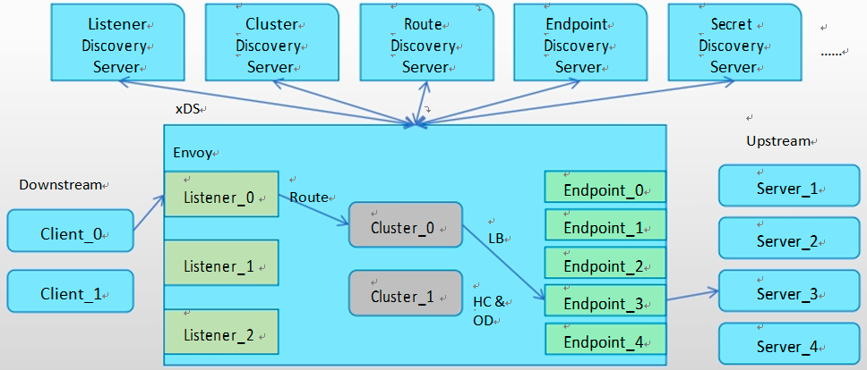
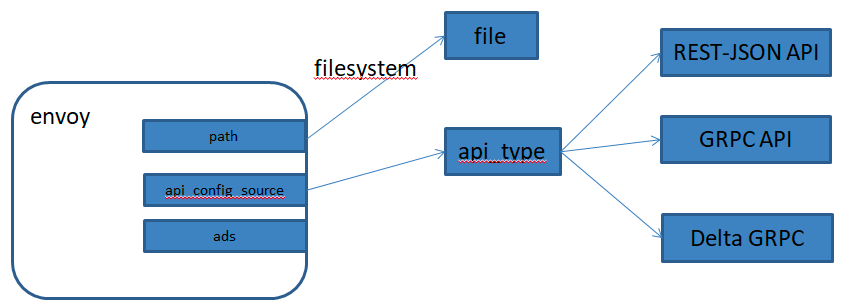

## envoy动态配置

### envoy动态配置介绍

动态资源，是指由envoy通过xDS协议发现所需要的各项配置的机制，相关的配置信息保存 于称之为管理服务器（Management Server ）的主机上，经由xDS API向外暴露；下面是一个 纯动态资源的基础配置框架。

```json
{
"lds_config": "{...}",
"cds_config": "{...}",
"ads_config": "{...}"
}

```

Envoy支持三种类型的配置信息的动态发现机制，相关的发现服务及其相应的API联合起来 称为xDS API。

1. 基于文件系统发现：指定要监视的文件系统路径
2. 通过查询一到多个管理服务器（Management Server）发现：通过 DiscoveryRequest 协议报文发送请求，并要求服务方以 DiscoveryResponse 协议报文进行响应
    * gRPC服务：启动gRPC流
    * REST服务：轮询REST-JSON URL

v3 xDS支持如下几种资源类型:

```shell

envoy.config.listener.v3.Listener
envoy.config.route.v3.RouteConfiguration
envoy.config.route.v3.ScopedRouteConfiguration
envoy.config.route.v3.VirtualHost
envoy.config.cluster.v3.Cluster
envoy.config.endpoint.v3.ClusterLoadAssignment
envoy.extensions.transport_sockets.tls.v3.Secret
envoy.service.runtime.v3.Runtime

```

#### xDS API介绍

Envoy对xDS API的管理由后端服务器实现，包括LDS、CDS、RDS、SRDS（Scoped Route）、VHDS （Virtual Host）、EDS、SDS、RTDS（Runtime ）等。

> 1. 所有这些API都提供了最终的一致性，并且彼此间不存在相互影响；
> 2. 部分更高级别的操作（例如执行服务的A/B部署）需要进行排序以防止流量被丢弃，因此，基于一个管理服务器提供多类API时还需要使用聚合发现服务（ADS ）API。
> 3. ADS API允许所有其他API通过来自单个管理服务器的单个gRPC双向流进行编组，从而允许对操作进行确定性排序

xDS的各API还支持增量传输机制，包括ADS



#### Bootstrap node

一个 Management Server 实例可能需要同时响应多个不同的Envoy实例的资源发现请求。

> * Management Server上的配置需要为适配到不同的Envoy实例
> * Envoy 实例请求发现配置时，需要在请求报文中上报自身的信息
>  - 例如id、cluster、metadata和locality等
>  - 这些配置信息定义在Bootstrap配置文件中
>

专用的顶级配置段“node{…}”中配置

```yaml
node:
  id: … # An opaque node identifier for the Envoy node. 
  cluster: … # Defines the local service cluster name where Envoy is running.
  metadata: {…} # Opaque metadata extending the node identifier. Envoy will pass this directly to the management server .
  locality: # Locality specifying where the Envoy instance is running.
    region: …
    zone: …
    sub_zone: …
  user_agent_name: … # Free-form string that identifies the entity requesting config. E.g . “envoy ” or “grpc”
  user_agent_version: … # Free-form string that identifies the version of the entity requesting config. E.g . “1.12.2” or “abcd1234” , or “SpecialEnvoyBuild ” 
  user_agent_build_version: # Structured version of the entity requesting config.
    version: …
    metadata: {…}
  extensions: [ ] # List of extensions and their versions supported by the node.
  client_features: [ ]
  listening_addresses: [ ] # Known listening ports on the node as a generic hint to the management server for filtering listeners to be returned

```

### API的流程

1、对于典型的HTTP路由方案，xDS API的Management Server 需要为其客户端（Envoy实例）配置的核心资源类型:Listener、RouteConfiguration、Cluster和ClusterLoadAssignment四个。每个Listener资源可以指向一个RouteConfiguration资源，该资源可以指向一个或多个Cluster资源，并且每个Cluster资源可以指向一个ClusterLoadAssignment资源。

2、Envoy实例在启动时请求加载所有Listener和Cluster资源，而后，再获取由这些Listener和 Cluster所依赖的RouteConfiguration和ClusterLoadAssignment配置；此种场景中，Listener资源和Cluster资源分别代表着客户端配置树上的“根（root）”配置，因而 可并行加载。

3、类型gRPC一类的非代理式客户端可以仅在启动时请求加载其感兴趣的Listener资源， 而后再加载这些特定Listener相关的RouteConfiguration资源；再然后，是这些 RouteConfiguration资源指向的Cluster资源，以及由这些Cluster资源依赖的 ClusterLoadAssignment资源；该种场景中，Listener资源是客户端整个配置树的“根”。

### Envoy的配置方式

Envoy的架构支持非常灵活的配置方式：简单部署场景可以使用纯静态配置，而更复 杂的部署场景则可以逐步添加需要的动态配置机制

```shell

1、纯静态配置：用户自行提供侦听器、过滤器链、集 群及HTTP路由（http代理场景），上游端点的发现仅可通过DNS服务进行，且配置的重新加载必须通过内置的热重启（ hot restart）完成

2、仅使用EDS：EDS提供的端点发现功能可有效规避DNS的限制（ 响应中的最大记录数等）

3、使用EDS和CDS：CDS能够让Envoy以优雅的方式添加、更新和删除上游集群，初始配置时， Envoy无须事先了解所有上游集群

4、EDS、CDS和RDS：动态发现路由配置；RDS与EDS、CDS一起使用时 ，为用户提供了构建复杂路由拓扑的能力（流量转移、蓝/绿部署等）

5、EDS、CDS、RDS和LDS：动态发现侦听器配置，包括内嵌的过滤器链；启用此四种发现服务后，除了较罕见的配置变动、证书轮替或更新Envoy程序之外，几乎无须再热重启Envoy

6、EDS、CDS、RDS、LDS和SDS：动态发现侦听器密钥相关的证书、 私钥及TLS会话票据， 以及对证书验证逻辑的配置（受信任的根证书和撤销机制等 ）

```

### Envoy资源的配置源(ConfigSource)

1、配置源（ConfigSource）用于指定资源配置数据的来源，用于为Listener、Cluster、Route、 Endpoint、Secret和VirtualHost等资源提供配置数据。

2、目前，Envoy支持的资源配置源只能是path、api_config_source或ads其中之一。

3、api_config_source或ads的数据来自于xDS API Server，即Management Server。





### 基于文件系统的订阅

```shell

1)Envoy将使用inotify（Mac OS X上的kqueue）来监视文件的更改，并在更新时解析文件中的DiscoveryResponse 报文
2)二进制protobufs，JSON，YAML和proto文本都是DiscoveryResponse 所支持的数据格式

提示
1)除了统计计数器和日志以外，没有任何机制可用于文件系统订阅ACK/NACK更新
2)若配置更新被拒绝，xDS API的最后一个有效配置将继续适用

```

####  基于eds实现Envoy基本全动态的配置方式

以EDS为例，Cluster为静态定义，其各Endpoint通过EDS动态发现

```yaml
# Cluster中的endpoint配置格式

clusters:
- name:
  ...
  eds_cluster_config:
    service_name:
    eds_config:
      path: ... # ConfigSource，支持使用path, api_config_source或ads三者之一；
```

cluster的配置

```yaml
# 类似如下纯静态格式的Cluster定义
clusters:
- name: webcluster1
  connect_timeout: 0.25s
  type: STATIC #类型为静态
  lb_policy: ROUND_ROBIN
  load_assignment:
    cluster_name: webcluster1
    endpoints:
    - lb_endpoints:
      - endpoint:
        address:
          socket_address:
            address: 172.21.0.3
            port_value: 8080

#使用了EDS的配置
clusters:
- name: webcluster1
  connect_timeout: 0.25s
  lb_policy: ROUND_ROBIN
  type: EDS #类型为EDS
  eds_cluster_config:
    service_name: webcluster1
    eds_config:
      path: '/etc/envoy/eds.yaml' # 指定订阅的文件路径
#提示：文件后缀名为conf，则资源要以json格式定义；文件后缀名为yaml，则资源需要以yaml格式定义；另外，动态配置中，各Envoy实例需要有惟的id标识


```

EDS的配置

1) 文件/etc/envoy/eds.yaml中以 Discovery Response 报文的格式给出响应实例，例如，下面的配置示例用于存在地址 172.21.0.3 某上游服务器可提供服务时

2) 响应报文需要以yaml格式给出

```yaml
resources:
  - "@type": type.googleapis.com/envoy.config.endpoint.v3.ClusterLoadAssignment
    cluster_name: webcluster
    endpoints:
    - lb_endpoints:
      - endpoint:
        address:
          socket_address:
            address: 172.21.0.3
            port_value: 8080
```

3) 测试

- 执行命令

```shell
cd ./eds-filesystem
sudo docker-compose up -d --build
```
- 检查docker 运行

```shell
sudo docker ps

CONTAINER ID   IMAGE                  COMMAND                  CREATED       STATUS       PORTS                                                                                         NAMES
c87a1782a38b   2dabae637bd2           "./httpbin"              3 hours ago   Up 3 hours   8080/tcp                                                                                      eds-filesystem_webserver2_1
bdfec256d456   2dabae637bd2           "./httpbin"              3 hours ago   Up 3 hours   8080/tcp                                                                                      eds-filesystem_webserver1_1
d60808d99cb8   eds-filesystem_envoy   "/docker-entrypoint.…"   3 hours ago   Up 3 hours   0.0.0.0:9091->9091/tcp, :::9091->9091/tcp, 10000/tcp, 0.0.0.0:8080->80/tcp, :::8080->80/tcp   eds-filesystem_envoy_1

```

- 检查

```shell
curl http://127.0.0.1:9091/clusters

webcluster1::eds_service_name::webcluster1
webcluster1::172.21.0.3:8080::cx_active::0
webcluster1::172.21.0.3:8080::cx_connect_fail::0
webcluster1::172.21.0.3:8080::cx_total::4
webcluster1::172.21.0.3:8080::rq_active::0
webcluster1::172.21.0.3:8080::rq_error::0
webcluster1::172.21.0.3:8080::rq_success::351
webcluster1::172.21.0.3:8080::rq_timeout::0
webcluster1::172.21.0.3:8080::rq_total::351
webcluster1::172.21.0.3:8080::hostname::
webcluster1::172.21.0.3:8080::health_flags::healthy
webcluster1::172.21.0.3:8080::weight::1
webcluster1::172.21.0.3:8080::region::
webcluster1::172.21.0.3:8080::zone::
webcluster1::172.21.0.3:8080::sub_zone::
webcluster1::172.21.0.3:8080::canary::false
webcluster1::172.21.0.3:8080::priority::0
webcluster1::172.21.0.3:8080::success_rate::-1
webcluster1::172.21.0.3:8080::local_origin_success_rate::-1

```

```shell
curl http://127.0.0.1:8080/hostname

"bdfec256d456"

```

- 变更eds 输出，增加另外 EndPoint

```shell
# 进入 envoy 容器
sudo docker exec -it d60808d99cb8  /bin/sh

cd /etc/envoy
cp eds.v2.yaml eds.yaml
# envoy 重新加载配置
mv eds.yaml tmp.yaml
mv tmp.yaml eds.yaml

```

```shell
curl http://127.0.0.1:9091/clusters

webcluster1::eds_service_name::webcluster1
webcluster1::172.21.0.3:8080::cx_active::1
webcluster1::172.21.0.3:8080::cx_connect_fail::0
webcluster1::172.21.0.3:8080::cx_total::5
webcluster1::172.21.0.3:8080::rq_active::0
webcluster1::172.21.0.3:8080::rq_error::0
webcluster1::172.21.0.3:8080::rq_success::353
webcluster1::172.21.0.3:8080::rq_timeout::0
webcluster1::172.21.0.3:8080::rq_total::353
webcluster1::172.21.0.3:8080::hostname::
webcluster1::172.21.0.3:8080::health_flags::healthy
webcluster1::172.21.0.3:8080::weight::1
webcluster1::172.21.0.3:8080::region::
webcluster1::172.21.0.3:8080::zone::
webcluster1::172.21.0.3:8080::sub_zone::
webcluster1::172.21.0.3:8080::canary::false
webcluster1::172.21.0.3:8080::priority::0
webcluster1::172.21.0.3:8080::success_rate::-1
webcluster1::172.21.0.3:8080::local_origin_success_rate::-1
webcluster1::172.21.0.4:8080::cx_active::1
webcluster1::172.21.0.4:8080::cx_connect_fail::0
webcluster1::172.21.0.4:8080::cx_total::1
webcluster1::172.21.0.4:8080::rq_active::0
webcluster1::172.21.0.4:8080::rq_error::0
webcluster1::172.21.0.4:8080::rq_success::2
webcluster1::172.21.0.4:8080::rq_timeout::0
webcluster1::172.21.0.4:8080::rq_total::2
webcluster1::172.21.0.4:8080::hostname::
webcluster1::172.21.0.4:8080::health_flags::healthy
webcluster1::172.21.0.4:8080::weight::1
webcluster1::172.21.0.4:8080::region::
webcluster1::172.21.0.4:8080::zone::
webcluster1::172.21.0.4:8080::sub_zone::
webcluster1::172.21.0.4:8080::canary::false
webcluster1::172.21.0.4:8080::priority::0
webcluster1::172.21.0.4:8080::success_rate::-1
webcluster1::172.21.0.4:8080::local_origin_success_rate::-1
```

```shell
curl http://127.0.0.1:8080/hostname

# 轮询输出两个 EndPoint 主机名
"bdfec256d456"
"c87a1782a38b"

```


# Reference
- [xDS 协议解析](https://www.cnbugs.com/post-4253.html)


