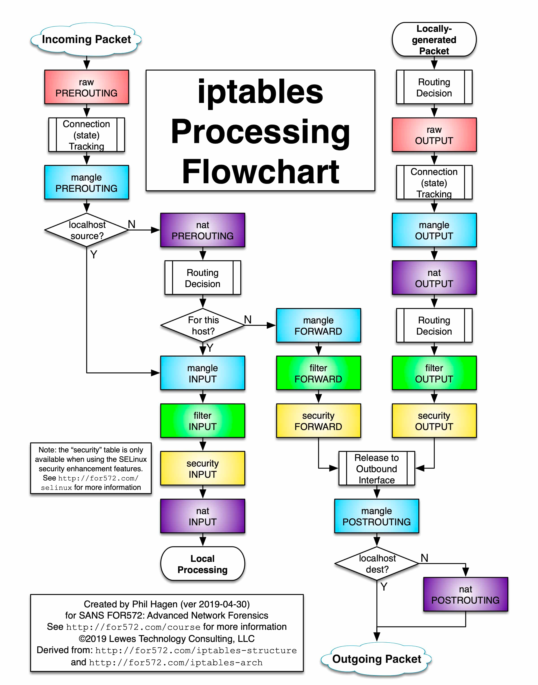
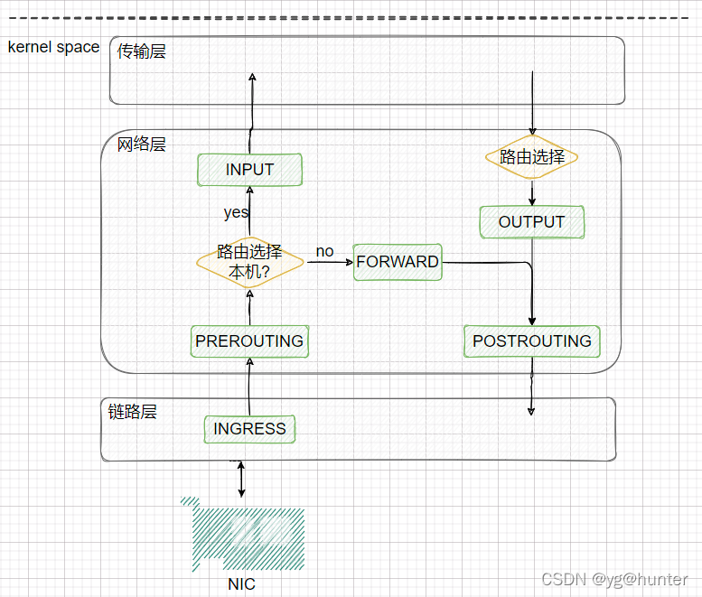
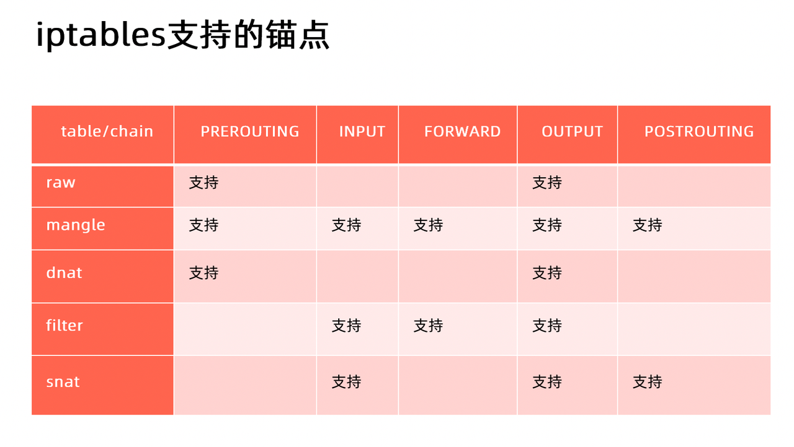

# iptables 简介

iptables 是 Linux 内核中的防火墙软件 netfilter 的管理工具，位于用户空间，同时也是 netfilter 的一部分。Netfilter 位于内核空间，不仅有网络地址转换的功能，也具备数据包内容修改、以及数据包过滤等防火墙功能。

在了解 Init 容器初始化的 iptables 之前，我们先来了解下 iptables 和规则配置。

下图展示了 iptables 调用链。

# iptables的链（chain）

1. 五个链（chain）及对应钩子:

- PREROUTING --> NF_INET_PRE_ROUTING
- INPUT  --> NF_INET_LOCAL_IN
- FORWARD --> NF_INET_FORWARD
- OUTPUT--> NF_INET_LOCAL_OUT
- POSTROUTING --> NF_INET_POST_ROUTING

下图展示了网络层五条链的位置:

2. 网络数据包的三种流转路径

- 从网络流入本机：PREROUTING --> INPUT-->localhost
- 从本机应用发出：localhost-->OUTPUT--> POSTROUTING
- 经本机转发：PREROUTING --> FORWARD --> POSTROUTING

# iptables的表

五张表（table）

- raw:关闭启用的连接跟踪机制，加快封包穿越防火墙速度
- mangle:修改数据标记位规则表
- nat:network address translation 地址转换规则表
- filter:过滤规则表，根据预定义的规则过滤符合条件的数据包，默认表
- security:用于强制访问控制(MAC)网络规则，由Linux安全模块(如SELinux)实现

# 理解 iptables 规则

https://wangchujiang.com/linux-command/c/iptables.html

# Reference
- https://jimmysong.io/blog/understanding-iptables/
- https://blog.csdn.net/weixin_42915431/article/details/122246807
- https://wangchujiang.com/linux-command/c/iptables.html