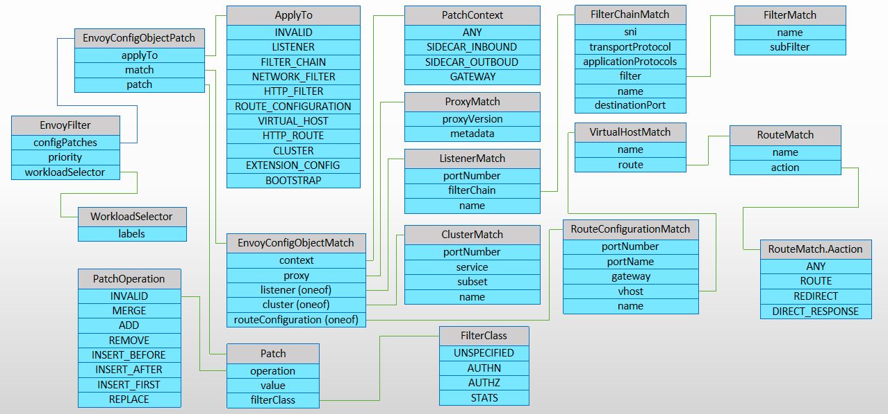
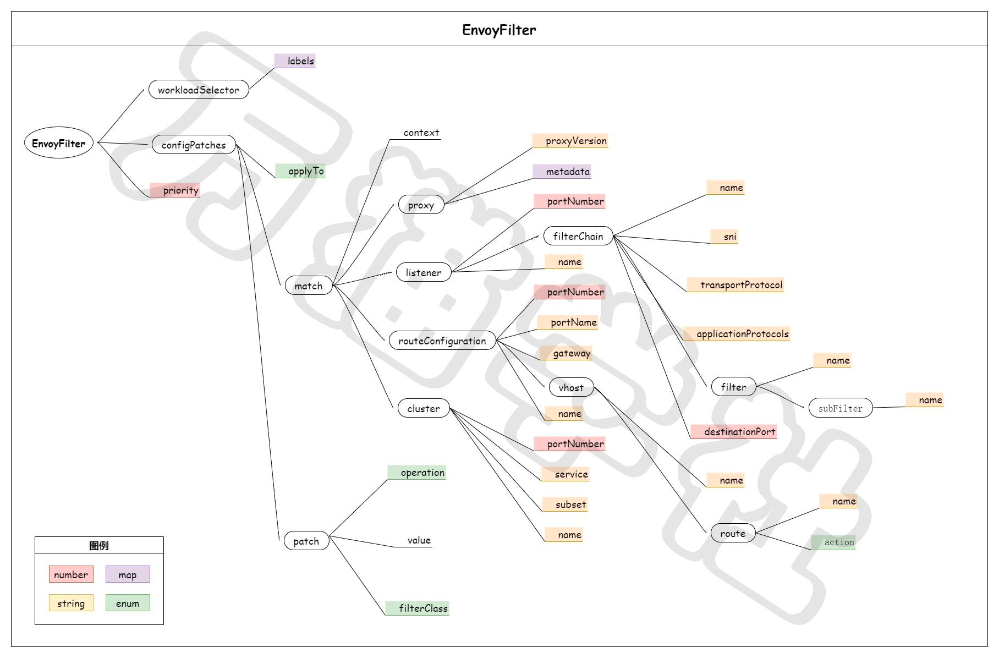
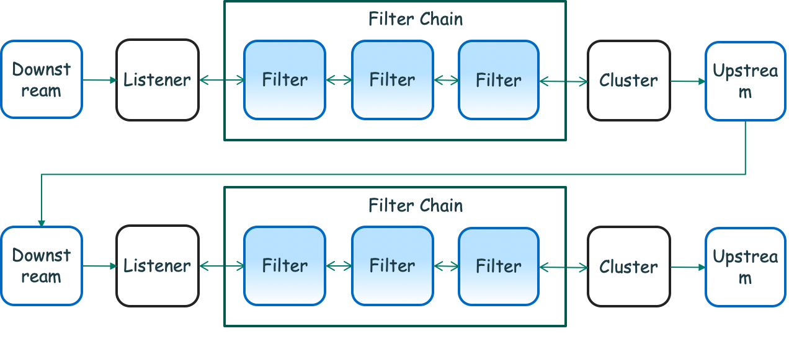
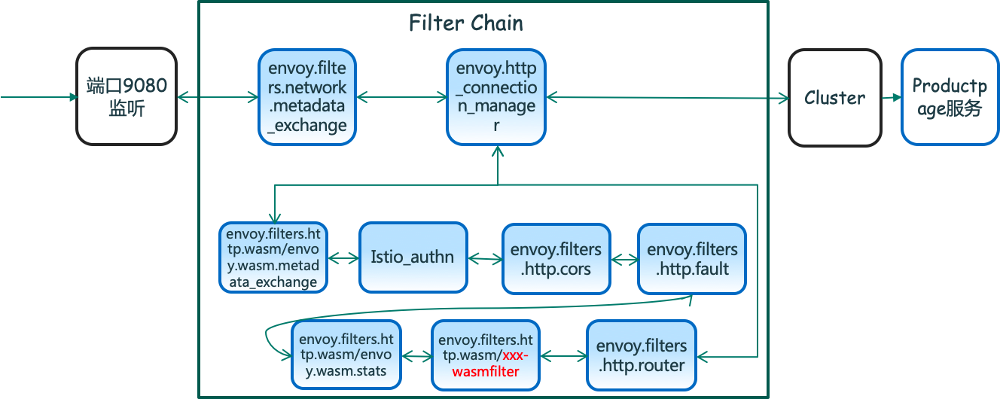

# EnvoyFilter

EnvoyFilter 提供了一种机制来定制 Istio Pilot 生成的 Envoy 配置。使用 EnvoyFilter 修改某些字段的值，添加特定的过滤器，甚至添加全新的侦听器、集群等。

EnvoyFilter 生效的顺序：
- 首先是配置在根命名空间中的所有 EnvoyFilter，
- 其次是配置在工作负载命名空间中的所有匹配的 EnvoyFilter

根命名空间(Root Namespace)： MeshConfig 中配置的  rootNamespace

> 注意： 
> - 当多个 EnvoyFilter 被绑定到给定命名空间中的相同工作负载时，将按照创建时间的顺序依次应用。如果有多个 EnvoyFilter 配置相互冲突，那么将无法确定哪个配置被应用。

> - 要将 EnvoyFilter 资源应用于系统中的所有工作负载（sidecar 和 gateway）上，请在 config 根命名空间中定义该资源，不要使用 workloadSelector。

> - 要将 EnvoyFilter 应用到系统中的所有工作负载（ sidecar 和网关）的时候，建议在配置根命名空间中定义，而不要使用 workloadSelector 。


## EnvoyFilter配置

<table><thead><tr><th data-spm-anchor-id="a2c6h.12873639.article-detail.i14.2f543e15PUMxIr">属性</th><th>数据类型</th><th>说明</th><th>是否必填</th></tr></thead><tbody><tr><td align="center">workloadSelector</td><td align="left">WorkloadSelector</td><td align="left">用于选择应用此补丁的pod或虚拟机</td><td align="center" data-spm-anchor-id="a2c6h.12873639.article-detail.i16.2f543e15PUMxIr">否</td></tr><tr><td align="center">configPatches</td><td align="left">EnvoyConfigObjectPatch[]</td><td align="left">具有匹配条件的补丁</td><td align="center">是</td></tr><tr><td align="center">priority</td><td align="left">int32</td><td align="left">定义了补丁集在上下文中应用顺序的优先级</td><td align="center">否</td></tr></tbody></table>

其中，如果 workloadSelector 没有被配置，此补丁将应用于相同名称空间中所有工作负载的实例； 
priority 的默认值为0，取值范围是[min-int32, max-int32]， priority 为负的补丁将在默认priority 之前处理，priority 为正的补丁将在默认priority 之后处理。

## EnvoyConfigObjectPatch配置

<table data-spm-anchor-id="a2c6h.12873639.article-detail.i20.2f543e15PUMxIr"><thead><tr><th data-spm-anchor-id="a2c6h.12873639.article-detail.i21.2f543e15PUMxIr">属性</th><th>数据类型</th><th>说明</th><th>是否必填</th></tr></thead><tbody><tr><td align="center">applyTo</td><td align="left">ApplyTo</td><td align="left" data-spm-anchor-id="a2c6h.12873639.article-detail.i18.2f543e15PUMxIr">指定在Envoy配置中应用补丁的位置</td><td align="center">否</td></tr><tr><td align="center">match</td><td align="left">EnvoyConfigObjectMatch</td><td align="left">用于匹配监听器、路由或集群</td><td align="center">否</td></tr><tr><td align="center">patch</td><td align="left">Patch</td><td align="left">与操作一起应用的补丁。</td><td align="center" data-spm-anchor-id="a2c6h.12873639.article-detail.i19.2f543e15PUMxIr">否</td></tr></tbody></table>

其中，ApplyTo可以配置的值有：

<table><thead><tr><th data-spm-anchor-id="a2c6h.12873639.article-detail.i24.2f543e15PUMxIr">名称</th><th>说明</th></tr></thead><tbody><tr><td align="center" data-spm-anchor-id="a2c6h.12873639.article-detail.i23.2f543e15PUMxIr">LISTENER</td><td align="left">将补丁应用于监听器。</td></tr><tr><td align="center">FILTER_CHAIN</td><td align="left">将补丁应用于过滤器链。</td></tr><tr><td align="center">NETWORK_FILTER</td><td align="left">应用补丁到网络过滤器链，修改现有的过滤器或添加一个新的过滤器。</td></tr><tr><td align="center">HTTP_FILTER</td><td align="left">将补丁应用于HTTP连接管理器中的HTTP过滤器链，以修改现有的过滤器或添加新的过滤器。</td></tr><tr><td align="center">ROUTE_CONFIGURATION</td><td align="left">将补丁应用于HTTP连接管理器内的Route配置。</td></tr><tr><td align="center">VIRTUAL_HOST</td><td align="left">将补丁应用于路由配置内部的虚拟主机。</td></tr><tr><td align="center">HTTP_ROUTE</td><td align="left">在路由配置中将补丁应用于匹配的虚拟主机内的路由对象。</td></tr><tr><td align="center">CLUSTER</td><td align="left">将补丁应用到集群。</td></tr><tr><td align="center">EXTENSION_CONFIG</td><td align="left">在ECDS输出中应用补丁或添加扩展配置。</td></tr><tr><td align="center">BOOTSTRAP</td><td align="left">将补丁应用于初始化配置。</td></tr></tbody></table>

## EnvoyFilter.Patch 配置

<table class="message-fields"><thead><tr><th>Field</th><th>Type</th><th>Description</th><th>Required</th></tr></thead><tbody><tr id="EnvoyFilter-Patch-operation"><td><code>operation</code></td><td><code><a href="#EnvoyFilter-Patch-Operation">Operation</a></code></td><td><p>Determines how the patch should be applied.</p></td><td>No</td></tr><tr id="EnvoyFilter-Patch-value"><td><code>value</code></td><td><code><a href="https://developers.google.com/protocol-buffers/docs/reference/google.protobuf#struct" target="_blank" rel="noopener">Struct</a><sup class="endnote-ref" aria-hidden="true">5</sup></code></td><td><p>The JSON config of the object being patched. This will be merged using
proto merge semantics with the existing proto in the path.</p></td><td>No</td></tr><tr id="EnvoyFilter-Patch-filter_class"><td><code>filterClass</code></td><td><code><a href="#EnvoyFilter-Patch-FilterClass">FilterClass</a></code></td><td><p>Determines the filter insertion order.</p></td><td>No</td></tr></tbody></table>

## EnvoyFilter.Patch.Operation 配置

<table class="enum-values"><thead><tr><th>Name</th><th>Description</th></tr></thead><tbody><tr id="EnvoyFilter-Patch-Operation-INVALID"><td><code>INVALID</code></td><td></td></tr><tr id="EnvoyFilter-Patch-Operation-MERGE"><td><code>MERGE</code></td><td><p>Merge the provided config with the generated config using
proto merge semantics. If you are specifying config in its
entirety, use <code>REPLACE</code> instead.</p></td></tr><tr id="EnvoyFilter-Patch-Operation-ADD"><td><code>ADD</code></td><td><p>Add the provided config to an existing list (of listeners,
clusters, virtual hosts, network filters, or http
filters). This operation will be ignored when <code>applyTo</code> is set
to <code>ROUTE_CONFIGURATION</code>, or <code>HTTP_ROUTE</code>.</p></td></tr><tr id="EnvoyFilter-Patch-Operation-REMOVE"><td><code>REMOVE</code></td><td><p>Remove the selected object from the list (of listeners,
clusters, virtual hosts, network filters, routes, or http
filters). Does not require a value to be specified. This
operation will be ignored when <code>applyTo</code> is set to
<code>ROUTE_CONFIGURATION</code>, or <code>HTTP_ROUTE</code>.</p></td></tr><tr id="EnvoyFilter-Patch-Operation-INSERT_BEFORE"><td><code>INSERT_BEFORE</code></td><td><p>Insert operation on an array of named objects. This operation
is typically useful only in the context of filters or routes,
where the order of elements matter. Routes should be ordered
based on most to least specific matching criteria since the
first matching element is selected. For clusters and virtual hosts,
order of the element in the array does not matter. Insert
before the selected filter or sub filter. If no filter is
selected, the specified filter will be inserted at the front
of the list.</p></td></tr><tr id="EnvoyFilter-Patch-Operation-INSERT_AFTER"><td><code>INSERT_AFTER</code></td><td><p>Insert operation on an array of named objects. This operation
is typically useful only in the context of filters or routes,
where the order of elements matter. Routes should be ordered
based on most to least specific matching criteria since the
first matching element is selected. For clusters and virtual hosts,
order of the element in the array does not matter. Insert
after the selected filter or sub filter. If no filter is
selected, the specified filter will be inserted at the end
of the list.</p></td></tr><tr id="EnvoyFilter-Patch-Operation-INSERT_FIRST"><td><code>INSERT_FIRST</code></td><td><p>Insert operation on an array of named objects. This operation
is typically useful only in the context of filters or routes,
where the order of elements matter. Routes should be ordered
based on most to least specific matching criteria since the
first matching element is selected. For clusters and virtual hosts,
order of the element in the array does not matter. Insert
first in the list based on the presence of selected filter or not.
This is specifically useful when you want your filter first in the
list based on a match condition specified in Match clause.</p></td></tr><tr id="EnvoyFilter-Patch-Operation-REPLACE"><td><code>REPLACE</code></td><td><p>Replace contents of a named filter with new contents.
<code>REPLACE</code> operation is only valid for <code>HTTP_FILTER</code> and
<code>NETWORK_FILTER</code>. If the named filter is not found, this operation
has no effect.</p></td></tr></tbody></table>

## EnvoyFilter.Patch.FilterClass 配置
<table class="enum-values"><thead><tr><th>Name</th><th>Description</th></tr></thead><tbody><tr id="EnvoyFilter-Patch-FilterClass-UNSPECIFIED"><td><code>UNSPECIFIED</code></td><td><p>Control plane decides where to insert the filter.
Do not specify <code>FilterClass</code> if the filter is independent of others.</p></td></tr><tr id="EnvoyFilter-Patch-FilterClass-AUTHN"><td><code>AUTHN</code></td><td><p>Insert filter after Istio authentication filters.</p></td></tr><tr id="EnvoyFilter-Patch-FilterClass-AUTHZ"><td><code>AUTHZ</code></td><td><p>Insert filter after Istio authorization filters.</p></td></tr><tr id="EnvoyFilter-Patch-FilterClass-STATS"><td><code>STATS</code></td><td><p>Insert filter before Istio stats filters.</p></td></tr></tbody></table>

## EnvoyFilter.PatchContext 配置

<table class="enum-values"><thead><tr><th>Name</th><th>Description</th></tr></thead><tbody><tr id="EnvoyFilter-PatchContext-ANY"><td><code>ANY</code></td><td><p>All listeners/routes/clusters in both sidecars and gateways.</p></td></tr><tr id="EnvoyFilter-PatchContext-SIDECAR_INBOUND"><td><code>SIDECAR_INBOUND</code></td><td><p>Inbound listener/route/cluster in sidecar.</p></td></tr><tr id="EnvoyFilter-PatchContext-SIDECAR_OUTBOUND"><td><code>SIDECAR_OUTBOUND</code></td><td><p>Outbound listener/route/cluster in sidecar.</p></td></tr><tr id="EnvoyFilter-PatchContext-GATEWAY"><td><code>GATEWAY</code></td><td><p>Gateway listener/route/cluster.</p></td></tr></tbody></table>


## CRD 的资源规范


## 思维导图



## envoy 配置实例

### 使用 EnvoyFilter 指定 Header 规则为首字母大写
Envoy 缺省会把 http header 的 key 转换为小写，例如有一个 http header Test-Upper-Case-Header: some-value，经过 envoy 代理后会变成 test-upper-case-header: some-value。这个在正常情况下没问题，RFC 2616 规范也说明了处理 HTTP Header 应该是大小写不敏感的。
Envoy 只支持两种规则：
- 全小写 (默认使用的规则)
- 首字母大写 (默认没有启用)

```yaml
apiVersion: networking.istio.io/v1alpha3
kind: EnvoyFilter
metadata:
  name: http-header-proper-case-words
  namespace: istio-system
spec:
  configPatches:
  - applyTo: NETWORK_FILTER # http connection manager is a filter in Envoy
    match:
      # context omitted so that this applies to both sidecars and gateways
      listener:
        name: XXX # 指定 cos 使用的listener name，可以从config_dump中查询到
        filterChain:
          filter:
            name: "envoy.http_connection_manager"
    patch:
      operation: MERGE
      value:
        name: "envoy.http_connection_manager"
        typed_config:
          "@type": "type.googleapis.com/envoy.config.filter.network.http_connection_manager.v2.HttpConnectionManager"
          http_protocol_options:
            header_key_format:
              proper_case_words: {}

```


### 从 nginx 切到 ingressgateway 

```yaml
apiVersion: networking.istio.io/v1alpha3
kind: EnvoyFilter
metadata:
  name: http-options
  namespace: istio-system
spec:
  configPatches:
  - applyTo: NETWORK_FILTER
    match:
      context: ANY
      listener:
        filterChain:
          filter:
            name: "envoy.http_connection_manager"
    patch:
      operation: MERGE
      value:
        typed_config:
          "@type": "type.googleapis.com/envoy.extensions.filters.network.http_connection_manager.v3.HttpConnectionManager"
          max_request_headers_kb: 96 # 96KB, 请求 header 最大限制
  - applyTo: HTTP_FILTER
    match:
      context: GATEWAY
      listener:
        filterChain:
          filter:
            name: "envoy.http_connection_manager"
    patch:
      operation: INSERT_BEFORE
      value:
        name: "envoy.filters.http.buffer"
        typed_config:
          '@type': "type.googleapis.com/envoy.extensions.filters.http.buffer.v3.Buffer"
          max_request_bytes: 1048576  # 1MB, 请求最大限制


```

### 

The example below declares a global default EnvoyFilter resource in the root namespace called istio-config, that adds a custom protocol filter on all sidecars in the system, for outbound port 9307. 
The filter should be added before the terminating tcp_proxy filter to take effect. 
In addition, it sets a 30s idle timeout for all HTTP connections in both gateways and sidecars.

```yaml
apiVersion: networking.istio.io/v1alpha3
kind: EnvoyFilter
metadata:
  name: custom-protocol
  namespace: istio-config # as defined in meshConfig resource.
spec:
  configPatches:
  - applyTo: NETWORK_FILTER
    match:
      context: SIDECAR_OUTBOUND # will match outbound listeners in all sidecars
      listener:
        portNumber: 9307
        filterChain:
          filter:
            name: "envoy.filters.network.tcp_proxy"
    patch:
      operation: INSERT_BEFORE
      value:
        # This is the full filter config including the name and typed_config section.
        name: "envoy.extensions.filters.network.mongo_proxy"
        typed_config:
          "@type": "type.googleapis.com/envoy.extensions.filters.network.mongo_proxy.v3.MongoProxy"
          ...
  - applyTo: NETWORK_FILTER # http connection manager is a filter in Envoy
    match:
      # context omitted so that this applies to both sidecars and gateways
      listener:
        filterChain:
          filter:
            name: "envoy.filters.network.http_connection_manager"
    patch:
      operation: MERGE
      value:
        name: "envoy.filters.network.http_connection_manager"
        typed_config:
          "@type": "type.googleapis.com/envoy.extensions.filters.network.http_connection_manager.v3.HttpConnectionManager"
          common_http_protocol_options:
            idle_timeout: 30s


```

### 添加 Lua Filter 和  CLUSTER

The following example enables Envoy’s Lua filter for all inbound HTTP calls arriving at service port 8080 of the reviews service pod with labels “app: reviews”, 
in the bookinfo namespace. The lua filter calls out to an external service internal.org.net:8888 that requires a special cluster definition in envoy. 
The cluster is also added to the sidecar as part of this configuration.


```yaml
apiVersion: networking.istio.io/v1alpha3
kind: EnvoyFilter
metadata:
  name: reviews-lua
  namespace: bookinfo
spec:
  workloadSelector:
    labels:
      app: reviews
  configPatches:
    # The first patch adds the lua filter to the listener/http connection manager
  - applyTo: HTTP_FILTER
    match:
      context: SIDECAR_INBOUND
      listener:
        portNumber: 8080
        filterChain:
          filter:
            name: "envoy.filters.network.http_connection_manager"
            subFilter:
              name: "envoy.filters.http.router"
    patch:
      operation: INSERT_BEFORE
      value: # lua filter specification
       name: envoy.filters.http.lua
       typed_config:
          "@type": "type.googleapis.com/envoy.extensions.filters.http.lua.v3.Lua"
          inlineCode: |
            function envoy_on_request(request_handle)
              -- Make an HTTP call to an upstream host with the following headers, body, and timeout.
              local headers, body = request_handle:httpCall(
               "lua_cluster",
               {
                [":method"] = "POST",
                [":path"] = "/acl",
                [":authority"] = "internal.org.net"
               },
              "authorize call",
              5000)
            end
  # The second patch adds the cluster that is referenced by the lua code
  # cds match is omitted as a new cluster is being added
  - applyTo: CLUSTER
    match:
      context: SIDECAR_OUTBOUND
    patch:
      operation: ADD
      value: # cluster specification
        name: "lua_cluster"
        type: STRICT_DNS
        connect_timeout: 0.5s
        lb_policy: ROUND_ROBIN
        load_assignment:
          cluster_name: lua_cluster
          endpoints:
          - lb_endpoints:
            - endpoint:
                address:
                  socket_address:
                    protocol: TCP
                    address: "internal.org.net"
                    port_value: 8888

```

### Ingressgateway 指定 SNI 配置

The following example overwrites certain fields (HTTP idle timeout and X-Forward-For trusted hops) in the HTTP connection manager in a listener on the ingress gateway in istio-system namespace for the SNI host app.example.com:

```yaml
apiVersion: networking.istio.io/v1alpha3
kind: EnvoyFilter
metadata:
  name: hcm-tweaks
  namespace: istio-system
spec:
  workloadSelector:
    labels:
      istio: ingressgateway
  configPatches:
  - applyTo: NETWORK_FILTER # http connection manager is a filter in Envoy
    match:
      context: GATEWAY
      listener:
        filterChain:
          sni: app.example.com
          filter:
            name: "envoy.filters.network.http_connection_manager"
    patch:
      operation: MERGE
      value:
        typed_config:
          "@type": "type.googleapis.com/envoy.extensions.filters.network.http_connection_manager.v3.HttpConnectionManager"
          xff_num_trusted_hops: 5
          common_http_protocol_options:
            idle_timeout: 30s

```

### The following example inserts an http ext_authz filter in the myns namespace.

```yaml
apiVersion: networking.istio.io/v1alpha3
kind: EnvoyFilter
metadata:
  name: myns-ext-authz
  namespace: myns
spec:
  configPatches:
  - applyTo: HTTP_FILTER
    match:
      context: SIDECAR_INBOUND
    patch:
      operation: ADD
      filterClass: AUTHZ # This filter will run *after* the Istio authz filter.
      value:
        name: envoy.filters.http.ext_authz
        typed_config:
          "@type": type.googleapis.com/envoy.extensions.filters.http.ext_authz.v3.ExtAuthz
          grpc_service:
            envoy_grpc:
              cluster_name: acme-ext-authz
            initial_metadata:
            - key: foo
              value: myauth.acme # required by local ext auth server.

```

### Skywalking trace

```yaml
apiVersion: networking.istio.io/v1alpha3
kind: EnvoyFilter
metadata:
  name: higress-trace
  namespace: higress-system
spec:
  configPatches:
    - applyTo: NETWORK_FILTER
      match:
        context: GATEWAY
        listener:
          filterChain:
            filter:
              name: envoy.filters.network.http_connection_manager
      patch:
        operation: MERGE
        value:
          name: envoy.filters.network.http_connection_manager
          typed_config:
            '@type': type.googleapis.com/envoy.extensions.filters.network.http_connection_manager.v3.HttpConnectionManager
            tracing:
              provider:
                name: envoy.tracers.skywalking
                typed_config:
                  '@type': type.googleapis.com/envoy.config.trace.v3.SkyWalkingConfig
                  client_config:
                    service_name: gateway
                  grpc_service:
                    envoy_grpc:
                      cluster_name: outbound|11800||skywalking-oap-server.op-system.svc.cluster.local
                    timeout: 0.250s
              random_sampling:
                value: 100
    - applyTo: HTTP_FILTER
      match:
        context: GATEWAY
        listener:
          filterChain:
            filter:
              name: envoy.filters.network.http_connection_manager
              subFilter:
                name: envoy.filters.http.router
      patch:
        operation: MERGE
        value:
          name: envoy.filters.http.router
          typed_config:
            '@type': type.googleapis.com/envoy.extensions.filters.http.router.v3.Router
            start_child_span: true
```

# istio Filter Chain

Envoy Filter 分为三类：
- Listener Filter：用于操作处理 L4 连接中的元数据。
- Network Filter：用于操作处理 L4 连接中的原始数据。
- HTTP Filter：用于操作处理 L7 连接中的 HTTP 请求与响应。

每个监听器同样会定义一组位于数据路径中的 Filter，并形成一组过滤器链 Filter Chain。通过这样的一组过滤器，用户可以配置 Envoy 来针对出站流量做特定的任务，包括数据协议处理、生成调用的统计信息、执行 RBAC 权限等




为了更好地理解这些 Envoy Filter 以及 Filter Chain，下面来看一个实际的例子。这个就是 Istio 官方示例 bookinfo 中的第一个服务 productpage。首先, productpage pod 中 Envoy Proxy 配置了一个监听 9080 端口的监听器，进入这个 pod 的端口 9080 上的流量请求都会被拦截到这个 proxy 中，然后请求就会经过这些 Filter Chain 进行处理。具体如下：

- 第一个 filter 是 envoy.filters.network.metadata_exchange，它的主要作用顾名思义，用来在 filter 之间交换元数据。

- 第二个 filter: envoy.http_connection_manager，它下面通常会有以下几个跟 http 特定的 filter，包括：

  - envoy.filters.http.wasm/envoy.wasm.metadata_exchange（用于元数据交互）

  - Istio_authn filter（用于授权认证）

  - envoy.filters.http.cors（处理跨域资源共享的 filter）

  - envoy.filters.http.fault（故障注入过滤器，可以用来测试微服务架构中容错能力，用户可以自定义错误代码来实现延时注入或者终止请求，在不同的失败场景下提供错误处理的能力，例如服务失败、服务过载、服务高延时等情况，这个也是较为常用的 filter）

  - envoy.filters.http.wasm/envoy.wasm.stats、envoy.filters.http.wasm/xxx-wasmfilter（用户自定义的 wasm 实现的filter）

  - envoy.filters.http.router（实现 HTTP 转发，几乎所有 HTTP 场景下都会使用到这一过滤器）

备注：可以通过请求这个 URL 地址获取配置信息：kubectl exec -it [productpage-xxx] -c istio-proxy curl localhost:15000/config_dump



# Wasm Filter


# Wasm Operator


# Reference
* https://istio.io/latest/zh/docs/reference/config/networking/envoy-filter/
* https://developer.aliyun.com/article/994916
* https://www.cnblogs.com/alisystemsoftware/p/14487723.html