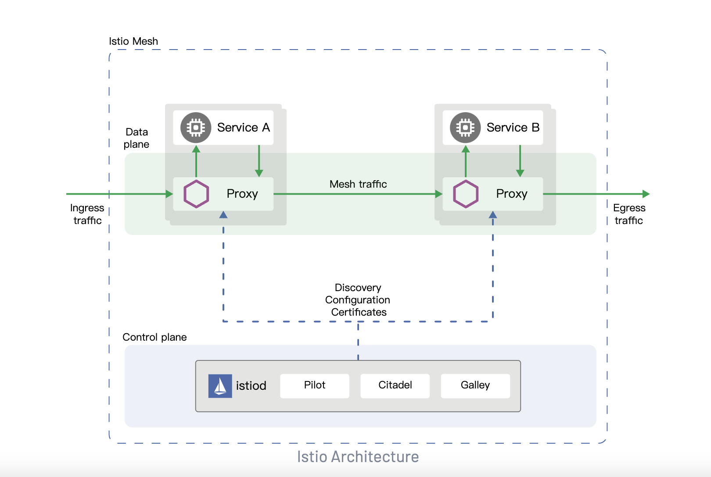
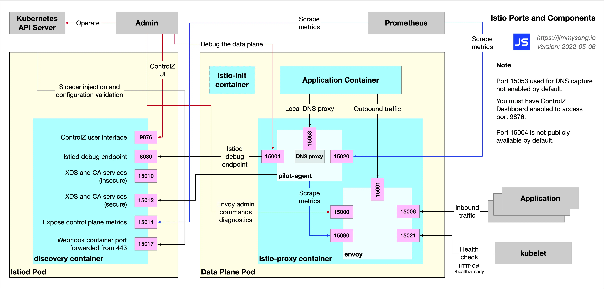
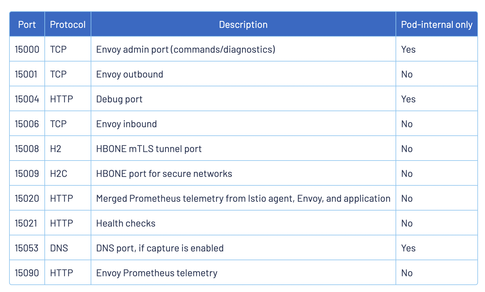
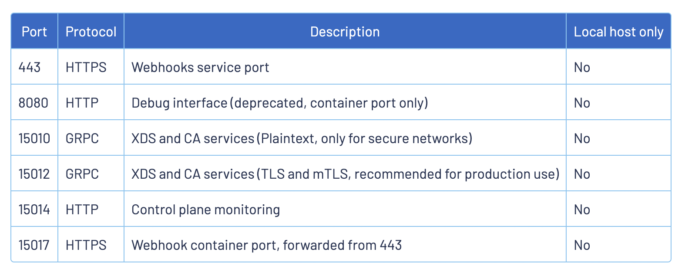

# istio

# get started
1. [文档](https://istio.io/latest/zh/docs/)
2. [install](https://istio.io/latest/zh/docs/setup/install/)

## 使用 Istioctl 安装
1. get istioctl

```shell
https://github.com/istio/istio/releases/tag/1.19.0
```

2. install

```shell
istioctl install --set profile=demo
```

3. 查看安装Pods

```shell
$  kubectl get pods -n istio-system
   NAME                                   READY   STATUS    RESTARTS   AGE
   istio-egressgateway-575466f5bb-xbv8d   1/1     Running   0          48s
   istio-ingressgateway-cb9c6b49d-x6zgx   1/1     Running   0          48s
   istiod-6fbbf67d58-5tlwc                1/1     Running   0          2m11s
```
4. 查看安装CRD

```shell
$ kubectl get crd | grep istio
authorizationpolicies.security.istio.io               2023-04-29T10:02:00Z
destinationrules.networking.istio.io                  2023-04-29T10:02:00Z
envoyfilters.networking.istio.io                      2023-04-29T10:02:00Z
gateways.networking.istio.io                          2023-04-29T10:02:00Z
istiooperators.install.istio.io                       2023-04-29T10:02:00Z
peerauthentications.security.istio.io                 2023-04-29T10:02:00Z
proxyconfigs.networking.istio.io                      2023-04-29T10:02:00Z
requestauthentications.security.istio.io              2023-04-29T10:02:00Z
serviceentries.networking.istio.io                    2023-04-29T10:02:01Z
sidecars.networking.istio.io                          2023-04-29T10:02:01Z
telemetries.telemetry.istio.io                        2023-04-29T10:02:01Z
virtualservices.networking.istio.io                   2023-04-29T10:02:01Z
wasmplugins.extensions.istio.io                       2023-04-29T10:02:01Z
workloadentries.networking.istio.io                   2023-04-29T10:02:01Z
workloadgroups.networking.istio.io                    2023-04-29T10:02:01Z
```

5. 卸载 Istio
要从集群中完整卸载 Istio，运行下面命令：

```shell
$ istioctl uninstall --purge
```

## Install Addons

```shell
$ kubectl apply -f samples/addons/grafna.yaml
$ kubectl apply -f samples/addons/jaeger.yaml
$ kubectl apply -f samples/addons/kaili.yaml
$ kubectl apply -f samples/addons/prometheus.yaml
```


## 需要开启 Envoy 访问日志，执行以下命令修改 istio 配置

  ```shell
  kubectl -n istio-system edit configmap istio
  ```
  
  ```yaml
  data:
  mesh: |-
    accessLogEncoding: JSON
    accessLogFile: /dev/stdout
  ```

- accessLogEncoding表示 accesslog 输出格式，Istio 预定义了 TEXT 和 JSON 两种日志输出格式。 默认使用 TEXT，通常改成 JSON 以提升可读性；
- accessLogFile:表示 accesslog 输出位置，通常指定到 /dev/stdout (标准输出)，以便使用 kubectl logs 来查看日志。


## 安装 httpbin 测试

- Start the httpbin service inside the Istio service mesh:
    ```bash
    kubectl create namespace istio-demo
    kubectl label namespace istio-demo istio-injection=enabled --overwrite
    kubectl apply -f samples/httpbin/httpbin.yaml -n istio-demo
    ```

- Otherwise manually inject the sidecars before applying:

    ```bash
    kubectl apply -f <(istioctl kube-inject -f samples/httpbin/httpbin.yaml) -n istio-demo
    ```

- apply gateway to access httpbin

  ```shell
  kubectl apply -f samples/httpbin/httpbin-gateway.yaml -n istio-demo
  ```
  
- apply sleep pod
  ```shell
  kubectl apply -f samples/sleep/sleep.yaml -n istio-demo
  ```
- test 
  ```shell
   export SLEEP_POD=$(kubectl get pods -l app=sleep -o 'jsonpath={.items[0].metadata.name}' -n istio-demo)
   kubectl exec "$SLEEP_POD" -n istio-demo -c sleep -- curl -sS http://httpbin:8000/headers
  
  {"Accept":"*/*","User-Agent":"curl/8.0.1-DEV","X-B3-Parentspanid":"b30e5a52126e8a3a","X-B3-Sampled":"1","X-B3-Spanid":"32e1a5ae744f591f","X-B3-Traceid":"2d88aa543462b4e1b30e5a52126e8a3a","X-Envoy-Attempt-Count":"1","X-Forwarded-Client-Cert":"By=spiffe://cluster.local/ns/istio-demo/sa/httpbin;Hash=3cb80bdef2f0cd5c2ecb03244a378fb1faecfc192667bd0cb67886d9f7341b80;Subject=\"\";URI=spiffe://cluster.local/ns/istio-demo/sa/sleep","X-Forwarded-Proto":"http","X-Request-Id":"65508395-36bf-9ac6-98f2-72ad5400f54a"}%   

  ```
- check sleep pod envoy proxy logs
  ```shell
  kubectl logs -l app=sleep -n istio-demo -c istio-proxy
  
  {"route_name":"default","response_flags":"-","response_code":200,"authority":"httpbin:8000","user_agent":"curl/8.0.1-DEV","method":"GET","bytes_sent":508,"request_id":"6618b006-b862-927e-ac43-aaf4f2026c0d","bytes_received":0,"downstream_remote_address":"10.10.241.84:40658","x_forwarded_for":null,"upstream_cluster":"outbound|8000||httpbin.istio-demo.svc.cluster.local","upstream_transport_failure_reason":null,"path":"/headers","start_time":"2023-05-02T01:45:04.154Z","protocol":"HTTP/1.1","connection_termination_details":null,"upstream_service_time":"11","duration":12,"upstream_local_address":"10.10.241.84:58514","upstream_host":"10.10.241.82:80","response_code_details":"via_upstream","downstream_local_address":"10.97.94.170:8000","requested_server_name":null}

  ```

- check httpbin pod envoy proxy logs
  ```shell
  kubectl logs -l app=httpbin -n istio-demo -c istio-proxy
  
  {"response_flags":"-","x_forwarded_for":null,"start_time":"2023-05-02T01:45:04.158Z","connection_termination_details":null,"path":"/headers","upstream_cluster":"inbound|80||","user_agent":"curl/8.0.1-DEV","upstream_transport_failure_reason":null,"response_code_details":"via_upstream","requested_server_name":"outbound_.8000_._.httpbin.istio-demo.svc.cluster.local","response_code":200,"upstream_host":"10.10.241.82:80","duration":2,"route_name":"default","upstream_local_address":"127.0.0.6:56619","bytes_received":0,"protocol":"HTTP/1.1","authority":"httpbin:8000","downstream_remote_address":"10.10.241.84:58514","method":"GET","bytes_sent":508,"request_id":"6618b006-b862-927e-ac43-aaf4f2026c0d","downstream_local_address":"10.10.241.82:80","upstream_service_time":"1"}

  ```
  
# 架构

## 概览

Istio 服务网格从逻辑上分为数据平面和控制平面。

- 数据平面 由一组智能代理（Envoy）组成，被部署为 Sidecar。这些代理负责协调和控制微服务之间的所有网络通信。它们还收集和报告所有网格流量的遥测数据。

- 控制平面 管理并配置代理来进行流量路由。

下图展示了组成每个平面的不同组件：



### 组件

#### Envoy

Istio 使用 Envoy 代理的扩展版本。Envoy 是用 C++ 开发的高性能代理，用于协调服务网格中所有服务的入站和出站流量。Envoy 代理是唯一与数据平面流量交互的 Istio 组件。

Envoy 代理被部署为服务的 Sidecar，在逻辑上为服务增加了 Envoy 的许多内置特性，例如：

- 动态服务发现
- 负载均衡
- TLS 终端
- HTTP/2 与 gRPC 代理
- 熔断器
- 健康检查
- 基于百分比流量分割的分阶段发布
- 故障注入
- 丰富的指标

由 Envoy 代理启用的一些 Istio 的功能和任务包括：

- 流量控制功能：通过丰富的 HTTP、gRPC、WebSocket 和 TCP 流量路由规则来执行细粒度的流量控制。
- 网络弹性特性：重试设置、故障转移、熔断器和故障注入。
- 安全性和身份认证特性：执行安全性策略，并强制实行通过配置 API 定义的访问控制和速率限制。
- 基于 WebAssembly 的可插拔扩展模型，允许通过自定义策略执行和生成网格流量的遥测。


### Istiod

- istiod
  - 服务发现
  - 配置
  - 证书管理

- Istiod 将控制流量行为的高级路由规则转换为 Envoy 特定的配置，并在运行时将其传播给 Sidecar。Pilot 提取了特定平台的服务发现机制，并将其综合为一种标准格式，任何符合 Envoy API 的 Sidecar 都可以使用。

- Istiod 安全通过内置的身份和凭证管理，实现了强大的服务对服务和终端用户认证。

- Istiod 充当证书授权（CA），并生成证书以允许在数据平面中进行安全的 mTLS 通信。


## 项目代码

### 顶层目录

```shell

(base) ➜  istio git:(source-1.17.2) tree . -L 1
├── bin
├── cni
├── common
├── docker
├── go.mod
├── go.sum
├── istio.deps
├── istioctl
├── licenses
├── logo
├── manifests
├── operator
├── pilot
├── pkg
├── prow
├── release
├── releasenotes
├── samples
├── security
├── tests
└── tools

18 directories, 13 files

```

- cni, istioctl, operator, pilot 目录分别包含同名相应模块的代码。下面的 cmd 是模块下相应二进制的编译入口，cmd 下面的 pkg 是 cmd 中的代码需要调用的依赖逻辑。
- 多个模块共同依赖的一些逻辑会放到外层的 pkg 目录下。
- security 是 istio 安全模块，构建零信任网络

### pilot 

Pilot 是最核心的模块，有 pilot-agent 和 pilot-discovery 两个二进制:

```shell
pilot
├── cmd
│   ├── pilot-agent
│   └── pilot-discovery
```

- pilot-discovery 就是 "istiod"，即 istio 控制面。
- pilot-agent 是连接 istiod (控制面) 和 envoy (数据面) 之间的纽带，主要负责拉起和管理数据面进程。


pilot-discovery(istiod) <--> pliot-agent <---> Envoy 


## 组件

```shell
(base) ➜  k8s-learning git:(main) ✗ kubectl get pods -n istio-system

NAME                                   READY   STATUS    RESTARTS   AGE
istio-egressgateway-575466f5bb-xbv8d   1/1     Running   0          46h
istio-ingressgateway-cb9c6b49d-x6zgx   1/1     Running   0          46h
istiod-6fbbf67d58-5tlwc                1/1     Running   0          46h

```

有三个核心Pod:
- istiod
- ingressgateway
- egressgateway


## ingressgateway 

```shell
(base) ➜  k8s-learning git:(main) ✗ kubectl describe pod istio-ingressgateway-cb9c6b49d-x6zgx -n istio-system

Name:         istio-ingressgateway-cb9c6b49d-x6zgx
Namespace:    istio-system
Priority:     0
Node:         master01/192.168.64.16
Start Time:   Sat, 29 Apr 2023 18:03:24 +0800
Labels:       app=istio-ingressgateway
              chart=gateways
              heritage=Tiller
              install.operator.istio.io/owning-resource=unknown
              istio=ingressgateway
              istio.io/rev=default
              operator.istio.io/component=IngressGateways
              pod-template-hash=cb9c6b49d
              release=istio
              service.istio.io/canonical-name=istio-ingressgateway
              service.istio.io/canonical-revision=latest
              sidecar.istio.io/inject=false
Annotations:  cni.projectcalico.org/containerID: 0168393a6c023d87f5cfb6d1cba3da3850d9269a5d41887e2ca9d6bbb439ce81
              cni.projectcalico.org/podIP: 10.10.241.73/32
              cni.projectcalico.org/podIPs: 10.10.241.73/32
              prometheus.io/path: /stats/prometheus
              prometheus.io/port: 15020
              prometheus.io/scrape: true
              sidecar.istio.io/inject: false
Status:       Running
IP:           10.10.241.73
IPs:
  IP:           10.10.241.73
Controlled By:  ReplicaSet/istio-ingressgateway-cb9c6b49d
Containers:
  istio-proxy:
    Container ID:  containerd://81a3db62892613845cb3e10ffab56acc77b197df07bafd704e9f79f755a3a1c8
    Image:         docker.io/istio/proxyv2:1.17.2
    Image ID:      docker.io/istio/proxyv2@sha256:f41745ee1183d3e70b10e82c727c772bee9ac3907fea328043332aaa90d7aa18
    Ports:         15021/TCP, 8080/TCP, 8443/TCP, 31400/TCP, 15443/TCP, 15090/TCP
    Host Ports:    0/TCP, 0/TCP, 0/TCP, 0/TCP, 0/TCP, 0/TCP
    Args:
      proxy
      router
      --domain
      $(POD_NAMESPACE).svc.cluster.local
      --proxyLogLevel=warning
      --proxyComponentLogLevel=misc:error
      --log_output_level=default:info
    State:          Running
      Started:      Sat, 29 Apr 2023 18:03:52 +0800
    Ready:          True
    Restart Count:  0
    Limits:
      cpu:     2
      memory:  1Gi
    Requests:
      cpu:      10m
      memory:   40Mi
    Readiness:  http-get http://:15021/healthz/ready delay=1s timeout=1s period=2s #success=1 #failure=30
    Environment:
      JWT_POLICY:                   third-party-jwt
      PILOT_CERT_PROVIDER:          istiod
      CA_ADDR:                      istiod.istio-system.svc:15012
      NODE_NAME:                     (v1:spec.nodeName)
      POD_NAME:                     istio-ingressgateway-cb9c6b49d-x6zgx (v1:metadata.name)
      POD_NAMESPACE:                istio-system (v1:metadata.namespace)
      INSTANCE_IP:                   (v1:status.podIP)
      HOST_IP:                       (v1:status.hostIP)
      SERVICE_ACCOUNT:               (v1:spec.serviceAccountName)
      ISTIO_META_WORKLOAD_NAME:     istio-ingressgateway
      ISTIO_META_OWNER:             kubernetes://apis/apps/v1/namespaces/istio-system/deployments/istio-ingressgateway
      ISTIO_META_MESH_ID:           cluster.local
      TRUST_DOMAIN:                 cluster.local
      ISTIO_META_UNPRIVILEGED_POD:  true
      ISTIO_META_CLUSTER_ID:        Kubernetes
      ISTIO_META_NODE_NAME:          (v1:spec.nodeName)
    Mounts:
      /etc/istio/config from config-volume (rw)
      /etc/istio/ingressgateway-ca-certs from ingressgateway-ca-certs (ro)
      /etc/istio/ingressgateway-certs from ingressgateway-certs (ro)
      /etc/istio/pod from podinfo (rw)
      /etc/istio/proxy from istio-envoy (rw)
      /var/lib/istio/data from istio-data (rw)
      /var/run/secrets/credential-uds from credential-socket (rw)
      /var/run/secrets/istio from istiod-ca-cert (rw)
      /var/run/secrets/kubernetes.io/serviceaccount from kube-api-access-2j2jm (ro)
      /var/run/secrets/tokens from istio-token (ro)
      /var/run/secrets/workload-spiffe-credentials from workload-certs (rw)
      /var/run/secrets/workload-spiffe-uds from workload-socket (rw)
Conditions:
  Type              Status
  Initialized       True 
  Ready             True 
  ContainersReady   True 
  PodScheduled      True 
Volumes:
  workload-socket:
    Type:       EmptyDir (a temporary directory that shares a pod's lifetime)
    Medium:     
    SizeLimit:  <unset>
  credential-socket:
    Type:       EmptyDir (a temporary directory that shares a pod's lifetime)
    Medium:     
    SizeLimit:  <unset>
  workload-certs:
    Type:       EmptyDir (a temporary directory that shares a pod's lifetime)
    Medium:     
    SizeLimit:  <unset>
  istiod-ca-cert:
    Type:      ConfigMap (a volume populated by a ConfigMap)
    Name:      istio-ca-root-cert
    Optional:  false
  podinfo:
    Type:  DownwardAPI (a volume populated by information about the pod)
    Items:
      metadata.labels -> labels
      metadata.annotations -> annotations
  istio-envoy:
    Type:       EmptyDir (a temporary directory that shares a pod's lifetime)
    Medium:     
    SizeLimit:  <unset>
  istio-data:
    Type:       EmptyDir (a temporary directory that shares a pod's lifetime)
    Medium:     
    SizeLimit:  <unset>
  istio-token:
    Type:                    Projected (a volume that contains injected data from multiple sources)
    TokenExpirationSeconds:  43200
  config-volume:
    Type:      ConfigMap (a volume populated by a ConfigMap)
    Name:      istio
    Optional:  true
  ingressgateway-certs:
    Type:        Secret (a volume populated by a Secret)
    SecretName:  istio-ingressgateway-certs
    Optional:    true
  ingressgateway-ca-certs:
    Type:        Secret (a volume populated by a Secret)
    SecretName:  istio-ingressgateway-ca-certs
    Optional:    true
  kube-api-access-2j2jm:
    Type:                    Projected (a volume that contains injected data from multiple sources)
    TokenExpirationSeconds:  3607
    ConfigMapName:           kube-root-ca.crt
    ConfigMapOptional:       <nil>
    DownwardAPI:             true
QoS Class:                   Burstable
Node-Selectors:              <none>
Tolerations:                 node.kubernetes.io/not-ready:NoExecute op=Exists for 300s
                             node.kubernetes.io/unreachable:NoExecute op=Exists for 300s
Events:                      <none>

```

可以得到以下信息:

1. Pod 由 istio-ingressgateway 启动

```shell
(base) ➜  k8s-learning git:(main) ✗ kubectl get deployment istio-ingressgateway -n istio-system

NAME                   READY   UP-TO-DATE   AVAILABLE   AGE
istio-ingressgateway   1/1     1            1           47h

```
2. 对应容器镜像

```shell
docker.io/istio/proxyv2:1.17.2
```
3. 启动参数

```shell
Args:
      proxy
      router
      --domain
      $(POD_NAMESPACE).svc.cluster.local
      --proxyLogLevel=warning
      --proxyComponentLogLevel=misc:error
      --log_output_level=default:info
```

4. 环境变量 ENV: 

```shell
Environment:
      JWT_POLICY:                   third-party-jwt
      PILOT_CERT_PROVIDER:          istiod
      CA_ADDR:                      istiod.istio-system.svc:15012
      NODE_NAME:                     (v1:spec.nodeName)
      POD_NAME:                     istio-ingressgateway-cb9c6b49d-x6zgx (v1:metadata.name)
      POD_NAMESPACE:                istio-system (v1:metadata.namespace)
      INSTANCE_IP:                   (v1:status.podIP)
      HOST_IP:                       (v1:status.hostIP)
      SERVICE_ACCOUNT:               (v1:spec.serviceAccountName)
      ISTIO_META_WORKLOAD_NAME:     istio-ingressgateway
      ISTIO_META_OWNER:             kubernetes://apis/apps/v1/namespaces/istio-system/deployments/istio-ingressgateway
      ISTIO_META_MESH_ID:           cluster.local
      TRUST_DOMAIN:                 cluster.local
      ISTIO_META_UNPRIVILEGED_POD:  true
      ISTIO_META_CLUSTER_ID:        Kubernetes
      ISTIO_META_NODE_NAME:          (v1:spec.nodeName)
```
5. Annotations:

```shell
   cni.projectcalico.org/containerID: 0168393a6c023d87f5cfb6d1cba3da3850d9269a5d41887e2ca9d6bbb439ce81
   cni.projectcalico.org/podIP: 10.10.241.73/32
   cni.projectcalico.org/podIPs: 10.10.241.73/32
   prometheus.io/path: /stats/prometheus
   prometheus.io/port: 15020
   prometheus.io/scrape: true
   sidecar.istio.io/inject: false
```

6. Mounts

```shell
Mounts:
      /etc/istio/config from config-volume (rw)
      /etc/istio/ingressgateway-ca-certs from ingressgateway-ca-certs (ro)
      /etc/istio/ingressgateway-certs from ingressgateway-certs (ro)
      /etc/istio/pod from podinfo (rw)
      /etc/istio/proxy from istio-envoy (rw)
      /var/lib/istio/data from istio-data (rw)
      /var/run/secrets/credential-uds from credential-socket (rw)
      /var/run/secrets/istio from istiod-ca-cert (rw)
      /var/run/secrets/kubernetes.io/serviceaccount from kube-api-access-2j2jm (ro)
      /var/run/secrets/tokens from istio-token (ro)
      /var/run/secrets/workload-spiffe-credentials from workload-certs (rw)
      /var/run/secrets/workload-spiffe-uds from workload-socket (rw)
```

这里包括 ca-certs, certs, token, serviceaccount, spiffe等后面在 istio 安全与零信任网络具体说明。


7. svc

```shell
(base) ➜  k8s-learning git:(main) ✗ kubectl get svc -n istio-system | grep ingressgateway
istio-ingressgateway   LoadBalancer   10.98.130.245    <pending>     15021:31829/TCP,80:32603/TCP,443:30221/TCP,31400:31870/TCP,15443:31806/TCP   47h
(
```

8. 测试 ingressgateway

查看 ingressgateway，本地测试这里用 nodePort 来暴露访问 ingressgateway, 获取 name == http2 暴露端口

```shell
export INGRESS_NAME=istio-ingressgateway
export INGRESS_NS=istio-system
export INGRESS_HOST=$(kubectl get po -l istio=ingressgateway -n "${INGRESS_NS}" -o jsonpath='{.items[0].status.hostIP}')
export INGRESS_PORT=$( kubectl get svc istio-ingressgateway -n istio-system -o jsonpath='{.spec.ports[?(@.name=="http2")].nodePort}' )
export SECURE_INGRESS_PORT=$(kubectl -n "${INGRESS_NS}" get service "${INGRESS_NAME}" -o jsonpath='{.spec.ports[?(@.name=="https")].nodePort}')
export TCP_INGRESS_PORT=$(kubectl -n "${INGRESS_NS}" get service "${INGRESS_NAME}" -o jsonpath='{.spec.ports[?(@.name=="tcp")].nodePort}')
```

然后通过 nodeIP + Ingress_PORT 来访问 ingressgateway 入口

- 使用 curl 访问 httpbin 服务：

  ```shell
  $ curl -s -H "Host:httpbin.example.com" "http://$INGRESS_HOST:$INGRESS_PORT/hostname"
  
  "httpbin-798dbb9f74-l7ntg"%    
  ```

- 检查 ingressgateway proxy日志

  ```shell
  kubectl logs -l app=istio-ingressgateway -n istio-system -c istio-proxy
  
  {"method":"GET","response_flags":"-","connection_termination_details":null,"response_code_details":"via_upstream","request_id":"1e6c664a-0604-9ac1-b4d7-484be35cee92","protocol":"HTTP/1.1","upstream_local_address":"10.10.241.86:34222","downstream_local_address":"10.10.241.86:8080","upstream_service_time":"9","user_agent":"curl/7.64.1","upstream_cluster":"outbound|8000||httpbin.istio-demo.svc.cluster.local","route_name":null,"downstream_remote_address":"192.168.64.16:55163","requested_server_name":null,"bytes_received":0,"duration":15,"upstream_host":"10.10.241.82:80","path":"/hostname","bytes_sent":26,"x_forwarded_for":"192.168.64.16","upstream_transport_failure_reason":null,"response_code":200,"authority":"httpbin.example.com","start_time":"2023-05-02T01:35:38.296Z"}

  ```

9. 分析 ingressgateway 镜像文件

- Dockerfile 位置 ：pilot\docker\Dockerfile.proxyv2

- Dockerfile 内容

  ```shell
  # BASE_DISTRIBUTION is used to switch between the old base distribution and distroless base images
  ARG BASE_DISTRIBUTION=debug
  
  # Version is the base image version from the TLD Makefile
  ARG BASE_VERSION=latest
  ARG ISTIO_BASE_REGISTRY=gcr.io/istio-release
  
  # The following section is used as base image if BASE_DISTRIBUTION=debug
  FROM ${ISTIO_BASE_REGISTRY}/base:${BASE_VERSION} as debug
  
  # The following section is used as base image if BASE_DISTRIBUTION=distroless
  # This image is a custom built debian11 distroless image with multiarchitecture support.
  # It is built on the base distroless image, with iptables binary and libraries added
  # The source can be found at https://github.com/istio/distroless/tree/iptables
  # This version is from commit a8b3fb577adb785211ce704fdf892983fc268b11.
  FROM gcr.io/istio-release/iptables@sha256:4be99c4dbc0a158fc4404d66198bf18f321292ffeff55201e9c8fa518a54b81e as distroless
  
  # This will build the final image based on either debug or distroless from above
  # hadolint ignore=DL3006
  FROM ${BASE_DISTRIBUTION:-debug}
  
  WORKDIR /
  
  ARG proxy_version
  ARG istio_version
  ARG SIDECAR=envoy
  
  # Copy Envoy bootstrap templates used by pilot-agent
  # envoy 启动配置文件模板
  COPY envoy_bootstrap.json /var/lib/istio/envoy/envoy_bootstrap_tmpl.json
  COPY gcp_envoy_bootstrap.json /var/lib/istio/envoy/gcp_envoy_bootstrap_tmpl.json
  
  # Install Envoy. 
  # 安装 envoy 
  ARG TARGETARCH
  COPY ${TARGETARCH:-amd64}/${SIDECAR} /usr/local/bin/${SIDECAR}
  
  # Environment variable indicating the exact proxy sha - for debugging or version-specific configs
  ENV ISTIO_META_ISTIO_PROXY_SHA $proxy_version
  # Environment variable indicating the exact build, for debugging
  ENV ISTIO_META_ISTIO_VERSION $istio_version
  
  ARG TARGETARCH
  
  # 安装 pilot-agent
  COPY ${TARGETARCH:-amd64}/pilot-agent /usr/local/bin/pilot-agent
  
  # 安装 wsam 插件
  COPY stats-filter.wasm /etc/istio/extensions/stats-filter.wasm
  COPY stats-filter.compiled.wasm /etc/istio/extensions/stats-filter.compiled.wasm
  COPY metadata-exchange-filter.wasm /etc/istio/extensions/metadata-exchange-filter.wasm
  COPY metadata-exchange-filter.compiled.wasm /etc/istio/extensions/metadata-exchange-filter.compiled.wasm
  
  # The pilot-agent will bootstrap Envoy.
  # 由 pilot-agent 启动 envoy
  ENTRYPOINT ["/usr/local/bin/pilot-agent"]
  ```

10. 分析进程

```shell
$ ps -ef | grep pilot-agent

1337      117477  117003  0 May01 ?        00:00:18 /usr/local/bin/pilot-agent proxy router --domain istio-system.svc.cluster.local --proxyLogLevel=warning --proxyComponentLogLevel=misc:error --log_output_level=default:info
1337      381968  381471  0 00:44 ?        00:00:07 /usr/local/bin/pilot-agent proxy sidecar --domain istio-demo.svc.cluster.local --proxyLogLevel=warning --proxyComponentLogLevel=misc:error --log_output_level=default:info --concurrency 2
1337      478727  478452  0 03:04 ?        00:00:03 /usr/local/bin/pilot-agent proxy sidecar --domain istio-demo.svc.cluster.local --proxyLogLevel=warning --proxyComponentLogLevel=misc:error --log_output_level=default:info --concurrency 2
1337      499005  498954  0 03:32 ?        00:00:02 /usr/local/bin/pilot-agent proxy router --domain istio-system.svc.cluster.local --proxyLogLevel=warning --proxyComponentLogLevel=misc:error --log_output_level=default:info
```
- 这里 两个 pilot-agent proxy router， 一个是 ingressgateway, 一个是 egressgateway
- 这里 两个 pilot-agent proxy sidecar 一个是 httpbin pod sidecar, 一个 是 sleep pod sidecar

```shell
ps -ef  | grep 499005
1337      499005  498954  0 03:32 ?        00:00:02 /usr/local/bin/pilot-agent proxy router --domain istio-system.svc.cluster.local --proxyLogLevel=warning --proxyComponentLogLevel=misc:error --log_output_level=default:info
1337      499030  499005  0 03:32 ?        00:00:19 /usr/local/bin/envoy -c etc/istio/proxy/envoy-rev.json --drain-time-s 45 --drain-strategy immediate --local-address-ip-version v4 --file-flush-interval-msec 1000 --disable-hot-restart --allow-unknown-static-fields --log-format %Y-%m-%dT%T.%fZ?%l?envoy %n %g:%#?%v?thread=%t -l warning --component-log-level misc:error
```
- 看出 envoy 父进程 是 pilot-agent ，envoy 是由 pilot-agent 管理

11. Pod 文件分析

```shell
$ kubctl exec -it istio-ingressgateway-cb9c6b49d-2bm49 -n istio-system -c istio-proxy -- /bin/sh

```
```shell
## 两个进程文件， envoy 和 pilot-agent
$ cd /usr/local/bin
$ ls
envoy  pilot-agent
$ 

## 主要配置和扩展文件
$ cd /etc/istio
$ ls
config  extensions  ingressgateway-ca-certs  ingressgateway-certs  pod  proxy
$ 


```
## envoy bootstrap 初始配置文件

$ cat /etc/istio/proxy/envoy-rev.json
```json

{
  "node": {
    "id": "router~10.10.241.86~istio-ingressgateway-cb9c6b49d-2bm49.istio-system~istio-system.svc.cluster.local",
    "cluster": "istio-ingressgateway.istio-system",
    "locality": {
    },
    "metadata": {
      "ANNOTATIONS": {
        "kubernetes.io/config.seen": "2023-05-02T01:32:02.928470601Z",
        "kubernetes.io/config.source": "api",
        "prometheus.io/path": "/stats/prometheus",
        "prometheus.io/port": "15020",
        "prometheus.io/scrape": "true",
        "sidecar.istio.io/inject": "false"
      },
      "CLUSTER_ID": "Kubernetes",
      "ENVOY_PROMETHEUS_PORT": 15090,
      "ENVOY_STATUS_PORT": 15021,
      "INSTANCE_IPS": "10.10.241.86",
      "ISTIO_PROXY_SHA": "d799381810ae54f1cccb2a9ae79d9c6191ca2c83",
      "ISTIO_VERSION": "1.17.2",
      "LABELS": {
        "app": "istio-ingressgateway",
        "chart": "gateways",
        "heritage": "Tiller",
        "install.operator.istio.io/owning-resource": "unknown",
        "istio": "ingressgateway",
        "istio.io/rev": "default",
        "operator.istio.io/component": "IngressGateways",
        "release": "istio",
        "service.istio.io/canonical-name": "istio-ingressgateway",
        "service.istio.io/canonical-revision": "latest",
        "sidecar.istio.io/inject": "false"
      },
      "MESH_ID": "cluster.local",
      "NAME": "istio-ingressgateway-cb9c6b49d-2bm49",
      "NAMESPACE": "istio-system",
      "NODE_NAME": "master01",
      "OWNER": "kubernetes://apis/apps/v1/namespaces/istio-system/deployments/istio-ingressgateway",
      "PILOT_SAN": [
        "istiod.istio-system.svc"
      ],
      "PROXY_CONFIG": {
        "binaryPath": "/usr/local/bin/envoy",
        "configPath": "./etc/istio/proxy",
        "controlPlaneAuthPolicy": "MUTUAL_TLS",
        "discoveryAddress": "istiod.istio-system.svc:15012",
        "drainDuration": "45s",
        "proxyAdminPort": 15000,
        "serviceCluster": "istio-proxy",
        "statNameLength": 189,
        "statusPort": 15020,
        "terminationDrainDuration": "5s",
        "tracing": {
          "zipkin": {
            "address": "zipkin.istio-system:9411"
          }
        }
      },
      "SERVICE_ACCOUNT": "istio-ingressgateway-service-account",
      "UNPRIVILEGED_POD": "true",
      "WORKLOAD_NAME": "istio-ingressgateway"
    }
  },
  "layered_runtime": {
    "layers": [
      {
        "name": "global config",
        "static_layer": {
          "envoy.deprecated_features:envoy.config.listener.v3.Listener.hidden_envoy_deprecated_use_original_dst": "true",
          "envoy.reloadable_features.http_reject_path_with_fragment": "false",
          "envoy.reloadable_features.no_extension_lookup_by_name": "false",
          "overload.global_downstream_max_connections": "2147483647",
          "re2.max_program_size.error_level": "32768"
        }
      },
      {
        "name": "admin",
        "admin_layer": {}
      }
    ]
  },
  "bootstrap_extensions": [
    {
      "name": "envoy.bootstrap.internal_listener",
      "typed_config": {
        "@type": "type.googleapis.com/udpa.type.v1.TypedStruct",
        "type_url": "type.googleapis.com/envoy.extensions.bootstrap.internal_listener.v3.InternalListener"
      }
    }
  ],
  "stats_config": {
    "use_all_default_tags": false,
    "stats_tags": [
      {
        "tag_name": "cluster_name",
        "regex": "^cluster\\.((.+?(\\..+?\\.svc\\.cluster\\.local)?)\\.)"
      },
      {
        "tag_name": "tcp_prefix",
        "regex": "^tcp\\.((.*?)\\.)\\w+?$"
      },
      {
        "regex": "(response_code=\\.=(.+?);\\.;)",
        "tag_name": "response_code"
      },
      {
        "regex": "_rq(_(\\d{3}))$",
        "tag_name": "response_code"
      },
      {
        "tag_name": "response_code_class",
        "regex": "_rq(_(\\dxx))$"
      },
      {
        "tag_name": "http_conn_manager_listener_prefix",
        "regex": "^listener(?=\\.).*?\\.http\\.(((?:[_.[:digit:]]*|[_\\[\\]aAbBcCdDeEfF[:digit:]]*))\\.)"
      },
      {
        "tag_name": "http_conn_manager_prefix",
        "regex": "^http\\.(((?:[_.[:digit:]]*|[_\\[\\]aAbBcCdDeEfF[:digit:]]*))\\.)"
      },
      {
        "tag_name": "listener_address",
        "regex": "^listener\\.(((?:[_.[:digit:]]*|[_\\[\\]aAbBcCdDeEfF[:digit:]]*))\\.)"
      },
      {
        "tag_name": "mongo_prefix",
        "regex": "^mongo\\.(.+?)\\.(collection|cmd|cx_|op_|delays_|decoding_)(.*?)$"
      },
      {
        "regex": "(reporter=\\.=(.*?);\\.;)",
        "tag_name": "reporter"
      },
      {
        "regex": "(source_namespace=\\.=(.*?);\\.;)",
        "tag_name": "source_namespace"
      },
      {
        "regex": "(source_workload=\\.=(.*?);\\.;)",
        "tag_name": "source_workload"
      },
      {
        "regex": "(source_workload_namespace=\\.=(.*?);\\.;)",
        "tag_name": "source_workload_namespace"
      },
      {
        "regex": "(source_principal=\\.=(.*?);\\.;)",
        "tag_name": "source_principal"
      },
      {
        "regex": "(source_app=\\.=(.*?);\\.;)",
        "tag_name": "source_app"
      },
      {
        "regex": "(source_version=\\.=(.*?);\\.;)",
        "tag_name": "source_version"
      },
      {
        "regex": "(source_cluster=\\.=(.*?);\\.;)",
        "tag_name": "source_cluster"
      },
      {
        "regex": "(destination_namespace=\\.=(.*?);\\.;)",
        "tag_name": "destination_namespace"
      },
      {
        "regex": "(destination_workload=\\.=(.*?);\\.;)",
        "tag_name": "destination_workload"
      },
      {
        "regex": "(destination_workload_namespace=\\.=(.*?);\\.;)",
        "tag_name": "destination_workload_namespace"
      },
      {
        "regex": "(destination_principal=\\.=(.*?);\\.;)",
        "tag_name": "destination_principal"
      },
      {
        "regex": "(destination_app=\\.=(.*?);\\.;)",
        "tag_name": "destination_app"
      },
      {
        "regex": "(destination_version=\\.=(.*?);\\.;)",
        "tag_name": "destination_version"
      },
      {
        "regex": "(destination_service=\\.=(.*?);\\.;)",
        "tag_name": "destination_service"
      },
      {
        "regex": "(destination_service_name=\\.=(.*?);\\.;)",
        "tag_name": "destination_service_name"
      },
      {
        "regex": "(destination_service_namespace=\\.=(.*?);\\.;)",
        "tag_name": "destination_service_namespace"
      },
      {
        "regex": "(destination_port=\\.=(.*?);\\.;)",
        "tag_name": "destination_port"
      },
      {
        "regex": "(destination_cluster=\\.=(.*?);\\.;)",
        "tag_name": "destination_cluster"
      },
      {
        "regex": "(request_protocol=\\.=(.*?);\\.;)",
        "tag_name": "request_protocol"
      },
      {
        "regex": "(request_operation=\\.=(.*?);\\.;)",
        "tag_name": "request_operation"
      },
      {
        "regex": "(request_host=\\.=(.*?);\\.;)",
        "tag_name": "request_host"
      },
      {
        "regex": "(response_flags=\\.=(.*?);\\.;)",
        "tag_name": "response_flags"
      },
      {
        "regex": "(grpc_response_status=\\.=(.*?);\\.;)",
        "tag_name": "grpc_response_status"
      },
      {
        "regex": "(connection_security_policy=\\.=(.*?);\\.;)",
        "tag_name": "connection_security_policy"
      },
      {
        "regex": "(source_canonical_service=\\.=(.*?);\\.;)",
        "tag_name": "source_canonical_service"
      },
      {
        "regex": "(destination_canonical_service=\\.=(.*?);\\.;)",
        "tag_name": "destination_canonical_service"
      },
      {
        "regex": "(source_canonical_revision=\\.=(.*?);\\.;)",
        "tag_name": "source_canonical_revision"
      },
      {
        "regex": "(destination_canonical_revision=\\.=(.*?);\\.;)",
        "tag_name": "destination_canonical_revision"
      },
      {
        "regex": "(cache\\.(.+?)\\.)",
        "tag_name": "cache"
      },
      {
        "regex": "(component\\.(.+?)\\.)",
        "tag_name": "component"
      },
      {
        "regex": "(tag\\.(.+?);\\.)",
        "tag_name": "tag"
      },
      {
        "regex": "(wasm_filter\\.(.+?)\\.)",
        "tag_name": "wasm_filter"
      },
      {
        "tag_name": "authz_enforce_result",
        "regex": "rbac(\\.(allowed|denied))"
      },
      {
        "tag_name": "authz_dry_run_action",
        "regex": "(\\.istio_dry_run_(allow|deny)_)"
      },
      {
        "tag_name": "authz_dry_run_result",
        "regex": "(\\.shadow_(allowed|denied))"
      }
    ],
    "stats_matcher": {
      "inclusion_list": {
        "patterns": [
          {
            "prefix": "reporter="
          },
          {
            "prefix": "cluster_manager"
          },
          {
            "prefix": "listener_manager"
          },
          {
            "prefix": "server"
          },
          {
            "prefix": "cluster.xds-grpc"
          },
          {
            "prefix": "wasm"
          },
          {
            "suffix": "rbac.allowed"
          },
          {
            "suffix": "rbac.denied"
          },
          {
            "suffix": "shadow_allowed"
          },
          {
            "suffix": "shadow_denied"
          },
          {
            "safe_regex": {
              "regex": "vhost\\.*\\.route\\.*"
            }
          },
          {
            "prefix": "component"
          },
          {
            "prefix": "istio"
          }
        ]
      }
    }
  },
  "admin": {
    "access_log": [
      {
        "name": "envoy.access_loggers.file",
        "typed_config": {
          "@type": "type.googleapis.com/envoy.extensions.access_loggers.file.v3.FileAccessLog",
          "path": "/dev/null"
        }
      }
    ],
    "profile_path": "/var/lib/istio/data/envoy.prof",
    "address": {
      "socket_address": {
        "address": "127.0.0.1",
        "port_value": 15000
      }
    }
  },
  "dynamic_resources": {
    "lds_config": {
      "ads": {},
      "initial_fetch_timeout": "0s",
      "resource_api_version": "V3"
    },
    "cds_config": {
      "ads": {},
      "initial_fetch_timeout": "0s",
      "resource_api_version": "V3"
    },
    "ads_config": {
      "api_type": "GRPC",
      "set_node_on_first_message_only": true,
      "transport_api_version": "V3",
      "grpc_services": [
        {
          "envoy_grpc": {
            "cluster_name": "xds-grpc"
          }
        }
      ]
    }
  },
  "static_resources": {
    "clusters": [
      {
        "name": "prometheus_stats",
        "type": "STATIC",
        "connect_timeout": "0.250s",
        "lb_policy": "ROUND_ROBIN",
        "load_assignment": {
          "cluster_name": "prometheus_stats",
          "endpoints": [
            {
              "lb_endpoints": [
                {
                  "endpoint": {
                    "address": {
                      "socket_address": {
                        "protocol": "TCP",
                        "address": "127.0.0.1",
                        "port_value": 15000
                      }
                    }
                  }
                }
              ]
            }
          ]
        }
      },
      {
        "name": "agent",
        "type": "STATIC",
        "connect_timeout": "0.250s",
        "lb_policy": "ROUND_ROBIN",
        "load_assignment": {
          "cluster_name": "agent",
          "endpoints": [
            {
              "lb_endpoints": [
                {
                  "endpoint": {
                    "address": {
                      "socket_address": {
                        "protocol": "TCP",
                        "address": "127.0.0.1",
                        "port_value": 15020
                      }
                    }
                  }
                }
              ]
            }
          ]
        }
      },
      {
        "name": "sds-grpc",
        "type": "STATIC",
        "typed_extension_protocol_options": {
          "envoy.extensions.upstreams.http.v3.HttpProtocolOptions": {
            "@type": "type.googleapis.com/envoy.extensions.upstreams.http.v3.HttpProtocolOptions",
            "explicit_http_config": {
              "http2_protocol_options": {}
            }
          }
        },
        "connect_timeout": "1s",
        "lb_policy": "ROUND_ROBIN",
        "load_assignment": {
          "cluster_name": "sds-grpc",
          "endpoints": [
            {
              "lb_endpoints": [
                {
                  "endpoint": {
                    "address": {
                      "pipe": {
                        "path": "./var/run/secrets/workload-spiffe-uds/socket"
                      }
                    }
                  }
                }
              ]
            }
          ]
        }
      },
      {
        "name": "xds-grpc",
        "type": "STATIC",
        "connect_timeout": "1s",
        "lb_policy": "ROUND_ROBIN",
        "load_assignment": {
          "cluster_name": "xds-grpc",
          "endpoints": [
            {
              "lb_endpoints": [
                {
                  "endpoint": {
                    "address": {
                      "pipe": {
                        "path": "./etc/istio/proxy/XDS"
                      }
                    }
                  }
                }
              ]
            }
          ]
        },
        "circuit_breakers": {
          "thresholds": [
            {
              "priority": "DEFAULT",
              "max_connections": 100000,
              "max_pending_requests": 100000,
              "max_requests": 100000
            },
            {
              "priority": "HIGH",
              "max_connections": 100000,
              "max_pending_requests": 100000,
              "max_requests": 100000
            }
          ]
        },
        "upstream_connection_options": {
          "tcp_keepalive": {
            "keepalive_time": 300
          }
        },
        "max_requests_per_connection": 1,
        "typed_extension_protocol_options": {
          "envoy.extensions.upstreams.http.v3.HttpProtocolOptions": {
            "@type": "type.googleapis.com/envoy.extensions.upstreams.http.v3.HttpProtocolOptions",
            "explicit_http_config": {
              "http2_protocol_options": {}
            }
          }
        }
      },
      {
        "name": "zipkin",
        "type": "STRICT_DNS",
        "respect_dns_ttl": true,
        "dns_lookup_family": "V4_ONLY",
        "dns_refresh_rate": "30s",
        "connect_timeout": "1s",
        "lb_policy": "ROUND_ROBIN",
        "load_assignment": {
          "cluster_name": "zipkin",
          "endpoints": [
            {
              "lb_endpoints": [
                {
                  "endpoint": {
                    "address": {
                      "socket_address": {
                        "address": "zipkin.istio-system",
                        "port_value": 9411
                      }
                    }
                  }
                }
              ]
            }
          ]
        }
      }
    ],
    "listeners": [
      {
        "address": {
          "socket_address": {
            "protocol": "TCP",
            "address": "0.0.0.0",
            "port_value": 15090
          }
        },
        "filter_chains": [
          {
            "filters": [
              {
                "name": "envoy.filters.network.http_connection_manager",
                "typed_config": {
                  "@type": "type.googleapis.com/envoy.extensions.filters.network.http_connection_manager.v3.HttpConnectionManager",
                  "codec_type": "AUTO",
                  "stat_prefix": "stats",
                  "route_config": {
                    "virtual_hosts": [
                      {
                        "name": "backend",
                        "domains": [
                          "*"
                        ],
                        "routes": [
                          {
                            "match": {
                              "prefix": "/stats/prometheus"
                            },
                            "route": {
                              "cluster": "prometheus_stats"
                            }
                          }
                        ]
                      }
                    ]
                  },
                  "http_filters": [
                    {
                      "name": "envoy.filters.http.router",
                      "typed_config": {
                        "@type": "type.googleapis.com/envoy.extensions.filters.http.router.v3.Router"
                      }
                    }
                  ]
                }
              }
            ]
          }
        ]
      },
      {
        "address": {
          "socket_address": {
            "protocol": "TCP",
            "address": "0.0.0.0",
            "port_value": 15021
          }
        },
        "filter_chains": [
          {
            "filters": [
              {
                "name": "envoy.filters.network.http_connection_manager",
                "typed_config": {
                  "@type": "type.googleapis.com/envoy.extensions.filters.network.http_connection_manager.v3.HttpConnectionManager",
                  "codec_type": "AUTO",
                  "stat_prefix": "agent",
                  "route_config": {
                    "virtual_hosts": [
                      {
                        "name": "backend",
                        "domains": [
                          "*"
                        ],
                        "routes": [
                          {
                            "match": {
                              "prefix": "/healthz/ready"
                            },
                            "route": {
                              "cluster": "agent"
                            }
                          }
                        ]
                      }
                    ]
                  },
                  "http_filters": [
                    {
                      "name": "envoy.filters.http.router",
                      "typed_config": {
                        "@type": "type.googleapis.com/envoy.extensions.filters.http.router.v3.Router"
                      }
                    }
                  ]
                }
              }
            ]
          }
        ]
      }
    ]
  },
  "tracing": {
    "http": {
      "name": "envoy.tracers.zipkin",
      "typed_config": {
        "@type": "type.googleapis.com/envoy.config.trace.v3.ZipkinConfig",
        "collector_cluster": "zipkin",
        "collector_endpoint": "/api/v2/spans",
        "collector_endpoint_version": "HTTP_JSON",
        "trace_id_128bit": true,
        "shared_span_context": false
      }
    }
  }
}

```
$ cat /etc/istio/proxy/grpc-bootstrap.json
```json

{
  "xds_servers": [
    {
      "server_uri": "unix:///etc/istio/proxy/XDS",
      "channel_creds": [
        {
          "type": "insecure"
        }
      ],
      "server_features": [
        "xds_v3"
      ]
    }
  ],
  "node": {
    "id": "router~10.10.241.86~istio-ingressgateway-cb9c6b49d-2bm49.istio-system~istio-system.svc.cluster.local",
    "metadata": {
      "ANNOTATIONS": {
        "kubernetes.io/config.seen": "2023-05-02T01:32:02.928470601Z",
        "kubernetes.io/config.source": "api",
        "prometheus.io/path": "/stats/prometheus",
        "prometheus.io/port": "15020",
        "prometheus.io/scrape": "true",
        "sidecar.istio.io/inject": "false"
      },
      "CLUSTER_ID": "Kubernetes",
      "ENVOY_PROMETHEUS_PORT": 15090,
      "ENVOY_STATUS_PORT": 15021,
      "GENERATOR": "grpc",
      "INSTANCE_IPS": "10.10.241.86",
      "ISTIO_PROXY_SHA": "d799381810ae54f1cccb2a9ae79d9c6191ca2c83",
      "ISTIO_VERSION": "1.17.2",
      "LABELS": {
        "app": "istio-ingressgateway",
        "chart": "gateways",
        "heritage": "Tiller",
        "install.operator.istio.io/owning-resource": "unknown",
        "istio": "ingressgateway",
        "istio.io/rev": "default",
        "operator.istio.io/component": "IngressGateways",
        "release": "istio",
        "service.istio.io/canonical-name": "istio-ingressgateway",
        "service.istio.io/canonical-revision": "latest",
        "sidecar.istio.io/inject": "false"
      },
      "MESH_ID": "cluster.local",
      "NAME": "istio-ingressgateway-cb9c6b49d-2bm49",
      "NAMESPACE": "istio-system",
      "NODE_NAME": "master01",
      "OWNER": "kubernetes://apis/apps/v1/namespaces/istio-system/deployments/istio-ingressgateway",
      "PILOT_SAN": [
        "istiod.istio-system.svc"
      ],
      "PROXY_CONFIG": {
        "binaryPath": "/usr/local/bin/envoy",
        "configPath": "./etc/istio/proxy",
        "controlPlaneAuthPolicy": "MUTUAL_TLS",
        "discoveryAddress": "istiod.istio-system.svc:15012",
        "drainDuration": "45s",
        "proxyAdminPort": 15000,
        "serviceCluster": "istio-proxy",
        "statNameLength": 189,
        "statusPort": 15020,
        "terminationDrainDuration": "5s",
        "tracing": {
          "zipkin": {
            "address": "zipkin.istio-system:9411"
          }
        }
      },
      "SERVICE_ACCOUNT": "istio-ingressgateway-service-account",
      "UNPRIVILEGED_POD": "true",
      "WORKLOAD_NAME": "istio-ingressgateway"
    },
    "locality": {},
    "UserAgentVersionType": null
  },
  "server_listener_resource_name_template": "xds.istio.io/grpc/lds/inbound/%s"
}
```


## pilot-discovery ( istiod )

pilot-discovery 负责服务注册中心，istio控制平面到 sidecar 之间的桥梁作用， pilot-discovery的主要
- 监控服务注册中心（比如kubernetes)的服务注册情况，在kubernetes下，会监控 service, endpoint, pod, node等kubenetes资源
- 监控 istio 控制平面信息变化，在kubenetes环境下， 会监控 RouteRule, VirtualService, Gateway, EgressRule, ServiceEntry等以 kubenetes CRD 信息存在 istio 控制平面信息
- 将上述信息合并组合为 sidecar 可以理解 （ 符合 envoy date plane api) 配置信息， 同时将这些信息以 grpc 协议提供给 sidecar
- 安全和零信任网络 控制面信息管理， 包括证书下发，mTLS, 认证&授权等


### pliot-discovery pod 信息

```shell
$ kubectl describe pod istiod-6fbbf67d58-5tlwc -n istio-system
Name:         istiod-6fbbf67d58-5tlwc
Namespace:    istio-system
Priority:     0
Node:         master01/192.168.64.16
Start Time:   Sat, 29 Apr 2023 18:02:01 +0800
Labels:       app=istiod
              install.operator.istio.io/owning-resource=unknown
              istio=pilot
              istio.io/rev=default
              operator.istio.io/component=Pilot
              pod-template-hash=6fbbf67d58
              sidecar.istio.io/inject=false
Annotations:  cni.projectcalico.org/containerID: 6696c7c30672f57d5efb1f5d0cb4a9b069a8fb89fa45e020e69ab482ce98a4b9
              cni.projectcalico.org/podIP: 10.10.241.72/32
              cni.projectcalico.org/podIPs: 10.10.241.72/32
              prometheus.io/port: 15014
              prometheus.io/scrape: true
              sidecar.istio.io/inject: false
Status:       Running
IP:           10.10.241.72
IPs:
  IP:           10.10.241.72
Controlled By:  ReplicaSet/istiod-6fbbf67d58
Containers:
  discovery:
    Container ID:  containerd://cc6e5365757c15835b25a0dd20fd3afb84a5e160e121d5732b3b15426780e811
    Image:         docker.io/istio/pilot:1.17.2
    Image ID:      docker.io/istio/pilot@sha256:04b21dec3b67c429340a03fc8dd2eebef91cd5081a229f7552ecc31a3b5bd403
    Ports:         8080/TCP, 15010/TCP, 15017/TCP
    Host Ports:    0/TCP, 0/TCP, 0/TCP
    Args:
      discovery
      --monitoringAddr=:15014
      --log_output_level=default:info
      --domain
      cluster.local
      --keepaliveMaxServerConnectionAge
      30m
    State:          Running
      Started:      Sat, 29 Apr 2023 18:03:21 +0800
    Ready:          True
    Restart Count:  0
    Requests:
      cpu:      10m
      memory:   100Mi
    Readiness:  http-get http://:8080/ready delay=1s timeout=5s period=3s #success=1 #failure=3
    Environment:
      REVISION:                                     default
      JWT_POLICY:                                   third-party-jwt
      PILOT_CERT_PROVIDER:                          istiod
      POD_NAME:                                     istiod-6fbbf67d58-5tlwc (v1:metadata.name)
      POD_NAMESPACE:                                istio-system (v1:metadata.namespace)
      SERVICE_ACCOUNT:                               (v1:spec.serviceAccountName)
      KUBECONFIG:                                   /var/run/secrets/remote/config
      PILOT_TRACE_SAMPLING:                         100
      PILOT_ENABLE_PROTOCOL_SNIFFING_FOR_OUTBOUND:  true
      PILOT_ENABLE_PROTOCOL_SNIFFING_FOR_INBOUND:   true
      ISTIOD_ADDR:                                  istiod.istio-system.svc:15012
      PILOT_ENABLE_ANALYSIS:                        false
      CLUSTER_ID:                                   Kubernetes
    Mounts:
      /etc/cacerts from cacerts (ro)
      /var/run/secrets/istio-dns from local-certs (rw)
      /var/run/secrets/istiod/ca from istio-csr-ca-configmap (ro)
      /var/run/secrets/istiod/tls from istio-csr-dns-cert (ro)
      /var/run/secrets/kubernetes.io/serviceaccount from kube-api-access-5czs2 (ro)
      /var/run/secrets/remote from istio-kubeconfig (ro)
      /var/run/secrets/tokens from istio-token (ro)
Conditions:
  Type              Status
  Initialized       True 
  Ready             True 
  ContainersReady   True 
  PodScheduled      True 
Volumes:
  local-certs:
    Type:       EmptyDir (a temporary directory that shares a pod's lifetime)
    Medium:     Memory
    SizeLimit:  <unset>
  istio-token:
    Type:                    Projected (a volume that contains injected data from multiple sources)
    TokenExpirationSeconds:  43200
  cacerts:
    Type:        Secret (a volume populated by a Secret)
    SecretName:  cacerts
    Optional:    true
  istio-kubeconfig:
    Type:        Secret (a volume populated by a Secret)
    SecretName:  istio-kubeconfig
    Optional:    true
  istio-csr-dns-cert:
    Type:        Secret (a volume populated by a Secret)
    SecretName:  istiod-tls
    Optional:    true
  istio-csr-ca-configmap:
    Type:      ConfigMap (a volume populated by a ConfigMap)
    Name:      istio-ca-root-cert
    Optional:  true
  kube-api-access-5czs2:
    Type:                    Projected (a volume that contains injected data from multiple sources)
    TokenExpirationSeconds:  3607
    ConfigMapName:           kube-root-ca.crt
    ConfigMapOptional:       <nil>
    DownwardAPI:             true
QoS Class:                   Burstable
Node-Selectors:              <none>
Tolerations:                 node.kubernetes.io/not-ready:NoExecute op=Exists for 300s
                             node.kubernetes.io/unreachable:NoExecute op=Exists for 300s
Events:                      <none>

```

### pod 构建镜像文件

Dockerfile 位置 pilot\docker\Dockerfile.pilot

```shell
# BASE_DISTRIBUTION is used to switch between the old base distribution and distroless base images
ARG BASE_DISTRIBUTION=debug

# Version is the base image version from the TLD Makefile
ARG BASE_VERSION=latest
ARG ISTIO_BASE_REGISTRY=gcr.io/istio-release

# The following section is used as base image if BASE_DISTRIBUTION=debug
FROM ${ISTIO_BASE_REGISTRY}/base:${BASE_VERSION} as debug

# The following section is used as base image if BASE_DISTRIBUTION=distroless
FROM ${ISTIO_BASE_REGISTRY}/distroless:${BASE_VERSION} as distroless

# This will build the final image based on either debug or distroless from above
# hadolint ignore=DL3006
FROM ${BASE_DISTRIBUTION:-debug}

ARG TARGETARCH
COPY ${TARGETARCH:-amd64}/pilot-discovery /usr/local/bin/pilot-discovery

# Copy templates for bootstrap generation.
COPY envoy_bootstrap.json /var/lib/istio/envoy/envoy_bootstrap_tmpl.json
COPY gcp_envoy_bootstrap.json /var/lib/istio/envoy/gcp_envoy_bootstrap_tmpl.json

USER 1337:1337

ENTRYPOINT ["/usr/local/bin/pilot-discovery"]

```


## sidecar 

1. 查看 httpbin pod 情况

```shell
$ kubctl get pods -n istio-demo
NAME                       READY   STATUS    RESTARTS   AGE
httpbin-798dbb9f74-l7ntg   2/2     Running   0          19h
sleep-9454cc476-8592b      2/2     Running   0          5h20m

```

(base) ➜  k8s-learning git:(main) ✗ kubectl get pod httpbin-798dbb9f74-l7ntg  -n istio-demo  -oyaml
```yaml
  apiVersion: v1
  kind: Pod
  metadata:
    annotations:
      cni.projectcalico.org/containerID: ffd63bf85ae8765b77327a79a0b74adb369d31e17f0011fd3742c403040dcc17
      cni.projectcalico.org/podIP: 10.10.241.82/32
      cni.projectcalico.org/podIPs: 10.10.241.82/32
      kubectl.kubernetes.io/default-container: httpbin
      kubectl.kubernetes.io/default-logs-container: httpbin
      prometheus.io/path: /stats/prometheus
      prometheus.io/port: "15020"
      prometheus.io/scrape: "true"
      sidecar.istio.io/status: '{"initContainers":["istio-init"],"containers":["istio-proxy"],"volumes":["workload-socket","credential-socket","workload-certs","istio-envoy","istio-data","istio-podinfo","istio-token","istiod-ca-cert"],"imagePullSecrets":null,"revision":"default"}'
    creationTimestamp: "2023-05-01T10:49:00Z"
    generateName: httpbin-798dbb9f74-
    labels:
      app: httpbin
      pod-template-hash: 798dbb9f74
      security.istio.io/tlsMode: istio
      service.istio.io/canonical-name: httpbin
      service.istio.io/canonical-revision: v1
      version: v1
    name: httpbin-798dbb9f74-l7ntg
    namespace: istio-demo
    ownerReferences:
      - apiVersion: apps/v1
        blockOwnerDeletion: true
        controller: true
        kind: ReplicaSet
        name: httpbin-798dbb9f74
        uid: a7edc6c1-0fe6-4825-b3e7-a1e332504504
    resourceVersion: "71840"
    uid: 93dcc18b-da50-43fa-9b56-6e158e625122
  spec:
    containers:
      - env:
          - name: POD_NAME
            valueFrom:
              fieldRef:
                apiVersion: v1
                fieldPath: metadata.name
          - name: POD_NAMESPACE
            valueFrom:
              fieldRef:
                apiVersion: v1
                fieldPath: metadata.namespace
          - name: POD_IP
            valueFrom:
              fieldRef:
                apiVersion: v1
                fieldPath: status.podIP
          - name: NODE_NAME
            valueFrom:
              fieldRef:
                apiVersion: v1
                fieldPath: spec.nodeName
          - name: SERVICE_ACCOUNT
            valueFrom:
              fieldRef:
                apiVersion: v1
                fieldPath: spec.serviceAccountName
        image: docker.io/2456868764/httpbin:1.0.0
        imagePullPolicy: IfNotPresent
        name: httpbin
        ports:
          - containerPort: 80
            protocol: TCP
        resources: {}
        terminationMessagePath: /dev/termination-log
        terminationMessagePolicy: File
        volumeMounts:
          - mountPath: /var/run/secrets/kubernetes.io/serviceaccount
            name: kube-api-access-4nqpz
            readOnly: true
      - args:
          - proxy
          - sidecar
          - --domain
          - $(POD_NAMESPACE).svc.cluster.local
          - --proxyLogLevel=warning
          - --proxyComponentLogLevel=misc:error
          - --log_output_level=default:info
          - --concurrency
          - "2"
        env:
          - name: JWT_POLICY
            value: third-party-jwt
          - name: PILOT_CERT_PROVIDER
            value: istiod
          - name: CA_ADDR
            value: istiod.istio-system.svc:15012
          - name: POD_NAME
            valueFrom:
              fieldRef:
                apiVersion: v1
                fieldPath: metadata.name
          - name: POD_NAMESPACE
            valueFrom:
              fieldRef:
                apiVersion: v1
                fieldPath: metadata.namespace
          - name: INSTANCE_IP
            valueFrom:
              fieldRef:
                apiVersion: v1
                fieldPath: status.podIP
          - name: SERVICE_ACCOUNT
            valueFrom:
              fieldRef:
                apiVersion: v1
                fieldPath: spec.serviceAccountName
          - name: HOST_IP
            valueFrom:
              fieldRef:
                apiVersion: v1
                fieldPath: status.hostIP
          - name: PROXY_CONFIG
            value: |
              {}
          - name: ISTIO_META_POD_PORTS
            value: |-
              [
                  {"containerPort":80,"protocol":"TCP"}
              ]
          - name: ISTIO_META_APP_CONTAINERS
            value: httpbin
          - name: ISTIO_META_CLUSTER_ID
            value: Kubernetes
          - name: ISTIO_META_NODE_NAME
            valueFrom:
              fieldRef:
                apiVersion: v1
                fieldPath: spec.nodeName
          - name: ISTIO_META_INTERCEPTION_MODE
            value: REDIRECT
          - name: ISTIO_META_WORKLOAD_NAME
            value: httpbin
          - name: ISTIO_META_OWNER
            value: kubernetes://apis/apps/v1/namespaces/istio-demo/deployments/httpbin
          - name: ISTIO_META_MESH_ID
            value: cluster.local
          - name: TRUST_DOMAIN
            value: cluster.local
        image: docker.io/istio/proxyv2:1.17.2
        imagePullPolicy: IfNotPresent
        name: istio-proxy
        ports:
          - containerPort: 15090
            name: http-envoy-prom
            protocol: TCP
        readinessProbe:
          failureThreshold: 30
          httpGet:
            path: /healthz/ready
            port: 15021
            scheme: HTTP
          initialDelaySeconds: 1
          periodSeconds: 2
          successThreshold: 1
          timeoutSeconds: 3
        resources:
          limits:
            cpu: "2"
            memory: 1Gi
          requests:
            cpu: 10m
            memory: 40Mi
        securityContext:
          allowPrivilegeEscalation: false
          capabilities:
            drop:
              - ALL
          privileged: false
          readOnlyRootFilesystem: true
          runAsGroup: 1337
          runAsNonRoot: true
          runAsUser: 1337
        terminationMessagePath: /dev/termination-log
        terminationMessagePolicy: File
        volumeMounts:
          - mountPath: /var/run/secrets/workload-spiffe-uds
            name: workload-socket
          - mountPath: /var/run/secrets/credential-uds
            name: credential-socket
          - mountPath: /var/run/secrets/workload-spiffe-credentials
            name: workload-certs
          - mountPath: /var/run/secrets/istio
            name: istiod-ca-cert
          - mountPath: /var/lib/istio/data
            name: istio-data
          - mountPath: /etc/istio/proxy
            name: istio-envoy
          - mountPath: /var/run/secrets/tokens
            name: istio-token
          - mountPath: /etc/istio/pod
            name: istio-podinfo
          - mountPath: /var/run/secrets/kubernetes.io/serviceaccount
            name: kube-api-access-4nqpz
            readOnly: true
    dnsPolicy: ClusterFirst
    enableServiceLinks: true
    initContainers:
      - args:
          - istio-iptables
          - -p
          - "15001"
          - -z
          - "15006"
          - -u
          - "1337"
          - -m
          - REDIRECT
          - -i
          - '*'
          - -x
          - ""
          - -b
          - '*'
          - -d
          - 15090,15021,15020
          - --log_output_level=default:info
        image: docker.io/istio/proxyv2:1.17.2
        imagePullPolicy: IfNotPresent
        name: istio-init
        resources:
          limits:
            cpu: "2"
            memory: 1Gi
          requests:
            cpu: 10m
            memory: 40Mi
        securityContext:
          allowPrivilegeEscalation: false
          capabilities:
            add:
              - NET_ADMIN
              - NET_RAW
            drop:
              - ALL
          privileged: false
          readOnlyRootFilesystem: false
          runAsGroup: 0
          runAsNonRoot: false
          runAsUser: 0
        terminationMessagePath: /dev/termination-log
        terminationMessagePolicy: File
        volumeMounts:
          - mountPath: /var/run/secrets/kubernetes.io/serviceaccount
            name: kube-api-access-4nqpz
            readOnly: true
    nodeName: master01
    preemptionPolicy: PreemptLowerPriority
    priority: 0
    restartPolicy: Always
    schedulerName: default-scheduler
    securityContext: {}
    serviceAccount: httpbin
    serviceAccountName: httpbin
    terminationGracePeriodSeconds: 30
    tolerations:
      - effect: NoExecute
        key: node.kubernetes.io/not-ready
        operator: Exists
        tolerationSeconds: 300
      - effect: NoExecute
        key: node.kubernetes.io/unreachable
        operator: Exists
        tolerationSeconds: 300
    volumes:
      - emptyDir: {}
        name: workload-socket
      - emptyDir: {}
        name: credential-socket
      - emptyDir: {}
        name: workload-certs
      - emptyDir:
          medium: Memory
        name: istio-envoy
      - emptyDir: {}
        name: istio-data
      - downwardAPI:
          defaultMode: 420
          items:
            - fieldRef:
                apiVersion: v1
                fieldPath: metadata.labels
              path: labels
            - fieldRef:
                apiVersion: v1
                fieldPath: metadata.annotations
              path: annotations
        name: istio-podinfo
      - name: istio-token
        projected:
          defaultMode: 420
          sources:
            - serviceAccountToken:
                audience: istio-ca
                expirationSeconds: 43200
                path: istio-token
      - configMap:
          defaultMode: 420
          name: istio-ca-root-cert
        name: istiod-ca-cert
      - name: kube-api-access-4nqpz
        projected:
          defaultMode: 420
          sources:
            - serviceAccountToken:
                expirationSeconds: 3607
                path: token
            - configMap:
                items:
                  - key: ca.crt
                    path: ca.crt
                name: kube-root-ca.crt
            - downwardAPI:
                items:
                  - fieldRef:
                      apiVersion: v1
                      fieldPath: metadata.namespace
                    path: namespace
  

```

Pod 包含三大内容：

- init container : docker.io/istio/proxyv2:1.17.2 iptables 注入
- istio-proxy：  docker.io/istio/proxyv2:1.17.2 proxy sidecar 注入
- httpbin： docker.io/2456868764/httpbin:1.0.0 httpbin 


## Istio 中的控制平面和数据平面各组件的端口及其功能

下图展示的是 Istio 数据平面中 sidecar 的组成，以及与其交互的对象。



我们可以使用 nsenter 命令进入 httpbin 示例的 httpbin Pod的网络空间，查看其内部监听的端口信息。

```shell
jun@master01:~/istio-1.17.2$ ps -ef | grep httpbin
root      381932  381471  0 01:21 ?        00:00:00 ./httpbin

jun@master01:~/istio-1.17.2$ sudo nsenter -n --target 381932
root@master01:/home/jun/istio-1.17.2# sudo netstat -ntl
Active Internet connections (only servers)
Proto Recv-Q Send-Q Local Address           Foreign Address         State      
tcp        0      0 127.0.0.1:15000         0.0.0.0:*               LISTEN     
tcp        0      0 127.0.0.1:15004         0.0.0.0:*               LISTEN     
tcp        0      0 0.0.0.0:15090           0.0.0.0:*               LISTEN     
tcp        0      0 0.0.0.0:15090           0.0.0.0:*               LISTEN     
tcp        0      0 0.0.0.0:15021           0.0.0.0:*               LISTEN     
tcp        0      0 0.0.0.0:15021           0.0.0.0:*               LISTEN     
tcp        0      0 0.0.0.0:15006           0.0.0.0:*               LISTEN     
tcp        0      0 0.0.0.0:15006           0.0.0.0:*               LISTEN     
tcp        0      0 0.0.0.0:15001           0.0.0.0:*               LISTEN     
tcp        0      0 0.0.0.0:15001           0.0.0.0:*               LISTEN     
tcp6       0      0 :::80                   :::*                    LISTEN     
tcp6       0      0 :::15020                :::*                    LISTEN  
```

从图中我们可以看到除了 httpbin 应用本身监听的 80 端口以外，Sidecar 容器还有监听大量的其他端口，如 15000、15001、15004、15006、15021、15090 等，你可以在 Istio 文档 上了解 Istio 中使用的端口。

https://istio.io/latest/docs/ops/deployment/requirements/#ports-used-by-istio

- sidecar envoy 使用端口



- 控制平面 istiod 使用端口




我们再进入 httpbin Pod 中，使用 lsof -i 命令查看它打开的端口，如下图所示。

```shell
COMMAND      PID     USER   FD   TYPE  DEVICE SIZE/OFF NODE NAME
httpbin   381932     root    3u  IPv6 1701184      0t0  TCP *:http (LISTEN)
pilot-age 381968     1337    7u  IPv6 1701212      0t0  TCP *:15020 (LISTEN)
pilot-age 381968     1337    8u  IPv4 2698423      0t0  TCP 10.10.241.82:55074->10.107.166.144:15012 (ESTABLISHED)
pilot-age 381968     1337   13u  IPv4 1701224      0t0  TCP localhost:15004 (LISTEN)
pilot-age 381968     1337   15u  IPv6 1699649      0t0  TCP localhost:15020->localhost:36410 (ESTABLISHED)
pilot-age 381968     1337   18u  IPv6 1701712      0t0  TCP localhost:15020->localhost:36424 (ESTABLISHED)
envoy     381989     1337   18u  IPv4 1701229      0t0  TCP localhost:15000 (LISTEN)
envoy     381989     1337   21u  IPv4 1701245      0t0  TCP *:15090 (LISTEN)
envoy     381989     1337   22u  IPv4 1701246      0t0  TCP *:15090 (LISTEN)
envoy     381989     1337   23u  IPv4 1701253      0t0  TCP *:15021 (LISTEN)
envoy     381989     1337   24u  IPv4 1701254      0t0  TCP *:15021 (LISTEN)
envoy     381989     1337   39u  IPv4 1703020      0t0  TCP localhost:36410->localhost:15020 (ESTABLISHED)
envoy     381989     1337   41u  IPv4 1704112      0t0  TCP localhost:36424->localhost:15020 (ESTABLISHED)
envoy     381989     1337   43u  IPv4 1702935      0t0  TCP *:15001 (LISTEN)
envoy     381989     1337   44u  IPv4 1702936      0t0  TCP *:15001 (LISTEN)
envoy     381989     1337   45u  IPv4 1703005      0t0  TCP *:15006 (LISTEN)
envoy     381989     1337   46u  IPv4 1703006      0t0  TCP *:15006 (LISTEN)
```

我们可以看到其中有 pilot-agent 与 istiod 建立了 TCP 连接，上文中所述的监听中的端口，还有在 Pod 内部建立的 TCP 连接，这些连接对应了上面的示意图。

Sidecar 容器（istio-proxy ）的根进程是 pilot-agent，启动命令如下图所示：

```shell
(base) ➜  k8s-learning git:(main) ✗ k exec -it httpbin-798dbb9f74-l7ntg -n istio-demo -c istio-proxy  -- /bin/sh
$ ps aux | more
USER         PID %CPU %MEM    VSZ   RSS TTY      STAT START   TIME COMMAND
istio-p+       1  0.0  1.1 752348 46724 ?        Ssl  01:21   0:10 /usr/local/bin/pilot-agent proxy sidecar --domain istio-demo.svc.cluster.local --proxyLogLevel=warning --
proxyComponentLogLevel=misc:error --log_output_level=default:info --concurrency 2
istio-p+      16  0.2  1.4 187324 56648 ?        Sl   01:21   0:54 /usr/local/bin/envoy -c etc/istio/proxy/envoy-rev.json --drain-time-s 45 --drain-strategy immediate --loc
al-address-ip-version v4 --file-flush-interval-msec 1000 --disable-hot-restart --allow-unknown-static-fields --log-format %Y-%m-%dT%T.%fZ.%l.envoy %n %g:%#.%v.thread=%t -l 
warning --component-log-level misc:error --concurrency 2
istio-p+      30  0.2  0.0   2308   832 pts/0    Ss   06:51   0:00 /bin/sh
istio-p+      36  1.0  0.0   6408  1548 pts/0    R+   06:51   0:00 ps aux
istio-p+      37  1.0  0.0   2484  1020 pts/0    S+   06:51   0:00 more

```

我们可以看到，它 pilot-agent 进程的 PID 是 1，是它拉起了 envoy 进程。

在 istiod 的 Pod 中查看它打开的端口，如下图所示。

```shell
(base) ➜  k8s-learning git:(main) ✗ k exec -it istiod-6fbbf67d58-5tlwc  -n istio-system -- /bin/sh
$ lsof -i
COMMAND   PID        USER   FD   TYPE  DEVICE SIZE/OFF NODE NAME
pilot-dis   1 istio-proxy    3u  IPv6  507742      0t0  TCP *:http-alt (LISTEN)
pilot-dis   1 istio-proxy    7u  IPv4  507746      0t0  TCP istiod-6fbbf67d58-5tlwc:49746->kubernetes.default.svc.cluster.local:https (ESTABLISHED)
pilot-dis   1 istio-proxy    8u  IPv4  505553      0t0  TCP localhost:9876 (LISTEN)
pilot-dis   1 istio-proxy    9u  IPv6  505554      0t0  TCP *:15014 (LISTEN)
pilot-dis   1 istio-proxy   10u  IPv6  506851      0t0  TCP *:15012 (LISTEN)
pilot-dis   1 istio-proxy   11u  IPv6  506852      0t0  TCP *:15010 (LISTEN)
pilot-dis   1 istio-proxy   12u  IPv6  506853      0t0  TCP *:15017 (LISTEN)
pilot-dis   1 istio-proxy   13u  IPv6 2757496      0t0  TCP istiod-6fbbf67d58-5tlwc:15012->10-10-241-84.sleep.istio-demo.svc.cluster.local:43956 (ESTABLISHED)
pilot-dis   1 istio-proxy   14u  IPv4  507781      0t0  TCP localhost:49240->localhost:15017 (ESTABLISHED)
pilot-dis   1 istio-proxy   15u  IPv6  507782      0t0  TCP localhost:15017->localhost:49240 (ESTABLISHED)
pilot-dis   1 istio-proxy   16u  IPv6 2734886      0t0  TCP istiod-6fbbf67d58-5tlwc:15012->10-10-241-86.istio-ingressgateway.istio-system.svc.cluster.local:57070 (ESTABLISHED)
pilot-dis   1 istio-proxy   17u  IPv6 2794289      0t0  TCP istiod-6fbbf67d58-5tlwc:15012->10-10-241-82.httpbin.istio-demo.svc.cluster.local:38772 (ESTABLISHED)
pilot-dis   1 istio-proxy   18u  IPv6 2756029      0t0  TCP istiod-6fbbf67d58-5tlwc:15012->10-10-241-87.istio-egressgateway.istio-system.svc.cluster.local:38156 (ESTABLISHED)
$ 

```
我们可以看到其中的监听的端口、进程间和远程通信连接。

### Istiod 中的端口

Istiod 中的端口相对比较少且功能单一：

- 9876：ControlZ 用户界面，暴露 istiod 的进程信息
- 8080：istiod 调试端口，通过该端口可以查询网格的配置和状态信息
- 15010：暴露 xDS API 和颁发纯文本证书
- 15012：功能同 15010 端口，但使用 TLS 通信
- 15014：暴露控制平面的指标给 Prometheus
- 15017：Sidecar 注入和配置校验端口

Sidecar 中的端口:

看到 sidecar 中有众多端口：

- 15000：Envoy 管理接口 ，你可以用它来查询和修改 Envoy 代理的的配置，详情请参考 Envoy 文档 。
- 15001：用于处理出站流量。
- 15004：调试端口，将在下文中解释。
- 15006：用于处理入站流量。
- 15020：汇总统计数据，对 Envoy 和 DNS 代理进行健康检查，调试 pilot-agent 进程，将在下文中详细解释。
- 15021：用于 sidecar 健康检查，以判断已注入 Pod 是否准备好接收流量。我们在该端口的 /healthz/ready 路径上设置了就绪探针，Istio 把 sidecar 的就绪检测交给了 kubelet，最大化利用 Kubernetes 平台自身的功能。envoy 进程将健康检查路由到 pilot-agent 进程的 15020 端口，实际的健康检查将发生在那里。
- 15053：本地 DNS 代理，用于解析 Kubernetes DNS 解析不了的集群内部域名的场景。
- 15090：Envoy Prometheus 查询端口，pilot-agent 将通过此端口收集统计信息。

以上端口可以分为以下几类：

- 负责进程间通信，例如 15001、15006、15053
- 负责健康检查和信息统计，例如 150021、15090
- 调试：15000、15004

### 15000 端口

15000 是 Envoy 的 Admin 接口，该接口允许我们修改 Envoy，并获得一个视图和查询指标和配置。

管理接口由一个具有多个端点的 REST API 和一个简单的用户界面组成，你可以使用下面的命令开启 httpbin Pod 中的 Envoy 管理接口视图。

```shell
kubectl -n default port-forward deploy/httpbin -n istio-demo 15000
```
在浏览器中访问 http://localhost:15000，你将看到 Envoy Admin 界面。

### 15004 端口

通过 pilot-agent 代理 istiod 8080 端口上的调试端点，你可以进入数据平面 Pod 中访问 localhost 的 15004 端口查询网格信息，其效果与下面的 8080 端口等同。

### 8080 端口

可以在本地转发 istiod 8080 端口，请运行下面的命令。

```shell
kubectl -n istio-system port-forward deploy/istiod 8080
```

在浏览器中访问 http://localhost:8080/debug  你将看到调试端点，如下图所示

当然，这只是一种获取网格信息和调试网格的方式，可以使用 istioctl 命令或 Kiali 来调试，那样将更加高效和直观。

### 15020 端口

15020 端口有三大功能：

- 汇总统计数据：查询 15090 端口获取 envoy 的指标，也可以配置查询应用程序的指标，将 envoy、应用程序和自身的指标汇总以供 Prometheus 收集。对应的调试端点是 /stats/prometheus。
- 对 Envoy 和 DNS 代理进行健康检查：对应的调试端点是 /healthz/ready 和 /app-health。
- 调试 pilot-agent 进程：对应的调试端点是 /quitquitquit、debug/ndsz 和 /debug/pprof。


通过对 Istio 中各组件端口的了解，对 Istio 中各组件的关系及其内部流量有了更进一步的认识，熟悉这些端口的功能，有助于对网格的故障排除。

## 常用连接

- [Ports used by istio](https://istio.io/latest/docs/ops/deployment/requirements/#ports-used-by-istio)
- [Resource Annotations](https://istio.io/latest/docs/reference/config/annotations/)

# Reference
* https://jimmysong.io/blog/istio-components-and-ports/