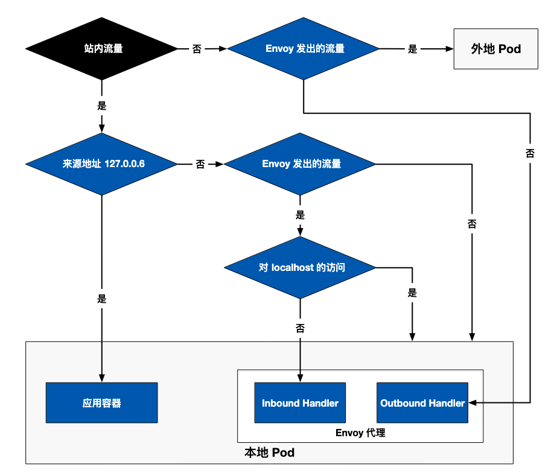
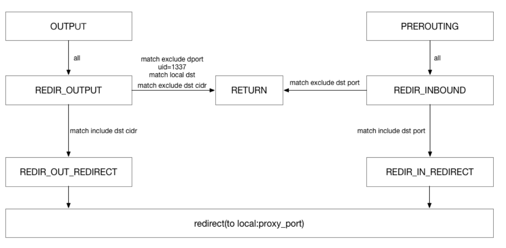

# istio流量劫持原理

## 环境介绍

1. 创建 namespace : istio-demo, 同时 允许 istio 注入 sidecar

```shell
  kubectl create namespace istio-demo
  kubectl label namespace istio-demo istio-injection=enabled --overwrite
```
 
2. 启动 sleep 服务 samples/sleep/sleep.yaml

```yaml

apiVersion: v1
kind: ServiceAccount
metadata:
  name: sleep
---
apiVersion: v1
kind: Service
metadata:
  name: sleep
  labels:
    app: sleep
    service: sleep
spec:
  ports:
  - port: 80
    name: http
  selector:
    app: sleep
---
apiVersion: apps/v1
kind: Deployment
metadata:
  name: sleep
spec:
  replicas: 1
  selector:
    matchLabels:
      app: sleep
  template:
    metadata:
      labels:
        app: sleep
    spec:
      terminationGracePeriodSeconds: 0
      serviceAccountName: sleep
      containers:
      - name: sleep
        image: curlimages/curl
        command: ["/bin/sleep", "infinity"]
        imagePullPolicy: IfNotPresent
        volumeMounts:
        - mountPath: /etc/sleep/tls
          name: secret-volume
      volumes:
      - name: secret-volume
        secret:
          secretName: sleep-secret
          optional: true
```

```bash
kubectl apply -f samples/sleep/sleep.yaml -n istio-demo
````

3. 启动 httpbin 服务 samples/httpbin/httpbin.yaml

```yaml
apiVersion: v1
kind: ServiceAccount
metadata:
  name: httpbin
---
apiVersion: v1
kind: Service
metadata:
  name: httpbin
  labels:
    app: httpbin
    service: httpbin
spec:
  ports:
  - name: http
    port: 8000
    targetPort: 80
  selector:
    app: httpbin
---
apiVersion: apps/v1
kind: Deployment
metadata:
  name: httpbin
spec:
  replicas: 1
  selector:
    matchLabels:
      app: httpbin
      version: v1
  template:
    metadata:
      labels:
        app: http
        version: v1
    spec:
      serviceAccountName: httpbin
      containers:
      - image: docker.io/2456868764/httpbin:1.0.0
        imagePullPolicy: IfNotPresent
        name: httpbin
        ports:
        - containerPort: 80
        env:
          - name: POD_NAME
            valueFrom:
              fieldRef:
                fieldPath: metadata.name
          - name: POD_NAMESPACE
            valueFrom:
              fieldRef:
                fieldPath: metadata.namespace
          - name: POD_IP
            valueFrom:
              fieldRef:
                fieldPath: status.podIP
          - name: NODE_NAME
            valueFrom:
              fieldRef:
                fieldPath: spec.nodeName
          - name: SERVICE_ACCOUNT
            valueFrom:
              fieldRef:
                fieldPath: spec.serviceAccountName

```

```bash
kubectl apply -f samples/httpbin/httpbin.yaml -n istio-demo
````

4. 启动 gateway 访问 httpbin

  ```shell
  kubectl apply -f samples/httpbin/httpbin-gateway.yaml -n istio-demo
  ```
5. 测试 

```shell
kubectl get pods -n istio-demo
NAME                       READY   STATUS    RESTARTS   AGE
httpbin-798dbb9f74-5l4sd   2/2     Running   0          46h
sleep-9454cc476-j2w49      2/2     Running   0          46h
```

```shell
export SLEEP_POD=$(kubectl get pods -l app=sleep -o 'jsonpath={.items[0].metadata.name}' -n istio-demo)
kubectl exec "$SLEEP_POD" -n istio-demo -c sleep -- curl -sS http://httpbin:8000/hostname

httpbin-798dbb9f74-5l4sd"
```


## 流量访问原理

通过 curl -sS http://httpbin:8000/hostname 从 SLEEP_POD 访问 httpbin service， 来分析流量


### 1. Sleep Pod Init 容器启动入口

```yaml
  initContainers:
  - args:
    - istio-iptables
    - -p
    - "15001"
    - -z
    - "15006"
    - -u
    - "1337"
    - -m
    - REDIRECT
    - -i
    - '*'
    - -x
    - ""
    - -b
    - '*'
    - -d
    - 15090,15021,15020
    - --log_output_level=default:info
    image: docker.io/istio/proxyv2:1.19.0
    imagePullPolicy: IfNotPresent
    name: istio-init
```

init 容器的启动入口是 istio-iptables 命令行，该命令行工具的用法如下：

```shell
$ istio-iptables [flags]
  -p: 指定重定向所有 TCP 流量的 sidecar 端口（默认为 $ENVOY_PORT = 15001）
  -m: 指定入站连接重定向到 sidecar 的模式，“REDIRECT” 或 “TPROXY”（默认为 $ISTIO_INBOUND_INTERCEPTION_MODE)
  -b: 逗号分隔的入站端口列表，其流量将重定向到 Envoy（可选）。使用通配符 “*” 表示重定向所有端口。为空时表示禁用所有入站重定向（默认为 $ISTIO_INBOUND_PORTS）
  -d: 指定要从重定向到 sidecar 中排除的入站端口列表（可选），以逗号格式分隔。使用通配符“*” 表示重定向所有入站流量（默认为 $ISTIO_LOCAL_EXCLUDE_PORTS）
  -o：逗号分隔的出站端口列表，不包括重定向到 Envoy 的端口。
  -i: 指定重定向到 sidecar 的 IP 地址范围（可选），以逗号分隔的 CIDR 格式列表。使用通配符 “*” 表示重定向所有出站流量。空列表将禁用所有出站重定向（默认为 $ISTIO_SERVICE_CIDR）
  -x: 指定将从重定向中排除的 IP 地址范围，以逗号分隔的 CIDR 格式列表。使用通配符 “*” 表示重定向所有出站流量（默认为 $ISTIO_SERVICE_EXCLUDE_CIDR）。
  -k：逗号分隔的虚拟接口列表，其入站流量（来自虚拟机的）将被视为出站流量。
  -g：指定不应用重定向的用户的 GID。(默认值与 -u param 相同)
  -u：指定不应用重定向的用户的 UID。通常情况下，这是代理容器的 UID（默认值是 1337，即 istio-proxy 的 UID）。
  -z: 所有进入 pod/VM 的 TCP 流量应被重定向到的端口（默认 $INBOUND_CAPTURE_PORT = 15006）。
```

该容器存在的意义就是让 sidecar 代理可以拦截所有的进出 pod 的流量，15090 端口, 15020, 15021 端口除外的所有入站（inbound）流量重定向到 15006 端口（sidecar），
再拦截应用容器的出站（outbound）流量经过 sidecar 处理（通过 15001 端口监听）后再出站。关于 Istio 中端口用途请参考 [Istio 官方文档](https://istio.io/latest/zh/docs/ops/deployment/requirements/) 。

istio-init 容器的入口是 /usr/local/bin/istio-iptables 命令行，该命令行工具的代码的位置在 Istio 源码仓库的 tools/istio-iptables 目录。

### 2. Pod 启动流程

启用了 Sidecar 自动注入的 Pod 启动流程如下：

- Init 容器先启动，向 Pod 中注入 iptables 规则，进行透明流量拦截。
- 随后，Kubernetes 会根据 Pod Spec 中容器的声明顺序依次启动容器，但这是非阻塞的，无法保证第一个容器启动完成后才启动下一个。istio-proxy 容器启动时，pilot-agent 将作为 PID 1 号进程，它是 Linux 用户空间的第一个进程，负责拉起其他进程和处理僵尸进程。pilot-agent 将生成 Envoy bootstrap 配置并拉起 envoy 进程；应用容器几乎跟 istio-proxy 容器同时启动，为了防止 Pod 内的容器在还没启动好的情况而接收到外界流量，这时候就绪探针就派上用场了。Kubernetes 会在 istio-proxy 容器的 15021 端口进行就绪检查，直到 isito-proxy 启动完成后 kubelet 才会将流量路由到 Pod 内。
- 在 Pod 启动完成后，pilot-agent 将变为守护进程监视系统其他进程，除此之外，该进程还为 Envoy 提供 Bootstrap 配置、证书、健康检查、配置热加载、身份支持及进程生命周期管理等。


### 3. 查看 Sleep 容器中的 iptables 规则

- 在主机节点上查看 sleep 进程 pid

```shell
jun@master01:~$ ps aux | grep sleep
_apt       51277  0.0  0.0   1660     4 ?        Ss   09:26   0:00 /bin/sleep infinity

```
- 用 crictl 查看

```shell
jun@master01:~$ sudo crictl ps | grep sleep
b5c1971e01234       63a8c69bc987b       2 days ago          Running             istio-proxy                 0                   f28dddfcf6da7       sleep-9454cc476-j2w49
fa39c33c89b3e       448e050c94d61       2 days ago          Running             sleep                       0                   f28dddfcf6da7       sleep-9454cc476-j2w49
jun@master01:~$ sudo crictl inspect fa39c33c89b3e | grep pid
    "pid": 51277,
            "pid": 1
            "type": "pid"
jun@master01:~$ 
```

sleep 在主机上 PID 是 51277

- 进入该进程的命名空间

```shell
jun@master01:~$ sudo nsenter -n --target 51277
root@master01:/home/jun# iptables-legacy -t nat -L 
```

### 4. iptables 流量劫持过程详解

经过上面的步骤，可以查看到 init 容器向 Pod 中注入的 iptables 规则，如下所示。

```shell
# PREROUTING 链：用于目标地址转换（DNAT），将所有入站 TCP 流量跳转到 ISTIO_INBOUND 链上。
Chain PREROUTING (policy ACCEPT)
target     prot opt source               destination         
ISTIO_INBOUND  tcp  --  anywhere             anywhere            

# INPUT 链：处理输入数据包，非 TCP 流量将继续 OUTPUT 链。
Chain INPUT (policy ACCEPT)
target     prot opt source               destination         

# OUTPUT 链：将所有出站数据包跳转到 ISTIO_OUTPUT 链上。
Chain OUTPUT (policy ACCEPT)
target     prot opt source               destination         
ISTIO_OUTPUT  tcp  --  anywhere             anywhere            

# POSTROUTING 链：所有数据包流出网卡时都要先进入 POSTROUTING 链，内核根据数据包目的地判断是否需要转发出去，我们看到此处未做任何处理。
Chain POSTROUTING (policy ACCEPT)
target     prot opt source               destination         

# ISTIO_INBOUND 链：将所有入站流量重定向到 ISTIO_IN_REDIRECT 链上。目的地为 15090, 15020, 15021 端口的流量除外，发送到以上两个端口的流量将返回 iptables 规则链的调用点，即 PREROUTING 链的后继 INPUT 后直接调用原始目的地。
Chain ISTIO_INBOUND (1 references)
target     prot opt source               destination         
RETURN     tcp  --  anywhere             anywhere             tcp dpt:15008
RETURN     tcp  --  anywhere             anywhere             tcp dpt:15090
RETURN     tcp  --  anywhere             anywhere             tcp dpt:15021
RETURN     tcp  --  anywhere             anywhere             tcp dpt:15020
ISTIO_IN_REDIRECT  tcp  --  anywhere             anywhere            

# ISTIO_IN_REDIRECT 链：将所有的入站流量跳转到本地的 15006 端口，至此成功的拦截了流量到 sidecar 代理的 Inbound Handler 中。
Chain ISTIO_IN_REDIRECT (3 references)
target     prot opt source               destination         
REDIRECT   tcp  --  anywhere             anywhere             redir ports 15006

# ISTIO_OUTPUT 链：规则比较复杂，将在下文解释
Chain ISTIO_OUTPUT (1 references)
target     prot opt source               destination         
RETURN     all  --  127.0.0.6            anywhere   #规则1
ISTIO_IN_REDIRECT  tcp  --  anywhere            !localhost            tcp dpt:!15008 owner UID match 1337 #规则2
RETURN     all  --  anywhere             anywhere             ! owner UID match 1337  #规则3
RETURN     all  --  anywhere             anywhere             owner UID match 1337  #规则4
ISTIO_IN_REDIRECT  tcp  --  anywhere            !localhost            tcp dpt:!15008 owner GID match 1337 #规则5
RETURN     all  --  anywhere             anywhere             ! owner GID match 1337 #规则6 
RETURN     all  --  anywhere             anywhere             owner GID match 1337  #规则7
RETURN     all  --  anywhere             localhost            #规则8
ISTIO_REDIRECT  all  --  anywhere             anywhere      #规则9
      
# ISTIO_REDIRECT 链：将所有流量重定向到 Envoy 代理的 15001 端口。
Chain ISTIO_REDIRECT (1 references)
target     prot opt source               destination         
REDIRECT   tcp  --  anywhere             anywhere             redir ports 15001
```

这里着重需要解释的是 ISTIO_OUTPUT 链中的 9 条规则，为了便于阅读，将以上规则中的部分内容使用表格的形式来展示如下：

```shell
规则	target	in	out	source	destination
1	RETURN	any	lo	127.0.0.6	anywhere
2	ISTIO_IN_REDIRECT	any	lo	anywhere	!localhost owner UID match 1337
3	RETURN	any	lo	anywhere	anywhere !owner UID match 1337
4	RETURN	any	any	anywhere	anywhere owner UID match 1337
5	ISTIO_IN_REDIRECT	any	lo	anywhere	!localhost owner GID match 1337
6	RETURN	any	lo	anywhere	anywhere !owner GID match 1337
7	RETURN	any	any	anywhere	anywhere owner GID match 1337
8	RETURN	any	any	anywhere	localhost
9	ISTIO_REDIRECT	any	any	anywhere	anywhere
```

下图展示了 ISTIO_ROUTE 规则的详细流程。



- 其中规则 5、6、7 是分别对规则 2、3、4 的应用范围扩大（从 UID 扩大为 GID），作用是类似的
- 其中的规则是按顺序执行的，也就是说排序越靠后的规则将作为默认值。
- 出站网卡（out）为 lo （本地回环地址，loopback 接口）时，表示流量的目的地是本地 Pod, 对于 Pod 向外部发送的流量就不会经过这个接口
- 所有 Sleep Pod 的出站流量只适用于规则 4、7、8、9。

#### 规则 1 
- 目的：透传 Envoy 代理发送到本地应用容器的流量，使其绕过 Envoy 代理，直达应用容器。
- 详情：该规则使得所有来自 127.0.0.6（该 IP 地址将在下文解释）的请求，跳出该链，返回 iptables 的调用点（即 OUTPUT）后继续执行其余路由规则，即 POSTROUTING 规则，把流量发送到任意目的地址，如本地 Pod 内的应用容器。如果没有这条规则，由 Pod 内 Envoy 代理发出的对 Pod 内容器访问的流量将会执行下一条规则，即规则 2，流量将再次进入到了 Inbound Handler 中，从而形成了死循环。将这条规则放在第一位可以避免流量在 Inbound Handler 中死循环的问题。

#### 规则 2、5

- 目的：处理 Envoy 代理发出的站内流量（Pod 内部的流量），但不是对 localhost 的请求，通过后续规则将其转发给 Envoy 代理的 Inbound Handler。该规则适用于 Pod 对自身 IP 地址调用的场景，即 Pod 内服务之间的访问。
- 详情：如果流量的目的地非 localhost，且数据包是由 1337 UID（即 istio-proxy 用户，Envoy 代理）发出的，流量将被经过 ISTIO_IN_REDIRECT 最终转发到 Envoy 的 Inbound Handler。

#### 规则 3、6

- 目的：透传 Pod 内的应用容器的站内流量。该规则适用于容器内部的流量。例如在 Pod 内对 Pod IP 或 localhost 的访问。
- 详情：如果流量不是由 Envoy 用户发出的，那么就跳出该链，返回 OUTPUT 调用 POSTROUTING，直达目的地。

#### 规则 4、7

- 目的：透传 Envoy 代理发出的出站请求。
- 详情：如果请求是由 Envoy 代理发出的，则返回 OUTPUT 继续调用 POSTROUTING 规则，最终直接访问目的地。


#### 规则 8

- 目的：透传 Pod 内部对 localhost 的请求。
- 详情：如果请求的目的地是 localhost，则返回 OUTPUT 调用 POSTROUTING，直接访问 localhost。

#### 规则 9

- 目的：所有其他的流量将被转发到 ISTIO_REDIRECT 后，最终达到 Envoy 代理的 Outbound Handler。


以上规则避免了 Envoy 代理到应用程序的路由在 iptables 规则中的死循环，保障了流量可以被正确的路由到 Envoy 代理上，也可以发出真正的出站请求。


#### 关于 RETURN target

可能留意到上述规则中有很多 RETURN target，它的意思是，指定到这条规则时，跳出该规则链，返回 iptables 的调用点（在我们的例子中即 OUTPUT）后继续执行其余路由规则，在我们的例子中即 POSTROUTING 规则，把流量发送到任意目的地址，你可以把它直观的理解为透传。

#### 关于 127.0.0.6 IP 地址

127.0.0.6 这个 IP 是 Istio 中默认的 InboundPassthroughClusterIpv4，在 Istio 的代码中指定。即流量在进入 Envoy 代理后被绑定的 IP 地址，作用是让 Outbound 流量重新发送到 Pod 中的应用容器，即 Passthought（透传），绕过 Outbound Handler。该流量是对 Pod 自身的访问，而不是真正的对外流量。至于为什么选择这个 IP 作为流量透传，请参考 [Istio Issue-29603](https://github.com/istio/istio/issues/29603) 。


### 流量路由过程详解

已经了解了 Istio 是如何在 Pod 中做透明流量劫持的，那么流量被劫持到 Envoy 代理中之后是如何被处理的呢？流量路由分为 Inbound 和 Outbound 两个过程，下面将根据上文中的示例及 sidecar 的配置为读者详细分析此过程。

#### 理解 Inbound Handler

Inbound Handler 的作用是将 iptables 拦截到的 downstream 的流量转发给 Pod 内的应用程序容器。 
其中一个 httpbin Pod 的名字是 httpbin-798dbb9f74-5l4sd

```shell
istioctl pc listener httpbin-798dbb9f74-5l4sd -n istio-demo --port 15006

ADDRESSES PORT  MATCH                                                                                         DESTINATION
0.0.0.0   15006 Addr: *:15006                                                                                 Non-HTTP/Non-TCP
0.0.0.0   15006 Trans: tls; App: istio-http/1.0,istio-http/1.1,istio-h2; Addr: 0.0.0.0/0                      InboundPassthroughClusterIpv4
0.0.0.0   15006 Trans: raw_buffer; App: http/1.1,h2c; Addr: 0.0.0.0/0                                         InboundPassthroughClusterIpv4
0.0.0.0   15006 Trans: tls; App: TCP TLS; Addr: 0.0.0.0/0                                                     InboundPassthroughClusterIpv4
0.0.0.0   15006 Trans: raw_buffer; Addr: 0.0.0.0/0                                                            InboundPassthroughClusterIpv4
0.0.0.0   15006 Trans: tls; Addr: 0.0.0.0/0                                                                   InboundPassthroughClusterIpv4
0.0.0.0   15006 Trans: tls; App: istio,istio-peer-exchange,istio-http/1.0,istio-http/1.1,istio-h2; Addr: *:80 Cluster: inbound|80||
0.0.0.0   15006 Trans: raw_buffer; Addr: *:80                                                                 Cluster: inbound|80||
```
下面列出了以上输出中各字段的含义：
- ADDRESS：下游地址
- PORT：Envoy 监听器监听的端口
- MATCH：请求使用的传输协议或匹配的下游地址
- DESTINATION：路由目的地

httpbin Pod 中的 Iptables 将入站流量劫持到 15006 端口上，从上面的输出我们可以看到 Envoy 的 Inbound Handler 在 15006 端口上监听，对目的地为任何 IP 的 80 端口的请求将路由到 inbound|80|| Cluster 上。

从该 Pod 的 Listener 列表的最后两行中可以看到，0.0.0.0:15006/TCP 的 Listener（其实际名字是 virtualInbound）监听所有的 Inbound 流量，其中包含了匹配规则，来自任意 IP 的对 80 端口的访问流量，将会路由到 inbound|80|| Cluster，如果你想以 Yaml 格式查看该 Listener 的详细配置，可以执行 istioctl proxy-config listeners httpbin-798dbb9f74-5l4sd --port 15006 -o yaml 命令，
你将获得类似下面的输出。

```yaml

  address:
    socketAddress:
      address: 0.0.0.0
      portValue: 15006
  continueOnListenerFiltersTimeout: true
  filterChains:
  - filterChainMatch:
      destinationPort: 15006
    filters:
    - name: istio.metadata_exchange
      typedConfig:
        '@type': type.googleapis.com/envoy.tcp.metadataexchange.config.MetadataExchange
        protocol: istio-peer-exchange
    - name: istio.stats
      typedConfig:
        '@type': type.googleapis.com/stats.PluginConfig
        disableHostHeaderFallback: true
    - name: envoy.filters.network.tcp_proxy
      typedConfig:
        '@type': type.googleapis.com/envoy.extensions.filters.network.tcp_proxy.v3.TcpProxy
        cluster: BlackHoleCluster
        statPrefix: BlackHoleCluster
    name: virtualInbound-blackhole
    
  # inbound 80   
  - filterChainMatch:
      destinationPort: 80
      transportProtocol: raw_buffer
    filters:
      - name: istio_authn
        typedConfig:
          '@type': type.googleapis.com/udpa.type.v1.TypedStruct
          typeUrl: type.googleapis.com/io.istio.network.authn.Config
      - name: istio.metadata_exchange
        typedConfig:
          '@type': type.googleapis.com/envoy.tcp.metadataexchange.config.MetadataExchange
          protocol: istio-peer-exchange
      - name: envoy.filters.network.http_connection_manager
        typedConfig:
          '@type': type.googleapis.com/envoy.extensions.filters.network.http_connection_manager.v3.HttpConnectionManager
          accessLog:
            - name: envoy.access_loggers.file
              typedConfig:
                '@type': type.googleapis.com/envoy.extensions.access_loggers.file.v3.FileAccessLog
                logFormat:
                  jsonFormat:
                    authority: '%REQ(:AUTHORITY)%'
                    bytes_received: '%BYTES_RECEIVED%'
                    bytes_sent: '%BYTES_SENT%'
                    connection_termination_details: '%CONNECTION_TERMINATION_DETAILS%'
                    downstream_local_address: '%DOWNSTREAM_LOCAL_ADDRESS%'
                    downstream_remote_address: '%DOWNSTREAM_REMOTE_ADDRESS%'
                    duration: '%DURATION%'
                    method: '%REQ(:METHOD)%'
                    path: '%REQ(X-ENVOY-ORIGINAL-PATH?:PATH)%'
                    protocol: '%PROTOCOL%'
                    request_id: '%REQ(X-REQUEST-ID)%'
                    requested_server_name: '%REQUESTED_SERVER_NAME%'
                    response_code: '%RESPONSE_CODE%'
                    response_code_details: '%RESPONSE_CODE_DETAILS%'
                    response_flags: '%RESPONSE_FLAGS%'
                    route_name: '%ROUTE_NAME%'
                    start_time: '%START_TIME%'
                    upstream_cluster: '%UPSTREAM_CLUSTER%'
                    upstream_host: '%UPSTREAM_HOST%'
                    upstream_local_address: '%UPSTREAM_LOCAL_ADDRESS%'
                    upstream_service_time: '%RESP(X-ENVOY-UPSTREAM-SERVICE-TIME)%'
                    upstream_transport_failure_reason: '%UPSTREAM_TRANSPORT_FAILURE_REASON%'
                    user_agent: '%REQ(USER-AGENT)%'
                    x_forwarded_for: '%REQ(X-FORWARDED-FOR)%'
                path: /dev/stdout
          forwardClientCertDetails: APPEND_FORWARD
          httpFilters:
            - name: istio.metadata_exchange
              typedConfig:
                '@type': type.googleapis.com/udpa.type.v1.TypedStruct
                typeUrl: type.googleapis.com/io.istio.http.peer_metadata.Config
                value:
                  downstream_discovery:
                    - istio_headers: {}
                    - workload_discovery: {}
                  downstream_propagation:
                    - istio_headers: {}
            - name: envoy.filters.http.grpc_stats
              typedConfig:
                '@type': type.googleapis.com/envoy.extensions.filters.http.grpc_stats.v3.FilterConfig
                emitFilterState: true
                statsForAllMethods: false
            - name: envoy.filters.http.fault
              typedConfig:
                '@type': type.googleapis.com/envoy.extensions.filters.http.fault.v3.HTTPFault
            - name: envoy.filters.http.cors
              typedConfig:
                '@type': type.googleapis.com/envoy.extensions.filters.http.cors.v3.Cors
            - name: istio.stats
              typedConfig:
                '@type': type.googleapis.com/stats.PluginConfig
                disableHostHeaderFallback: true
            - name: envoy.filters.http.router
              typedConfig:
                '@type': type.googleapis.com/envoy.extensions.filters.http.router.v3.Router
          normalizePath: true
          pathWithEscapedSlashesAction: KEEP_UNCHANGED
          requestIdExtension:
            typedConfig:
              '@type': type.googleapis.com/envoy.extensions.request_id.uuid.v3.UuidRequestIdConfig
              useRequestIdForTraceSampling: true
          routeConfig:
            name: inbound|80||
            validateClusters: false
            virtualHosts:
              - domains:
                  - '*'
                name: inbound|http|8000
                routes:
                  - decorator:
                      operation: httpbin.istio-demo.svc.cluster.local:8000/*
                    match:
                      prefix: /
                    name: default
                    route:
                      cluster: inbound|80||
                      maxStreamDuration:
                        grpcTimeoutHeaderMax: 0s
                        maxStreamDuration: 0s
                      timeout: 0s
          serverName: istio-envoy
          setCurrentClientCertDetails:
            dns: true
            subject: true
            uri: true
          statPrefix: inbound_0.0.0.0_80
          streamIdleTimeout: 0s
          tracing:
            clientSampling:
              value: 100
            customTags:
              - metadata:
                  kind:
                    request: {}
                  metadataKey:
                    key: envoy.filters.http.rbac
                    path:
                      - key: istio_dry_run_allow_shadow_effective_policy_id
                tag: istio.authorization.dry_run.allow_policy.name
              - metadata:
                  kind:
                    request: {}
                  metadataKey:
                    key: envoy.filters.http.rbac
                    path:
                      - key: istio_dry_run_allow_shadow_engine_result
                tag: istio.authorization.dry_run.allow_policy.result
              - metadata:
                  kind:
                    request: {}
                  metadataKey:
                    key: envoy.filters.http.rbac
                    path:
                      - key: istio_dry_run_deny_shadow_effective_policy_id
                tag: istio.authorization.dry_run.deny_policy.name
              - metadata:
                  kind:
                    request: {}
                  metadataKey:
                    key: envoy.filters.http.rbac
                    path:
                      - key: istio_dry_run_deny_shadow_engine_result
                tag: istio.authorization.dry_run.deny_policy.result
              - literal:
                  value: v1
                tag: istio.canonical_revision
              - literal:
                  value: httpbin
                tag: istio.canonical_service
              - literal:
                  value: cluster.local
                tag: istio.mesh_id
              - literal:
                  value: istio-demo
                tag: istio.namespace
            overallSampling:
              value: 100
            randomSampling:
              value: 100
          upgradeConfigs:
            - upgradeType: websocket
          useRemoteAddress: false
    name: 0.0.0.0_80

```

既然 Inbound Handler 的流量中将来自任意地址的对该 Pod 80 端口的流量路由到 inbound|80|| Cluster，
那么我们运行 istioctl pc cluster httpbin-798dbb9f74-5l4sd -n istio-demo --port 80 --direction inbound -o yaml 查看下该 Cluster 配置，将获得类似下面的输出。

```yaml
- circuitBreakers:
    thresholds:
    - maxConnections: 4294967295
      maxPendingRequests: 4294967295
      maxRequests: 4294967295
      maxRetries: 4294967295
      trackRemaining: true
  commonLbConfig: {}
  connectTimeout: 10s
  lbPolicy: CLUSTER_PROVIDED
  metadata:
    filterMetadata:
      istio:
        services:
        - host: httpbin.istio-demo.svc.cluster.local
          name: httpbin
          namespace: istio-demo
  name: inbound|80||
  type: ORIGINAL_DST
  upstreamBindConfig:
    sourceAddress:
      address: 127.0.0.6
      portValue: 0
```

看到其中的 TYPE 为 ORIGINAL_DST，将流量发送到原始目标地址（Pod IP），因为原始目标地址即当前 Pod，还应该注意到 upstreamBindConfig.sourceAddress.address 的值被改写为了 127.0.0.6，而且对于 Pod 内流量是通过 lo 网卡发送的，这刚好呼应了上文中的 iptables ISTIO_OUTPUT 链中的第一条规则，根据该规则，流量将被透传到 Pod 内的应用容器。

关于 ORIGINAL_DST， 可以看一下这篇文章 [Introduction to Original Destination in Envoy](https://venilnoronha.medium.com/introduction-to-original-destination-in-envoy-d8a8aa184bb6) 


#### 理解 Outbound Handler

在本示例中 Sleep 会向 Httpbin 服务发送 HTTP 请求，请求的地址是：http://httpbin:8000/hostname 

Outbound Handler 的作用是将 iptables 拦截到的本地应用程序向外发出的流量，经由 Envoy 代理路由到上游。

Envoy 监听在 15001 端口上监听所有 Outbound 流量，Outbound Handler 处理，然后经过 virtualOutbound Listener、0.0.0.0_8000 Listener，然后通过 Route 8000 找到上游的 cluster，进而通过 EDS 找到 Endpoint 执行路由动作。

运行 istioctl proxy-config routes sleep-9454cc476-j2w49 -n istio-demo --name 8000 -o yaml 查看 route 配置，因为 sidecar 会根据 HTTP header 中的 domains 来匹配 VirtualHost，所以下面只列举了 httpbin.istio-demo.svc.cluster.local:8000 这一个 VirtualHost。

```yaml
- ignorePortInHostMatching: true
  maxDirectResponseBodySizeBytes: 1048576
  name: "8000"
  validateClusters: false
  virtualHosts:
    - domains:
        - httpbin.istio-demo.svc.cluster.local
        - httpbin
        - httpbin.istio-demo.svc
        - httpbin.istio-demo
        - 10.97.253.42
      includeRequestAttemptCount: true
      name: httpbin.istio-demo.svc.cluster.local:8000
      routes:
        - decorator:
            operation: httpbin.istio-demo.svc.cluster.local:8000/*
          match:
            prefix: /
          name: default
          route:
            cluster: outbound|8000||httpbin.istio-demo.svc.cluster.local
            maxGrpcTimeout: 0s
            retryPolicy:
              hostSelectionRetryMaxAttempts: "5"
              numRetries: 2
              retriableStatusCodes:
                - 503
              retryHostPredicate:
                - name: envoy.retry_host_predicates.previous_hosts
                  typedConfig:
                    '@type': type.googleapis.com/envoy.extensions.retry.host.previous_hosts.v3.PreviousHostsPredicate
              retryOn: connect-failure,refused-stream,unavailable,cancelled,retriable-status-codes
            timeout: 0s
    - domains:
        - '*'
      includeRequestAttemptCount: true
      name: allow_any
      routes:
        - match:
            prefix: /
          name: allow_any
          route:
            cluster: PassthroughCluster
            maxGrpcTimeout: 0s
            timeout: 0s

```

从该 Virtual Host 配置中可以看到将流量路由到 outbound|8000||httpbin.istio-demo.svc.cluster.local 集群。

运行 istioctl proxy-config endpoint sleep-9454cc476-j2w49 -n istio-demo --port 80 -o yaml --cluster "outbound|8000||httpbin.istio-demo.svc.cluster.local" 查看集群的 Endpoint 配置，结果如下。

```yaml
- addedViaApi: true
  circuitBreakers:
    thresholds:
    - maxConnections: 4294967295
      maxPendingRequests: 4294967295
      maxRequests: 4294967295
      maxRetries: 4294967295
    - maxConnections: 1024
      maxPendingRequests: 1024
      maxRequests: 1024
      maxRetries: 3
      priority: HIGH
  edsServiceName: outbound|8000||httpbin.istio-demo.svc.cluster.local
  hostStatuses:
  - address:
      socketAddress:
        address: 10.10.241.116
        portValue: 80
    healthStatus:
      edsHealthStatus: HEALTHY
    locality: {}
    stats:
    - name: cx_connect_fail
      value: "36"
    - name: cx_total
      value: "38"
    - name: rq_error
      value: "36"
    - name: rq_success
      value: "15"
    - name: rq_timeout
    - name: rq_total
      value: "15"
    - name: cx_active
      type: GAUGE
    - name: rq_active
      type: GAUGE
    weight: 1
  name: outbound|8000||httpbin.istio-demo.svc.cluster.local
  observabilityName: outbound|8000||httpbin.istio-demo.svc.cluster.local

```

我们看到端点的地址是 10.10.241.116。实际上，Endpoint 可以是一个或多个，sidecar 将根据一定规则选择适当的 Endpoint 来路由。至此 sleep Pod 找到了它上游服务 httpbin 的 Endpoint。


使用 iptables 做流量劫持只是 service mesh 的数据平面中做流量劫持的方式之一，还有更多的流量劫持方案，下面引用自 [云原生网络代理 MOSN 官网](https://mosn.io/docs/products/structure/traffic-hijack/)中给出的流量劫持 部分的描述。

### 使用 iptables 做流量劫持

iptables 通过 NAT 表的 redirect 动作执行流量重定向，通过 syn 包触发新建 nefilter 层的连接，后续报文到来时查找连接转换目的地址与端口。新建连接时同时会记录下原始目的地址，应用程序可以通过(SOL_IP、SO_ORIGINAL_DST)获取到真实的目的地址。

iptables 劫持原理如下图所示：



使用 iptables 做流量劫持时存在的问题
目前 Istio 使用 iptables 实现透明劫持，主要存在以下三个问题：

- 需要借助于 conntrack 模块实现连接跟踪，在连接数较多的情况下，会造成较大的消耗，同时可能会造成 track 表满的情况，为了避免这个问题，业内有关闭 conntrack 的做法。
- iptables 属于常用模块，全局生效，不能显式的禁止相关联的修改，可管控性比较差。
- iptables 重定向流量本质上是通过 loopback 交换数据，outbond 流量将两次穿越协议栈，在大并发场景下会损失转发性能。

透明劫持方案优化

使用 Merbridge 开源项目利用 eBPF 劫持流量

[Merbridge](https://merbridge.io/) 是由 DaoCloud 在 2022 年初开源的的一款利用 eBPF 加速 Istio 服务网格的插件。使用 Merbridge 可以在一定程度上优化数据平面的网络性能。

Merbridge 利用 eBPF 的 sockops 和 redir 能力，可以直接将数据包从 inbound socket 传输到 outbound socket。eBPF 提供了 bpf_msg_redirect_hash 函数可以直接转发应用程序的数据包


# Reference
- [Sidecar 启动顺序问题](https://imroc.cc/istio/faq/sidecar-startup-order)
- [Istio 中的 Sidecar 注入、透明流量劫持及流量路由过程详解](https://jimmysong.io/blog/sidecar-injection-iptables-and-traffic-routing/)
- [Introduction to Original Destination in Envoy](https://venilnoronha.medium.com/introduction-to-original-destination-in-envoy-d8a8aa184bb6) 
- [流量劫持](https://mosn.io/docs/products/structure/traffic-hijack/)
- [Merbridge](https://merbridge.io/)