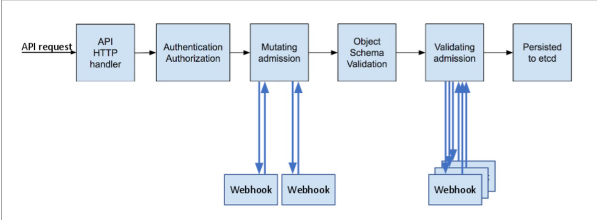

# 准入控制器

文档位置：  https://kubernetes.io/zh-cn/docs/reference/access-authn-authz/admission-controllers/

准入控制器 是一段代码，它会在请求通过认证和鉴权之后、对象被持久化之前拦截到达 API 服务器的请求。

准入控制器可以执行验证（Validating） 和/或变更（Mutating） 操作。 变更（mutating）控制器可以根据被其接受的请求更改相关对象；验证（validating）控制器则不行。




Kubernetes 1.27 中的准入控制器由下面的列表组成， 并编译进 kube-apiserver 可执行文件，并且只能由集群管理员配置。 
在该列表中，有两个特殊的控制器：MutatingAdmissionWebhook 和 ValidatingAdmissionWebhook。 它们根据 API 中的配置， 分别执行变更和验证准入控制 webhook。

## 准入控制阶段

准入控制过程分为两个阶段。
- 第一阶段，运行变更准入控制器。
- 第二阶段，运行验证准入控制器。


## 启用和关闭一个准入控制器

1. 要查看哪些插件是被启用的：

```shell
kube-apiserver -h | grep enable-admission-plugins
```

在 Kubernetes 1.27 中，默认启用的插件有：

```shell
CertificateApproval, CertificateSigning, CertificateSubjectRestriction, DefaultIngressClass, DefaultStorageClass, DefaultTolerationSeconds, LimitRanger, MutatingAdmissionWebhook, NamespaceLifecycle, PersistentVolumeClaimResize, PodSecurity, Priority, ResourceQuota, RuntimeClass, ServiceAccount, StorageObjectInUseProtection, TaintNodesByCondition, ValidatingAdmissionPolicy, ValidatingAdmissionWebhook

```

2. 启用一个准入控制器

Kubernetes API 服务器的 enable-admission-plugins 标志接受一个（以逗号分隔的）准入控制插件列表， 这些插件会在集群修改对象之前被调用。

例如，下面的命令启用 NamespaceLifecycle 和 LimitRanger 准入控制插件：

```shell
kube-apiserver --enable-admission-plugins=NamespaceLifecycle,LimitRanger ...


```
3. 关闭准入控制器

Kubernetes API 服务器的 disable-admission-plugins 标志，会将传入的（以逗号分隔的） 准入控制插件列表禁用，即使是默认启用的插件也会被禁用。

```shell
kube-apiserver --disable-admission-plugins=PodNodeSelector,AlwaysDeny ...
```

## 动态准入控制

文档位置： https://kubernetes.io/zh-cn/docs/reference/access-authn-authz/extensible-admission-controllers/

除了内置的 [admission 插件](https://kubernetes.io/zh-cn/docs/reference/access-authn-authz/admission-controllers/)， 准入插件可以作为扩展独立开发，并以运行时所配置的 Webhook 的形式运行。 此页面描述了如何构建、配置、使用和监视准入 Webhook。

1. 准入 Webhook

准入 Webhook 是一种用于接收准入请求并对其进行处理的 HTTP 回调机制。 可以定义两种类型的准入 webhook:

- 验证性质的准入 Webhook 
- 修改性质的准入 Webhook。 

修改性质的准入 Webhook 会先被调用。 它们可以更改发送到 API 服务器的对象以执行自定义的设置默认值操作。


2. 编写一个准入 Webhook 服务器

请参阅 Kubernetes e2e 测试中的 [Admission Webhook 服务器](https://github.com/kubernetes/kubernetes/blob/release-1.21/test/images/agnhost/webhook/)的实现。webhook 处理由 API 服务器发送的 AdmissionReview 请求，并且将其决定 作为 AdmissionReview 对象以相同版本发送回去。

有关发送到 Webhook 的数据的详细信息，请参阅 [Webhook 请求](https://kubernetes.io/zh-cn/docs/reference/access-authn-authz/extensible-admission-controllers/#request)。

要获取来自 Webhook 的预期数据，请参阅 [Webhook 响应](https://kubernetes.io/zh-cn/docs/reference/access-authn-authz/extensible-admission-controllers/#response)。

示例准入 Webhook 服务器置 ClientAuth 字段为空， 默认为 NoClientCert 。这意味着 Webhook 服务器不会验证客户端的身份，认为其是 apiservers。 如果你需要双向 TLS 或其他方式来验证客户端，请参阅 如何对 [apiservers 进行身份认证](https://kubernetes.io/zh-cn/docs/reference/access-authn-authz/extensible-admission-controllers/#authenticate-apiservers)。

## 源码分析

- 入口位置 /cmd/kube-apiserver/app/server.go
- buildGenericConfig

```golang
    pluginInitializers, admissionPostStartHook, err = admissionConfig.New(proxyTransport, genericConfig.EgressSelector, serviceResolver, genericConfig.TracerProvider, schemaResolver)
	if err != nil {
		lastErr = fmt.Errorf("failed to create admission plugin initializer: %v", err)
		return
	}

	err = s.Admission.ApplyTo(
		genericConfig,
		versionedInformers,
		kubeClientConfig,
		utilfeature.DefaultFeatureGate,
		pluginInitializers...)
	if err != nil {
		lastErr = fmt.Errorf("failed to initialize admission: %v", err)
		return
	}

```

### 1. admissionConfig.New 初始化准入控制器的配置

New 设置 注入控制器所需 plugins 和  admission webhook 启动勾子函数

```golang
func (c *Config) New(proxyTransport *http.Transport, egressSelector *egressselector.EgressSelector, serviceResolver webhook.ServiceResolver, tp trace.TracerProvider, schemaResolver resolver.SchemaResolver) ([]admission.PluginInitializer, genericapiserver.PostStartHookFunc, error) {
	webhookAuthResolverWrapper := webhook.NewDefaultAuthenticationInfoResolverWrapper(proxyTransport, egressSelector, c.LoopbackClientConfig, tp)
	webhookPluginInitializer := webhookinit.NewPluginInitializer(webhookAuthResolverWrapper, serviceResolver)

	var cloudConfig []byte
	if c.CloudConfigFile != "" {
		var err error
		cloudConfig, err = ioutil.ReadFile(c.CloudConfigFile)
		if err != nil {
			klog.Fatalf("Error reading from cloud configuration file %s: %#v", c.CloudConfigFile, err)
		}
	}
	clientset, err := kubernetes.NewForConfig(c.LoopbackClientConfig)
	if err != nil {
		return nil, nil, err
	}
	discoveryClient := cacheddiscovery.NewMemCacheClient(clientset.Discovery())
	discoveryRESTMapper := restmapper.NewDeferredDiscoveryRESTMapper(discoveryClient)
	kubePluginInitializer := NewPluginInitializer(
		cloudConfig,
		discoveryRESTMapper,
		quotainstall.NewQuotaConfigurationForAdmission(),
		schemaResolver,
	)

	admissionPostStartHook := func(context genericapiserver.PostStartHookContext) error {
		discoveryRESTMapper.Reset()
		go utilwait.Until(discoveryRESTMapper.Reset, 30*time.Second, context.StopCh)
		return nil
	}

	return []admission.PluginInitializer{webhookPluginInitializer, kubePluginInitializer}, admissionPostStartHook, nil
}
```

初始化三个对象
- webhookPluginInitializer
- kubePluginInitializer
- admissionPostStartHook

### 2. PluginInitializer

接口文件位置：  /vendor/k8s.io/apiserver/pkg/admission/interfaces.go

```golang

// Interface is an abstract, pluggable interface for Admission Control decisions.
type Interface interface {
	// Handles returns true if this admission controller can handle the given operation
	// where operation can be one of CREATE, UPDATE, DELETE, or CONNECT
	Handles(operation Operation) bool
}

type MutationInterface interface {
	Interface

	// Admit makes an admission decision based on the request attributes.
	// Context is used only for timeout/deadline/cancellation and tracing information.
	Admit(ctx context.Context, a Attributes, o ObjectInterfaces) (err error)
}

// ValidationInterface is an abstract, pluggable interface for Admission Control decisions.
type ValidationInterface interface {
	Interface

	// Validate makes an admission decision based on the request attributes.  It is NOT allowed to mutate
	// Context is used only for timeout/deadline/cancellation and tracing information.
	Validate(ctx context.Context, a Attributes, o ObjectInterfaces) (err error)
}

// Operation is the type of resource operation being checked for admission control
type Operation string

// Operation constants
const (
	Create  Operation = "CREATE"
	Update  Operation = "UPDATE"
	Delete  Operation = "DELETE"
	Connect Operation = "CONNECT"
)

// PluginInitializer is used for initialization of shareable resources between admission plugins.
// After initialization the resources have to be set separately
type PluginInitializer interface {
	Initialize(plugin Interface)
}

// InitializationValidator holds ValidateInitialization functions, which are responsible for validation of initialized
// shared resources and should be implemented on admission plugins
type InitializationValidator interface {
	ValidateInitialization() error
}

// ConfigProvider provides a way to get configuration for an admission plugin based on its name
type ConfigProvider interface {
	ConfigFor(pluginName string) (io.Reader, error)
}

```

文件位置： /pkg/kubeapiserver/admission/initializer.go

```golang

// PluginInitializer is used for initialization of the Kubernetes specific admission plugins.
type PluginInitializer struct {
    cloudConfig        []byte
    restMapper         meta.RESTMapper
    quotaConfiguration quota.Configuration
    schemaResolver     resolver.SchemaResolver
}


// Initialize checks the initialization interfaces implemented by each plugin
// and provide the appropriate initialization data
func (i *PluginInitializer) Initialize(plugin admission.Interface) {
	if wants, ok := plugin.(WantsCloudConfig); ok {
		wants.SetCloudConfig(i.cloudConfig)
	}

	if wants, ok := plugin.(initializer.WantsRESTMapper); ok {
		wants.SetRESTMapper(i.restMapper)
	}

	if wants, ok := plugin.(initializer.WantsQuotaConfiguration); ok {
		wants.SetQuotaConfiguration(i.quotaConfiguration)
	}

	if wants, ok := plugin.(initializer.WantsSchemaResolver); ok {
		wants.SetSchemaResolver(i.schemaResolver)
	}
}

```

### 3. Admission.ApplyTo 初始化准入控制

```golang
   err = s.Admission.ApplyTo(
		genericConfig,
		versionedInformers,
		kubeClientConfig,
		utilfeature.DefaultFeatureGate,
		pluginInitializers...)
	if err != nil {
		lastErr = fmt.Errorf("failed to initialize admission: %v", err)
		return
	}
```

根据传入开启和关闭插件列表和默认推荐列表计算开启和关闭

```golang
	// pass PluginNames to generic AdmissionOptions
		a.GenericAdmission.EnablePlugins, a.GenericAdmission.DisablePlugins = computePluginNames(a.PluginNames, a.GenericAdmission.RecommendedPluginOrder)

```
- PluginNames 表示 --admission-controller 传入
- a.GenericAdmission.RecommendedPluginOrder 默认推荐，文件位置： /pkg/kubeapiserver/options/plugins.go

```golang

// AllOrderedPlugins is the list of all the plugins in order.
var AllOrderedPlugins = []string{
	admit.PluginName,                        // AlwaysAdmit
	autoprovision.PluginName,                // NamespaceAutoProvision
	lifecycle.PluginName,                    // NamespaceLifecycle
	exists.PluginName,                       // NamespaceExists
	scdeny.PluginName,                       // SecurityContextDeny
	antiaffinity.PluginName,                 // LimitPodHardAntiAffinityTopology
	limitranger.PluginName,                  // LimitRanger
	serviceaccount.PluginName,               // ServiceAccount
	noderestriction.PluginName,              // NodeRestriction
	nodetaint.PluginName,                    // TaintNodesByCondition
	alwayspullimages.PluginName,             // AlwaysPullImages
	imagepolicy.PluginName,                  // ImagePolicyWebhook
	podsecurity.PluginName,                  // PodSecurity
	podnodeselector.PluginName,              // PodNodeSelector
	podpriority.PluginName,                  // Priority
	defaulttolerationseconds.PluginName,     // DefaultTolerationSeconds
	podtolerationrestriction.PluginName,     // PodTolerationRestriction
	eventratelimit.PluginName,               // EventRateLimit
	extendedresourcetoleration.PluginName,   // ExtendedResourceToleration
	label.PluginName,                        // PersistentVolumeLabel
	setdefault.PluginName,                   // DefaultStorageClass
	storageobjectinuseprotection.PluginName, // StorageObjectInUseProtection
	gc.PluginName,                           // OwnerReferencesPermissionEnforcement
	resize.PluginName,                       // PersistentVolumeClaimResize
	runtimeclass.PluginName,                 // RuntimeClass
	certapproval.PluginName,                 // CertificateApproval
	certsigning.PluginName,                  // CertificateSigning
	ctbattest.PluginName,                    // ClusterTrustBundleAttest
	certsubjectrestriction.PluginName,       // CertificateSubjectRestriction
	defaultingressclass.PluginName,          // DefaultIngressClass
	denyserviceexternalips.PluginName,       // DenyServiceExternalIPs

	// new admission plugins should generally be inserted above here
	// webhook, resourcequota, and deny plugins must go at the end

	mutatingwebhook.PluginName,           // MutatingAdmissionWebhook
	validatingadmissionpolicy.PluginName, // ValidatingAdmissionPolicy
	validatingwebhook.PluginName,         // ValidatingAdmissionWebhook
	resourcequota.PluginName,             // ResourceQuota
	deny.PluginName,                      // AlwaysDeny
}
```

- 使用 computePluginNames 计算差值得到开启和关闭

```golang
// explicitly disable all plugins that are not in the enabled list
func computePluginNames(explicitlyEnabled []string, all []string) (enabled []string, disabled []string) {
    return explicitlyEnabled, sets.NewString(all...).Difference(sets.NewString(explicitlyEnabled...)).List()
}
```

### 4. 底层 ApplyTo 分析

- 文件位置： /vendor/k8s.io/apiserver/pkg/server/options/admission.go
- (a *AdmissionOptions) ApplyTo

根据传入关闭，开启，推荐插件列表真正计算需要要开启列表

```golang
// enabledPluginNames makes use of RecommendedPluginOrder, DefaultOffPlugins,
// EnablePlugins, DisablePlugins fields
// to prepare a list of ordered plugin names that are enabled.
func (a *AdmissionOptions) enabledPluginNames() []string {
	allOffPlugins := append(a.DefaultOffPlugins.List(), a.DisablePlugins...)
	disabledPlugins := sets.NewString(allOffPlugins...)
	enabledPlugins := sets.NewString(a.EnablePlugins...)
	disabledPlugins = disabledPlugins.Difference(enabledPlugins)

	orderedPlugins := []string{}
	for _, plugin := range a.RecommendedPluginOrder {
		if !disabledPlugins.Has(plugin) {
			orderedPlugins = append(orderedPlugins, plugin)
		}
	}

	return orderedPlugins
}
```

根据配置文件读取配置 admission-control-config-file
 
```golang
	pluginsConfigProvider, err := admission.ReadAdmissionConfiguration(pluginNames, a.ConfigFile, configScheme)
	if err != nil {
		return fmt.Errorf("failed to read plugin config: %v", err)
	}
```

初始化 genericInitializer

```golang
    genericInitializer := initializer.New(clientset, dynamicClient, informers, c.Authorization.Authorizer, features, c.DrainedNotify())
	initializersChain := admission.PluginInitializers{genericInitializer}
	initializersChain = append(initializersChain, pluginInitializers...)
```

NewFromPlugins 执行所有准入的启用插件

```golang
    admissionChain, err := a.Plugins.NewFromPlugins(pluginNames, pluginsConfigProvider, initializersChain, a.Decorators)
	if err != nil {
		return err
	}
```

### 5.NewFromPlugins

文件位置： /vendor/k8s.io/apiserver/pkg/admission/plugins.go

```golang
for _, pluginName := range pluginNames {
		pluginConfig, err := configProvider.ConfigFor(pluginName)
		if err != nil {
			return nil, err
		}

		plugin, err := ps.InitPlugin(pluginName, pluginConfig, pluginInitializer)
		if err != nil {
			return nil, err
		}
		
		
		if plugin != nil {
			if decorator != nil {
				handlers = append(handlers, decorator.Decorate(plugin, pluginName))
			} else {
				handlers = append(handlers, plugin)
			}

			if _, ok := plugin.(MutationInterface); ok {
				mutationPlugins = append(mutationPlugins, pluginName)
			}
			if _, ok := plugin.(ValidationInterface); ok {
				validationPlugins = append(validationPlugins, pluginName)
			}
		}
	}
```

遍历插件，调用InitPlugin

### 6.InitPlugin

```golang

// InitPlugin creates an instance of the named interface.
func (ps *Plugins) InitPlugin(name string, config io.Reader, pluginInitializer PluginInitializer) (Interface, error) {
	if name == "" {
		klog.Info("No admission plugin specified.")
		return nil, nil
	}

	plugin, found, err := ps.getPlugin(name, config)
	if err != nil {
		return nil, fmt.Errorf("couldn't init admission plugin %q: %v", name, err)
	}
	if !found {
		return nil, fmt.Errorf("unknown admission plugin: %s", name)
	}

	pluginInitializer.Initialize(plugin)
	// ensure that plugins have been properly initialized
	if err := ValidateInitialization(plugin); err != nil {
		return nil, fmt.Errorf("failed to initialize admission plugin %q: %v", name, err)
	}

	return plugin, nil
}

```

调用 getPlugin 获取插件, 调用 pluginInitializer.Initialize 初始化插件

### 7. getPlugin

```golang
// getPlugin creates an instance of the named plugin.  It returns `false` if
// the name is not known. The error is returned only when the named provider was
// known but failed to initialize.  The config parameter specifies the io.Reader
// handler of the configuration file for the cloud provider, or nil for no configuration.
func (ps *Plugins) getPlugin(name string, config io.Reader) (Interface, bool, error) {
	ps.lock.Lock()
	defer ps.lock.Unlock()
	f, found := ps.registry[name]
	if !found {
		return nil, false, nil
	}

	config1, config2, err := splitStream(config)
	if err != nil {
		return nil, true, err
	}
	if !PluginEnabledFn(name, config1) {
		return nil, true, nil
	}

	ret, err := f(config2)
	return ret, true, err
}

```

最关键是到 ps.registry map 中获取插件， 对应 value 是工厂函数

```golang
// Factory is a function that returns an Interface for admission decisions.
// The config parameter provides an io.Reader handler to the factory in
// order to load specific configurations. If no configuration is provided
// the parameter is nil.
type Factory func(config io.Reader) (Interface, error)

type Plugins struct {
	lock     sync.Mutex
	registry map[string]Factory
}
```

这些工厂函数 在 RegisterAllAdmissionPlugins 被注册 

文件位置： /pkg/kubeapiserver/options/plugins.go

```golang

// RegisterAllAdmissionPlugins registers all admission plugins.
// The order of registration is irrelevant, see AllOrderedPlugins for execution order.
func RegisterAllAdmissionPlugins(plugins *admission.Plugins) {
	admit.Register(plugins) // DEPRECATED as no real meaning
	alwayspullimages.Register(plugins)
	antiaffinity.Register(plugins)
	defaulttolerationseconds.Register(plugins)
	defaultingressclass.Register(plugins)
	denyserviceexternalips.Register(plugins)
	deny.Register(plugins) // DEPRECATED as no real meaning
	eventratelimit.Register(plugins)
	extendedresourcetoleration.Register(plugins)
	gc.Register(plugins)
	imagepolicy.Register(plugins)
	limitranger.Register(plugins)
	autoprovision.Register(plugins)
	exists.Register(plugins)
	noderestriction.Register(plugins)
	nodetaint.Register(plugins)
	label.Register(plugins) // DEPRECATED, future PVs should not rely on labels for zone topology
	podnodeselector.Register(plugins)
	podtolerationrestriction.Register(plugins)
	runtimeclass.Register(plugins)
	resourcequota.Register(plugins)
	podsecurity.Register(plugins)
	podpriority.Register(plugins)
	scdeny.Register(plugins)
	serviceaccount.Register(plugins)
	setdefault.Register(plugins)
	resize.Register(plugins)
	storageobjectinuseprotection.Register(plugins)
	certapproval.Register(plugins)
	certsigning.Register(plugins)
	ctbattest.Register(plugins)
	certsubjectrestriction.Register(plugins)
}
```

看一下 alwayspullimages 这个插件 alwayspullimages.Register(plugins)

文件位置： /plugin/pkg/admission/alwayspullimages/admission.go
```golang
// Register registers a plugin
func Register(plugins *admission.Plugins) {
	plugins.Register(PluginName, func(config io.Reader) (admission.Interface, error) {
		return NewAlwaysPullImages(), nil
	})
}

```
这个方法调用拉 plugins.Register 方法注册到 ps.registry

```golang
// Register registers a plugin Factory by name. This
// is expected to happen during app startup.
func (ps *Plugins) Register(name string, plugin Factory) {
	ps.lock.Lock()
	defer ps.lock.Unlock()
	if ps.registry != nil {
		_, found := ps.registry[name]
		if found {
			klog.Fatalf("Admission plugin %q was registered twice", name)
		}
	} else {
		ps.registry = map[string]Factory{}
	}

	klog.V(1).InfoS("Registered admission plugin", "plugin", name)
	ps.registry[name] = plugin
}
```

### 8. alwayspullimages 插件为例

文件位置： /plugin/pkg/admission/alwayspullimages/admission.go

- 注册方法和工厂函数

```golang
// PluginName indicates name of admission plugin.
const PluginName = "AlwaysPullImages"

// Register registers a plugin
func Register(plugins *admission.Plugins) {
	plugins.Register(PluginName, func(config io.Reader) (admission.Interface, error) {
		return NewAlwaysPullImages(), nil
	})
}

// NewAlwaysPullImages creates a new always pull images admission control handler
func NewAlwaysPullImages() *AlwaysPullImages {
    return &AlwaysPullImages{
      Handler: admission.NewHandler(admission.Create, admission.Update),
    }
}


```

- 实现 Mutation 和  Validation 接口

```golang
type MutationInterface interface {
	Interface

	// Admit makes an admission decision based on the request attributes.
	// Context is used only for timeout/deadline/cancellation and tracing information.
	Admit(ctx context.Context, a Attributes, o ObjectInterfaces) (err error)
}

// ValidationInterface is an abstract, pluggable interface for Admission Control decisions.
type ValidationInterface interface {
	Interface

	// Validate makes an admission decision based on the request attributes.  It is NOT allowed to mutate
	// Context is used only for timeout/deadline/cancellation and tracing information.
	Validate(ctx context.Context, a Attributes, o ObjectInterfaces) (err error)
}
```

```golang

const (
    // PullAlways means that kubelet always attempts to pull the latest image.  Container will fail If the pull fails.
    PullAlways PullPolicy = "Always"
    // PullNever means that kubelet never pulls an image, but only uses a local image.  Container will fail if the image isn't present
    PullNever PullPolicy = "Never"
    // PullIfNotPresent means that kubelet pulls if the image isn't present on disk. Container will fail if the image isn't present and the pull fails.
    PullIfNotPresent PullPolicy = "IfNotPresent"
)


var _ admission.MutationInterface = &AlwaysPullImages{}
var _ admission.ValidationInterface = &AlwaysPullImages{}

// Admit makes an admission decision based on the request attributes
func (a *AlwaysPullImages) Admit(ctx context.Context, attributes admission.Attributes, o admission.ObjectInterfaces) (err error) {
	// Ignore all calls to subresources or resources other than pods.
	if shouldIgnore(attributes) {
		return nil
	}
	pod, ok := attributes.GetObject().(*api.Pod)
	if !ok {
		return apierrors.NewBadRequest("Resource was marked with kind Pod but was unable to be converted")
	}

	pods.VisitContainersWithPath(&pod.Spec, field.NewPath("spec"), func(c *api.Container, _ *field.Path) bool {
		c.ImagePullPolicy = api.PullAlways
		return true
	})

	return nil
}

// Validate makes sure that all containers are set to always pull images
func (*AlwaysPullImages) Validate(ctx context.Context, attributes admission.Attributes, o admission.ObjectInterfaces) (err error) {
	if shouldIgnore(attributes) {
		return nil
	}

	pod, ok := attributes.GetObject().(*api.Pod)
	if !ok {
		return apierrors.NewBadRequest("Resource was marked with kind Pod but was unable to be converted")
	}

	var allErrs []error
	pods.VisitContainersWithPath(&pod.Spec, field.NewPath("spec"), func(c *api.Container, p *field.Path) bool {
		if c.ImagePullPolicy != api.PullAlways {
			allErrs = append(allErrs, admission.NewForbidden(attributes,
				field.NotSupported(p.Child("imagePullPolicy"), c.ImagePullPolicy, []string{string(api.PullAlways)}),
			))
		}
		return true
	})
	if len(allErrs) > 0 {
		return utilerrors.NewAggregate(allErrs)
	}

	return nil
}
```


