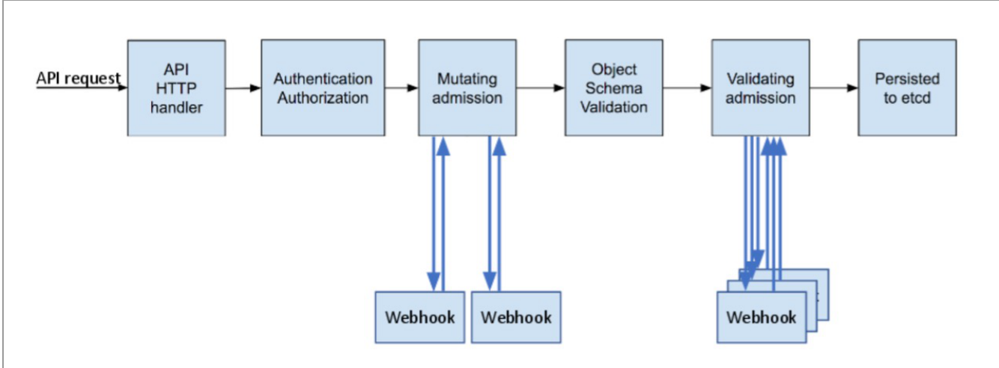
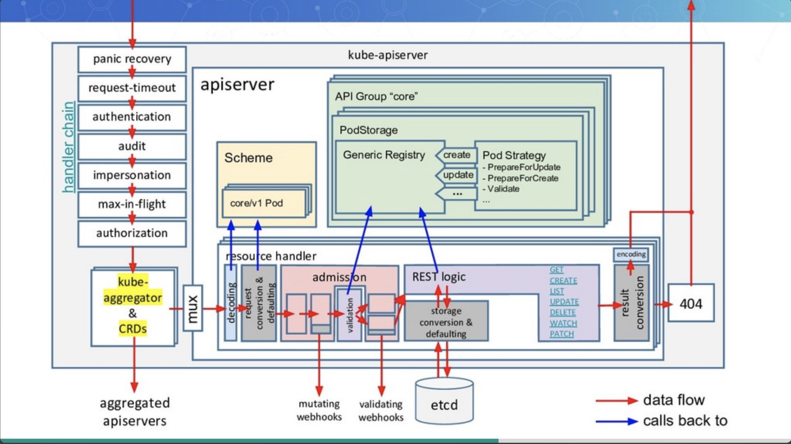

# API Server 访问控制
Kubernetes API的每个请求都会经过多阶段的访问控制之后才会被接受，这包括认证、授权以及
准入控制（Admission Control）等。



# API Server 基本架构



整体涉及：
- 认证
- 限流
- 授权
- 准入

# 启动主流程分析

1. 入口地址
- cmd/kube-apiserver/apiserver.go
- 初始化apiserver的 cmd 并执行

```golang
func main() {
	command := app.NewAPIServerCommand()
	code := cli.Run(command)
	os.Exit(code)
}

```
2. cmd/kube-apiserver/app/server.go:NewAPIServerCommand()

```golang
PersistentPreRunE: func(*cobra.Command, []string) error {
    // silence client-go warnings.
    // kube-apiserver loopback clients should not log self-issued warnings.
    rest.SetDefaultWarningHandler(rest.NoWarnings{})
    return nil
},
RunE: func(cmd *cobra.Command, args []string) error {
		
			//  设置默认 Options
			completedOptions, err := Complete(s)
			if err != nil {
				return err
			}

			// 校验 Options
			if errs := completedOptions.Validate(); len(errs) != 0 {
				return utilerrors.NewAggregate(errs)
			}
			
			// 添加Metrics特性
			utilfeature.DefaultMutableFeatureGate.AddMetrics()
			// 运行
			return Run(completedOptions, genericapiserver.SetupSignalHandler())
},
```

2. 默认 Options

kube-apiserver [命令行参数](https://kubernetes.io/zh-cn/docs/reference/command-line-tools-reference/kube-apiserver/)

3. Option校验

- 文件：/cmd/kube-apiserver/app/options/validation.go
```golang
// Validate checks ServerRunOptions and return a slice of found errs.
func (s *ServerRunOptions) Validate() []error {
	var errs []error
	if s.MasterCount <= 0 {
		errs = append(errs, fmt.Errorf("--apiserver-count should be a positive number, but value '%d' provided", s.MasterCount))
	}
	errs = append(errs, s.Etcd.Validate()...)
	errs = append(errs, validateClusterIPFlags(s)...)
	errs = append(errs, validateServiceNodePort(s)...)
	errs = append(errs, validateAPIPriorityAndFairness(s)...)
	errs = append(errs, s.SecureServing.Validate()...)
	errs = append(errs, s.Authentication.Validate()...)
	errs = append(errs, s.Authorization.Validate()...)
	errs = append(errs, s.Audit.Validate()...)
	errs = append(errs, s.Admission.Validate()...)
	errs = append(errs, s.APIEnablement.Validate(legacyscheme.Scheme, apiextensionsapiserver.Scheme, aggregatorscheme.Scheme)...)
	errs = append(errs, validateTokenRequest(s)...)
	errs = append(errs, s.Metrics.Validate()...)

	return errs
}

```

3. Run

就会调用 Run() 启动函数，并传递经过验证的选项配置 completeOptions 以及一个停止信号的通道 stopCh ，函数的定义如下：

- 文件： vendor/k8s.io/apiserver/pkg/server/signal.go
```golang
// SetupSignalHandler registered for SIGTERM and SIGINT. A stop channel is returned
// which is closed on one of these signals. If a second signal is caught, the program
// is terminated with exit code 1.
// Only one of SetupSignalContext and SetupSignalHandler should be called, and only can
// be called once.
func SetupSignalHandler() <-chan struct{} {
	return SetupSignalContext().Done()
}

// SetupSignalContext is same as SetupSignalHandler, but a context.Context is returned.
// Only one of SetupSignalContext and SetupSignalHandler should be called, and only can
// be called once.
func SetupSignalContext() context.Context {
	close(onlyOneSignalHandler) // panics when called twice

	shutdownHandler = make(chan os.Signal, 2)

	ctx, cancel := context.WithCancel(context.Background())
	signal.Notify(shutdownHandler, shutdownSignals...)
	go func() {
		<-shutdownHandler
		cancel()
		<-shutdownHandler
		os.Exit(1) // second signal. Exit directly.
	}()

	return ctx
}
```


```golang
// Run runs the specified APIServer.  This should never exit.
func Run(completeOptions completedServerRunOptions, stopCh <-chan struct{}) error {
    // 1、创建服务调用链
	server, err := CreateServerChain(completeOptions)
	if err != nil {
		return err
	}
    // 2、进行服务启动的准备工作
	prepared, err := server.PrepareRun()
	if err != nil {
		return err
	}
    // 3、服务启动
	return prepared.Run(stopCh)
}

```

- CreateServerChain ：创建服务调用链。该函数负责创建各种不同 API Server 的配置并初始化，最后构建出完整的 API Server 链式结构
- PrepareRun：服务启动前的准备工作。该函数负责进行健康检查、存活检查和 OpenAPI 路由的注册工作，以便 apiserver 能够顺利地运行
- Run：服务启动。该函数启动 HTTP Server 实例并开始监听和处理来自客户端的请求

4. 服务调用链的创建

[Kubernetes API 聚合层](https://kubernetes.io/zh-cn/docs/concepts/extend-kubernetes/api-extension/apiserver-aggregation/)

在这里会根据不同功能进行解耦，创建出三个不同的 API Server:

- AggregatorServer：API 聚合服务。用于实现 Kubernetes API 聚合层[1] 的功能，当 AggregatorServer 接收到请求之后，如果发现对应的是一个 APIService 的请求，则会直接转发到对应的服务上（自行编写和部署的 API 服务器），否则则委托给 KubeAPIServer 进行处理
- KubeAPIServer：API 核心服务。实现认证、鉴权以及所有 Kubernetes 内置资源的 REST API 接口（诸如 Pod 和 Service 等资源的接口），如果请求未能找到对应的处理，则委托给 APIExtensionsServer 进行处理
- APIExtensionsServer：API 扩展服务。处理 CustomResourceDefinitions（CRD）和 Custom Resource（CR）的 REST 请求（自定义资源的接口），如果请求仍不能被处理则委托给 404 Handler 处理

