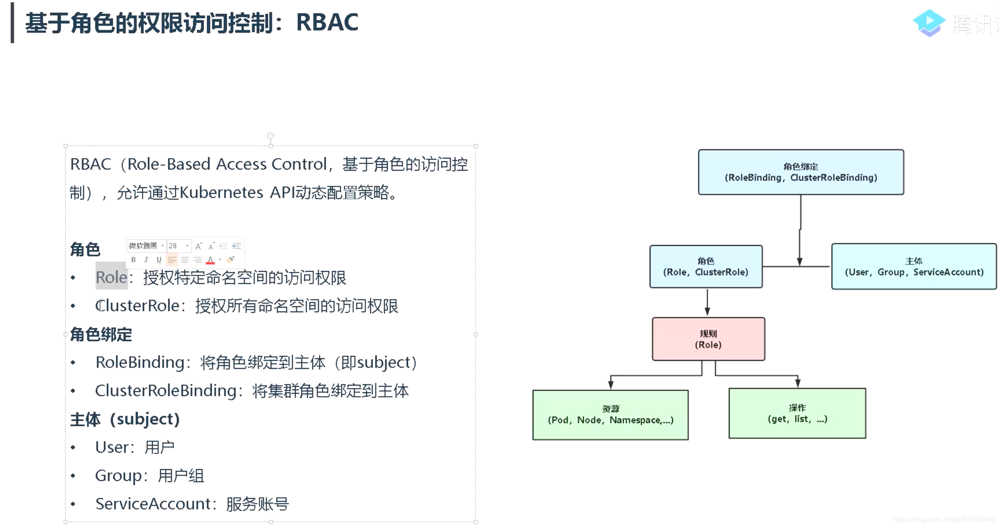

# RBAC 类型 Authorization

文档位置： https://kubernetes.io/zh-cn/docs/reference/access-authn-authz/rbac/

基于角色（Role）的访问控制（RBAC）是一种基于组织中用户的角色来调节控制对计算机或网络资源的访问的方法。

RBAC 鉴权机制使用 rbac.authorization.k8s.io API 组来驱动鉴权决定， 允许你通过 Kubernetes API 动态配置策略。

要启用 RBAC，在启动 API 服务器时将 --authorization-mode 参数设置为一个逗号分隔的列表并确保其中包含 RBAC。

```shell
kube-apiserver --authorization-mode=Example,RBAC --<其他选项> --<其他选项>
```

## RBAC 鉴权模型

1. Role , ClusterRole, RoleBinding, ClusterRoleBinding 四种对象



2. Role & ClusterRole 中 rules 规则

- 资源对象
- 非资源对象
- ApiGroups
- Verbs 动作

3. 鉴权代码核心逻辑

- 通过 informer 获取 clusterRoleBinding 列表，根据 user 匹配 subject， 通过 informer 获取 clusterRole 里 Rules, 遍历调用 visit 匹配
- 通过 informer 获取 roleBinding 列表，根据 user 和 namespace 匹配 subject， 通过 informer 获取 Role 里 Rules, 遍历调用 visit 匹配


## 源码分析

文件位置： /pkg/kubeapiserver/authorizer/config.go

```golang
		case modes.ModeRBAC:
			rbacAuthorizer := rbac.New(
				&rbac.RoleGetter{Lister: config.VersionedInformerFactory.Rbac().V1().Roles().Lister()},
				&rbac.RoleBindingLister{Lister: config.VersionedInformerFactory.Rbac().V1().RoleBindings().Lister()},
				&rbac.ClusterRoleGetter{Lister: config.VersionedInformerFactory.Rbac().V1().ClusterRoles().Lister()},
				&rbac.ClusterRoleBindingLister{Lister: config.VersionedInformerFactory.Rbac().V1().ClusterRoleBindings().Lister()},
			)
			authorizers = append(authorizers, rbacAuthorizer)
			ruleResolvers = append(ruleResolvers, rbacAuthorizer)
```

### 4种对象的 Getter

rbac.New 传入 Role, RoleBinding, ClusterRole, ClusterRoleBinding 4种对象的 Getter

实际上传入的这四种对象的 Lister 用于获取这四种对象。

其中一个 RoleLister 接口如下： 
- 获取 Role 列表
- 获取某个 namespace 下 Role 列表
- 获取某个 namespace 下 Role 

文件位置： /vendor/k8s.io/client-go/listers/rbac/v1/role.go

```golang

// RoleLister helps list Roles.
// All objects returned here must be treated as read-only.
type RoleLister interface {
	// List lists all Roles in the indexer.
	// Objects returned here must be treated as read-only.
	List(selector labels.Selector) (ret []*v1.Role, err error)
	// Roles returns an object that can list and get Roles.
	Roles(namespace string) RoleNamespaceLister
	RoleListerExpansion
}

// roleLister implements the RoleLister interface.
type roleLister struct {
	indexer cache.Indexer
}

// NewRoleLister returns a new RoleLister.
func NewRoleLister(indexer cache.Indexer) RoleLister {
	return &roleLister{indexer: indexer}
}

// List lists all Roles in the indexer.
func (s *roleLister) List(selector labels.Selector) (ret []*v1.Role, err error) {
	err = cache.ListAll(s.indexer, selector, func(m interface{}) {
		ret = append(ret, m.(*v1.Role))
	})
	return ret, err
}

// Roles returns an object that can list and get Roles.
func (s *roleLister) Roles(namespace string) RoleNamespaceLister {
	return roleNamespaceLister{indexer: s.indexer, namespace: namespace}
}

// RoleNamespaceLister helps list and get Roles.
// All objects returned here must be treated as read-only.
type RoleNamespaceLister interface {
	// List lists all Roles in the indexer for a given namespace.
	// Objects returned here must be treated as read-only.
	List(selector labels.Selector) (ret []*v1.Role, err error)
	// Get retrieves the Role from the indexer for a given namespace and name.
	// Objects returned here must be treated as read-only.
	Get(name string) (*v1.Role, error)
	RoleNamespaceListerExpansion
}

// roleNamespaceLister implements the RoleNamespaceLister
// interface.
type roleNamespaceLister struct {
	indexer   cache.Indexer
	namespace string
}

// List lists all Roles in the indexer for a given namespace.
func (s roleNamespaceLister) List(selector labels.Selector) (ret []*v1.Role, err error) {
	err = cache.ListAllByNamespace(s.indexer, s.namespace, selector, func(m interface{}) {
		ret = append(ret, m.(*v1.Role))
	})
	return ret, err
}

// Get retrieves the Role from the indexer for a given namespace and name.
func (s roleNamespaceLister) Get(name string) (*v1.Role, error) {
	obj, exists, err := s.indexer.GetByKey(s.namespace + "/" + name)
	if err != nil {
		return nil, err
	}
	if !exists {
		return nil, errors.NewNotFound(v1.Resource("role"), name)
	}
	return obj.(*v1.Role), nil
}

```

### RBACAuthorizer.Authorize 

文件位置： /plugin/pkg/auth/authorizer/rbac/rbac.go

#### 1.核心判断是 ruleCheckingVisitor.allowed 这个标志位， 如果 true 通过验证， 否则拒绝

```golang
func (r *RBACAuthorizer) Authorize(ctx context.Context, requestAttributes authorizer.Attributes) (authorizer.Decision, string, error) {
	ruleCheckingVisitor := &authorizingVisitor{requestAttributes: requestAttributes}

	r.authorizationRuleResolver.VisitRulesFor(requestAttributes.GetUser(), requestAttributes.GetNamespace(), ruleCheckingVisitor.visit)
	if ruleCheckingVisitor.allowed {
		return authorizer.DecisionAllow, ruleCheckingVisitor.reason, nil
	}
    
	
	 
	return authorizer.DecisionNoOpinion, reason, nil
}

```

#### 2.allowed 标志位在 visit 方法里设置，条件是 RuleAllows == true

```golang
func (v *authorizingVisitor) visit(source fmt.Stringer, rule *rbacv1.PolicyRule, err error) bool {
	if rule != nil && RuleAllows(v.requestAttributes, rule) {
		v.allowed = true
		v.reason = fmt.Sprintf("RBAC: allowed by %s", source.String())
		return false
	}
	if err != nil {
		v.errors = append(v.errors, err)
	}
	return true
}
```

#### 3.VisitRulesFor 调用 visitor 检查每一条 Rule

```golang
	r.authorizationRuleResolver.VisitRulesFor(requestAttributes.GetUser(), requestAttributes.GetNamespace(), ruleCheckingVisitor.visit)
```

#### 4.VisitRulesFor 先检查 ClusterRoleBinding 是否匹配

文件位置： /pkg/registry/rbac/validation/rule.go

```golang
	if clusterRoleBindings, err := r.clusterRoleBindingLister.ListClusterRoleBindings(); err != nil {
		if !visitor(nil, nil, err) {
			return
		}
	} else {
		sourceDescriber := &clusterRoleBindingDescriber{}
		for _, clusterRoleBinding := range clusterRoleBindings {
			subjectIndex, applies := appliesTo(user, clusterRoleBinding.Subjects, "")
			if !applies {
				continue
			}
			rules, err := r.GetRoleReferenceRules(clusterRoleBinding.RoleRef, "")
			if err != nil {
				if !visitor(nil, nil, err) {
					return
				}
				continue
			}
			sourceDescriber.binding = clusterRoleBinding
			sourceDescriber.subject = &clusterRoleBinding.Subjects[subjectIndex]
			for i := range rules {
				if !visitor(sourceDescriber, &rules[i], nil) {
					return
				}
			}
		}
	}
```

核心逻辑：
- 获取所有 ClusterRoleBinding, 遍历每个 ClusterRoleBinding
- 通过 appliesTo 检查每个 ClusterRoleBinding subject 是否和用户匹配，如果匹配，就范围匹配 subjectIndex
- 如果匹配，通过 r.GetRoleReferenceRules 获取 匹配 ClusterRoleBinding 的 Rules
- 遍历 Rules， 对 每个 Rule 调用 visitor 检查是否匹配。

#### 5.appliesTo 和 appliesToUser 方法分析

文件位置： /pkg/registry/rbac/validation/rule.go

```golang
// appliesTo returns whether any of the bindingSubjects applies to the specified subject,
// and if true, the index of the first subject that applies
func appliesTo(user user.Info, bindingSubjects []rbacv1.Subject, namespace string) (int, bool) {
	for i, bindingSubject := range bindingSubjects {
		if appliesToUser(user, bindingSubject, namespace) {
			return i, true
		}
	}
	return 0, false
}

func has(set []string, ele string) bool {
    for _, s := range set {
        if s == ele {
            return true
        }
    }
    return false
}


func appliesToUser(user user.Info, subject rbacv1.Subject, namespace string) bool {
	switch subject.Kind {
	case rbacv1.UserKind:
		return user.GetName() == subject.Name

	case rbacv1.GroupKind:
		return has(user.GetGroups(), subject.Name)

	case rbacv1.ServiceAccountKind:
		// default the namespace to namespace we're working in if its available.  This allows rolebindings that reference
		// SAs in th local namespace to avoid having to qualify them.
		saNamespace := namespace
		if len(subject.Namespace) > 0 {
			saNamespace = subject.Namespace
		}
		if len(saNamespace) == 0 {
			return false
		}
		// use a more efficient comparison for RBAC checking
		return serviceaccount.MatchesUsername(saNamespace, subject.Name, user.GetName())
	default:
		return false
	}
}

```
核心逻辑：
- 根据用户类型来判断
- 如果是普通用户，就用subject.Name来判断
- 如果是群组，看subject.Name 是否在用户群组列表里
- 如果是 ServicAccount， 用 serviceaccount.MatchesUsername func来判断

#### 6.serviceaccount.MatchesUsername 分析

文件位置： /vendor/k8s.io/apiserver/pkg/authentication/serviceaccount/util.go

```golang
const (
    ServiceAccountUsernamePrefix    = "system:serviceaccount:"
    ServiceAccountUsernameSeparator = ":"
    ServiceAccountGroupPrefix       = "system:serviceaccounts:"
    AllServiceAccountsGroup         = "system:serviceaccounts"
)
// MatchesUsername checks whether the provided username matches the namespace and name without
// allocating. Use this when checking a service account namespace and name against a known string.
func MatchesUsername(namespace, name string, username string) bool {
	if !strings.HasPrefix(username, ServiceAccountUsernamePrefix) {
		return false
	}
	username = username[len(ServiceAccountUsernamePrefix):]

	if !strings.HasPrefix(username, namespace) {
		return false
	}
	username = username[len(namespace):]

	if !strings.HasPrefix(username, ServiceAccountUsernameSeparator) {
		return false
	}
	username = username[len(ServiceAccountUsernameSeparator):]

	return username == name
}

```

服务账户（ServiceAccount） 的用户名前缀为 system:serviceaccount:，属于前缀为 system:serviceaccounts: 的用户组。

> 说明：
> system:serviceaccount: （单数）是用于服务账户用户名的前缀；
> system:serviceaccounts: （复数）是用于服务账户组名的前缀。
>

- 对于 kube-system 名字空间中的默认服务账户：

```yaml
subjects:
- kind: ServiceAccount
  name: default
  namespace: kube-system
```

- 对于 "qa" 名称空间中的所有服务账户：

```yaml
subjects:
- kind: Group
  name: system:serviceaccounts:qa
  apiGroup: rbac.authorization.k8s.io
```

- 对于在任何名字空间中的服务账户：
```yaml
 subjects:
 - kind: Group
   name: system:serviceaccounts
   apiGroup: rbac.authorization.k8s.io
```

- 对于所有已经过身份认证的用户：
```yaml
subjects:
- kind: Group
  name: system:authenticated
  apiGroup: rbac.authorization.k8s.io
```

- 对于所有未通过身份认证的用户：

```yaml
subjects:
- kind: Group
  name: system:unauthenticated
  apiGroup: rbac.authorization.k8s.io
```

- 对于所有用户：

```yaml
subjects:
- kind: Group
  name: system:authenticated
  apiGroup: rbac.authorization.k8s.io
- kind: Group
  name: system:unauthenticated
  apiGroup: rbac.authorization.k8s.io

```

serviceAccountName 格式 ：  system:serviceaccount: + namespace + ":" + name
serviceAccountGroup 格式：  system:serviceaccounts: + namespace

MatchesUsername 这个 func 代码就很容易理解

下面是组装 Username 和 GroupName 方法： 

```golang
// MakeUsername generates a username from the given namespace and ServiceAccount name.
// The resulting username can be passed to SplitUsername to extract the original namespace and ServiceAccount name.
func MakeUsername(namespace, name string) string {
	return ServiceAccountUsernamePrefix + namespace + ServiceAccountUsernameSeparator + name
}
// MakeNamespaceGroupName returns the name of the group all service accounts in the namespace are included in
func MakeNamespaceGroupName(namespace string) string {
    return ServiceAccountGroupPrefix + namespace
}

```

#### 7. 再根据 clusterRoleBind.RoleRef 从 informer 获取 Rules
```golang
        rules, err := r.GetRoleReferenceRules(clusterRoleBinding.RoleRef, "")
```
### 8. 遍历 Rules， 传入找到 clusterRoleBinding 调用 visit 进行比对

```golang
        sourceDescriber.binding = clusterRoleBinding
        sourceDescriber.subject = &clusterRoleBinding.Subjects[subjectIndex]
        for i := range rules {
            if !visitor(sourceDescriber, &rules[i], nil) {
                return
            }
        }
```
### 9. visit 中 RuleAllows 方法
文件位置： /plugin/pkg/auth/authorizer/rbac/rbac.go

```golang

func RuleAllows(requestAttributes authorizer.Attributes, rule *rbacv1.PolicyRule) bool {
	if requestAttributes.IsResourceRequest() {
		combinedResource := requestAttributes.GetResource()
		if len(requestAttributes.GetSubresource()) > 0 {
			combinedResource = requestAttributes.GetResource() + "/" + requestAttributes.GetSubresource()
		}

		return rbacv1helpers.VerbMatches(rule, requestAttributes.GetVerb()) &&
			rbacv1helpers.APIGroupMatches(rule, requestAttributes.GetAPIGroup()) &&
			rbacv1helpers.ResourceMatches(rule, combinedResource, requestAttributes.GetSubresource()) &&
			rbacv1helpers.ResourceNameMatches(rule, requestAttributes.GetName())
	}

	return rbacv1helpers.VerbMatches(rule, requestAttributes.GetVerb()) &&
		rbacv1helpers.NonResourceURLMatches(rule, requestAttributes.GetPath())
}

```

核心逻辑:
- 资源型需要同时匹配
  - Verb
  - APIGroup
  - Resource/SubResource
  - ResourceName
- 非资源型同时匹配
  - NonResourceURL
  - Verb

### 10. 再校验 RoleBinding
- 通过 informer 获取 roleBinding 列表

```golang
roleBindings, err := r.roleBindingLister.ListRoleBindings(namespace)
```

- 遍历对比 subject
```golang

            for _, roleBinding := range roleBindings {
				subjectIndex, applies := appliesTo(user, roleBinding.Subjects, namespace)
				if !applies {
					continue
				}
				
```
- 根据 informer 获取匹配到 roleBinding 的 rules 

```golang
    rules, err := r.GetRoleReferenceRules(roleBinding.RoleRef, namespace)
```
- 调用 visit 方法遍历 rule 进行匹配

```golang
                sourceDescriber.binding = roleBinding
				sourceDescriber.subject = &roleBinding.Subjects[subjectIndex]
				for i := range rules {
					if !visitor(sourceDescriber, &rules[i], nil) {
						return
					}
				}
```