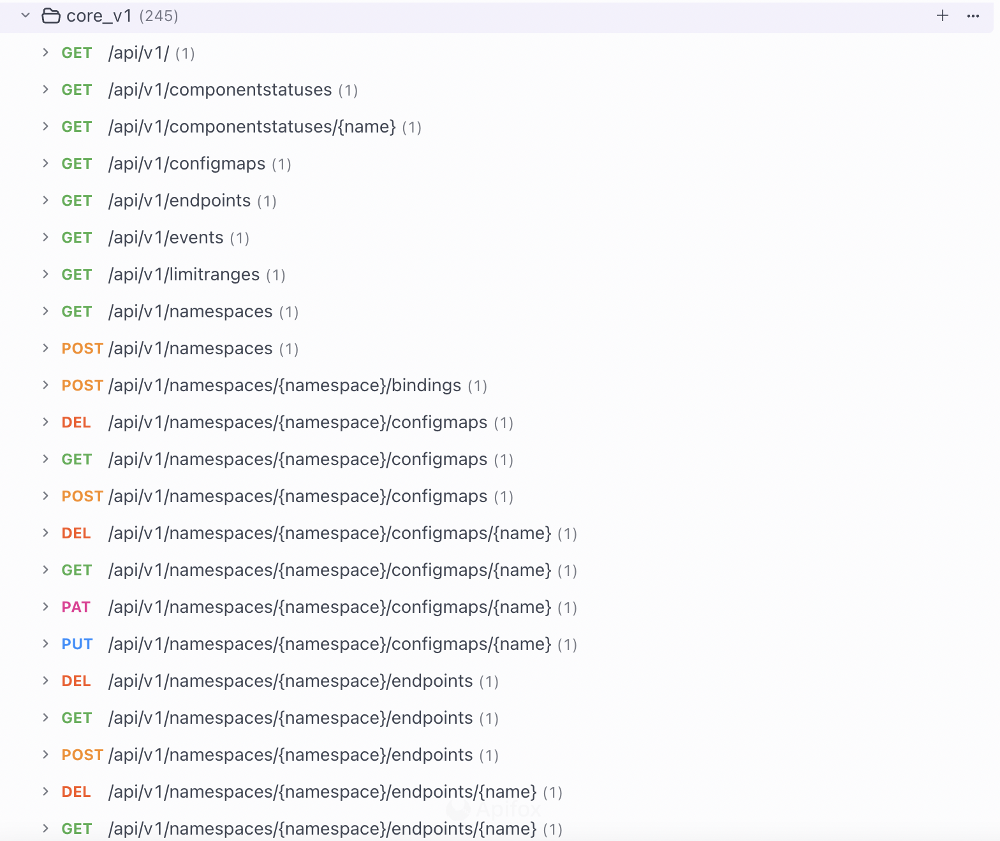

# KubeAPIServer 路由注册

回到初始化 KubeAPIServer 的 CreateKubeAPIServer 函数：

```golang
func CreateKubeAPIServer(kubeAPIServerConfig *controlplane.Config, delegateAPIServer genericapiserver.DelegationTarget) (*controlplane.Instance, error) {
 return kubeAPIServerConfig.Complete().New(delegateAPIServer)
}
```

kubeAPIServerConfig.Complete() 主要是用于确保 KubeAPIServer 的配置完整性和合法性，主要看 New 方法：


```golang

// pkg/controlplane/instance.go #357
func (c completedConfig) New(delegationTarget genericapiserver.DelegationTarget) (*Instance, error) {
 // ...
 // 创建 KubeAPIServer 委托对象
 s, err := c.GenericConfig.New("kube-apiserver", delegationTarget)
 if err != nil {
  return nil, err
 }

 // 稍后再看
}

// k8s.io/apiserver/pkg/server/config.go #665
func (c completedConfig) New(name string, delegationTarget DelegationTarget) (*GenericAPIServer, error) {
 // ... 
 //用于完整的处理程序链 FullHandlerChain 的构建
 handlerChainBuilder := func(handler http.Handler) http.Handler {
  return c.BuildHandlerChainFunc(handler, c.Config)
 }

 // ...
 // 创建 API Server 的 Handler 处理器
 apiServerHandler := NewAPIServerHandler(name, c.Serializer, handlerChainBuilder, delegationTarget.UnprotectedHandler())

 // 初始化 GenericAPIServer
 s := &GenericAPIServer{
  // ...
  Handler:                apiServerHandler,
  // ...
 }

 // ...
 // 注册 /、/debug/*、/metrics、/version、/apis 基本路由
 installAPI(s, c.Config)

 // ...
 
 
 
 return s, nil
}
```

## 1. installAPI 注册 /、/debug/*、/metrics、/version、/apis 基本路由

首先在 c.GenericConfig.New("kube-apiserver", delegationTarget) 中会调用 installAPI 来注册 /、/debug/*、/metrics、/version 、/apis 基本路由（这是三个服务都一样的流程）

```golang
// k8s.io/apiserver/pkg/server/config.go #962
func installAPI(s *GenericAPIServer, c *Config) {
	// 如果启用 index 功能， 注册 / , /index.html 路由
	if c.EnableIndex {
		routes.Index{}.Install(s.listedPathProvider, s.Handler.NonGoRestfulMux)
	}
   // 如果启用性能分析功能，注册 /debug/* 路由
	if c.EnableProfiling {
		routes.Profiling{}.Install(s.Handler.NonGoRestfulMux)
		if c.EnableContentionProfiling {
			goruntime.SetBlockProfileRate(1)
		}
		// so far, only logging related endpoints are considered valid to add for these debug flags.
		routes.DebugFlags{}.Install(s.Handler.NonGoRestfulMux, "v", routes.StringFlagPutHandler(logs.GlogSetter))
	}

   // 如果启用未进行认证授权的用于调试功能的 Socket 接口，为其注册 /debug/* 路由
	if s.UnprotectedDebugSocket != nil {
		s.UnprotectedDebugSocket.InstallProfiling()
		s.UnprotectedDebugSocket.InstallDebugFlag("v", routes.StringFlagPutHandler(logs.GlogSetter))
		if c.EnableContentionProfiling {
			goruntime.SetBlockProfileRate(1)
		}
	}

	// 如果启用指标功能，注册 /metrics 路由
	if c.EnableMetrics {
		if c.EnableProfiling {
			routes.MetricsWithReset{}.Install(s.Handler.NonGoRestfulMux)
			if utilfeature.DefaultFeatureGate.Enabled(features.ComponentSLIs) {
				slis.SLIMetricsWithReset{}.Install(s.Handler.NonGoRestfulMux)
			}
		} else {
			routes.DefaultMetrics{}.Install(s.Handler.NonGoRestfulMux)
			if utilfeature.DefaultFeatureGate.Enabled(features.ComponentSLIs) {
				slis.SLIMetrics{}.Install(s.Handler.NonGoRestfulMux)
			}
		}
	}

	// 注册 /version 路由
	routes.Version{Version: c.Version}.Install(s.Handler.GoRestfulContainer)

   // 如果启用服务发现功能，则注册 /apis 路由
	if c.EnableDiscovery {
		if utilfeature.DefaultFeatureGate.Enabled(genericfeatures.AggregatedDiscoveryEndpoint) {
			wrapped := discoveryendpoint.WrapAggregatedDiscoveryToHandler(s.DiscoveryGroupManager, s.AggregatedDiscoveryGroupManager)
			s.Handler.GoRestfulContainer.Add(wrapped.GenerateWebService("/apis", metav1.APIGroupList{}))
		} else {
			s.Handler.GoRestfulContainer.Add(s.DiscoveryGroupManager.WebService())
		}
	}

   // 启用流量控制器中间件，用于控制 API 请求优先级和公平性
	if c.FlowControl != nil && utilfeature.DefaultFeatureGate.Enabled(genericfeatures.APIPriorityAndFairness) {
		c.FlowControl.Install(s.Handler.NonGoRestfulMux)
	}
}

```

## 2. m.InstallLegacyAPI 注册 /api 开头核心 API

在 kubeAPIServerConfig.Complete().New(delegateAPIServer） func 后面开始注册 

```golang
// k8s.io/apiserver/pkg/server/config.go #665
func (c completedConfig) New(name string, delegationTarget DelegationTarget) (*GenericAPIServer, error) {

	// ...
	
	
	// 注册 /api 开头核心 API
	if err := m.InstallLegacyAPI(&c, c.GenericConfig.RESTOptionsGetter); err != nil {
     return nil, err
    }

	// ...
}
```

### InstallLegacyAPI 主要三步


- 各个资源创建 RESTStorage
- 将各种资源和对应的后端存储（etcd）的操作绑定
- 注册路由

先看一下 APIGroupInfo
- PrioritizedVersions: api group 和  version 信息
- VersionedResourcesStorageMap： 保存 这个 api group 下资源信息


```golang
// /vendor/k8s.io/apimachinery/pkg/runtime/schema/group_version.go #166
// GroupVersion contains the "group" and the "version", which uniquely identifies the API.
type GroupVersion struct {
	Group   string
	Version string
}


// Info about an API group.
type APIGroupInfo struct {
    PrioritizedVersions []schema.GroupVersion
    // Info about the resources in this group. It's a map from version to resource to the storage.
    VersionedResourcesStorageMap map[string]map[string]rest.Storage
    // OptionsExternalVersion controls the APIVersion used for common objects in the
    // schema like api.Status, api.DeleteOptions, and metav1.ListOptions. Other implementors may
    // define a version "v1beta1" but want to use the Kubernetes "v1" internal objects.
    // If nil, defaults to groupMeta.GroupVersion.
    // TODO: Remove this when https://github.com/kubernetes/kubernetes/issues/19018 is fixed.
    OptionsExternalVersion *schema.GroupVersion
    // MetaGroupVersion defaults to "meta.k8s.io/v1" and is the scheme group version used to decode
    // common API implementations like ListOptions. Future changes will allow this to vary by group
    // version (for when the inevitable meta/v2 group emerges).
    MetaGroupVersion *schema.GroupVersion
    
    // Scheme includes all of the types used by this group and how to convert between them (or
    // to convert objects from outside of this group that are accepted in this API).
    // TODO: replace with interfaces
    Scheme *runtime.Scheme
    // NegotiatedSerializer controls how this group encodes and decodes data
    NegotiatedSerializer runtime.NegotiatedSerializer
    // ParameterCodec performs conversions for query parameters passed to API calls
    ParameterCodec runtime.ParameterCodec
    
    // StaticOpenAPISpec is the spec derived from the definitions of all resources installed together.
    // It is set during InstallAPIGroups, InstallAPIGroup, and InstallLegacyAPIGroup.
    StaticOpenAPISpec map[string]*spec.Schema
}
```
```golang
// /vendor/k8s.io/apiserver/pkg/endpoints/groupversion.go #51
// APIGroupVersion is a helper for exposing rest.Storage objects as http.Handlers via go-restful
// It handles URLs of the form:
// /${storage_key}[/${object_name}]
// Where 'storage_key' points to a rest.Storage object stored in storage.
// This object should contain all parameterization necessary for running a particular API version
type APIGroupVersion struct {
	Storage map[string]rest.Storage

	Root string

	// GroupVersion is the external group version
	GroupVersion schema.GroupVersion

	// OptionsExternalVersion controls the Kubernetes APIVersion used for common objects in the apiserver
	// schema like api.Status, api.DeleteOptions, and metav1.ListOptions. Other implementors may
	// define a version "v1beta1" but want to use the Kubernetes "v1" internal objects. If
	// empty, defaults to GroupVersion.
	OptionsExternalVersion *schema.GroupVersion
	// MetaGroupVersion defaults to "meta.k8s.io/v1" and is the scheme group version used to decode
	// common API implementations like ListOptions. Future changes will allow this to vary by group
	// version (for when the inevitable meta/v2 group emerges).
	MetaGroupVersion *schema.GroupVersion

	// RootScopedKinds are the root scoped kinds for the primary GroupVersion
	RootScopedKinds sets.String

	// Serializer is used to determine how to convert responses from API methods into bytes to send over
	// the wire.
	Serializer     runtime.NegotiatedSerializer
	ParameterCodec runtime.ParameterCodec

	Typer                 runtime.ObjectTyper
	Creater               runtime.ObjectCreater
	Convertor             runtime.ObjectConvertor
	ConvertabilityChecker ConvertabilityChecker
	Defaulter             runtime.ObjectDefaulter
	Namer                 runtime.Namer
	UnsafeConvertor       runtime.ObjectConvertor
	TypeConverter         managedfields.TypeConverter

	EquivalentResourceRegistry runtime.EquivalentResourceRegistry

	// Authorizer determines whether a user is allowed to make a certain request. The Handler does a preliminary
	// authorization check using the request URI but it may be necessary to make additional checks, such as in
	// the create-on-update case
	Authorizer authorizer.Authorizer

	Admit admission.Interface

	MinRequestTimeout time.Duration

	// The limit on the request body size that would be accepted and decoded in a write request.
	// 0 means no limit.
	MaxRequestBodyBytes int64
}
```


```golang
// /pkg/controlplane/instance.go #580
// InstallLegacyAPI will install the legacy APIs for the restStorageProviders if they are enabled.
func (m *Instance) InstallLegacyAPI(c *completedConfig, restOptionsGetter generic.RESTOptionsGetter) error {

	//  LegacyAPI 中各个资源创建 RESTStorage
	legacyRESTStorageProvider := corerest.LegacyRESTStorageProvider{
		StorageFactory:              c.ExtraConfig.StorageFactory,
		ProxyTransport:              c.ExtraConfig.ProxyTransport,
		KubeletClientConfig:         c.ExtraConfig.KubeletClientConfig,
		EventTTL:                    c.ExtraConfig.EventTTL,
		ServiceIPRange:              c.ExtraConfig.ServiceIPRange,
		SecondaryServiceIPRange:     c.ExtraConfig.SecondaryServiceIPRange,
		ServiceNodePortRange:        c.ExtraConfig.ServiceNodePortRange,
		LoopbackClientConfig:        c.GenericConfig.LoopbackClientConfig,
		ServiceAccountIssuer:        c.ExtraConfig.ServiceAccountIssuer,
		ExtendExpiration:            c.ExtraConfig.ExtendExpiration,
		ServiceAccountMaxExpiration: c.ExtraConfig.ServiceAccountMaxExpiration,
		APIAudiences:                c.GenericConfig.Authentication.APIAudiences,
		Informers:                   c.ExtraConfig.VersionedInformers,
	}
	// 将各种资源和对应的后端存储（etcd）的操作绑定
	legacyRESTStorage, apiGroupInfo, err := legacyRESTStorageProvider.NewLegacyRESTStorage(c.ExtraConfig.APIResourceConfigSource, restOptionsGetter)

	// ...
	// 注册路由
	if err := m.GenericAPIServer.InstallLegacyAPIGroup(genericapiserver.DefaultLegacyAPIPrefix, &apiGroupInfo); err != nil {
		return fmt.Errorf("error in registering group versions: %v", err)
	}
	return nil
}
```

### InstallLegacyAPIGroup 路由注册

```golang
// /vendor/k8s.io/apiserver/pkg/server/genericapiserver.go #815
// InstallLegacyAPIGroup exposes the given legacy api group in the API.
// The <apiGroupInfo> passed into this function shouldn't be used elsewhere as the
// underlying storage will be destroyed on this servers shutdown.
func (s *GenericAPIServer) InstallLegacyAPIGroup(apiPrefix string, apiGroupInfo *APIGroupInfo) error {

	// ...
	// installAPIResources 看具体实现
	if err := s.installAPIResources(apiPrefix, apiGroupInfo, openAPIModels); err != nil {
		return err
	}
	// ...

	return nil
}

```
```golang
// /vendor/k8s.io/apiserver/pkg/server/genericapiserver.go #739
// installAPIResources is a private method for installing the REST storage backing each api groupversionresource
func (s *GenericAPIServer) installAPIResources(apiPrefix string, apiGroupInfo *APIGroupInfo, openAPIModels map[string]*spec.Schema) error {

	// ...
	var resourceInfos []*storageversion.ResourceInfo
	// 遍历获取 API 版本，目前对于 /api 路由只有 v1 一个版本
	
	for _, groupVersion := range apiGroupInfo.PrioritizedVersions {
	
		// ...
		// 根据路由前缀和版本（/api/v1）获取每个路由及其绑定的 RESTStorage 的 ApiGroupVersion 信息
		apiGroupVersion, err := s.getAPIGroupVersion(apiGroupInfo, groupVersion, apiPrefix)
		
		// 组装好了所有路由及其对应的 RESTStorage 后，开始进行路由注册
		discoveryAPIResources, r, err := apiGroupVersion.InstallREST(s.Handler.GoRestfulContainer)
        // ...

	}
	// ...
	return nil
}
```

### apiGroupVersion.InstallREST 路由注册

```golang

// InstallREST registers the REST handlers (storage, watch, proxy and redirect) into a restful Container.
// It is expected that the provided path root prefix will serve all operations. Root MUST NOT end
// in a slash.
func (g *APIGroupVersion) InstallREST(container *restful.Container) ([]apidiscoveryv2beta1.APIResourceDiscovery, []*storageversion.ResourceInfo, error) {
	prefix := path.Join(g.Root, g.GroupVersion.Group, g.GroupVersion.Version)
	installer := &APIInstaller{
		group:             g,
		prefix:            prefix,
		minRequestTimeout: g.MinRequestTimeout,
	}

	apiResources, resourceInfos, ws, registrationErrors := installer.Install()
	//...
	return aggregatedDiscoveryResources, removeNonPersistedResources(resourceInfos), utilerrors.NewAggregate(registrationErrors)
}
```
```golang
// /vendor/k8s.io/apiserver/pkg/endpoints/installer.go #184
// Install handlers for API resources.
func (a *APIInstaller) Install() ([]metav1.APIResource, []*storageversion.ResourceInfo, *restful.WebService, []error) {
	var apiResources []metav1.APIResource
	var resourceInfos []*storageversion.ResourceInfo
	var errors []error
	ws := a.newWebService()

	// 先对路径进行排序，以确保在不同的环境中生成的 Swagger 规范是相同的
	// Register the paths in a deterministic (sorted) order to get a deterministic swagger spec.
	paths := make([]string, len(a.group.Storage))
	var i int = 0
	for path := range a.group.Storage {
		paths[i] = path
		i++
	}
	sort.Strings(paths)
	for _, path := range paths {
		
		apiResource, resourceInfo, err := a.registerResourceHandlers(path, a.group.Storage[path], ws)
		// ...
	}
	return apiResources, resourceInfos, ws, errors
}
```

###  a.registerResourceHandlers 具体路由注册

registerResourceHandlers 方法，整整 800 多行代码，分开看，不看细节

先看下图： 核心 api 具体路由情况，有个大概了解 



1. 首先先判断 RESTStorage 支持的 verbs ，然后根据是否支持 namespace 选项来添加对应的 action ：

```golang
func (a *APIInstaller) registerResourceHandlers(path string, storage rest.Storage, ws *restful.WebService) (*metav1.APIResource, *storageversion.ResourceInfo, error) {
 // ...
 // 判断 RESTStorage 支持的 verbs
 creater, isCreater := storage.(rest.Creater)
 namedCreater, isNamedCreater := storage.(rest.NamedCreater)
 lister, isLister := storage.(rest.Lister)
 getter, isGetter := storage.(rest.Getter)
 getterWithOptions, isGetterWithOptions := storage.(rest.GetterWithOptions)
 gracefulDeleter, isGracefulDeleter := storage.(rest.GracefulDeleter)
 collectionDeleter, isCollectionDeleter := storage.(rest.CollectionDeleter)
 updater, isUpdater := storage.(rest.Updater)
 patcher, isPatcher := storage.(rest.Patcher)
 watcher, isWatcher := storage.(rest.Watcher)
 connecter, isConnecter := storage.(rest.Connecter)
 storageMeta, isMetadata := storage.(rest.StorageMetadata)
 storageVersionProvider, isStorageVersionProvider := storage.(rest.StorageVersionProvider)
 gvAcceptor, _ := storage.(rest.GroupVersionAcceptor)


 // ...
 // 根据资源是否支持 namespace 选项来添加对应的 action
 switch {
 case !namespaceScoped:
  // 非 namespace 作用域的资源，例如 nodes
  // ...省略
 default:
  // 支持 namespace 作用域的资源，例如 pods
  namespaceParamName := "namespaces"
  // Handler for standard REST verbs (GET, PUT, POST and DELETE).
  namespaceParam := ws.PathParameter("namespace", "object name and auth scope, such as for teams and projects").DataType("string")
  // 支持指定 namespace
  // 例如 /api/v1/pods 等同于 /api/v1/namespaces/default/pods
  namespacedPath := namespaceParamName + "/{namespace}/" + resource
  namespaceParams := []*restful.Parameter{namespaceParam}

  resourcePath := namespacedPath
  resourceParams := namespaceParams
  itemPath := namespacedPath + "/{name}"
  nameParams := append(namespaceParams, nameParam)
  proxyParams := append(nameParams, pathParam)
  itemPathSuffix := ""
  if isSubresource {
   itemPathSuffix = "/" + subresource
   itemPath = itemPath + itemPathSuffix
   resourcePath = itemPath
   resourceParams = nameParams
  }
  apiResource.Name = path
  apiResource.Namespaced = true
  apiResource.Kind = resourceKind
  namer := handlers.ContextBasedNaming{
   Namer:         a.group.Namer,
   ClusterScoped: false,
  }

  // 结合 RESTStorage 支持的 verbs，添加 action
  actions = appendIf(actions, action{"LIST", resourcePath, resourceParams, namer, false}, isLister)
  actions = appendIf(actions, action{"POST", resourcePath, resourceParams, namer, false}, isCreater)
  actions = appendIf(actions, action{"DELETECOLLECTION", resourcePath, resourceParams, namer, false}, isCollectionDeleter)
  // DEPRECATED in 1.11
  actions = appendIf(actions, action{"WATCHLIST", "watch/" + resourcePath, resourceParams, namer, false}, allowWatchList)

  actions = appendIf(actions, action{"GET", itemPath, nameParams, namer, false}, isGetter)
  if getSubpath {
   actions = appendIf(actions, action{"GET", itemPath + "/{path:*}", proxyParams, namer, false}, isGetter)
  }
  actions = appendIf(actions, action{"PUT", itemPath, nameParams, namer, false}, isUpdater)
  actions = appendIf(actions, action{"PATCH", itemPath, nameParams, namer, false}, isPatcher)
  actions = appendIf(actions, action{"DELETE", itemPath, nameParams, namer, false}, isGracefulDeleter)
  // DEPRECATED in 1.11
  actions = appendIf(actions, action{"WATCH", "watch/" + itemPath, nameParams, namer, false}, isWatcher)
  actions = appendIf(actions, action{"CONNECT", itemPath, nameParams, namer, false}, isConnecter)
  actions = appendIf(actions, action{"CONNECT", itemPath + "/{path:*}", proxyParams, namer, false}, isConnecter && connectSubpath)

  // list or post across namespace.
  // For ex: LIST all pods in all namespaces by sending a LIST request at /api/apiVersion/pods.
  // TODO: more strongly type whether a resource allows these actions on "all namespaces" (bulk delete)
  if !isSubresource {
   actions = appendIf(actions, action{"LIST", resource, params, namer, true}, isLister)
   // DEPRECATED in 1.11
   actions = appendIf(actions, action{"WATCHLIST", "watch/" + resource, params, namer, true}, allowWatchList)
  }
 }

 // ...
 return &apiResource, resourceInfo, nil
}

```

2. 最后就可以根据每个 action 来添加对应的 handler 并注册到路由中，以 GET 为例：

```golang
func (a *APIInstaller) registerResourceHandlers(path string, storage rest.Storage, ws *restful.WebService) (*metav1.APIResource, *storageversion.ResourceInfo, error) {
 // ...

 for _, action := range actions {

  switch action.Verb {
  case "GET": // Get a resource.
    // 初始化 handler
    var handler restful.RouteFunction
    if isGetterWithOptions {
        handler = restfulGetResourceWithOptions(getterWithOptions, reqScope, isSubresource)
    } else {
        handler = restfulGetResource(getter, reqScope)
    }
    
    if needOverride {
    // need change the reported verb
        handler = metrics.InstrumentRouteFunc(verbOverrider.OverrideMetricsVerb(action.Verb), group, version, resource, subresource, requestScope, metrics.APIServerComponent, deprecated, removedRelease, handler)
    } else {
        handler = metrics.InstrumentRouteFunc(action.Verb, group, version, resource, subresource, requestScope, metrics.APIServerComponent, deprecated, removedRelease, handler)
    }
        handler = utilwarning.AddWarningsHandler(handler, warnings)
    
    doc := "read the specified " + kind
    if isSubresource {
        doc = "read " + subresource + " of the specified " + kind
    }
	
    // 使用 go-restful 的路由注册方法
    route := ws.GET(action.Path).To(handler).
    Doc(doc).
    Param(ws.QueryParameter("pretty", "If 'true', then the output is pretty printed.")).
    Operation("read"+namespaced+kind+strings.Title(subresource)+operationSuffix).
    Produces(append(storageMeta.ProducesMIMETypes(action.Verb), mediaTypes...)...).
    Returns(http.StatusOK, "OK", producedObject).
    Writes(producedObject)
    if isGetterWithOptions {
        if err := AddObjectParams(ws, route, versionedGetOptions); err != nil {
        return nil, nil, err
        }
    }
    addParams(route, action.Params)
    routes = append(routes, route)
  case "LIST": // List all resources of a kind.
   // ...
  case "PUT": // Update a resource.
   // ...
  case "PATCH": // Partially update a resource
   // ...
  case "POST": // Create a resource.
   // ...
  case "DELETE": // Delete a resource.
   // ...
  case "DELETECOLLECTION":
   // ...
  // deprecated in 1.11
  case "WATCH": // Watch a resource.
   // ...
  // deprecated in 1.11
  case "WATCHLIST": // Watch all resources of a kind.
   // ...
  case "CONNECT":
   // ...
  default:
   return nil, nil, fmt.Errorf("unrecognized action verb: %s", action.Verb)
  }
  for _, route := range routes {
   route.Metadata(ROUTE_META_GVK, metav1.GroupVersionKind{
    Group:   reqScope.Kind.Group,
    Version: reqScope.Kind.Version,
    Kind:    reqScope.Kind.Kind,
   })
   route.Metadata(ROUTE_META_ACTION, strings.ToLower(action.Verb))

   // 使用 go-restful 的路由注册方法
   ws.Route(route)
  }
  // Note: update GetAuthorizerAttributes() when adding a custom handler.
 }

 // ...
 return &apiResource, resourceInfo, nil
}
```

到这里，所有路由注册就完成了。

## 3. m.InstallAPIs  注册 /apis 开头的路由

最后的 /apis/* 路由的注册，即 InstallAPIs 方法，其主要流程和 InstallLegacyAPI 方法是一致的。


## Reference
* https://mp.weixin.qq.com/s/mbbNEnx_yhJKlzu3TvLh4A