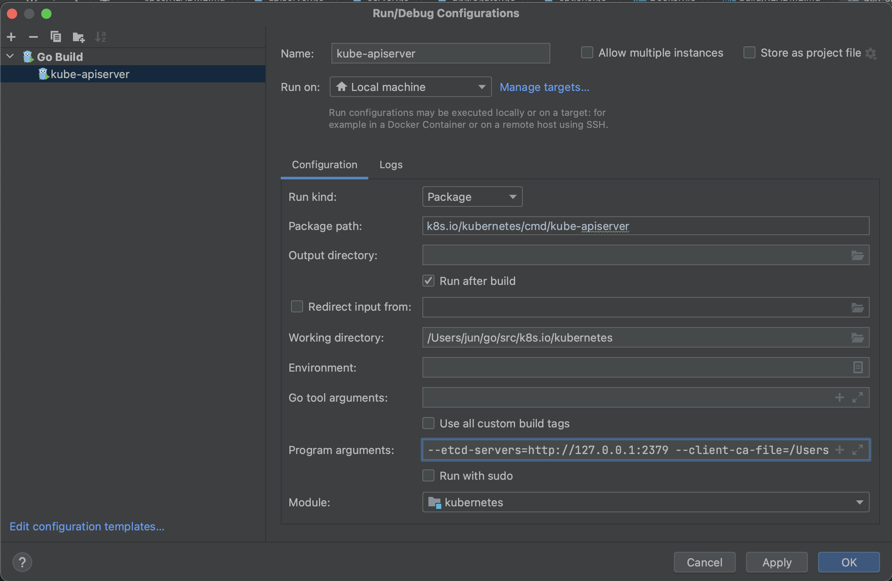
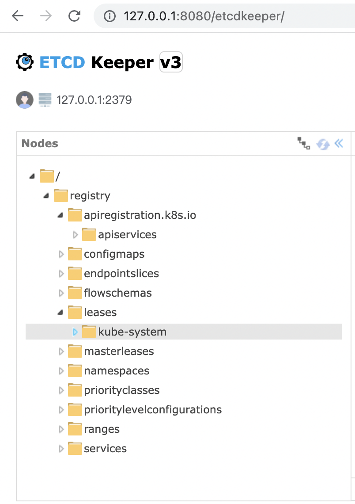
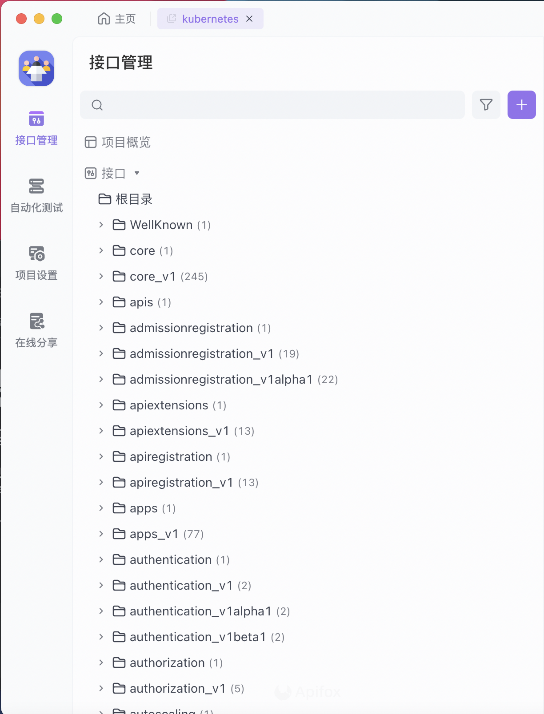

# Api Server 本地调试环境搭建

## Etcd 本地单机版本搭建

1. 使用 etcdkeeper 可视化管理etcd

https://github.com/evildecay/etcdkeeper/releases/

2. 安装 etcd
安装 ：https://etcd.io/docs/v3.5/install/

```shell
$ brew update
$ brew install etcd
$ etcd --version
```
3. 启动 etcd 和 测试

```shell
$ etcd
{"level":"info","ts":"2021-09-17T09:19:32.783-0400","caller":"etcdmain/etcd.go:72","msg":... }

$ etcdctl put greeting "Hello, etcd"
$ etcdctl get greeting
```

## 启动 etcdkeeper
```shell
$ ./etcdkeeper
2023-06-22 07:43:44.741555 I | listening on 0.0.0.0:8080
2023-06-22 07:43:57.062496 I | POST v3 connect success.
2023-06-22 07:43:57.073476 I | GET v3 /
```

## openssl & 证书配置
1. 生成一个 2048 位的 ca.key 文件
```shel
openssl genrsa -out ca.key 2048
```

2. 在 ca.key 文件的基础上，生成 ca.crt 文件（用参数 -days 设置证书有效期）

```shell
openssl req -x509 -new -nodes -key ca.key -subj "/CN=${MASTER_IP}" -days 10000 -out ca.crt
```
3. 生成一个 2048 位的 server.key 文件：
```shell
openssl genrsa -out server.key 2048
```
4. 创建一个用于生成证书签名请求（CSR）的配置文件。

保存文件（例如：csr.conf）前，记得用真实值替换掉尖括号中的值（例如：<MASTER_IP>）。 注意：MASTER_CLUSTER_IP 就像前一小节所述，它的值是 API 服务器的服务集群 IP。 下面的例子假定你的默认 DNS 域名为 cluster.local。

```shell
[ req ]
default_bits = 2048
prompt = no
default_md = sha256
req_extensions = req_ext
distinguished_name = dn

[ dn ]
C = <country>
ST = <state>
L = <city>
O = <organization>
OU = <organization unit>
CN = <MASTER_IP>

[ req_ext ]
subjectAltName = @alt_names

[ alt_names ]
DNS.1 = kubernetes
DNS.2 = kubernetes.default
DNS.3 = kubernetes.default.svc
DNS.4 = kubernetes.default.svc.cluster
DNS.5 = kubernetes.default.svc.cluster.local
IP.1 = <MASTER_IP>
IP.2 = <MASTER_CLUSTER_IP>

[ v3_ext ]
authorityKeyIdentifier=keyid,issuer:always
basicConstraints=CA:FALSE
keyUsage=keyEncipherment,dataEncipherment
extendedKeyUsage=serverAuth,clientAuth
subjectAltName=@alt_names

```
5. 基于上面的配置文件生成证书签名请求：

```shell
openssl req -new -key server.key -out server.csr -config csr.conf
```
6. 基于 ca.key、ca.crt 和 server.csr 等三个文件生成服务端证书：

```shell
openssl x509 -req -in server.csr -CA ca.crt -CAkey ca.key \
    -CAcreateserial -out server.crt -days 10000 \
    -extensions v3_ext -extfile csr.conf -sha256
```
7. 查看证书签名请求：

```shell
openssl req  -noout -text -in ./server.csr
```
8. 查看证书：

```shell
openssl x509  -noout -text -in ./server.crt
```

9.在 API 服务器的启动参数中添加以下参数：

将生成的证书（ca.crt、server.crt , server.key）拷贝到自定义目录（例如：cert），并添加到 apiserver 的启动参数中：

```shell
--client-ca-file=cert/ca.crt
--tls-cert-file=cert/server.crt
--tls-private-key-file=cert/server.key
```

10. service account 证书

pod 访问 kube-apiserver 还需要用到 service account 证书（pki/private/ca.key），需要指定服务帐号令牌颁发者 ：

```shell
--service-account-issuer=api
--service-account-key-file=cert/ca.crt
--service-account-signing-key-file=cert/ca.key
```
11. api server 启动参数

```shell
--etcd-servers=http://127.0.0.1:2379 --client-ca-file=cert/ca.crt --tls-cert-file=cert/server.crt --tls-private-key-file=cert/server.key --service-account-issuer=api --service-account-key-file=cert/ca.crt --service-account-signing-key-file=cert/ca.key

```

12.  client证书

apiserver 启动成功后，可以直接使用 curl 充当一个客户端调用 apiserver 的接口，但是得先为客户端创建客户端证书：

```shell
# 生成客户端私钥
openssl genrsa -out cert/client.key 2048
# 生成证书签名请求（CSR）
openssl req -new -key cert/client.key -out cert/client.csr -subj "/CN=dev"
# 使用 kube-apiserver 的 CA 签署 CSR，生成客户端证书
openssl x509 -req -in cert/client.csr -CA cert/ca.crt -CAkey cert/ca.key -CAcreateserial -out cert/client.crt -days 365
```

13. 在 goland 启动 api server 

编辑Run/Debug configuration 



api server 启动日志

```shell
GOROOT=/usr/local/go #gosetup
GOPATH=/Users/jun/go #gosetup
/usr/local/go/bin/go build -o /private/var/folders/9h/tj14s47n02lcj994fvg3y9340000gn/T/GoLand/___go_build_k8s_io_kubernetes_cmd_kube_apiserver k8s.io/kubernetes/cmd/kube-apiserver #gosetup
/private/var/folders/9h/tj14s47n02lcj994fvg3y9340000gn/T/GoLand/___go_build_k8s_io_kubernetes_cmd_kube_apiserver --etcd-servers=http://127.0.0.1:2379 --client-ca-file=/Users/jun/go/src/github.com/2456868764/k8s-learning/k8s/apiserver/cert/ca.crt --tls-cert-file=/Users/jun/go/src/github.com/2456868764/k8s-learning/k8s/apiserver/cert/server.crt --tls-private-key-file=/Users/jun/go/src/github.com/2456868764/k8s-learning/k8s/apiserver/cert/server.key --service-account-issuer=api --service-account-key-file=/Users/jun/go/src/github.com/2456868764/k8s-learning/k8s/apiserver/cert/ca.crt --service-account-signing-key-file=/Users/jun/go/src/github.com/2456868764/k8s-learning/k8s/apiserver/cert/ca.key
W0622 11:20:35.203306   85496 services.go:37] No CIDR for service cluster IPs specified. Default value which was 10.0.0.0/24 is deprecated and will be removed in future releases. Please specify it using --service-cluster-ip-range on kube-apiserver.
I0622 11:20:35.203444   85496 server.go:551] external host was not specified, using 192.168.31.72
W0622 11:20:35.203459   85496 authentication.go:525] AnonymousAuth is not allowed with the AlwaysAllow authorizer. Resetting AnonymousAuth to false. You should use a different authorizer
I0622 11:20:35.206766   85496 server.go:165] Version: v0.0.0-master+$Format:%H$
I0622 11:20:35.206780   85496 server.go:167] "Golang settings" GOGC="" GOMAXPROCS="" GOTRACEBACK=""
I0622 11:20:35.473753   85496 plugins.go:158] Loaded 11 mutating admission controller(s) successfully in the following order: NamespaceLifecycle,LimitRanger,ServiceAccount,TaintNodesByCondition,Priority,DefaultTolerationSeconds,DefaultStorageClass,StorageObjectInUseProtection,RuntimeClass,DefaultIngressClass,MutatingAdmissionWebhook.
I0622 11:20:35.473778   85496 plugins.go:161] Loaded 13 validating admission controller(s) successfully in the following order: LimitRanger,ServiceAccount,PodSecurity,Priority,PersistentVolumeClaimResize,RuntimeClass,CertificateApproval,CertificateSigning,ClusterTrustBundleAttest,CertificateSubjectRestriction,ValidatingAdmissionPolicy,ValidatingAdmissionWebhook,ResourceQuota.
I0622 11:20:35.481896   85496 handler.go:232] Adding GroupVersion apiextensions.k8s.io v1 to ResourceManager
W0622 11:20:35.481920   85496 genericapiserver.go:752] Skipping API apiextensions.k8s.io/v1beta1 because it has no resources.
I0622 11:20:35.482800   85496 instance.go:282] Using reconciler: lease

```

etcd keeper 查看 etcd 内容



14. curl 测试

```shell
$ curl --cacert cert/ca.crt --cert cert/client.crt --key cert/client.key https://127.0.0.1:6443/version

{
  "major": "",
  "minor": "",
  "gitVersion": "v0.0.0-master+$Format:%H$",
  "gitCommit": "$Format:%H$",
  "gitTreeState": "",
  "buildDate": "1970-01-01T00:00:00Z",
  "goVersion": "go1.20.4",
  "compiler": "gc",
  "platform": "darwin/arm64"
}
```

15. kubectl 

```shell
# 添加新集群（apiserver地址和ca证书）
kubectl config set-cluster devk8s --server=https://127.0.0.1:6443 --certificate-authority=cert/ca.crt
# 添加用户（客户端证书）
kubectl config set-credentials dev --client-certificate=cert/client.crt --client-key=cert/client.key
# 添加上下文（绑定集群和用户）
kubectl config set-context devk8s --user=dev --cluster=devk8s
# 切换当前上下文
kubectl config use-context devk8s
```

```shell
kubectl get ns
NAME              STATUS   AGE
default           Active   19m
kube-node-lease   Active   19m
kube-public       Active   19m
kube-system       Active   19m

```
```shell
kubectl create sa default
```

```shell
cat <<EOF | kubectl apply -f - 
apiVersion: v1
kind: Pod
metadata:
  name: nginx
spec:
  containers:
  - name: nginx
    image: nginx:latest
    ports:
    - containerPort: 80
```
```shell
kubectl get pods -owide
NAME    READY   STATUS    RESTARTS   AGE   IP       NODE     NOMINATED NODE   READINESS GATES
nginx   0/1     Pending   0          13s   <none>   <none>   <none>           <none>
```


## OpenApi Swagger导入

把 api/openapi-spec/swagger.json 到入到 api 管理工具 apifox, 



## Reference
- 
https://kubernetes.io/zh-cn/docs/reference/command-line-tools-reference/kube-apiserver
- 
https://kubernetes.io/zh-cn/docs/tasks/administer-cluster/certificates/#distributing-self-signed-ca-certificate