# 调度器原理

文档位置： https://kubernetes.io/zh-cn/docs/concepts/scheduling-eviction/

调度器通过 Kubernetes 的监测（Watch）机制来发现集群中新创建且尚未被调度到节点上的 Pod。 调度器会将所发现的每一个未调度的 Pod 调度到一个合适的节点上来运行。 

## 调度概览

1. 调度概览


2. 调度时机

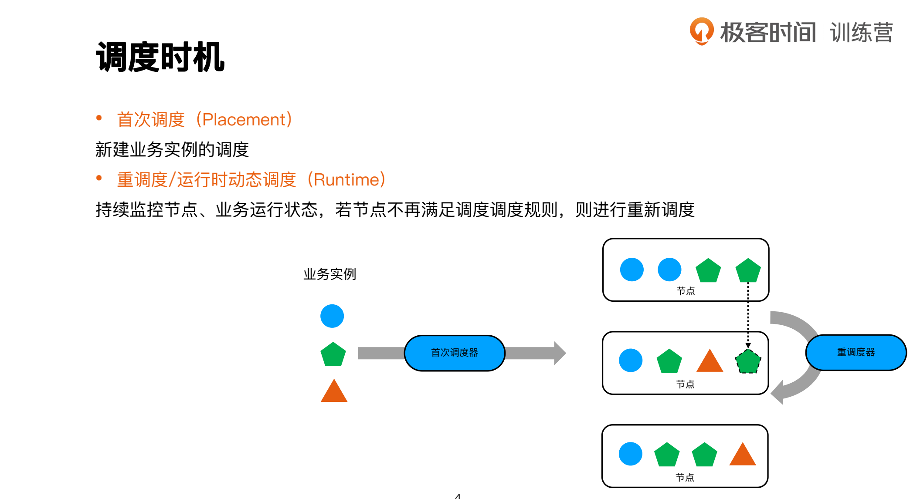

3. 调度器分类
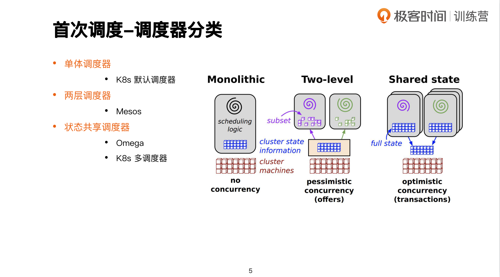

- 单体调度器：对于大规模批量调度诉求场景，不能胜任！(基于pod的事件调度)！ 
- 两层调度器：应用平台--hadoop,spark；资源调度器(负责底层计算资源的管理)，应用调度器；resource offers，存在的问题：1.资源争抢如何解决？2.分配资源不合理如何处理 解决办法：悲观锁 先锁定资源，再进行资源的腾挪处理。-->效率不高 
- 状态共享调度器：基于版本控制/事务控制的基于乐观锁的调度！ full state,本地缓存，回写，冲突判断，重试。

4. 调度器需要充分考虑诸多的因素


- 资源高效利用：装箱率要高！ 
- affinity：微服务，分步式系统，网络调用，本机调用，排除了网络调用，额外的传输时间，物理网卡带宽限制！ 
- anti-affinity：某个业务的不同副本，不能让其跑在一台机器上，一个机架上，一个地域里，使其分布在不同的故障域。
- locality：数据本地化，是一个很重要的概念，哪里有数据，我的作业就去哪里，这样可以减少数据拷贝的开销。k8s里的拉取镜像。


## 默认调度器 
kube-scheduler 是 Kubernetes 集群的默认调度器，并且是集群控制面的一部分。 如果你真得希望或者有这方面的需求，kube-scheduler 在设计上允许你自己编写一个调度组件并替换原有的 kube-scheduler。

Kube-scheduler 选择一个最佳节点来运行新创建的或尚未调度（unscheduled）的 Pod。 由于 Pod 中的容器和 Pod 本身可能有不同的要求，调度程序会过滤掉任何不满足 Pod 特定调度需求的节点。 或者，API 允许你在创建 Pod 时为它指定一个节点，但这并不常见，并且仅在特殊情况下才会这样做。

在一个集群中，满足一个 Pod 调度请求的所有节点称之为 可调度节点。 如果没有任何一个节点能满足 Pod 的资源请求， 那么这个 Pod 将一直停留在未调度状态直到调度器能够找到合适的 Node。

调度器先在集群中找到一个 Pod 的所有可调度节点，然后根据一系列函数对这些可调度节点打分， 选出其中得分最高的节点来运行 Pod。之后，调度器将这个调度决定通知给 kube-apiserver，这个过程叫做 绑定。

在做调度决定时需要考虑的因素包括：单独和整体的资源请求、硬件/软件/策略限制、 亲和以及反亲和要求、数据局部性、负载间的干扰等等。

Pod 是 Kubernetes 中最小的调度单元，Pod 被创建出来的工作流程如图所示：


在这张图中: 
- 第一步通过 apiserver REST API 创建一个 Pod。
- 然后 apiserver 接收到数据后将数据写入到 etcd 中。
- 由于 kube-scheduler 通过 apiserver watch API 一直在监听资源的变化，这个时候发现有一个新的 Pod，但是这个时候该 Pod 还没和任何 Node 节点进行绑定，所以 kube-scheduler 就进行调度，选择出一个合适的 Node 节点，将该 Pod 和该目标 Node 进行绑定。绑定之后再更新消息到 etcd 中。
- 这个时候一样的目标 Node 节点上的 kubelet 通过 apiserver watch API 检测到有一个新的 Pod 被调度过来了，他就将该 Pod 的相关数据传递给后面的容器运行时(container runtime)，比如 Docker，让他们去运行该 Pod。
- 而且 kubelet 还会通过 container runtime 获取 Pod 的状态，然后更新到 apiserver 中，当然最后也是写入到 etcd 中去的。

整个过程中最重要的就是 apiserver watch API 和 kube-scheduler 的调度策略。

Kube-scheduler 的主要作用就是根据特定的调度算法和调度策略将 Pod 调度到合适的 Node 节点上去。

启动之后会一直监听 API Server，获取到 

```shell
PodSpec.NodeName
```
为空的 Pod，对每个 Pod 都会创建一个 binding。


这个过程在我们看来好像比较简单，但在实际的生产环境中，需要考虑的问题就有很多了:

- 如何保证全部的节点调度的公平性？要知道并不是所有节点资源配置一定都是一样的
- 如何保证每个节点都能被分配资源？
- 集群资源如何能够被高效利用？
- 集群资源如何才能被最大化使用？
- 如何保证 Pod 调度的性能和效率？(假设说有1w个节点，我是否可以在其中1k个节点上进行筛选呢，这样就可以大幅度提高调度效率了 )
- 用户是否可以根据自己的实际需求定制自己的调度策略？


调度主要分为以下几个部分：

- 首先是预选过程，过滤掉不满足条件的节点，这个过程称为Predicates（过滤）
- 然后是优选过程，对通过的节点按照优先级排序，称之为Priorities（打分）
- 最后从中选择优先级最高的节点，如果中间任何一步骤有错误，就直接返回错误

过滤阶段会将所有满足 Pod 调度需求的节点选出来。 例如，PodFitsResources 过滤函数会检查候选节点的可用资源能否满足 Pod 的资源请求。 在过滤之后，得出一个节点列表，里面包含了所有可调度节点；通常情况下， 这个节点列表包含不止一个节点。如果这个列表是空的，代表这个 Pod 不可调度。

在打分阶段，调度器会为 Pod 从所有可调度节点中选取一个最合适的节点。 根据当前启用的打分规则，调度器会给每一个可调度节点进行打分。

最后，kube-scheduler 会将 Pod 调度到得分最高的节点上。 如果存在多个得分最高的节点，kube-scheduler 会从中随机选取一个。


> - 如果你的pod处于pending状态，那么一定就是调度器出现了问题，那么原因会很多，有可能是你的node资源不足，有可能是你的节点已经被占用了……(因此需要使用kubectl describle pod xxx来查看原因)
> - 所谓的binding操作就是如下： $ kubectl get pod nginx  -oyaml …… nodeName: node2 #将pod的配置清单的nodeName字段补充完成。 ……

下面是调度过程的简单示意图：

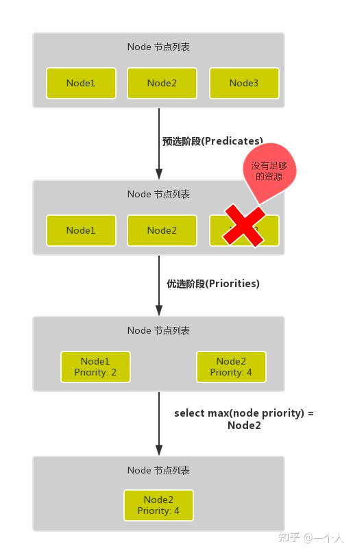

更详细的流程是这样的：

- 首先，客户端通过 API Server 的 REST API 或者 kubectl 工具创建 Pod 资源
- API Server 收到用户请求后，存储相关数据到 etcd 数据库中
- 调度器监听 API Server 查看到还未被调度(bind)的 Pod 列表，循环遍历地为每个 Pod 尝试分配节点，这个分配过程就是我们上面提到的两个阶段：
- 预选阶段(Predicates)，过滤节点，调度器用一组规则过滤掉不符合要求的 Node 节点，比如 Pod 设置了资源的 request，那么可用资源比 Pod 需要的资源少的主机显然就会被过滤掉。
- 优选阶段(Priorities)，为节点的优先级打分，将上一阶段过滤出来的 Node 列表进行打分，调度器会考虑一些整体的优化策略，比如把 Deployment 控制的多个 Pod 副本尽量分布到不同的主机上，使用最低负载的主机等等策略。
- 经过上面的阶段过滤后选择打分最高的 Node 节点和 Pod 进行 binding 操作，然后将结果存储到 etcd 中， 最后被选择出来的 Node 节点对应的 kubelet 去执行创建 Pod 的相关操作（当然也是 watch APIServer 发现的）。


### 1. 调度插件:

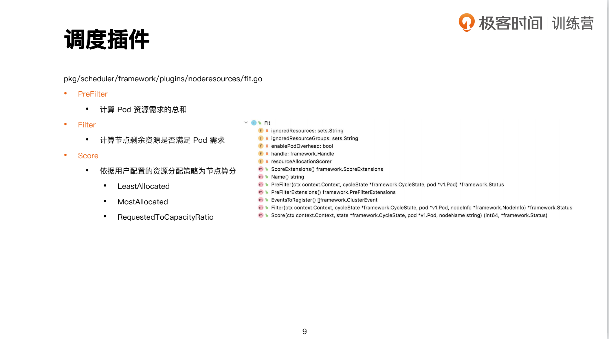

- LeastAllocated：空闲资源多的分高 --使的node上的负载比较合理一点！ 
- MostAllocated：空闲资源少的分高 -- 可以退回Node资源！


### 2. Predicates plugin工作原理 
链式过滤器:

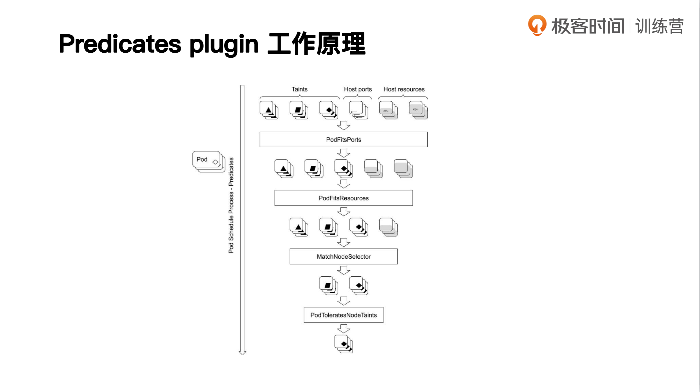

### 3. kubernetes 中的资源分配

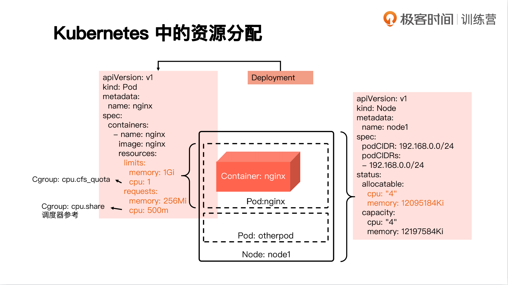

### 4. 节点上进程调度
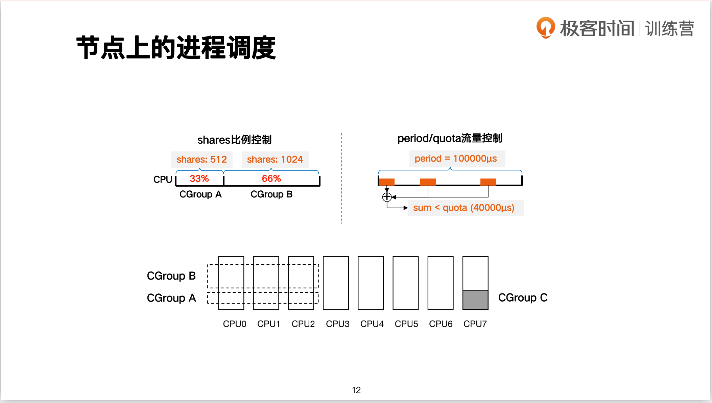

### 5. nodeSelector
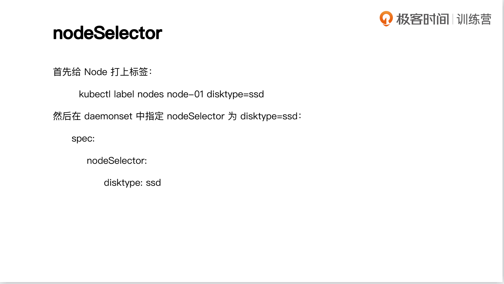
### 6. NodeAffinity


### 7. podAffinity


### 8. Taints 和 Tolerations
文档位置： https://kubernetes.io/zh-cn/docs/concepts/scheduling-eviction/taint-and-toleration/

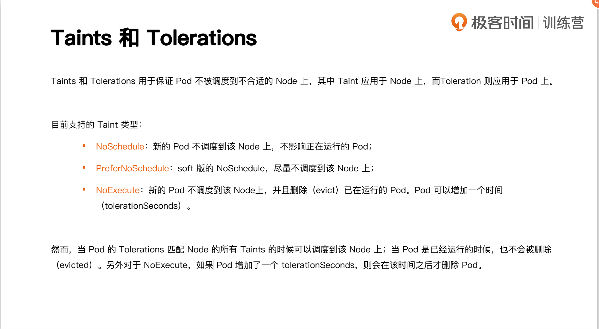

### 9. PriorityClass
文档位置： https://kubernetes.io/zh-cn/docs/concepts/scheduling-eviction/pod-priority-preemption/
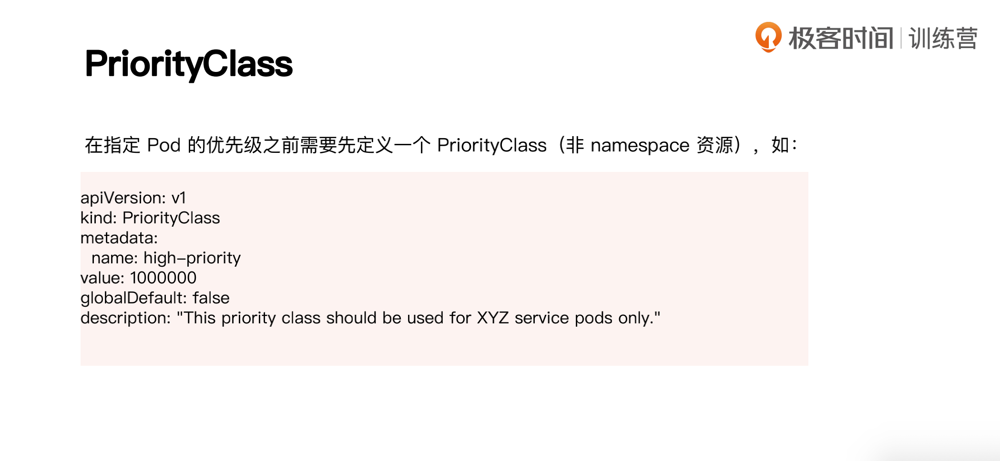

## 调度框架

基于Scheduler Framework实现扩展

调度框架是面向 Kubernetes 调度器的一种插件架构， 它为现有的调度器添加了一组新的“插件” API。插件会被编译到调度器之中。 这些 API 允许大多数调度功能以插件的形式实现，同时使调度“核心”保持简单且可维护。

调度框架定义了一组扩展点，用户可以实现扩展点定义的接口来定义自己的调度逻辑（称之为扩展），并将扩展注册到扩展点上，调度框架在执行调度工作流时，遇到对应的扩展点时，将调用用户注册的扩展。调度框架在预留扩展点时，都是有特定的目的，有些扩展点上的扩展可以改变调度程序的决策方法，有些扩展点上的扩展只是发送一个通知。

每次调度一个 Pod 的尝试都分为两个阶段，即 调度周期 和 绑定周期。

### 1. 调度周期和绑定周期

调度过程为 Pod 选择一个合适的节点，绑定过程则将调度过程的决策应用到集群中（也就是在被选定的节点上运行 Pod），将调度过程和绑定过程合在一起，称之为调度上下文（scheduling context）。

需要注意的是调度过程是同步运行的（同一时间点只为一个 Pod 进行调度），绑定过程可异步运行（同一时间点可并发为多个 Pod 执行绑定）。

调度过程和绑定过程遇到如下情况时会中途退出：
- 调度程序认为当前没有该 Pod 的可选节点
- 内部错误

这个时候，该 Pod 将被放回到 待调度队列，并等待下次重试。

### 2. 扩展点

下图展示了调度框架中的调度上下文及其中的扩展点，一个扩展可以注册多个扩展点，以便可以执行更复杂的有状态的任务。


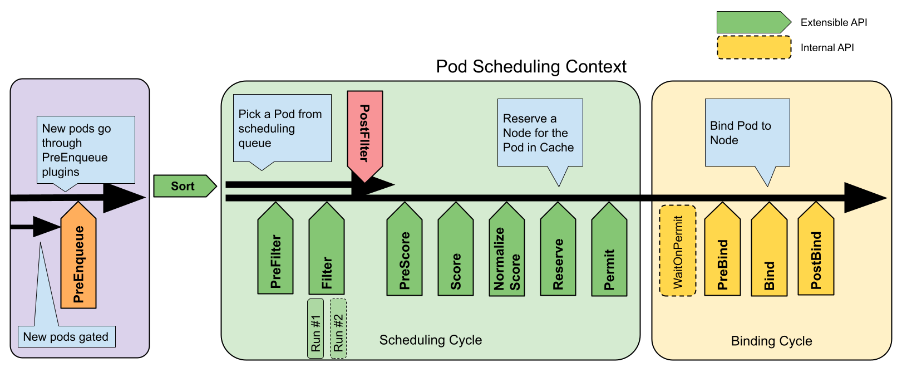

1. PreEnqueue

这些插件在将 Pod 被添加到内部活动队列之前被调用，在此队列中 Pod 被标记为准备好进行调度。

只有当所有 PreEnqueue 插件返回 Success 时，Pod 才允许进入活动队列。 否则，它将被放置在内部无法调度的 Pod 列表中，并且不会获得 Unschedulable 状态。

要了解有关内部调度器队列如何工作的更多详细信息，请阅读 kube-scheduler 调度队列。

2. Sort

这些插件用于对调度队列中的 Pod 进行排序。 队列排序插件本质上提供 Less(Pod1, Pod2) 函数。 一次只能启动一个队列插件。

3. PreFilter

这些插件用于预处理 Pod 的相关信息，或者检查集群或 Pod 必须满足的某些条件。 如果 PreFilter 插件返回错误，则调度周期将终止。

4. Filter

这些插件用于过滤出不能运行该 Pod 的节点。对于每个节点， 调度器将按照其配置顺序调用这些过滤插件。如果任何过滤插件将节点标记为不可行， 则不会为该节点调用剩下的过滤插件。节点可以被同时进行评估。

5. PostFilter

这些插件在 Filter 阶段后调用，但仅在该 Pod 没有可行的节点时调用。 插件按其配置的顺序调用。如果任何 PostFilter 插件标记节点为“Schedulable”， 则其余的插件不会调用。典型的 PostFilter 实现是抢占，试图通过抢占其他 Pod 的资源使该 Pod 可以调度。

6. PreScore

这些插件用于执行 “前置评分（pre-scoring）” 工作，即生成一个可共享状态供 Score 插件使用。 如果 PreScore 插件返回错误，则调度周期将终止。

7. Score

这些插件用于对通过过滤阶段的节点进行排序。调度器将为每个节点调用每个评分插件。 将有一个定义明确的整数范围，代表最小和最大分数。 在标准化评分阶段之后，调度器将根据配置的插件权重 合并所有插件的节点分数。

8. NormalizeScore

这些插件用于在调度器计算 Node 排名之前修改分数。 在此扩展点注册的插件被调用时会使用同一插件的 Score 结果。 每个插件在每个调度周期调用一次。


9. Reserve

Reserve 是一个通知性质的扩展点，有状态的插件可以使用该扩展点来获得节点上为 Pod 预留的资源，该事件发生在调度器将 Pod 绑定到节点之前，目的是避免调度器在等待 Pod 与节点绑定的过程中调度新的 Pod 到节点上时，发生实际使用资源超出可用资源的情况（因为绑定 Pod 到节点上是异步发生的）。这是调度过程的最后一个步骤，Pod 进入 reserved 状态以后，要么在绑定失败时触发 Unreserve 扩展，要么在绑定成功时，由 Post-bind 扩展结束绑定过程；

10. Permit

Permit 插件在每个 Pod 调度周期的最后调用，用于防止或延迟 Pod 的绑定。 一个允许插件可以做以下三件事之一：

- 批准  : 一旦所有 Permit 插件批准 Pod 后，该 Pod 将被发送以进行绑定。
- 拒绝 : 如果任何 Permit 插件拒绝 Pod，则该 Pod 将被返回到调度队列。 这将触发 Reserve 插件中的 Unreserve 阶段。
- 等待（带有超时） :如果一个 Permit 插件返回 “等待” 结果，则 Pod 将保持在一个内部的 “等待中” 的 Pod 列表，同时该 Pod 的绑定周期启动时即直接阻塞直到得到批准。 如果超时发生，等待 变成 拒绝，并且 Pod 将返回调度队列，从而触发 Reserve 插件中的 Unreserve 阶段。

11. PreBind

这些插件用于执行 Pod 绑定前所需的所有工作。用于Pod绑定之前执行某些逻辑。例如，可以将一个基于网络的数据卷挂载到节点上，以便Pod可以使用。
如果任何 PreBind 插件返回错误，则 Pod 将被 拒绝 并且 退回到调度队列中。

12. Bind

Bind 插件用于将 Pod 绑定到节点上。直到所有的 PreBind 插件都完成，Bind 插件才会被调用。 各 Bind 插件按照配置顺序被调用。Bind 插件可以选择是否处理指定的 Pod。 如果某 Bind 插件选择处理某 Pod，剩余的 Bind 插件将被跳过。

13. PostBind

这是个信息性的扩展点。 PostBind 插件在 Pod 成功绑定后被调用。这是绑定周期的结尾，可用于清理相关的资源。

14. Unreserve

这是个信息性的扩展点。 如果 Pod 被保留，然后在后面的阶段中被拒绝，则 Unreserve 插件将被通知。 Unreserve 插件应该清楚保留 Pod 的相关状态。


### 插件 API

插件 API 分为两个步骤。首先，插件必须完成注册并配置，然后才能使用扩展点接口。 扩展点接口具有以下形式。

```golang
type Plugin interface {
    Name() string
}

type QueueSortPlugin interface {
    Plugin
    Less(*v1.pod, *v1.pod) bool
}

type PreFilterPlugin interface {
    Plugin
    PreFilter(context.Context, *framework.CycleState, *v1.pod) error
}

// ...
```

### 插件配置

你可以在调度器配置中启用或禁用插件。 如果你在使用 Kubernetes v1.18 或更高版本，大部分调度 [插件](https://kubernetes.io/zh-cn/docs/reference/scheduling/config/#scheduling-plugins) 都在使用中且默认启用。

除了默认的插件，你还可以实现自己的调度插件并且将它们与默认插件一起配置。 你可以访问 [scheduler-plugins](https://github.com/kubernetes-sigs/scheduler-plugins) 了解更多信息。

如果你正在使用 Kubernetes v1.18 或更高版本，你可以将一组插件设置为 一个调度器配置文件，然后定义不同的配置文件来满足各类工作负载。 了解更多关于[多配置文件](https://kubernetes.io/zh-cn/docs/reference/scheduling/config/#multiple-profiles)。


## 多调度器

如果默认的调度器不满足要求，还可以部署自定义的调度器。并且，在整个集群中还可以同时运 行多个调度器实例，通过 pod.Spec.schedulerName 来选择使用哪一个调度器（默认使用内置 的调度器）。

## 重调度器

参考： https://github.com/kubernetes-sigs/descheduler

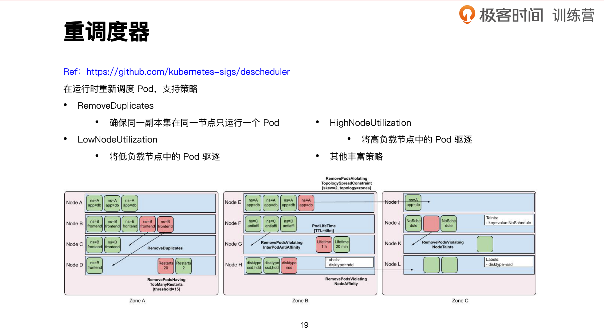

## 扩展调度器

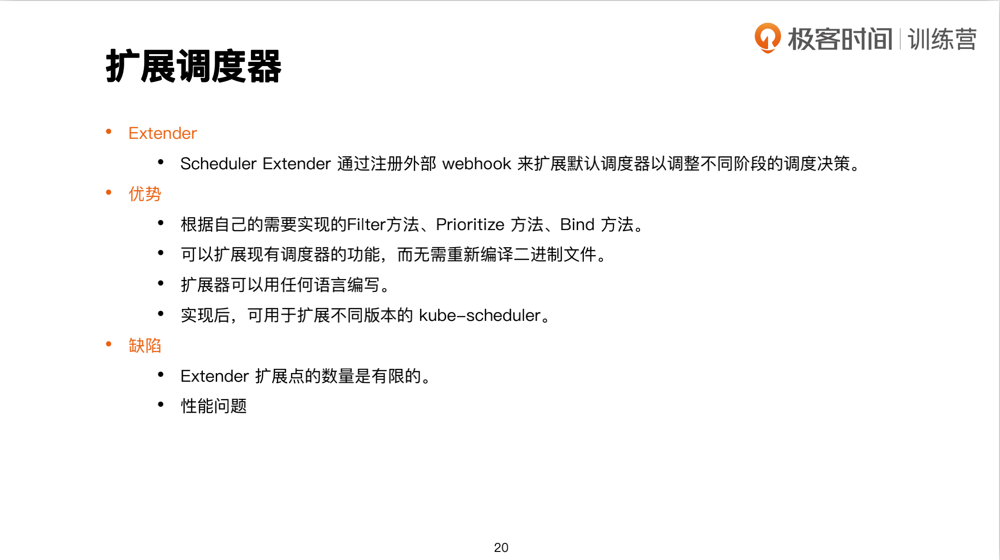

extender本身就是一个拉低性能的因素。
考虑到实际环境中的各种复杂情况，kubernetes 的调度器采用插件化的形式实现，可以方便用户进行定制或者二次开发，我们可以自定义一个调度器并以插件形式和 kubernetes 进行集成。

## 基于 Scheduler Framework 实现扩展

1. Vendor scheduler framework 
2. 编写自己的调度器插件 cmd := app.NewSchedulerCommand( app.WithPlugin(dynamic.Name, dynamic.NewDynamicScheduler), )
3. 实现 scheduler framework 提供的扩展点 Filter/Score 等 
4. 完成调度器配置

## 动态调度器

- Scheduler-Controller 周期性地从 Prometheus 拉取各个节点的真实负载数据， 再以 Annotation 的形式标记在各个节点上； 
- Scheduler 则直接在从候选节点的 Annotation 读取负载信息，并基于这些负载信息在 Filter 阶段对节点进行过滤以及在 Score 阶段对节点进行打分。

参考： https://github.com/gocrane/crane-scheduler


## 拓扑感知调度

参考： https://github.com/gocrane/crane-scheduler

- 性能优先 
  - 优先选择Pod能绑定在单 NUMA Node 内的节点 
  - 优先选择在同一个 NUMA Socket 内的 NUMA Node 
- 负载均衡 
  - 优先选择空闲资源更多的 NUMA Node 
- 更灵活的策略 
  - 解决原生CPU Manager导致集群负载过低的问题

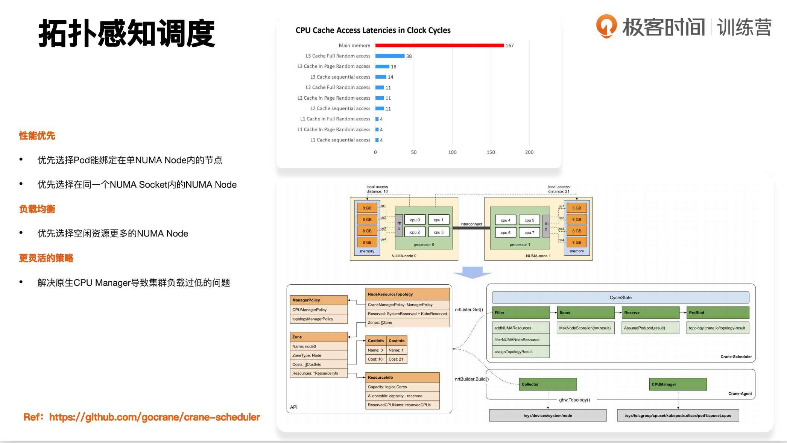

## 支持模拟调度的重调度器

优雅驱逐能力 
- 有全局视图，在多workload并行、同一workload内串行驱逐
- 支持模拟调度，集群资源不足时可停止驱逐 
- 可以通过先扩容后缩容的方式实现无感驱逐 

支持场景 
- 驱逐负载过高的节点上的低优Pod 
- 支持固定时间窗口腾空节点 
- 支持基于特定标签批量驱逐Pod

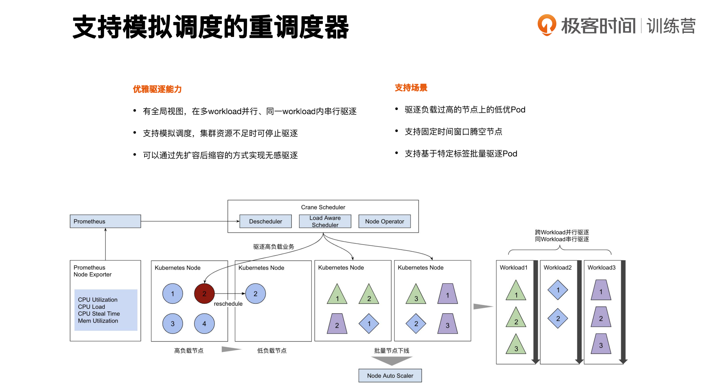
