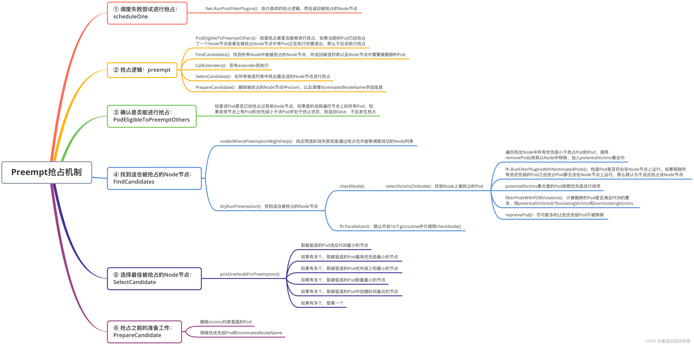

# Preempt抢占机制

当高优先级的Pod没有找到合适的节点时，调度器会尝试抢占低优先级的Pod的节点。抢占过程是将低优先级的Pod从所在的节点上驱逐走，再让高优先级的Pod运行在该节点上，被驱逐走的低优先级的Pod会重新进入调度队列并等待再次选择合适的节点


## 1. 调度失败尝试进行抢占

scheduleOne()方法中如果调度失败，就会尝试进行抢占，代码如下：

```golang
// schedulingCycle tries to schedule a single Pod.
func (sched *Scheduler) schedulingCycle(
	ctx context.Context,
	state *framework.CycleState,
	fwk framework.Framework,
	podInfo *framework.QueuedPodInfo,
	start time.Time,
	podsToActivate *framework.PodsToActivate,
) (ScheduleResult, *framework.QueuedPodInfo, *framework.Status) {
	pod := podInfo.Pod
	
	scheduleResult, err := sched.SchedulePod(ctx, fwk, state, pod)
    // 调度失败后,尝试进行抢占
	if err != nil {
		// ....

		// Run PostFilter plugins to attempt to make the pod schedulable in a future scheduling cycle.
		result, status := fwk.RunPostFilterPlugins(ctx, state, pod, fitError.Diagnosis.NodeToStatusMap)
		
		
	}
}

```

scheduleOne()方法中调用fwk.RunPostFilterPlugins()方法执行具体的抢占逻辑，然后返回被抢占的Node节点。抢占者并不会立刻被调度到被抢占的Node上，调度器只会将抢占者的status.nominatedNodeName字段设置为被抢占的Node的名称，当然即使在下一个调度周期，调度器也不会保证抢占者一定会运行在被抢占的节点上

这样设计的一个重要原因就是调度器只会通过标准的DELETE API来删除被抢占的Pod，所以，这些Pod必然有一定的优雅退出时间（默认是30秒）。而在这段时间里，其他的节点也是有可能变成可调度的，或者有新的节点被添加到这个集群中来

而在抢占者等待被调度的过程中，如果有其他更高优先级的Pod也要抢占同一个节点，那么调度器就会清空原抢占者的status.nominatedNodeName字段，从而允许更高优先级的抢占者执行抢占，这也使得原抢占者也有机会去重新抢占其他节点

fwk.RunPostFilterPlugins()  方法会遍历所有的PostFilter插件，然后调用插件的PostFilter方法

```golang
// RunPostFilterPlugins runs the set of configured PostFilter plugins until the first
// Success, Error or UnschedulableAndUnresolvable is met; otherwise continues to execute all plugins.
func (f *frameworkImpl) RunPostFilterPlugins(ctx context.Context, state *framework.CycleState, pod *v1.Pod, filteredNodeStatusMap framework.NodeToStatusMap) (_ *framework.PostFilterResult, status *framework.Status) {
     // ...
	// `result` records the last meaningful(non-noop) PostFilterResult.
	var result *framework.PostFilterResult
	var reasons []string
	var failedPlugin string
	for _, pl := range f.postFilterPlugins {
       // 调用postFilter插件的PostFilter方法
		r, s := f.runPostFilterPlugin(ctx, pl, state, pod, filteredNodeStatusMap)
		// ...
	}

	return result, framework.NewStatus(framework.Unschedulable, reasons...).WithFailedPlugin(failedPlugin)
}

```

PostFilter插件只有一个DefaultPreemption来执行抢占逻辑 

```golang
// /pkg/scheduler/framework/plugins/defaultpreemption/default_preemption.go
// PostFilter invoked at the postFilter extension point.
func (pl *DefaultPreemption) PostFilter(ctx context.Context, state *framework.CycleState, pod *v1.Pod, m framework.NodeToStatusMap) (*framework.PostFilterResult, *framework.Status) {
	defer func() {
		metrics.PreemptionAttempts.Inc()
	}()

	pe := preemption.Evaluator{
		PluginName: names.DefaultPreemption,
		Handler:    pl.fh,
		PodLister:  pl.podLister,
		PdbLister:  pl.pdbLister,
		State:      state,
		Interface:  pl,
	}
    // 执行抢占
	result, status := pe.Preempt(ctx, pod, m)
	if status.Message() != "" {
		return result, framework.NewStatus(status.Code(), "preemption: "+status.Message())
	}
	return result, status
}

```

## 2. 抢占逻辑

```golang
// 
// Preempt returns a PostFilterResult carrying suggested nominatedNodeName, along with a Status.
// The semantics of returned <PostFilterResult, Status> varies on different scenarios:
//
//   - <nil, Error>. This denotes it's a transient/rare error that may be self-healed in future cycles.
//
//   - <nil, Unschedulable>. This status is mostly as expected like the preemptor is waiting for the
//     victims to be fully terminated.
//
//   - In both cases above, a nil PostFilterResult is returned to keep the pod's nominatedNodeName unchanged.
//
//   - <non-nil PostFilterResult, Unschedulable>. It indicates the pod cannot be scheduled even with preemption.
//     In this case, a non-nil PostFilterResult is returned and result.NominatingMode instructs how to deal with
//     the nominatedNodeName.
//
//   - <non-nil PostFilterResult, Success>. It's the regular happy path
//     and the non-empty nominatedNodeName will be applied to the preemptor pod.
func (ev *Evaluator) Preempt(ctx context.Context, pod *v1.Pod, m framework.NodeToStatusMap) (*framework.PostFilterResult, *framework.Status) {
	// 0) Fetch the latest version of <pod>.
	// It's safe to directly fetch pod here. Because the informer cache has already been
	// initialized when creating the Scheduler obj.
	// However, tests may need to manually initialize the shared pod informer.
	podNamespace, podName := pod.Namespace, pod.Name
	pod, err := ev.PodLister.Pods(pod.Namespace).Get(pod.Name)
	if err != nil {
		klog.ErrorS(err, "Getting the updated preemptor pod object", "pod", klog.KRef(podNamespace, podName))
		return nil, framework.AsStatus(err)
	}
    // 1)确认抢占者是否能够进行抢占
	// 1) Ensure the preemptor is eligible to preempt other pods.
	if ok, msg := ev.PodEligibleToPreemptOthers(pod, m[pod.Status.NominatedNodeName]); !ok {
		klog.V(5).InfoS("Pod is not eligible for preemption", "pod", klog.KObj(pod), "reason", msg)
		return nil, framework.NewStatus(framework.Unschedulable, msg)
	}
    // 2)查找所有抢占候选者
	// 2) Find all preemption candidates.
	candidates, nodeToStatusMap, err := ev.findCandidates(ctx, pod, m)
	if err != nil && len(candidates) == 0 {
		return nil, framework.AsStatus(err)
	}

	// Return a FitError only when there are no candidates that fit the pod.
	if len(candidates) == 0 {
		// ...
		// Specify nominatedNodeName to clear the pod's nominatedNodeName status, if applicable.
		return framework.NewPostFilterResultWithNominatedNode(""), framework.NewStatus(framework.Unschedulable, fitError.Error())
	}

	// 3)如果有extender则执行
	// 3) Interact with registered Extenders to filter out some candidates if needed.
	candidates, status := ev.callExtenders(pod, candidates)
	if !status.IsSuccess() {
		return nil, status
	}
    // 4)查找最佳抢占候选者
	// 4) Find the best candidate.
	bestCandidate := ev.SelectCandidate(candidates)
	if bestCandidate == nil || len(bestCandidate.Name()) == 0 {
		return nil, framework.NewStatus(framework.Unschedulable, "no candidate node for preemption")
	}
    // 5)在抢占之前做一些准备工作
	// 5) Perform preparation work before nominating the selected candidate.
	if status := ev.prepareCandidate(ctx, bestCandidate, pod, ev.PluginName); !status.IsSuccess() {
		return nil, status
	}

	return framework.NewPostFilterResultWithNominatedNode(bestCandidate.Name()), framework.NewStatus(framework.Success)
}

```


preempt()方法首先获取最新的要执行抢占的Pod信息，接着分下面几步执行抢占：


- 调用PodEligibleToPreemptOthers()方法，检查抢占者是否能够进行抢占，如果当前的Pod已经抢占了一个Node节点或者在被抢占Node节点中有Pod正在执行优雅退出，那么不应该执行抢占
- 调用FindCandidates()方法找到所有Node中能被抢占的Node节点，并返回候选列表以及Node节点中需要被删除的Pod
- 若有extender则执行
- 调用SelectCandidate()方法在所有候选列表中找出最合适的Node节点进行抢占
- 调用PrepareCandidate()方法删除被抢占的Node节点中victim（牺牲者），以及清理NominatedNodeName字段信息


## 3. 确认是否能进行抢占

```golang
// pkg/scheduler/framework/plugins/defaultpreemption/default_preemption.go
// PodEligibleToPreemptOthers returns one bool and one string. The bool
// indicates whether this pod should be considered for preempting other pods or
// not. The string includes the reason if this pod isn't eligible.
// There're several reasons:
//  1. The pod has a preemptionPolicy of Never.
//  2. The pod has already preempted other pods and the victims are in their graceful termination period.
//     Currently we check the node that is nominated for this pod, and as long as there are
//     terminating pods on this node, we don't attempt to preempt more pods.
func (pl *DefaultPreemption) PodEligibleToPreemptOthers(pod *v1.Pod, nominatedNodeStatus *framework.Status) (bool, string) {
	if pod.Spec.PreemptionPolicy != nil && *pod.Spec.PreemptionPolicy == v1.PreemptNever {
		return false, "not eligible due to preemptionPolicy=Never."
	}

	nodeInfos := pl.fh.SnapshotSharedLister().NodeInfos()
	// 查看抢占者是否已经抢占过
	nomNodeName := pod.Status.NominatedNodeName
	if len(nomNodeName) > 0 {
		// If the pod's nominated node is considered as UnschedulableAndUnresolvable by the filters,
		// then the pod should be considered for preempting again.
		if nominatedNodeStatus.Code() == framework.UnschedulableAndUnresolvable {
			return true, ""
		}
		// 获取被抢占的node节点
		if nodeInfo, _ := nodeInfos.Get(nomNodeName); nodeInfo != nil {
			// 查看是否存在正在被删除并且优先级比抢占者pod低的pod
			podPriority := corev1helpers.PodPriority(pod)
			for _, p := range nodeInfo.Pods {
				if corev1helpers.PodPriority(p.Pod) < podPriority && podTerminatingByPreemption(p.Pod, pl.fts.EnablePodDisruptionConditions) {
					// There is a terminating pod on the nominated node.
					return false, "not eligible due to a terminating pod on the nominated node."
				}
			}
		}
	}
	return true, ""
}


```

PodEligibleToPreemptOthers()方法会检查该Pod是否已经抢占过其他Node节点，如果是的话就遍历节点上的所有Pod，如果发现节点上有Pod的优先级小于该Pod并处于终止状态，则返回false，不会发生抢占


## 4. 找到适合被抢占的Node节点

```golang
// FindCandidates calculates a slice of preemption candidates.
// Each candidate is executable to make the given <pod> schedulable.
func (ev *Evaluator) findCandidates(ctx context.Context, pod *v1.Pod, m framework.NodeToStatusMap) ([]Candidate, framework.NodeToStatusMap, error) {
	allNodes, err := ev.Handler.SnapshotSharedLister().NodeInfos().List()
	if err != nil {
		return nil, nil, err
	}
	if len(allNodes) == 0 {
		return nil, nil, errors.New("no nodes available")
	}
	// 找到predicates阶段失败但是通过抢占也许能够成功调度的node
	potentialNodes, unschedulableNodeStatus := nodesWherePreemptionMightHelp(allNodes, m)
	if len(potentialNodes) == 0 {
		// ...
		return nil, unschedulableNodeStatus, nil
	}

	// 获取pdb对象,pdb能够限制同时终止pod的数量,以保证集群的高可用性
	pdbs, err := getPodDisruptionBudgets(ev.PdbLister)
	if err != nil {
		return nil, nil, err
	}

	offset, numCandidates := ev.GetOffsetAndNumCandidates(int32(len(potentialNodes)))
	if klogV := klog.V(5); klogV.Enabled() {
		var sample []string
		for i := offset; i < offset+10 && i < int32(len(potentialNodes)); i++ {
			sample = append(sample, potentialNodes[i].Node().Name)
		}
		klogV.InfoS("Selecting candidates from a pool of nodes", "potentialNodesCount", len(potentialNodes), "offset", offset, "sampleLength", len(sample), "sample", sample, "candidates", numCandidates)
	}
	// 找到适合被抢占的node节点,并封装成candidates数组返回
	candidates, nodeStatuses, err := ev.DryRunPreemption(ctx, pod, potentialNodes, pdbs, offset, numCandidates)
	for node, nodeStatus := range unschedulableNodeStatus {
		nodeStatuses[node] = nodeStatus
	}
	return candidates, nodeStatuses, err
}
```
FindCandidates() 方法核心流程：
- 首先会获取Node列表
- 获取pdb对象,pdb能够限制同时终止pod的数量,以保证集群的高可用性
- 调用 nodesWherePreemptionMightHelp() 方法找出Predicates（预选）阶段失败但是通过抢占也许能够调度成功的Node列表，
- 最后调用 dryRunPreemption() 方法来找到适合被抢占的Node节点

dryRunPreemption()方法代码如下：

```golang
// /pkg/scheduler/framework/preemption/preemption.go
// DryRunPreemption simulates Preemption logic on <potentialNodes> in parallel,
// returns preemption candidates and a map indicating filtered nodes statuses.
// The number of candidates depends on the constraints defined in the plugin's args. In the returned list of
// candidates, ones that do not violate PDB are preferred over ones that do.
// NOTE: This method is exported for easier testing in default preemption.
func (ev *Evaluator) DryRunPreemption(ctx context.Context, pod *v1.Pod, potentialNodes []*framework.NodeInfo,
	pdbs []*policy.PodDisruptionBudget, offset int32, numCandidates int32) ([]Candidate, framework.NodeToStatusMap, error) {
	fh := ev.Handler
	nonViolatingCandidates := newCandidateList(numCandidates)
	violatingCandidates := newCandidateList(numCandidates)
	ctx, cancel := context.WithCancel(ctx)
	defer cancel()
	nodeStatuses := make(framework.NodeToStatusMap)
	var statusesLock sync.Mutex
	var errs []error
	
	checkNode := func(i int) {
		nodeInfoCopy := potentialNodes[(int(offset)+i)%len(potentialNodes)].Clone()
		stateCopy := ev.State.Clone()
		pods, numPDBViolations, status := ev.SelectVictimsOnNode(ctx, stateCopy, pod, nodeInfoCopy, pdbs)
		if status.IsSuccess() && len(pods) != 0 {
			victims := extenderv1.Victims{
				Pods:             pods,
				NumPDBViolations: int64(numPDBViolations),
			}
			c := &candidate{
				victims: &victims,
				name:    nodeInfoCopy.Node().Name,
			}
			if numPDBViolations == 0 {
				nonViolatingCandidates.add(c)
			} else {
				violatingCandidates.add(c)
			}
			nvcSize, vcSize := nonViolatingCandidates.size(), violatingCandidates.size()
			if nvcSize > 0 && nvcSize+vcSize >= numCandidates {
				cancel()
			}
			return
		}
		if status.IsSuccess() && len(pods) == 0 {
			status = framework.AsStatus(fmt.Errorf("expected at least one victim pod on node %q", nodeInfoCopy.Node().Name))
		}
		statusesLock.Lock()
		if status.Code() == framework.Error {
			errs = append(errs, status.AsError())
		}
		nodeStatuses[nodeInfoCopy.Node().Name] = status
		statusesLock.Unlock()
	}
	fh.Parallelizer().Until(ctx, len(potentialNodes), checkNode, ev.PluginName)
	return append(nonViolatingCandidates.get(), violatingCandidates.get()...), nodeStatuses, utilerrors.NewAggregate(errs)
}

```

dryRunPreemption()方法中会默认开启16个goroutine并行调用checkNode()方法，checkNode()方法中会调用selectVictimsOnNode()方法来检查这个Node是不是能被执行抢占，如果能抢占返回的pods表示被抢占的Pod，然后封装成candidate添加到candidates列表中返回

selectVictimsOnNode()方法代码如下：

```golang
// /pkg/scheduler/framework/plugins/defaultpreemption/default_preemption.go
// SelectVictimsOnNode finds minimum set of pods on the given node that should be preempted in order to make enough room
// for "pod" to be scheduled.
func (pl *DefaultPreemption) SelectVictimsOnNode(
	ctx context.Context,
	state *framework.CycleState,
	pod *v1.Pod,
	nodeInfo *framework.NodeInfo,
	pdbs []*policy.PodDisruptionBudget) ([]*v1.Pod, int, *framework.Status) {
	var potentialVictims []*framework.PodInfo

	// 移除node节点的pod
	removePod := func(rpi *framework.PodInfo) error {
		if err := nodeInfo.RemovePod(rpi.Pod); err != nil {
			return err
		}
		status := pl.fh.RunPreFilterExtensionRemovePod(ctx, state, pod, rpi, nodeInfo)
		if !status.IsSuccess() {
			return status.AsError()
		}
		return nil
	}
	// 将node节点添加pod
	addPod := func(api *framework.PodInfo) error {
		nodeInfo.AddPodInfo(api)
		status := pl.fh.RunPreFilterExtensionAddPod(ctx, state, pod, api, nodeInfo)
		if !status.IsSuccess() {
			return status.AsError()
		}
		return nil
	}
	// As the first step, remove all the lower priority pods from the node and
	// check if the given pod can be scheduled.
	// 获取pod的优先级,并将node中所有优先级低于该pod的调用removePod方法移除
	podPriority := corev1helpers.PodPriority(pod)
	for _, pi := range nodeInfo.Pods {
		if corev1helpers.PodPriority(pi.Pod) < podPriority {
			potentialVictims = append(potentialVictims, pi)
			if err := removePod(pi); err != nil {
				return nil, 0, framework.AsStatus(err)
			}
		}
	}
    // 没有优先级低的pod,直接返回
	// No potential victims are found, and so we don't need to evaluate the node again since its state didn't change.
	if len(potentialVictims) == 0 {
		message := fmt.Sprintf("No preemption victims found for incoming pod")
		return nil, 0, framework.NewStatus(framework.UnschedulableAndUnresolvable, message)
	}

	// If the new pod does not fit after removing all the lower priority pods,
	// we are almost done and this node is not suitable for preemption. The only
	// condition that we could check is if the "pod" is failing to schedule due to
	// inter-pod affinity to one or more victims, but we have decided not to
	// support this case for performance reasons. Having affinity to lower
	// priority pods is not a recommended configuration anyway.
	// 检查抢占pod是否符合在node节点上运行,如果移除所有低优先级的pod之后抢占pod都无法在node节点上运行,那么就认为不适合抢占该node节点
	if status := pl.fh.RunFilterPluginsWithNominatedPods(ctx, state, pod, nodeInfo); !status.IsSuccess() {
		return nil, 0, status
	}
	var victims []*v1.Pod
	numViolatingVictim := 0
	// 将potentialVictims集合里的pod按照优先级进行排序
	sort.Slice(potentialVictims, func(i, j int) bool { return util.MoreImportantPod(potentialVictims[i].Pod, potentialVictims[j].Pod) })
	// Try to reprieve as many pods as possible. We first try to reprieve the PDB
	// violating victims and then other non-violating ones. In both cases, we start
	// from the highest priority victims.
	// 将potentialVictims集合里的pod基于pod是否有pdb被分为两组
	violatingVictims, nonViolatingVictims := filterPodsWithPDBViolation(potentialVictims, pdbs)
	reprievePod := func(pi *framework.PodInfo) (bool, error) {
		// 先将删除的pod添加回来
		if err := addPod(pi); err != nil {
			return false, err
		}
		// 判断添加完之后是否还符合抢占pod的调度
		status := pl.fh.RunFilterPluginsWithNominatedPods(ctx, state, pod, nodeInfo)
		fits := status.IsSuccess()
		if !fits {
            // 不符合就再删除pod
			if err := removePod(pi); err != nil {
				return false, err
			}
			rpi := pi.Pod
			// 并将这个需要删除的pod添加到victims(最终需要删除的pod列表中)
			victims = append(victims, rpi)
			klog.V(5).InfoS("Pod is a potential preemption victim on node", "pod", klog.KObj(rpi), "node", klog.KObj(nodeInfo.Node()))
		}
		return fits, nil
	}
	// 依次调用reprievePod方法尽可能多的让低优先级Pod不被移除
	for _, p := range violatingVictims {
		if fits, err := reprievePod(p); err != nil {
			return nil, 0, framework.AsStatus(err)
		} else if !fits {
			numViolatingVictim++
		}
	}
	// Now we try to reprieve non-violating victims.
	for _, p := range nonViolatingVictims {
		if _, err := reprievePod(p); err != nil {
			return nil, 0, framework.AsStatus(err)
		}
	}
	return victims, numViolatingVictim, framework.NewStatus(framework.Success)
}

```

selectVictimsOnNode()方法逻辑如下：

- 首先定义了两个函数：removePod 和 addPod，这两个函数都差不多，removePod会把Pod从Node中移除，然后修改Node的属性，如将Requested.MilliCPU、Requested.Memory中减去，表示已用资源大小，将该Pod从Node节点的Pods列表中移除等等
- 遍历找出Node中所有优先级小于抢占Pod的Pod，调用 removePod() 方法将其从Node中移除，加入 potentialVictims 集合中
- 调用 fh.RunFilterPluginsWithNominatedPods() 检查抢占Pod是否符合在Node节点上运行，这个就是调度的预选算法中调用的函数，同样会执行两遍，检查加上 NominatedPods 是否满足，再将 NominatedPods 移除检查是否满足。如果移除所有低优先级的Pod之后抢占Pod都无法在Node节点上运行，那么就认为不适合抢占该Node节点
- 将 potentialVictims 集合里的Pod按照优先级进行排序，排序算法为先看Pod的优先级，然后看Pod的启动时间，启动越早优先级越高
- 通过 filterPodsWithPDBViolation() 方法计算删除的Pod是否满足PDB的要求，将 potentialVictims分为 violatingVictims 和 nonViolatingVictims
- 根据上面选出来的violatingVictims和nonViolatingVictims，通过reprievePod()方法尽可能多的让低优先级Pod不被移除。reprievePod()函数先将删除的Pod添加回来，判断添加完之后是否还符合抢占Pod的调度，如果不符合再删除该Pod，并将这个需要删除的Pod添加到victims列表中

## 5. 选择最佳被抢占的Node节点

SelectCandidate()方法代码如下：

```golang
// /pkg/scheduler/framework/preemption/preemption.go
// SelectCandidate chooses the best-fit candidate from given <candidates> and return it.
// NOTE: This method is exported for easier testing in default preemption.
func (ev *Evaluator) SelectCandidate(candidates []Candidate) Candidate {
	if len(candidates) == 0 {
		return nil
	}
	if len(candidates) == 1 {
		return candidates[0]
	}

	victimsMap := ev.CandidatesToVictimsMap(candidates)
	// 选择最佳被抢占的node节点
	candidateNode := pickOneNodeForPreemption(victimsMap)

	// Same as candidatesToVictimsMap, this logic is not applicable for out-of-tree
	// preemption plugins that exercise different candidates on the same nominated node.
	if victims := victimsMap[candidateNode]; victims != nil {
		return &candidate{
			victims: victims,
			name:    candidateNode,
		}
	}

	// We shouldn't reach here.
	klog.ErrorS(errors.New("no candidate selected"), "Should not reach here", "candidates", candidates)
	// To not break the whole flow, return the first candidate.
	return candidates[0]
}

```

SelectCandidate()方法中调用pickOneNodeForPreemption()方法选择最佳被抢占的Node节点

```golang
// /pkg/scheduler/framework/preemption/preemption.go
// pickOneNodeForPreemption chooses one node among the given nodes. It assumes
// pods in each map entry are ordered by decreasing priority.
// It picks a node based on the following criteria:
// 1. A node with minimum number of PDB violations.
// 2. A node with minimum highest priority victim is picked.
// 3. Ties are broken by sum of priorities of all victims.
// 4. If there are still ties, node with the minimum number of victims is picked.
// 5. If there are still ties, node with the latest start time of all highest priority victims is picked.
// 6. If there are still ties, the first such node is picked (sort of randomly).
// The 'minNodes1' and 'minNodes2' are being reused here to save the memory
// allocation and garbage collection time.
func pickOneNodeForPreemption(nodesToVictims map[string]*extenderv1.Victims) string {
	if len(nodesToVictims) == 0 {
		return ""
	}

	allCandidates := make([]string, 0, len(nodesToVictims))
	for node := range nodesToVictims {
		allCandidates = append(allCandidates, node)
	}

	minNumPDBViolatingScoreFunc := func(node string) int64 {
		// The smaller the NumPDBViolations, the higher the score.
		return -nodesToVictims[node].NumPDBViolations
	}
	minHighestPriorityScoreFunc := func(node string) int64 {
		// highestPodPriority is the highest priority among the victims on this node.
		highestPodPriority := corev1helpers.PodPriority(nodesToVictims[node].Pods[0])
		// The smaller the highestPodPriority, the higher the score.
		return -int64(highestPodPriority)
	}
	minSumPrioritiesScoreFunc := func(node string) int64 {
		var sumPriorities int64
		for _, pod := range nodesToVictims[node].Pods {
			// We add MaxInt32+1 to all priorities to make all of them >= 0. This is
			// needed so that a node with a few pods with negative priority is not
			// picked over a node with a smaller number of pods with the same negative
			// priority (and similar scenarios).
			sumPriorities += int64(corev1helpers.PodPriority(pod)) + int64(math.MaxInt32+1)
		}
		// The smaller the sumPriorities, the higher the score.
		return -sumPriorities
	}
	minNumPodsScoreFunc := func(node string) int64 {
		// The smaller the length of pods, the higher the score.
		return -int64(len(nodesToVictims[node].Pods))
	}
	latestStartTimeScoreFunc := func(node string) int64 {
		// Get earliest start time of all pods on the current node.
		earliestStartTimeOnNode := util.GetEarliestPodStartTime(nodesToVictims[node])
		if earliestStartTimeOnNode == nil {
			klog.ErrorS(errors.New("earliestStartTime is nil for node"), "Should not reach here", "node", node)
			return int64(math.MinInt64)
		}
		// The bigger the earliestStartTimeOnNode, the higher the score.
		return earliestStartTimeOnNode.UnixNano()
	}

	// Each scoreFunc scores the nodes according to specific rules and keeps the name of the node
	// with the highest score. If and only if the scoreFunc has more than one node with the highest
	// score, we will execute the other scoreFunc in order of precedence.
	scoreFuncs := []func(string) int64{
		// A node with a minimum number of PDB is preferable.
		minNumPDBViolatingScoreFunc,
		// A node with a minimum highest priority victim is preferable.
		minHighestPriorityScoreFunc,
		// A node with the smallest sum of priorities is preferable.
		minSumPrioritiesScoreFunc,
		// A node with the minimum number of pods is preferable.
		minNumPodsScoreFunc,
		// A node with the latest start time of all highest priority victims is preferable.
		latestStartTimeScoreFunc,
		// If there are still ties, then the first Node in the list is selected.
	}

	for _, f := range scoreFuncs {
		selectedNodes := []string{}
		maxScore := int64(math.MinInt64)
		for _, node := range allCandidates {
			score := f(node)
			if score > maxScore {
				maxScore = score
				selectedNodes = []string{}
			}
			if score == maxScore {
				selectedNodes = append(selectedNodes, node)
			}
		}
		if len(selectedNodes) == 1 {
			return selectedNodes[0]
		}
		allCandidates = selectedNodes
	}

	return allCandidates[0]
}
```
pickOneNodeForPreemption()方法根据以下标准选择一个节点作为最终被抢占的节点：

- 取被驱逐的Pod违反PDB最少的节点
- 如果上一步选择完存在多个节点，取被驱逐的Pod最高优先级最小的节点
- 如果上一步选择完存在多个节点，取被驱逐的Pod优先级之和最小的节点
- 如果上一步选择完存在多个节点，取被驱逐的Pod数量最小的节点
- 如果上一步选择完存在多个节点，取被驱逐的Pod中创建时间最近的节点
- 如果上一步选择完存在多个节点，取第一个节点


## 6. 抢占之前的准备工作

PrepareCandidate()方法代码如下：

```golang
// prepareCandidate does some preparation work before nominating the selected candidate:
// - Evict the victim pods
// - Reject the victim pods if they are in waitingPod map
// - Clear the low-priority pods' nominatedNodeName status if needed
func (ev *Evaluator) prepareCandidate(ctx context.Context, c Candidate, pod *v1.Pod, pluginName string) *framework.Status {
	fh := ev.Handler
	cs := ev.Handler.ClientSet()

	ctx, cancel := context.WithCancel(ctx)
	defer cancel()
	errCh := parallelize.NewErrorChannel()
	preemptPod := func(index int) {
		victim := c.Victims().Pods[index]
		// If the victim is a WaitingPod, send a reject message to the PermitPlugin.
		// Otherwise we should delete the victim.
		if waitingPod := fh.GetWaitingPod(victim.UID); waitingPod != nil {
			waitingPod.Reject(pluginName, "preempted")
		} else {
			if feature.DefaultFeatureGate.Enabled(features.PodDisruptionConditions) {
				victimPodApply := corev1apply.Pod(victim.Name, victim.Namespace).WithStatus(corev1apply.PodStatus())
				victimPodApply.Status.WithConditions(corev1apply.PodCondition().
					WithType(v1.DisruptionTarget).
					WithStatus(v1.ConditionTrue).
					WithReason(v1.PodReasonPreemptionByScheduler).
					WithMessage(fmt.Sprintf("%s: preempting to accommodate a higher priority pod", pod.Spec.SchedulerName)).
					WithLastTransitionTime(metav1.Now()),
				)

				if _, err := cs.CoreV1().Pods(victim.Namespace).ApplyStatus(ctx, victimPodApply, metav1.ApplyOptions{FieldManager: fieldManager, Force: true}); err != nil {
					klog.ErrorS(err, "Preparing pod preemption", "pod", klog.KObj(victim), "preemptor", klog.KObj(pod))
					errCh.SendErrorWithCancel(err, cancel)
					return
				}
			}
			if err := util.DeletePod(ctx, cs, victim); err != nil {
				klog.ErrorS(err, "Preempting pod", "pod", klog.KObj(victim), "preemptor", klog.KObj(pod))
				errCh.SendErrorWithCancel(err, cancel)
				return
			}
		}
		fh.EventRecorder().Eventf(victim, pod, v1.EventTypeNormal, "Preempted", "Preempting", "Preempted by a pod on node %v", c.Name())
	}

	fh.Parallelizer().Until(ctx, len(c.Victims().Pods), preemptPod, ev.PluginName)
	if err := errCh.ReceiveError(); err != nil {
		return framework.AsStatus(err)
	}

	metrics.PreemptionVictims.Observe(float64(len(c.Victims().Pods)))

	// Lower priority pods nominated to run on this node, may no longer fit on
	// this node. So, we should remove their nomination. Removing their
	// nomination updates these pods and moves them to the active queue. It
	// lets scheduler find another place for them.
	nominatedPods := getLowerPriorityNominatedPods(fh, pod, c.Name())
	if err := util.ClearNominatedNodeName(ctx, cs, nominatedPods...); err != nil {
		klog.ErrorS(err, "Cannot clear 'NominatedNodeName' field")
		// We do not return as this error is not critical.
	}

	return nil
}

```

## 7. 小结




