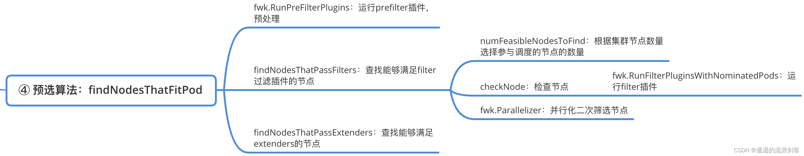
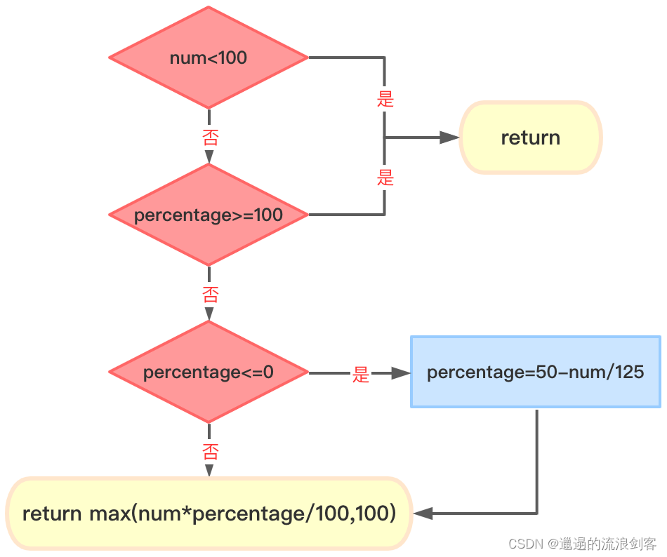
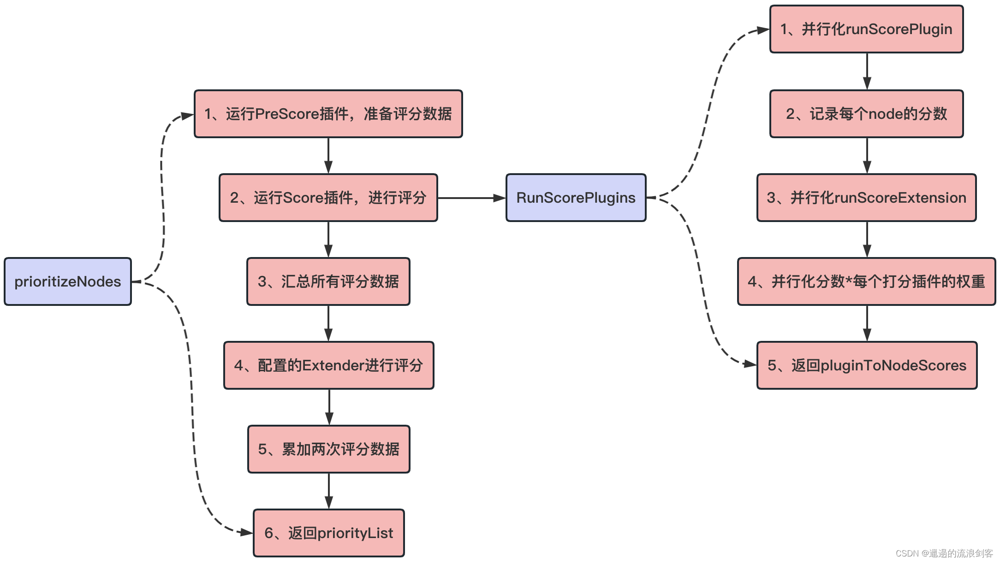
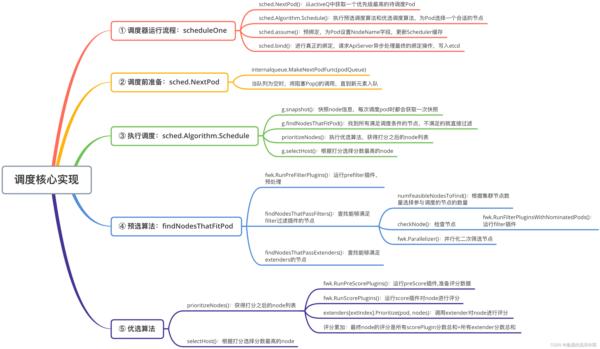

# 核心调度算法


## 1.  sched.SchedulePod() 执行预选与优选算法处理

```golang
// 
// schedulePod tries to schedule the given pod to one of the nodes in the node list.
// If it succeeds, it will return the name of the node.
// If it fails, it will return a FitError with reasons.
func (sched *Scheduler) schedulePod(ctx context.Context, fwk framework.Framework, state *framework.CycleState, pod *v1.Pod) (result ScheduleResult, err error) {
	trace := utiltrace.New("Scheduling", utiltrace.Field{Key: "namespace", Value: pod.Namespace}, utiltrace.Field{Key: "name", Value: pod.Name})
	defer trace.LogIfLong(100 * time.Millisecond)

	// 1.快照node信息,每次调度pod时都会获取一次快照
	if err := sched.Cache.UpdateSnapshot(sched.nodeInfoSnapshot); err != nil {
		return result, err
	}
	trace.Step("Snapshotting scheduler cache and node infos done")
	
	if sched.nodeInfoSnapshot.NumNodes() == 0 {
		return result, ErrNoNodesAvailable
	}

	// 2.Predicates阶段:找到所有满足调度条件的节点,不满足的就直接过滤
	feasibleNodes, diagnosis, err := sched.findNodesThatFitPod(ctx, fwk, state, pod)
	if err != nil {
		return result, err
	}
	trace.Step("Computing predicates done")

	// 3.预选后没有合适的node直接返回 
	if len(feasibleNodes) == 0 {
		return result, &framework.FitError{
			Pod:         pod,
			NumAllNodes: sched.nodeInfoSnapshot.NumNodes(),
			Diagnosis:   diagnosis,
		}
	}
    // 4.当预选后只剩下一个node,就使用它 
	// When only one node after predicate, just use it.
	if len(feasibleNodes) == 1 {
		return ScheduleResult{
			SuggestedHost:  feasibleNodes[0].Name,
			EvaluatedNodes: 1 + len(diagnosis.NodeToStatusMap),
			FeasibleNodes:  1,
		}, nil
	}
    // 5. Priorities阶段:执行优选算法,获得打分之后的node列表
	priorityList, err := prioritizeNodes(ctx, sched.Extenders, fwk, state, pod, feasibleNodes)
	if err != nil {
		return result, err
	}

	// 6.根据打分选择分数最高的node
	host, err := selectHost(priorityList)
	trace.Step("Prioritizing done")

	return ScheduleResult{
		SuggestedHost:  host,
		EvaluatedNodes: len(feasibleNodes) + len(diagnosis.NodeToStatusMap),
		FeasibleNodes:  len(feasibleNodes),
	}, err
}
```

核心流程如下：
- 快照node信息,每次调度pod时都会获取一次快照
- Predicates阶段:找到所有满足调度条件的节点,不满足的就直接过滤
- 预选后没有合适的node直接返回 
- 当预选后只剩下一个node,就使用它 
- Priorities阶段:执行优选算法,获得打分之后的node列表
- 根据打分选择分数最高的node

## 2. 预选算法 sched.findNodesThatFitPod

预选算法会从当前集群中的所有的Node中进行过滤，选出符合当前Pod运行的Nodes。预选的核心流程是通过findNodesThatFit()来完成，其返回预选结果供优选流程使用。预选算法的主要逻辑如下图：




```golang
// Filters the nodes to find the ones that fit the pod based on the framework
// filter plugins and filter extenders.
func (sched *Scheduler) findNodesThatFitPod(ctx context.Context, fwk framework.Framework, state *framework.CycleState, pod *v1.Pod) ([]*v1.Node, framework.Diagnosis, error) {
	// ...
	allNodes, err := sched.nodeInfoSnapshot.NodeInfos().List()
	if err != nil {
		return nil, diagnosis, err
	}
	// 运行prefilter插件,预处理pod的相关信息,或者检查集群或pod必须满足的某些条件
	// Run "prefilter" plugins.
	preRes, s := fwk.RunPreFilterPlugins(ctx, state, pod)
	if !s.IsSuccess() {
		// ...
		return nil, diagnosis, nil
	}

	// POD 抢占处理
	// "NominatedNodeName" can potentially be set in a previous scheduling cycle as a result of preemption.
	// This node is likely the only candidate that will fit the pod, and hence we try it first before iterating over all nodes.
	if len(pod.Status.NominatedNodeName) > 0 {
		feasibleNodes, err := sched.evaluateNominatedNode(ctx, pod, fwk, state, diagnosis)
		if err != nil {
			klog.ErrorS(err, "Evaluation failed on nominated node", "pod", klog.KObj(pod), "node", pod.Status.NominatedNodeName)
		}
		// Nominated node passes all the filters, scheduler is good to assign this node to the pod.
		if len(feasibleNodes) != 0 {
			return feasibleNodes, diagnosis, nil
		}
	}

	nodes := allNodes
	if !preRes.AllNodes() {
		nodes = make([]*framework.NodeInfo, 0, len(preRes.NodeNames))
		for n := range preRes.NodeNames {
			nInfo, err := sched.nodeInfoSnapshot.NodeInfos().Get(n)
			if err != nil {
				return nil, diagnosis, err
			}
			nodes = append(nodes, nInfo)
		}
	}
	// 查找能够满足filter过滤插件的节点
	feasibleNodes, err := sched.findNodesThatPassFilters(ctx, fwk, state, pod, diagnosis, nodes)
	// always try to update the sched.nextStartNodeIndex regardless of whether an error has occurred
	// this is helpful to make sure that all the nodes have a chance to be searched
	processedNodes := len(feasibleNodes) + len(diagnosis.NodeToStatusMap)
	sched.nextStartNodeIndex = (sched.nextStartNodeIndex + processedNodes) % len(nodes)
	if err != nil {
		return nil, diagnosis, err
	}

	// 查找能够满足extenders的节点
	feasibleNodes, err = findNodesThatPassExtenders(sched.Extenders, pod, feasibleNodes, diagnosis.NodeToStatusMap)
	if err != nil {
		return nil, diagnosis, err
	}
	return feasibleNodes, diagnosis, nil
}
```

findNodesThatFit()方法逻辑如下：
- 调用fwk.RunPreFilterPlugins()方法，运行 prefilter 插件，预处理
- 调用findNodesThatPassFilters()方法，查找能够满足 filter 过滤插件的节点
- 调用findNodesThatPassExtenders()方法，查找能够满足 extenders 的节点

## 3. RunPreFilterPlugins

```golang
// /pkg/scheduler/framework/runtime/framework.go
// RunPreFilterPlugins runs the set of configured PreFilter plugins. It returns
// *Status and its code is set to non-success if any of the plugins returns
// anything but Success/Skip.
// When it returns Skip status, returned PreFilterResult and other fields in status are just ignored,
// and coupled Filter plugin/PreFilterExtensions() will be skipped in this scheduling cycle.
// If a non-success status is returned, then the scheduling cycle is aborted.
func (f *frameworkImpl) RunPreFilterPlugins(ctx context.Context, state *framework.CycleState, pod *v1.Pod) (_ *framework.PreFilterResult, status *framework.Status) {
	startTime := time.Now()
	var result *framework.PreFilterResult
	// 运行所有preFilter插件
	for _, pl := range f.preFilterPlugins {
		r, s := f.runPreFilterPlugin(ctx, pl, state, pod)
		// ...
        result = result.Merge(r)
	}
	
	state.SkipFilterPlugins = skipPlugins
	return result, nil
}

func (f *frameworkImpl) runPreFilterPlugin(ctx context.Context, pl framework.PreFilterPlugin, state *framework.CycleState, pod *v1.Pod) (*framework.PreFilterResult, *framework.Status) {
	// ...
	startTime := time.Now()
	// 调用插件的PreFilter函数
	result, status := pl.PreFilter(ctx, state, pod)
	// ...
	return result, status
}

```
核心流程遍历插件列表，调用插件的 PreFilter 方法。

## 4. findNodesThatPassFilters

```golang
// /pkg/scheduler/schedule_one.go
// findNodesThatPassFilters finds the nodes that fit the filter plugins.
func (sched *Scheduler) findNodesThatPassFilters(
	ctx context.Context,
	fwk framework.Framework,
	state *framework.CycleState,
	pod *v1.Pod,
	diagnosis framework.Diagnosis,
	nodes []*framework.NodeInfo) ([]*v1.Node, error) {
	numAllNodes := len(nodes)
	// 根据集群节点数量选择参与调度的节点的数量
	numNodesToFind := sched.numFeasibleNodesToFind(fwk.PercentageOfNodesToScore(), int32(numAllNodes))

	// Create feasible list with enough space to avoid growing it
	// and allow assigning.
	feasibleNodes := make([]*v1.Node, numNodesToFind)

	if !fwk.HasFilterPlugins() {
		for i := range feasibleNodes {
			feasibleNodes[i] = nodes[(sched.nextStartNodeIndex+i)%numAllNodes].Node()
		}
		return feasibleNodes, nil
	}

	errCh := parallelize.NewErrorChannel()
	var statusesLock sync.Mutex
	var feasibleNodesLen int32
	ctx, cancel := context.WithCancel(ctx)
	defer cancel()
	checkNode := func(i int) {
		// We check the nodes starting from where we left off in the previous scheduling cycle,
		// this is to make sure all nodes have the same chance of being examined across pods.
		// 从上一个调度周期中停止的地方开始检查节点,为了确保所有节点都有相同的机会在调度pod中被检查
		nodeInfo := nodes[(sched.nextStartNodeIndex+i)%numAllNodes]
		// 运行filter插件
		status := fwk.RunFilterPluginsWithNominatedPods(ctx, state, pod, nodeInfo)
		if status.Code() == framework.Error {
			errCh.SendErrorWithCancel(status.AsError(), cancel)
			return
		}
		// 如果该节点合适,放入到feasibleNodes列表中
		if status.IsSuccess() {
			length := atomic.AddInt32(&feasibleNodesLen, 1)
			if length > numNodesToFind {
				cancel()
				atomic.AddInt32(&feasibleNodesLen, -1)
			} else {
				feasibleNodes[length-1] = nodeInfo.Node()
			}
		} else {
			statusesLock.Lock()
			diagnosis.NodeToStatusMap[nodeInfo.Node().Name] = status
			diagnosis.UnschedulablePlugins.Insert(status.FailedPlugin())
			statusesLock.Unlock()
		}
	}

	beginCheckNode := time.Now()
	statusCode := framework.Success
	defer func() {
		// We record Filter extension point latency here instead of in framework.go because framework.RunFilterPlugins
		// function is called for each node, whereas we want to have an overall latency for all nodes per scheduling cycle.
		// Note that this latency also includes latency for `addNominatedPods`, which calls framework.RunPreFilterAddPod.
		metrics.FrameworkExtensionPointDuration.WithLabelValues(metrics.Filter, statusCode.String(), fwk.ProfileName()).Observe(metrics.SinceInSeconds(beginCheckNode))
	}()

	// 开启多个协程并行寻找符合条件的node节点
	// Stops searching for more nodes once the configured number of feasible nodes
	// are found.
	fwk.Parallelizer().Until(ctx, numAllNodes, checkNode, metrics.Filter)
    // 合并返回结果
	feasibleNodes = feasibleNodes[:feasibleNodesLen]
	if err := errCh.ReceiveError(); err != nil {
		statusCode = framework.Error
		return feasibleNodes, err
	}
	return feasibleNodes, nil
}

``` 
findNodesThatPassFilters()方法逻辑如下：

- 调用 numFeasibleNodesToFind() 方法，根据集群节点数量选择参与调度的节点的数量

- checkNode()函数用于检查节点，检查节点时：

  - 1）先会从上一个调度周期中停止的地方开始检查节点，为了确保所有节点都有相同的机会在调度Pod中被检查
  - 2）然后调用fwk.RunFilterPluginsWithNominatedPods()运行filter插件
  - 3）如果该Node节点合适，放入到feasibleNodes列表中

- 调用fwk.Parallelizer().Until(ctx, len(nodes), checkNode)，默认开启16个goroutine并行寻找符合条件的Node节点

## 5. 确定参与调度的节点数量 numFeasibleNodesToFind

numFeasibleNodesToFind()根据集群节点数量选择参与调度的节点的数量，算法的具体逻辑如下图：



核心流程如下：

- 如果节点数小于minFeasibleNodesToFind（默认值100），那么全部节点参与调度

- percentageOfNodesToScore 参数值是集群中每次参与调度节点的百分比，范围是1到100之间。如果集群节点数>100，那么就会根据这个值来计算让合适的节点参与调度

- 举个例子，如果一个5000个节点的集群，percentageOfNodesToScore为10，也就是每次500个节点参与调度。因为如果一个500个节点的集群来进行调度的话，不进行控制时，每个Pod调度都需要尝试5000次的节点预选过程是非常消耗资源的

- 如果计算后的参与调度的节点数小于minFeasibleNodesToFind，那么返回minFeasibleNodesToFind

```golang
// numFeasibleNodesToFind returns the number of feasible nodes that once found, the scheduler stops
// its search for more feasible nodes.
func (sched *Scheduler) numFeasibleNodesToFind(percentageOfNodesToScore *int32, numAllNodes int32) (numNodes int32) {
	if numAllNodes < minFeasibleNodesToFind {
		return numAllNodes
	}

	// Use profile percentageOfNodesToScore if it's set. Otherwise, use global percentageOfNodesToScore.
	var percentage int32
	if percentageOfNodesToScore != nil {
		percentage = *percentageOfNodesToScore
	} else {
		percentage = sched.percentageOfNodesToScore
	}

	if percentage == 0 {
		percentage = int32(50) - numAllNodes/125
		if percentage < minFeasibleNodesPercentageToFind {
			percentage = minFeasibleNodesPercentageToFind
		}
	}

	numNodes = numAllNodes * percentage / 100
	if numNodes < minFeasibleNodesToFind {
		return minFeasibleNodesToFind
	}

	return numNodes
}

```

## 6. 并行化二次筛选节点

并行取样主要通过调用workqueue的ParallelizeUntil()方法来启动N个goroutine来进行并行取样，并通过Context来协调退出。选取节点的规则由checkNode()函数来定义，checkNode里面调用RunFilterPluginsWithNominatedPods()方法筛选出合适的节点

为什么需要两次筛选节点？

在Kubernetes中经过调度器调度后的Pod结果会放入到SchedulingQueue中暂存，这些Pod（NominatedPods）未来可能会经过后续调度流程运行在提议的Node上，也可能因为某些原因（例如抢占机制等）导致最终没有运行，预选过程为了减少后续因为调度冲突，则会在进行预选的时候，将这部分Pod考虑进去。如果在这些Pod存在的情况下，Node可以满足当前Pod的筛选条件，则会去除NominatedPods再进行筛选

假设当前调度Pod资源对象的亲和性策略依赖的是NominatedPods，而NominatedPods不能保证一定可以调度到对应的节点上，所以会去除NominatedPods进行第二次筛选

RunFilterPluginsWithNominatedPods()方法代码如下：

```golang
// /pkg/scheduler/framework/runtime/framework.go
// RunFilterPluginsWithNominatedPods runs the set of configured filter plugins
// for nominated pod on the given node.
// This function is called from two different places: Schedule and Preempt.
// When it is called from Schedule, we want to test whether the pod is
// schedulable on the node with all the existing pods on the node plus higher
// and equal priority pods nominated to run on the node.
// When it is called from Preempt, we should remove the victims of preemption
// and add the nominated pods. Removal of the victims is done by
// SelectVictimsOnNode(). Preempt removes victims from PreFilter state and
// NodeInfo before calling this function.
func (f *frameworkImpl) RunFilterPluginsWithNominatedPods(ctx context.Context, state *framework.CycleState, pod *v1.Pod, info *framework.NodeInfo) *framework.Status {
	var status *framework.Status

	podsAdded := false
	// We run filters twice in some cases. If the node has greater or equal priority
	// nominated pods, we run them when those pods are added to PreFilter state and nodeInfo.
	// If all filters succeed in this pass, we run them again when these
	// nominated pods are not added. This second pass is necessary because some
	// filters such as inter-pod affinity may not pass without the nominated pods.
	// If there are no nominated pods for the node or if the first run of the
	// filters fail, we don't run the second pass.
	// We consider only equal or higher priority pods in the first pass, because
	// those are the current "pod" must yield to them and not take a space opened
	// for running them. It is ok if the current "pod" take resources freed for
	// lower priority pods.
	// Requiring that the new pod is schedulable in both circumstances ensures that
	// we are making a conservative decision: filters like resources and inter-pod
	// anti-affinity are more likely to fail when the nominated pods are treated
	// as running, while filters like pod affinity are more likely to fail when
	// the nominated pods are treated as not running. We can't just assume the
	// nominated pods are running because they are not running right now and in fact,
	// they may end up getting scheduled to a different node.
	for i := 0; i < 2; i++ {
		stateToUse := state
		nodeInfoToUse := info
		if i == 0 {
			var err error
			podsAdded, stateToUse, nodeInfoToUse, err = addNominatedPods(ctx, f, pod, state, info)
			if err != nil {
				return framework.AsStatus(err)
			}
		} else if !podsAdded || !status.IsSuccess() {
			break
		}

		status = f.RunFilterPlugins(ctx, stateToUse, pod, nodeInfoToUse)
		if !status.IsSuccess() && !status.IsUnschedulable() {
			return status
		}
	}

	return status
}


```

## 7. 优选算法

优选算法先通过prioritizeNodes()方法获得打分之后的node列表，然后再通过selectHost()方法选择分数最高的node，返回结果

- 1）获得打分之后的node列表
prioritizeNodes()通过运行评分插件对节点进行优先排序，这些插件从RunScorePlugins()方法中为每个节点返回一个分数。每个插件的分数和Extender的分数加在一起，成为该节点的分数。整个流程如下图：



```golang
// prioritizeNodes prioritizes the nodes by running the score plugins,
// which return a score for each node from the call to RunScorePlugins().
// The scores from each plugin are added together to make the score for that node, then
// any extenders are run as well.
// All scores are finally combined (added) to get the total weighted scores of all nodes
func prioritizeNodes(
	ctx context.Context,
	extenders []framework.Extender,
	fwk framework.Framework,
	state *framework.CycleState,
	pod *v1.Pod,
	nodes []*v1.Node,
) ([]framework.NodePluginScores, error) {
	// If no priority configs are provided, then all nodes will have a score of one.
	// This is required to generate the priority list in the required format
	if len(extenders) == 0 && !fwk.HasScorePlugins() {
		result := make([]framework.NodePluginScores, 0, len(nodes))
		for i := range nodes {
			result = append(result, framework.NodePluginScores{
				Name:       nodes[i].Name,
				TotalScore: 1,
			})
		}
		return result, nil
	}

	// Run PreScore plugins.
	// 运行preScore插件,准备评分数据
	preScoreStatus := fwk.RunPreScorePlugins(ctx, state, pod, nodes)
	if !preScoreStatus.IsSuccess() {
		return nil, preScoreStatus.AsError()
	}

	// Run the Score plugins.
	// 运行score插件对node进行评分
	nodesScores, scoreStatus := fwk.RunScorePlugins(ctx, state, pod, nodes)
	if !scoreStatus.IsSuccess() {
		return nil, scoreStatus.AsError()
	}
    
	// ...

	if len(extenders) != 0 && nodes != nil {
		// allNodeExtendersScores has all extenders scores for all nodes.
		// It is keyed with node name.
		allNodeExtendersScores := make(map[string]*framework.NodePluginScores, len(nodes))
		var mu sync.Mutex
		var wg sync.WaitGroup
		for i := range extenders {
			if !extenders[i].IsInterested(pod) {
				continue
			}
			wg.Add(1)
			go func(extIndex int) {
				// ...
				defer func() {
					// ...
					wg.Done()
				}()
				prioritizedList, weight, err := extenders[extIndex].Prioritize(pod, nodes)
				// ...
				mu.Lock()
				defer mu.Unlock()
				for i := range *prioritizedList {
					nodename := (*prioritizedList)[i].Host
					score := (*prioritizedList)[i].Score
					// ...
					// MaxExtenderPriority may diverge from the max priority used in the scheduler and defined by MaxNodeScore,
					// therefore we need to scale the score returned by extenders to the score range used by the scheduler.
					finalscore := score * weight * (framework.MaxNodeScore / extenderv1.MaxExtenderPriority)

					if allNodeExtendersScores[nodename] == nil {
						allNodeExtendersScores[nodename] = &framework.NodePluginScores{
							Name:   nodename,
							Scores: make([]framework.PluginScore, 0, len(extenders)),
						}
					}
					allNodeExtendersScores[nodename].Scores = append(allNodeExtendersScores[nodename].Scores, framework.PluginScore{
						Name:  extenders[extIndex].Name(),
						Score: finalscore,
					})
					allNodeExtendersScores[nodename].TotalScore += finalscore
				}
			}(i)
		}
		// wait for all go routines to finish
		wg.Wait()
		
		
		// 和 extenders scores 累加
		for i := range nodesScores {
			if score, ok := allNodeExtendersScores[nodes[i].Name]; ok {
				nodesScores[i].Scores = append(nodesScores[i].Scores, score.Scores...)
				nodesScores[i].TotalScore += score.TotalScore
			}
		}
	}
	// ...
	return nodesScores, nil
}

```

根据打分选择分数最高的node

priorityList数组保存了每个Node的名字和它对应的分数，最后通过selectHost()方法选出分数最高的Node对Pod进行绑定和调度。代码如下：

```golang
// selectHost takes a prioritized list of nodes and then picks one
// in a reservoir sampling manner from the nodes that had the highest score.
func selectHost(nodeScores []framework.NodePluginScores) (string, error) {
	if len(nodeScores) == 0 {
		return "", fmt.Errorf("empty priorityList")
	}
	maxScore := nodeScores[0].TotalScore
	selected := nodeScores[0].Name
	// 记录最高分数相同的节点数量
	cntOfMaxScore := 1
	for _, ns := range nodeScores[1:] {
		if ns.TotalScore > maxScore {
			maxScore = ns.TotalScore
			selected = ns.Name
			cntOfMaxScore = 1
		} else if ns.TotalScore == maxScore {
			// 分数相同就累计数量
			cntOfMaxScore++
			if rand.Intn(cntOfMaxScore) == 0 {
				// Replace the candidate with probability of 1/cntOfMaxScore
				selected = ns.Name
			}
		}
	}
	return selected, nil
}


```

## 调度核心实现总结



