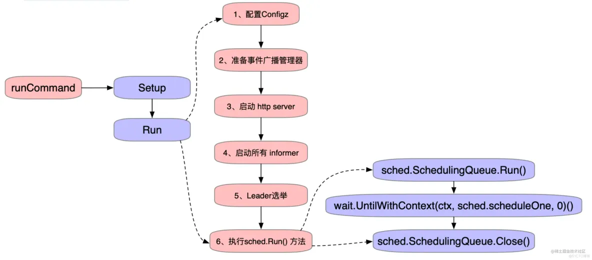

# 调度器启动过程

## 启动流程


1. 启动入口

kube-scheduler的启动入口位于cmd/kube-scheduler/scheduler.go文件，该文件中就包含一个main入口函数：

```golang
// cmd/kube-scheduler/scheduler.go
func main() {
	command := app.NewSchedulerCommand()
	code := cli.Run(command)
	os.Exit(code)
}

```
main函数中通过app.NewSchedulerCommand()方法获得一个Cobra的Command对象，然后调用command.Execute()方法执行这个命令，NewSchedulerCommand()方法代码如下：

```golang
// cmd/kube-scheduler/server.go
func NewSchedulerCommand(registryOptions ...Option) *cobra.Command {
	opts := options.NewOptions()
	cmd := &cobra.Command{
		Use: "kube-scheduler",
		Long: `The Kubernetes scheduler is a control plane process which assigns
Pods to Nodes. The scheduler determines which Nodes are valid placements for
each Pod in the scheduling queue according to constraints and available
resources. The scheduler then ranks each valid Node and binds the Pod to a
suitable Node. Multiple different schedulers may be used within a cluster;
kube-scheduler is the reference implementation.
See [scheduling](https://kubernetes.io/docs/concepts/scheduling-eviction/)
for more information about scheduling and the kube-scheduler component.`,
		RunE: func(cmd *cobra.Command, args []string) error {
			return runCommand(cmd, opts, registryOptions...)
		},
		Args: func(cmd *cobra.Command, args []string) error {
			for _, arg := range args {
				if len(arg) > 0 {
					return fmt.Errorf("%q does not take any arguments, got %q", cmd.CommandPath(), args)
				}
			}
			return nil
		},
	}

	// ...

	return cmd
}

```

真正执行的函数入口是runCommand()方法，代码如下：

```golang
// runCommand runs the scheduler.
func runCommand(cmd *cobra.Command, opts *options.Options, registryOptions ...Option) error {
	verflag.PrintAndExitIfRequested()

	// Activate logging as soon as possible, after that
	// show flags with the final logging configuration.
	if err := logsapi.ValidateAndApply(opts.Logs, utilfeature.DefaultFeatureGate); err != nil {
		fmt.Fprintf(os.Stderr, "%v\n", err)
		os.Exit(1)
	}
	cliflag.PrintFlags(cmd.Flags())

	ctx, cancel := context.WithCancel(context.Background())
	defer cancel()
	go func() {
		stopCh := server.SetupSignalHandler()
		<-stopCh
		cancel()
	}()

	// 根据命令行参数和options创建完整的配置和调度程序
	cc, sched, err := Setup(ctx, opts, registryOptions...)
	if err != nil {
		return err
	}
	// add feature enablement metrics
	utilfeature.DefaultMutableFeatureGate.AddMetrics()
	// 真正去启动调度器
	return Run(ctx, cc, sched)
}

```

runCommand()方法中先调用Setup()方法根据命令行参数和options构造完整的配置和调度器对象，然后调用Run()方法真正去启动调度器

## 2. Setup()创建Scheduler对象

runCommand()方法中通过Setup()方法根据命令行参数和options构造完整的配置和调度器对象，代码如下：

```golang
// cmd/kube-scheduler/app/server.go
// Setup根据命令行参数和options构造完整的配置和调度器对象
func Setup(ctx context.Context, opts *options.Options, outOfTreeRegistryOptions ...Option) (*schedulerserverconfig.CompletedConfig, *scheduler.Scheduler, error) {
    // 获取默认的配置
	if cfg, err := latest.Default(); err != nil {
		return nil, nil, err
	} else {
		opts.ComponentConfig = cfg
	}

	// 校验命令行选项
	if errs := opts.Validate(); len(errs) > 0 {
		return nil, nil, utilerrors.NewAggregate(errs)
	}

    // 获取调度器config对象,该对象拥有一个调度器所有的上下文信息
	c, err := opts.Config(ctx)
	if err != nil {
		return nil, nil, err
	}

	// Get the completed config
	// 获取completed配置
	cc := c.Complete()

	outOfTreeRegistry := make(runtime.Registry)
	for _, option := range outOfTreeRegistryOptions {
		if err := option(outOfTreeRegistry); err != nil {
			return nil, nil, err
		}
	}

	recorderFactory := getRecorderFactory(&cc)
	completedProfiles := make([]kubeschedulerconfig.KubeSchedulerProfile, 0)
	// Create the scheduler.
    // 创建调度器
	sched, err := scheduler.New(cc.Client,
		cc.InformerFactory,
		cc.DynInformerFactory,
		recorderFactory,
		ctx.Done(),
		scheduler.WithComponentConfigVersion(cc.ComponentConfig.TypeMeta.APIVersion),
		scheduler.WithKubeConfig(cc.KubeConfig),
		scheduler.WithProfiles(cc.ComponentConfig.Profiles...),
		scheduler.WithPercentageOfNodesToScore(cc.ComponentConfig.PercentageOfNodesToScore),
		scheduler.WithFrameworkOutOfTreeRegistry(outOfTreeRegistry),
		scheduler.WithPodMaxBackoffSeconds(cc.ComponentConfig.PodMaxBackoffSeconds),
		scheduler.WithPodInitialBackoffSeconds(cc.ComponentConfig.PodInitialBackoffSeconds),
		scheduler.WithPodMaxInUnschedulablePodsDuration(cc.PodMaxInUnschedulablePodsDuration),
		scheduler.WithExtenders(cc.ComponentConfig.Extenders...),
		scheduler.WithParallelism(cc.ComponentConfig.Parallelism),
		scheduler.WithBuildFrameworkCapturer(func(profile kubeschedulerconfig.KubeSchedulerProfile) {
			// Profiles are processed during Framework instantiation to set default plugins and configurations. Capturing them for logging
			completedProfiles = append(completedProfiles, profile)
		}),
	)
	if err != nil {
		return nil, nil, err
	}
	if err := options.LogOrWriteConfig(klog.FromContext(ctx), opts.WriteConfigTo, &cc.ComponentConfig, completedProfiles); err != nil {
		return nil, nil, err
	}

	return &cc, sched, nil
}
```
### Setup() 具体代码解读

#### opts.Config 初始化配置

- Apply 应用配置

```golang
    c := &schedulerappconfig.Config{}
	if err := o.ApplyTo(logger, c); err != nil {
		return nil, err
	}

```

- 初始化  kube clients

```golang
    client, eventClient, err := createClients(c.KubeConfig)
	if err != nil {
		return nil, err
	}

```
通过 client-go clientset.NewForConfig 创建 clientset
```golang
// /cmd/kube-scheduler/app/options/options.go
// createClients creates a kube client and an event client from the given kubeConfig
func createClients(kubeConfig *restclient.Config) (clientset.Interface, clientset.Interface, error) {
	client, err := clientset.NewForConfig(restclient.AddUserAgent(kubeConfig, "scheduler"))
	if err != nil {
		return nil, nil, err
	}

	eventClient, err := clientset.NewForConfig(kubeConfig)
	if err != nil {
		return nil, nil, err
	}

	return client, eventClient, nil
}
```

```golang
// k8s.io/client-go/kubernetes/clientset.go
func NewForConfigAndClient(c *rest.Config, httpClient *http.Client) (*Clientset, error) {
	//...
	var cs Clientset
	var err error
	cs.admissionregistrationV1, err = admissionregistrationv1.NewForConfigAndClient(&configShallowCopy, httpClient)
	if err != nil {
		return nil, err
	}
	cs.admissionregistrationV1alpha1, err = admissionregistrationv1alpha1.NewForConfigAndClient(&configShallowCopy, httpClient)
	if err != nil {
		return nil, err
	}
	cs.admissionregistrationV1beta1, err = admissionregistrationv1beta1.NewForConfigAndClient(&configShallowCopy, httpClient)
	if err != nil {
		return nil, err
	}
    // ...
}
```

- 创建 EventBroadcaster

```golang
c.EventBroadcaster = events.NewEventBroadcasterAdapter(eventClient)

```
- 创建 leaderElectionConfig
默认schedule 启动时候带上参数  --leader-elect=true 代表选主再进行主流程，为了高可用部署
```golang
    // Set up leader election if enabled.
	var leaderElectionConfig *leaderelection.LeaderElectionConfig
	if c.ComponentConfig.LeaderElection.LeaderElect {
		// Use the scheduler name in the first profile to record leader election.
		schedulerName := corev1.DefaultSchedulerName
		if len(c.ComponentConfig.Profiles) != 0 {
			schedulerName = c.ComponentConfig.Profiles[0].SchedulerName
		}
		coreRecorder := c.EventBroadcaster.DeprecatedNewLegacyRecorder(schedulerName)
		leaderElectionConfig, err = makeLeaderElectionConfig(c.ComponentConfig.LeaderElection, c.KubeConfig, coreRecorder)
		if err != nil {
			return nil, err
		}
	}
```

#### setup()

- 创建 InformerFactory 

```golang
    c.InformerFactory = scheduler.NewInformerFactory(client, 0)
	dynClient := dynamic.NewForConfigOrDie(c.KubeConfig)
	c.DynInformerFactory = dynamicinformer.NewFilteredDynamicSharedInformerFactory(dynClient, 0, corev1.NamespaceAll, nil)
	
```

- 创建 scheduler

```golang
       sched, err := scheduler.New(cc.Client,
		cc.InformerFactory,
		cc.DynInformerFactory,
		recorderFactory,
		ctx.Done(),
		scheduler.WithComponentConfigVersion(cc.ComponentConfig.TypeMeta.APIVersion),
		scheduler.WithKubeConfig(cc.KubeConfig),
		scheduler.WithProfiles(cc.ComponentConfig.Profiles...),
		scheduler.WithPercentageOfNodesToScore(cc.ComponentConfig.PercentageOfNodesToScore),
		scheduler.WithFrameworkOutOfTreeRegistry(outOfTreeRegistry),
		scheduler.WithPodMaxBackoffSeconds(cc.ComponentConfig.PodMaxBackoffSeconds),
		scheduler.WithPodInitialBackoffSeconds(cc.ComponentConfig.PodInitialBackoffSeconds),
		scheduler.WithPodMaxInUnschedulablePodsDuration(cc.PodMaxInUnschedulablePodsDuration),
		scheduler.WithExtenders(cc.ComponentConfig.Extenders...),
		scheduler.WithParallelism(cc.ComponentConfig.Parallelism),
		scheduler.WithBuildFrameworkCapturer(func(profile kubeschedulerconfig.KubeSchedulerProfile) {
			// Profiles are processed during Framework instantiation to set default plugins and configurations. Capturing them for logging
			completedProfiles = append(completedProfiles, profile)
		}),
	)
```


## 3. Run()启动

```golang
// Run executes the scheduler based on the given configuration. It only returns on error or when context is done.
func Run(ctx context.Context, cc *schedulerserverconfig.CompletedConfig, sched *scheduler.Scheduler) error {
    // ...
	// Configz registration.
	if cz, err := configz.New("componentconfig"); err == nil {
		cz.Set(cc.ComponentConfig)
	} else {
		return fmt.Errorf("unable to register configz: %s", err)
	}

	// Start events processing pipeline.
	cc.EventBroadcaster.StartRecordingToSink(ctx.Done())
	defer cc.EventBroadcaster.Shutdown()

	// Setup healthz checks.
	var checks []healthz.HealthChecker
	if cc.ComponentConfig.LeaderElection.LeaderElect {
		checks = append(checks, cc.LeaderElection.WatchDog)
	}

	waitingForLeader := make(chan struct{})
	isLeader := func() bool {
		select {
		case _, ok := <-waitingForLeader:
			// if channel is closed, we are leading
			return !ok
		default:
			// channel is open, we are waiting for a leader
			return false
		}
	}

	// Start up the healthz server.
	if cc.SecureServing != nil {
		handler := buildHandlerChain(newHealthzAndMetricsHandler(&cc.ComponentConfig, cc.InformerFactory, isLeader, checks...), cc.Authentication.Authenticator, cc.Authorization.Authorizer)
		// TODO: handle stoppedCh and listenerStoppedCh returned by c.SecureServing.Serve
		if _, _, err := cc.SecureServing.Serve(handler, 0, ctx.Done()); err != nil {
			// fail early for secure handlers, removing the old error loop from above
			return fmt.Errorf("failed to start secure server: %v", err)
		}
	}

	// Start all informers.
	cc.InformerFactory.Start(ctx.Done())
	// DynInformerFactory can be nil in tests.
	if cc.DynInformerFactory != nil {
		cc.DynInformerFactory.Start(ctx.Done())
	}

	// Wait for all caches to sync before scheduling.
	cc.InformerFactory.WaitForCacheSync(ctx.Done())
	// DynInformerFactory can be nil in tests.
	if cc.DynInformerFactory != nil {
		cc.DynInformerFactory.WaitForCacheSync(ctx.Done())
	}

	// If leader election is enabled, runCommand via LeaderElector until done and exit.
	if cc.LeaderElection != nil {
		cc.LeaderElection.Callbacks = leaderelection.LeaderCallbacks{
			OnStartedLeading: func(ctx context.Context) {
				close(waitingForLeader)
				sched.Run(ctx)
			},
			OnStoppedLeading: func() {
				select {
				case <-ctx.Done():
					// We were asked to terminate. Exit 0.
					logger.Info("Requested to terminate, exiting")
					os.Exit(0)
				default:
					// We lost the lock.
					logger.Error(nil, "Leaderelection lost")
					klog.FlushAndExit(klog.ExitFlushTimeout, 1)
				}
			},
		}
		leaderElector, err := leaderelection.NewLeaderElector(*cc.LeaderElection)
		if err != nil {
			return fmt.Errorf("couldn't create leader elector: %v", err)
		}

		leaderElector.Run(ctx)

		return fmt.Errorf("lost lease")
	}

	// Leader election is disabled, so runCommand inline until done.
	close(waitingForLeader)
	sched.Run(ctx)
	return fmt.Errorf("finished without leader elect")
}

```
