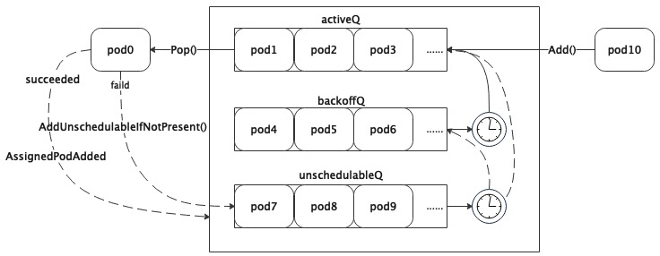

# 调度队列

## 调度队列中的Pod

```golang
// /pkg/scheduler/framework/types.go
// QueuedPodInfo is a Pod wrapper with additional information related to
// the pod's status in the scheduling queue, such as the timestamp when
// it's added to the queue.
type QueuedPodInfo struct {
    // 继承Pod的API类型
	*PodInfo
	// The time pod added to the scheduling queue.
	// Pod添加到调度队列的时间。因为Pod可能会频繁的从调度队列中取出(用于调度)然后再放入调度队列(不可调度)
	// 所以每次进入队列时都会记录入队列的时间，这个时间作用很大，后面在分析调度队列的实现的时候会提到。
	Timestamp time.Time
	// Number of schedule attempts before successfully scheduled.
	// It's used to record the # attempts metric.
	// Pod尝试调度的次数。应该说，正常的情况下Pod一次就会调度成功，但是在一些异常情况下（比如资源不足），Pod可能会被尝试调度多次
	Attempts int
	// The time when the pod is added to the queue for the first time. The pod may be added
	// back to the queue multiple times before it's successfully scheduled.
	// It shouldn't be updated once initialized. It's used to record the e2e scheduling
	// latency for a pod.
	// Pod第一次添加到调度队列的时间，Pod调度成功前可能会多次加回队列，这个变量可以用来计算Pod的调度延迟（即从Pod入队到最终调度成功所用时间）
	InitialAttemptTimestamp time.Time
	// If a Pod failed in a scheduling cycle, record the plugin names it failed by.
	UnschedulablePlugins sets.String
	// Whether the Pod is scheduling gated (by PreEnqueuePlugins) or not.
	Gated bool
}
```

## 堆（Heap）

在kube-scheduler中，堆既有map的高效检索能力，有具备slice的顺序，这对于调度队列来说非常关键。因为调度对象随时可能添加、删除、更新，需要有高效的检索能力快速找到对象，map非常适合。但是golang中的map是无序的，访问map还有一定的随机性（每次range的第一个对象是随机的）。而调度经常会因为优先级、时间、依赖等原因需要对对象排序，slice非常合适，所以就有了堆这个类型。

```golang
// /pkg/scheduler/internal/heap/heap.go
// Heap is a producer/consumer queue that implements a heap data structure.
// It can be used to implement priority queues and similar data structures.
type Heap struct {
	// data stores objects and has a queue that keeps their ordering according
	// to the heap invariant.
	// Heap继承了data
	data *data
	// metricRecorder updates the counter when elements of a heap get added or
	// removed, and it does nothing if it's nil
	// 监控相关，与本文内容无关
	metricRecorder metrics.MetricRecorder
}

// data is an internal struct that implements the standard heap interface
// and keeps the data stored in the heap.
type data struct {
	// items is a map from key of the objects to the objects and their index.
	// We depend on the property that items in the map are in the queue and vice versa.
	// 用map管理所有对象
	items map[string]*heapItem
	// queue implements a heap data structure and keeps the order of elements
	// according to the heap invariant. The queue keeps the keys of objects stored
	// in "items".
	// 在用slice管理所有对象的key，对象的key就是Pod的namespace+name，这是在kubernetes下唯一键
	queue []string

	// keyFunc is used to make the key used for queued item insertion and retrieval, and
	// should be deterministic.
	// 获取对象key的函数，毕竟对象是interface{}类型的
	keyFunc KeyFunc
	// lessFunc is used to compare two objects in the heap.
    // 判断两个对象哪个小的函数，了解sort.Sort()的读者此时应该能够猜到它是用来排序的。
    // 所以可以推断出来queue中key是根据lessFunc排过序的，而lessFunc又是传入进来的，
    // 这让Heap中对象的序可定制，这个非常有价值，非常有用
	lessFunc lessFunc
}

// 堆存储对象的定义
type heapItem struct {
   // 对象，更准确的说应该是指针，应用在调度队列中就是*QueuedPodInfo
	obj   interface{} // The object which is stored in the heap.
    // Heap.queue的索引
	index int         // The index of the object's key in the Heap.queue.
}
```

## 不可调度队列(UnschedulablePodsMap)

不可调度队列(UnschedulablePodsMap)管理暂时无法被调度（比如没有满足要求的Node）的Pod。虽然叫队列，其实是map实现，队列本质就是排队的缓冲，他与数据结构中的queue不是一个概念。

```go
// 不可调度Pod的队列，就是对map的一种封装，可以简单的把它理解为map就可以了
type UnschedulablePodsMap struct {
    // 本质就是一个map，keyFunc与堆一样，用来获取对象的key
    podInfoMap map[string]*framework.QueuedPodInfo
    keyFunc    func(*v1.Pod) string
    // 监控相关，与本文内容无关
    metricRecorder metrics.MetricRecorder
}
```

## 调度队列的抽象

```golang
// /pkg/scheduler/internal/queue/scheduling_queue.go
// SchedulingQueue is an interface for a queue to store pods waiting to be scheduled.
// The interface follows a pattern similar to cache.FIFO and cache.Heap and
// makes it easy to use those data structures as a SchedulingQueue.
type SchedulingQueue interface {
    // PodNominator其实与调度队列的功能关系不大，但是Pod在调度队列中的状态变化需要同步给PodNominator。
    // 本文不对PodNominator做详细说明，在其他后续分析调度器的文章中引用时再做说明。
	framework.PodNominator
	// 向队列中添加待调度的Pod，比如通过kubectl创建一个Pod时，kube-scheduler会通过该接口放入队列中.
	Add(pod *v1.Pod) error
	// Activate moves the given pods to activeQ iff they're in unschedulablePods or backoffQ.
	// The passed-in pods are originally compiled from plugins that want to activate Pods,
	// by injecting the pods through a reserved CycleState struct (PodsToActivate).
	Activate(pods map[string]*v1.Pod)
	// AddUnschedulableIfNotPresent adds an unschedulable pod back to scheduling queue.
	// The podSchedulingCycle represents the current scheduling cycle number which can be
	// returned by calling SchedulingCycle().
    // 把无法调度的Pod添加回调度队列，前提条件是Pod不在调度队列中。podSchedulingCycle是通过调用SchedulingCycle（）返回的当前调度周期号。
	AddUnschedulableIfNotPresent(pod *framework.QueuedPodInfo, podSchedulingCycle int64) error
	// SchedulingCycle returns the current number of scheduling cycle which is
	// cached by scheduling queue. Normally, incrementing this number whenever
	// a pod is popped (e.g. called Pop()) is enough.
	// 首先需要理解什么是调度周期，kube-scheduler没调度一轮算作一个周期。向调度队列添加Pod不能算作一个调度周期，因为没有执行调度动作。
	// 只有从调度队列中弹出（Pop）才会执行调度动作，当然可能因为某些原因调度失败了，但是也算调度了一次，所以调度周期是在Pop()接口中统计的。
	// 每次pop一个pod就会加一，可以理解为调度队列的一种特殊的tick。用该接口可以获取当前的调度周期。
	SchedulingCycle() int64
	// Pop removes the head of the queue and returns it. It blocks if the
	// queue is empty and waits until a new item is added to the queue.
	// 返回队列头部的pod，如果队列为空会被阻塞直到新的pod被添加到队列中.Add()和Pop()的组合有点数据结构中queue的感觉了，
	// 可能不是先入先出，这要通过lessFunc对Pod的进行排序，也就是本文后面提到的优先队列，按照Pod的优先级出队列。
	Pop() (*framework.QueuedPodInfo, error)
    // 更新pod
	Update(oldPod, newPod *v1.Pod) error
    // 删除pod
	Delete(pod *v1.Pod) error
   // 首选需要知道调度队列中至少包含activeQ和backoffQ，activeQ是所有ready等待调度的Pod，backoffQ是所有退避Pod。
   // 什么是退避？与退避三舍一个意思，退避的Pod不会被调度，即便优先级再高也没用。那退避到什么程度呢？调度队列用时间来衡量，比如1秒钟。
   // 对于kube-scheduler也是有退避策略的，退避时间按照尝试次数指数增长，但不是无限增长，有退避上限，默认的退避上限是10秒。
   // 在kube-scheduler中Pod退避的原因就是调度失败，退避就是为了减少无意义的频繁重试。
    // 把所有不可调度的Pod移到activeQ或者backoffQ中，至于哪些放到activeQ哪些放入backoffQ后面章节会有说明。
	MoveAllToActiveOrBackoffQueue(event framework.ClusterEvent, preCheck PreEnqueueCheck)
    // 当参数pod指向的Pod被调度后，把通过标签选择该Pod的所有不可调度的Pod移到activeQ，是不是有点绕？
    // 说的直白点就是当Pod1依赖(通过标签选择)Pod2时，在Pod2没有被调度前Pod1是不可调度的，当Pod2被调度后调度器就会调用该接口。
	AssignedPodAdded(pod *v1.Pod)
	// 与AssignedPodAdded一样，只是发生在更新时
	AssignedPodUpdated(pod *v1.Pod)
    // 获取所有挂起的Pod，其实就是队列中所有的Pod，因为调度队列中都是未调度（pending）的Pod
	PendingPods() ([]*v1.Pod, string)
	// Close closes the SchedulingQueue so that the goroutine which is
	// waiting to pop items can exit gracefully.
    // 关闭队列
	Close()
	// Run starts the goroutines managing the queue.
    // 启动协程管理队列
	Run()
}

```

## 优先队列(PriorityQueue)

优先队列（PriorityQueue）实现了调度队列（SchedulingQueue），优先队列的头部是优先级最高的挂起（Pending）Pod。
优先队列有三个子队列：
- 一个子队列包含准备好调度的Pod，称为activeQ（是堆类型）；
- 另一个队列包含已尝试并且确定为不可调度的Pod，称为unschedulableQ（UnschedulablePodsMap）；
- 第三个队列是backoffQ,包含从unschedulableQ移出的Pod，退避完成后的Pod将其移到activeQ。


```golang
// PriorityQueue implements a scheduling queue.
// The head of PriorityQueue is the highest priority pending pod. This structure
// has two sub queues and a additional data structure, namely: activeQ,
// backoffQ and unschedulablePods.
//   - activeQ holds pods that are being considered for scheduling.
//   - backoffQ holds pods that moved from unschedulablePods and will move to
//     activeQ when their backoff periods complete.
//   - unschedulablePods holds pods that were already attempted for scheduling and
//     are currently determined to be unschedulable.
type PriorityQueue struct {
	*nominator

	//这两个不解释了，比较简单
	stop  chan struct{}
	clock clock.Clock

	// pod initial backoff duration.
	// Pod的初始退避时间，默认值是1秒，可配置.当Pod调度失败后第一次的退避时间就是podInitialBackoffDuration。
	// 第二次尝试调度失败后的退避时间就是podInitialBackoffDuration*2，
	// 第三次是podInitialBackoffDuration*4以此类推
	podInitialBackoffDuration time.Duration
	// pod maximum backoff duration.
	// Pod的最大退避时间，默认值是10秒，可配置。因为退避时间随着尝试次数指数增长，这个变量就是退避时间的上限值
	podMaxBackoffDuration time.Duration
	// the maximum time a pod can stay in the unschedulablePods.
	podMaxInUnschedulablePodsDuration time.Duration

	cond sync.Cond

	// activeQ is heap structure that scheduler actively looks at to find pods to
	// schedule. Head of heap is the highest priority pod.
	// activeQ，是Heap类型
	activeQ *heap.Heap
	// podBackoffQ is a heap ordered by backoff expiry. Pods which have completed backoff
	// are popped from this heap before the scheduler looks at activeQ
    // backoffQ，也是Heap类型
	podBackoffQ *heap.Heap
	// unschedulablePods holds pods that have been tried and determined unschedulable.
    // unschedulableQ，详情见前面章节
	unschedulablePods *UnschedulablePods
	// schedulingCycle represents sequence number of scheduling cycle and is incremented
	// when a pod is popped.
    // 调度周期，在Pop()中自增，SchedulingCycle()获取这个值
	schedulingCycle int64
	// moveRequestCycle caches the sequence number of scheduling cycle when we
	// received a move request. Unschedulable pods in and before this scheduling
	// cycle will be put back to activeQueue if we were trying to schedule them
	// when we received move request.
    // 这个变量以调度周期为tick，记录上一次调用MoveAllToActiveOrBackoffQueue()的调度周期。
    // 因为调用AddUnschedulableIfNotPresent()接口的时候需要提供调度周期，当调度周期小于moveRequestCycle时，
    // 说明该不可调度Pod应该也被挪走，只是在调用接口的时候抢锁晚于MoveAllToActiveOrBackoffQueue()。具体后面会有代码注释
	moveRequestCycle int64

	clusterEventMap map[framework.ClusterEvent]sets.String
	// preEnqueuePluginMap is keyed with profile name, valued with registered preEnqueue plugins.
	preEnqueuePluginMap map[string][]framework.PreEnqueuePlugin

	// closed indicates that the queue is closed.
	// It is mainly used to let Pop() exit its control loop while waiting for an item.
	closed bool

	nsLister listersv1.NamespaceLister

	metricsRecorder metrics.MetricAsyncRecorder
	// pluginMetricsSamplePercent is the percentage of plugin metrics to be sampled.
	pluginMetricsSamplePercent int
}

```

根据优先队列的定义基本能够设想到实现调度队列的方法，接下来看看优先队列的具体实现。

### Add

```golang
// Add adds a pod to the active queue. It should be called only when a new pod
// is added so there is no chance the pod is already in active/unschedulable/backoff queues
func (p *PriorityQueue) Add(pod *v1.Pod) error {
   // 全程在锁的保护范围内，后续代码中都有相关的代码，不再赘述
	p.lock.Lock()
	defer p.lock.Unlock()
   // 把v1.Pod转成QueuedPodInfo，然后加入到activeQ。
   // 需要注意的是newQueuedPodInfo()会用当前时间设置pInfo.Timestamp和InitialAttemptTimestamp
	pInfo := p.newQueuedPodInfo(pod)
	gated := pInfo.Gated
	if added, err := p.addToActiveQ(pInfo); !added {
		return err
	}
    // 如果Pod在不可调度队列，那么从其中删除
	if p.unschedulablePods.get(pod) != nil {
		klog.ErrorS(nil, "Error: pod is already in the unschedulable queue", "pod", klog.KObj(pod))
		p.unschedulablePods.delete(pod, gated)
	}
    // 如果Pod在退避队列，那么从其中删除
	// Delete pod from backoffQ if it is backing off
	if err := p.podBackoffQ.Delete(pInfo); err == nil {
		klog.ErrorS(nil, "Error: pod is already in the podBackoff queue", "pod", klog.KObj(pod))
	}
	klog.V(5).InfoS("Pod moved to an internal scheduling queue", "pod", klog.KObj(pod), "event", PodAdd, "queue", activeQName)
	metrics.SchedulerQueueIncomingPods.WithLabelValues("active", PodAdd).Inc()
	p.addNominatedPodUnlocked(pInfo.PodInfo, nil)
   // 因为有新的Pod，所以需要唤醒所有被Pop()阻塞的协程，在注释Pop()的源码的时候会看到阻塞的部分。
	p.cond.Broadcast()

	return nil
}

```

### AddUnschedulableIfNotPresent
```golang
// AddUnschedulableIfNotPresent inserts a pod that cannot be scheduled into
// the queue, unless it is already in the queue. Normally, PriorityQueue puts
// unschedulable pods in `unschedulablePods`. But if there has been a recent move
// request, then the pod is put in `podBackoffQ`.
// 如果调度队列中没有指定的不可调度的Pod，则将其加入调度队列。通常，PriorityQueue将无法调度的Pod放入`unschedulableQ`中。
// 但是，如果最近调用过MoveAllToActiveOrBackoffQueue()，则将pod放入`podBackoffQ`中。
func (p *PriorityQueue) AddUnschedulableIfNotPresent(pInfo *framework.QueuedPodInfo, podSchedulingCycle int64) error {
	p.lock.Lock()
	defer p.lock.Unlock()
	pod := pInfo.Pod
    // 如果已经在不可调度队列存在，则返回错误
	if p.unschedulablePods.get(pod) != nil {
		return fmt.Errorf("Pod %v is already present in unschedulable queue", klog.KObj(pod))
	}

    // 只要在activeQ或者podBackoffQ存在也返回错误，完全符合接口中IfNotPresent的定义
	if _, exists, _ := p.activeQ.Get(pInfo); exists {
		return fmt.Errorf("Pod %v is already present in the active queue", klog.KObj(pod))
	}
	if _, exists, _ := p.podBackoffQ.Get(pInfo); exists {
		return fmt.Errorf("Pod %v is already present in the backoff queue", klog.KObj(pod))
	}

    // 更新Pod加入队列的时间戳，因为被重新加入队列。
    // Refresh the timestamp since the pod is re-added.
	pInfo.Timestamp = p.clock.Now()

	// If a move request has been received, move it to the BackoffQ, otherwise move
	// it to unschedulablePods.
	for plugin := range pInfo.UnschedulablePlugins {
		metrics.UnschedulableReason(plugin, pInfo.Pod.Spec.SchedulerName).Inc()
	}
   // 此处就是判断该Pod是不是属于上次MoveAllToActiveOrBackoffQueue()的范围，如果是就把Pod放到退避队列，否则放到不可调度队列。
   // 为什么不判断是否应该放入activeQ？因为刚刚更新了入队时间，是不可能退避完成的，所以直接放入backoffQ没毛病。
	if p.moveRequestCycle >= podSchedulingCycle {
		if err := p.podBackoffQ.Add(pInfo); err != nil {
			return fmt.Errorf("error adding pod %v to the backoff queue: %v", klog.KObj(pod), err)
		}
		klog.V(5).InfoS("Pod moved to an internal scheduling queue", "pod", klog.KObj(pod), "event", ScheduleAttemptFailure, "queue", backoffQName)
		metrics.SchedulerQueueIncomingPods.WithLabelValues("backoff", ScheduleAttemptFailure).Inc()
	} else {
		p.unschedulablePods.addOrUpdate(pInfo)
		klog.V(5).InfoS("Pod moved to an internal scheduling queue", "pod", klog.KObj(pod), "event", ScheduleAttemptFailure, "queue", unschedulablePods)
		metrics.SchedulerQueueIncomingPods.WithLabelValues("unschedulable", ScheduleAttemptFailure).Inc()

	}

	p.addNominatedPodUnlocked(pInfo.PodInfo, nil)
	return nil
}
```

### Pop

```golang

// Pop removes the head of the active queue and returns it. It blocks if the
// activeQ is empty and waits until a new item is added to the queue. It
// increments scheduling cycle when a pod is popped.
// 从调度队列中弹出一个需要调度的Pod
func (p *PriorityQueue) Pop() (*framework.QueuedPodInfo, error) {
	p.lock.Lock()
	defer p.lock.Unlock()
    // 如果activeQ中没有Pod，则阻塞协程，当然如果调度队列已经关闭了除外。
	for p.activeQ.Len() == 0 {
		// When the queue is empty, invocation of Pop() is blocked until new item is enqueued.
		// When Close() is called, the p.closed is set and the condition is broadcast,
		// which causes this loop to continue and return from the Pop().
		if p.closed {
			return nil, fmt.Errorf(queueClosed)
		}
		p.cond.Wait()
	}
    // 从activeQ弹出第一个Pod
	obj, err := p.activeQ.Pop()
	if err != nil {
		return nil, err
	}
    // 尝试调度的计数加1，调度周期加1，这些都比较容易理解
	pInfo := obj.(*framework.QueuedPodInfo)
	pInfo.Attempts++
	p.schedulingCycle++
	return pInfo, nil
}
```

### Update

```golang
// Update updates a pod in the active or backoff queue if present. Otherwise, it removes
// the item from the unschedulable queue if pod is updated in a way that it may
// become schedulable and adds the updated one to the active queue.
// If pod is not present in any of the queues, it is added to the active queue.
func (p *PriorityQueue) Update(oldPod, newPod *v1.Pod) error {
	p.lock.Lock()
	defer p.lock.Unlock()
    // 更新Pod就需要先找到他在哪个子队列，但只有oldPod不为空才会在activeQ或者backoffQ查找，这是为什么？
    // 既然是更新oldPod就不应该为nil，笔者猜测是版本更新历史遗留问题，当前版本调用该接口的地方保证了oldPod肯定不为nil，详情参看下面如下代码链接

    if oldPod != nil {
		oldPodInfo := newQueuedPodInfoForLookup(oldPod)
		// If the pod is already in the active queue, just update it there.
        // 如果Pod在activeQ中就更新它
		if oldPodInfo, exists, _ := p.activeQ.Get(oldPodInfo); exists {
			pInfo := updatePod(oldPodInfo, newPod)
			p.updateNominatedPodUnlocked(oldPod, pInfo.PodInfo)
			return p.activeQ.Update(pInfo)
		}
         // 如果Pod在backoffQ中，就把他从backoffQ中移除，更新后放到activeQ中，并唤醒所有因为Pop()阻塞的协程。
		 // 直接更新不行么？为什么需要从backoffQ移到activeQ？很简单，造成Pod退避的问题更新后可能就不存在了，所以立即再尝试调度一次。
		// If the pod is in the backoff queue, update it there.
		if oldPodInfo, exists, _ := p.podBackoffQ.Get(oldPodInfo); exists {
			pInfo := updatePod(oldPodInfo, newPod)
			p.updateNominatedPodUnlocked(oldPod, pInfo.PodInfo)
			return p.podBackoffQ.Update(pInfo)
		}
	}

	// If the pod is in the unschedulable queue, updating it may make it schedulable.
    // 如果Pod在unschedulableQ中，则更新它。
	if usPodInfo := p.unschedulablePods.get(newPod); usPodInfo != nil {
		pInfo := updatePod(usPodInfo, newPod)
		p.updateNominatedPodUnlocked(oldPod, pInfo.PodInfo)
         // 此处判断了Pod是否有更新，如果确实更新了就把他从unschedulableQ中移除，更新后放到activeQ中，道理和上面一样，不多说了。
         // 那么问题来了，为什么此处需要判断Pod是否确实更新了？为什么在backoffQ的处理代码中没有相应的判断？
         // 这就需要关联调度逻辑的上下文
		if isPodUpdated(oldPod, newPod) {
			gated := usPodInfo.Gated
			if p.isPodBackingoff(usPodInfo) {
				if err := p.podBackoffQ.Add(pInfo); err != nil {
					return err
				}
				p.unschedulablePods.delete(usPodInfo.Pod, gated)
				klog.V(5).InfoS("Pod moved to an internal scheduling queue", "pod", klog.KObj(pInfo.Pod), "event", PodUpdate, "queue", backoffQName)
			} else {
				if added, err := p.addToActiveQ(pInfo); !added {
					return err
				}
				p.unschedulablePods.delete(usPodInfo.Pod, gated)
				klog.V(5).InfoS("Pod moved to an internal scheduling queue", "pod", klog.KObj(pInfo.Pod), "event", BackoffComplete, "queue", activeQName)
				p.cond.Broadcast()
			}
		} else {
			// Pod update didn't make it schedulable, keep it in the unschedulable queue.
            // Pod没有实质的更新，那么就直接在unschedulableQ更新好了
			p.unschedulablePods.addOrUpdate(pInfo)
		}

		return nil
	}
	// If pod is not in any of the queues, we put it in the active queue.
    // 如果Pod没有在任何子队列中，那么就当新的Pod处理，为什么要有这个逻辑？
    // 1.正常的逻辑可能不会运行到这里，但是可能有某些异常情况，这里可以兜底，保证状态一致，没什么毛病。
    // 2.因为调度队列是支持并发的，在调用Update()的同时可能另一个协程刚刚删除了该Pod，更新其实就是覆盖，也约等于删除后添加。
	pInfo := p.newQueuedPodInfo(newPod)
	if added, err := p.addToActiveQ(pInfo); !added {
		return err
	}
	p.addNominatedPodUnlocked(pInfo.PodInfo, nil)
	klog.V(5).InfoS("Pod moved to an internal scheduling queue", "pod", klog.KObj(pInfo.Pod), "event", PodUpdate, "queue", activeQName)
	p.cond.Broadcast()
	return nil
}
```

### Delete

```golang
// Delete deletes the item from either of the two queues. It assumes the pod is
// only in one queue.
func (p *PriorityQueue) Delete(pod *v1.Pod) error {
	p.lock.Lock()
	defer p.lock.Unlock()
	p.deleteNominatedPodIfExistsUnlocked(pod)
	pInfo := newQueuedPodInfoForLookup(pod)
   // 删除实现比较简单，就是先从activeQ删除，如果删除失败多半是不存在，那么再从backoffQ和unschedulableQ删除。
	if err := p.activeQ.Delete(pInfo); err != nil {
		// The item was probably not found in the activeQ.
		p.podBackoffQ.Delete(pInfo)
		if pInfo = p.unschedulablePods.get(pod); pInfo != nil {
			p.unschedulablePods.delete(pod, pInfo.Gated)
		}
	}
	return nil
}
```

### ### MoveAllToActiveOrBackoffQueue

```golang
// MoveAllToActiveOrBackoffQueue moves all pods from unschedulablePods to activeQ or backoffQ.
// This function adds all pods and then signals the condition variable to ensure that
// if Pop() is waiting for an item, it receives the signal after all the pods are in the
// queue and the head is the highest priority pod.
func (p *PriorityQueue) MoveAllToActiveOrBackoffQueue(event framework.ClusterEvent, preCheck PreEnqueueCheck) {
	p.lock.Lock()
	defer p.lock.Unlock()
	p.moveAllToActiveOrBackoffQueue(event, preCheck)
}

// NOTE: this function assumes a lock has been acquired in the caller.
// moveAllToActiveOrBackoffQueue moves all pods from unschedulablePods to activeQ or backoffQ.
// This function adds all pods and then signals the condition variable to ensure that
// if Pop() is waiting for an item, it receives the signal after all the pods are in the
// queue and the head is the highest priority pod.
func (p *PriorityQueue) moveAllToActiveOrBackoffQueue(event framework.ClusterEvent, preCheck PreEnqueueCheck) {
    // 把map变成slice
	unschedulablePods := make([]*framework.QueuedPodInfo, 0, len(p.unschedulablePods.podInfoMap))
	for _, pInfo := range p.unschedulablePods.podInfoMap {
		if preCheck == nil || preCheck(pInfo.Pod) {
			unschedulablePods = append(unschedulablePods, pInfo)
		}
	}
    // 调用movePodsToActiveOrBackoffQueue把所有不可调度的Pod移到activeQ或者backoffQ.
	p.movePodsToActiveOrBackoffQueue(unschedulablePods, event)
}


// NOTE: this function assumes lock has been acquired in caller
// 把不可调度的Pod移到activeQ或者backoffQ
func (p *PriorityQueue) movePodsToActiveOrBackoffQueue(podInfoList []*framework.QueuedPodInfo, event framework.ClusterEvent) {
	activated := false
	for _, pInfo := range podInfoList {
		// If the event doesn't help making the Pod schedulable, continue.
		// Note: we don't run the check if pInfo.UnschedulablePlugins is nil, which denotes
		// either there is some abnormal error, or scheduling the pod failed by plugins other than PreFilter, Filter and Permit.
		// In that case, it's desired to move it anyways.
		if len(pInfo.UnschedulablePlugins) != 0 && !p.podMatchesEvent(pInfo, event) {
			continue
		}
		pod := pInfo.Pod
        // 判断Pod当前是否需要退避(判断方法见下面)，如果退避就放在backoffQ，当然放失败了还得放回unschedulableQ
		if p.isPodBackingoff(pInfo) {
			if err := p.podBackoffQ.Add(pInfo); err != nil {
				klog.ErrorS(err, "Error adding pod to the backoff queue", "pod", klog.KObj(pod))
			} else {
				klog.V(5).InfoS("Pod moved to an internal scheduling queue", "pod", klog.KObj(pInfo.Pod), "event", event, "queue", backoffQName)
				metrics.SchedulerQueueIncomingPods.WithLabelValues("backoff", event.Label).Inc()
				p.unschedulablePods.delete(pod, pInfo.Gated)
			}
		} else {
			gated := pInfo.Gated
            // Pod无需退避就放在activeQ，放失败了还得放回unschedulableQ
			if added, _ := p.addToActiveQ(pInfo); added {
				klog.V(5).InfoS("Pod moved to an internal scheduling queue", "pod", klog.KObj(pInfo.Pod), "event", event, "queue", activeQName)
				activated = true
				metrics.SchedulerQueueIncomingPods.WithLabelValues("active", event.Label).Inc()
				p.unschedulablePods.delete(pod, gated)
			}
		}
	}
    // 记录上一次移动的调度周期，在AddUnschedulableIfNotPresent()中用到了，到这里就比较清晰了。
	p.moveRequestCycle = p.schedulingCycle
	if activated {
		// 唤醒所有被Pop阻塞的协程，因为可能有Pod放入了activeQ。
		p.cond.Broadcast()
	}
}

// isPodBackingoff returns true if a pod is still waiting for its backoff timer.
// If this returns true, the pod should not be re-tried.
func (p *PriorityQueue) isPodBackingoff(podInfo *framework.QueuedPodInfo) bool {
	if podInfo.Gated {
		return false
	}
    // 获取Pod需要退避的时间(见下面)，如果退避完成时间比当前还要晚，那么就需要退避
	boTime := p.getBackoffTime(podInfo)
	return boTime.After(p.clock.Now())
}

// getBackoffTime returns the time that podInfo completes backoff
func (p *PriorityQueue) getBackoffTime(podInfo *framework.QueuedPodInfo) time.Time {
   // 计算退避时长
	duration := p.calculateBackoffDuration(podInfo)
    // 在加入队列的时间基础上+退避时长就是Pod的退避完成时间
	backoffTime := podInfo.Timestamp.Add(duration)
	return backoffTime
}

// calculateBackoffDuration is a helper function for calculating the backoffDuration
// based on the number of attempts the pod has made.
func (p *PriorityQueue) calculateBackoffDuration(podInfo *framework.QueuedPodInfo) time.Duration {
// 在初始退避时长基础上，每尝试调度一次就在退避时长基础上乘以2，如果超过最大退避时长则按照最大值退避。
// 这种方法比较常见，比如网络通信中连接失败，每次失败都等待一段时间再尝试连接，等待时间就是按照2的指数增长直到最大值。
	duration := p.podInitialBackoffDuration
	for i := 1; i < podInfo.Attempts; i++ {
		// Use subtraction instead of addition or multiplication to avoid overflow.
		if duration > p.podMaxBackoffDuration-duration {
			return p.podMaxBackoffDuration
		}
		duration += duration
	}
	return duration
}
```

### PendingPods

```golang

// PendingPods returns all the pending pods in the queue; accompanied by a debugging string
// recording showing the number of pods in each queue respectively.
// This function is used for debugging purposes in the scheduler cache dumper and comparer.
// PendingPods的实现就是把三个子队列的Pod放到一个slice里面返回，比较简单
func (p *PriorityQueue) PendingPods() ([]*v1.Pod, string) {
	p.lock.RLock()
	defer p.lock.RUnlock()
	var result []*v1.Pod
    // 先导出activeQ中的Pod
	for _, pInfo := range p.activeQ.List() {
		result = append(result, pInfo.(*framework.QueuedPodInfo).Pod)
	}
    // 再导出backoffQ中的Pod
	for _, pInfo := range p.podBackoffQ.List() {
		result = append(result, pInfo.(*framework.QueuedPodInfo).Pod)
	}
    // 最后导出unschedulableQ中的Pod
	for _, pInfo := range p.unschedulablePods.podInfoMap {
		result = append(result, pInfo.Pod)
	}
	return result, fmt.Sprintf(pendingPodsSummary, p.activeQ.Len(), p.podBackoffQ.Len(), len(p.unschedulablePods.podInfoMap))
}
```

### Run

```golang
// Run starts the goroutine to pump from podBackoffQ to activeQ
func (p *PriorityQueue) Run() {
   // 启动两个协程，一个定时刷backoffQ，一个定时刷unschedulableQ，至于wait.Until的实现读者自行了解，比较简单.
   // 为什么是两个协程，1个协程不行么？这个从两个协程的定时周期可以知道，不可调度的Pod刷新周期要远远低于退避协程.
   // 合成一个协程实现需要取最小刷新周期，如果不可调度Pod比较多，会带来很多无效的计算。
	go wait.Until(p.flushBackoffQCompleted, 1.0*time.Second, p.stop)
	go wait.Until(p.flushUnschedulablePodsLeftover, 30*time.Second, p.stop)
}

// flushBackoffQCompleted Moves all pods from backoffQ which have completed backoff in to activeQ
// 把所有退避完成的Pod放到activeQ
func (p *PriorityQueue) flushBackoffQCompleted() {
	p.lock.Lock()
	defer p.lock.Unlock()
	activated := false
	for {
        // 此处需要知道的是，退避队列是按照退避完成时间排序的队列，还记得Heap中的lessFunc么？退避队列的lessFunc就是比较退避完成时间
        // Peek是返回队列第一个Pod但不从队列中删除,如果队列中没有Pod就可以返回了
		rawPodInfo := p.podBackoffQ.Peek()
		if rawPodInfo == nil {
			break
		}
        // 如果第一个Pod的退避完成时间还没到，那么队列中的所有Pod也都没有完成退避，因为队列是按照退避完成时间排序的，这种队列比较常见，没什么解释的了。
		pInfo := rawPodInfo.(*framework.QueuedPodInfo)
		pod := pInfo.Pod
		if p.isPodBackingoff(pInfo) {
			break
		}
        // 弹出第一个Pod，因为Pod退避时间结束了
		_, err := p.podBackoffQ.Pop()
		if err != nil {
			klog.ErrorS(err, "Unable to pop pod from backoff queue despite backoff completion", "pod", klog.KObj(pod))
			break
		}
        // 把Pod加入activeQ
		if added, _ := p.addToActiveQ(pInfo); added {
			klog.V(5).InfoS("Pod moved to an internal scheduling queue", "pod", klog.KObj(pod), "event", BackoffComplete, "queue", activeQName)
			metrics.SchedulerQueueIncomingPods.WithLabelValues("active", BackoffComplete).Inc()
			activated = true
		}
	}

	if activated {
		p.cond.Broadcast()
	}
}

// flushUnschedulablePodsLeftover moves pods which stay in unschedulablePods
// longer than podMaxInUnschedulablePodsDuration to backoffQ or activeQ.
// 不可调度队列并不意味着Pod不再调度，kube-scheduler有一个不可调度的间隔，如果Pod放入unschedulableQ超过该时间间隔将会重新尝试调度
// 说的直白点，不可调度的Pod每隔unschedulableQTimeInterval(60秒，可以理解刷新周期是30秒了吧)还会再尝试调度的.
func (p *PriorityQueue) flushUnschedulablePodsLeftover() {
	p.lock.Lock()
	defer p.lock.Unlock()

    // 取出在unschedulableQ中呆的时间超过不可调度间隔的所有Pod
	var podsToMove []*framework.QueuedPodInfo
	currentTime := p.clock.Now()
	for _, pInfo := range p.unschedulablePods.podInfoMap {
		lastScheduleTime := pInfo.Timestamp
		if currentTime.Sub(lastScheduleTime) > p.podMaxInUnschedulablePodsDuration {
			podsToMove = append(podsToMove, pInfo)
		}
	}
    // 然后将这些Pod放到activeQ或者backoffQ中
	if len(podsToMove) > 0 {
		
		p.movePodsToActiveOrBackoffQueue(podsToMove, UnschedulableTimeout)
	}
}
```

### AssignedPodAdded/AssignedPodUpdated

```golang
// 这两个函数最终都是调用movePodsToActiveOrBackoffQueue把需要的Pod放入activeQ或者backoffQ的。
// 什么是需要的？getUnschedulablePodsWithMatchingAffinityTerm()给出了答案，简单说就是Pod的亲和性与指定另一个Pod有关，
// 比如Pod1不能与指定标签的Pod2在同一个Node上，那么Pod2没调度，Pod1是不能调度的，比较好理解吧。
// AssignedPodAdded is called when a bound pod is added. Creation of this pod
// may make pending pods with matching affinity terms schedulable.
func (p *PriorityQueue) AssignedPodAdded(pod *v1.Pod) {
	p.lock.Lock()
	p.movePodsToActiveOrBackoffQueue(p.getUnschedulablePodsWithMatchingAffinityTerm(pod), AssignedPodAdd)
	p.lock.Unlock()
}

// AssignedPodUpdated is called when a bound pod is updated. Change of labels
// may make pending pods with matching affinity terms schedulable.
func (p *PriorityQueue) AssignedPodUpdated(pod *v1.Pod) {
	p.lock.Lock()
	if isPodResourcesResizedDown(pod) {
		p.moveAllToActiveOrBackoffQueue(AssignedPodUpdate, nil)
	} else {
		p.movePodsToActiveOrBackoffQueue(p.getUnschedulablePodsWithMatchingAffinityTerm(pod), AssignedPodUpdate)
	}
	p.lock.Unlock()
}
```

### 其他

PriorityQueue.Close()，PriorityQueue.SchedulingCycle()等的实现过于简单，不做解释。


## 调度队列启动

调度器启动后最终是调用 Scheduler 的 Run() 方法来开始调度Pod

```golang
// /pkg/scheduler/scheduler.go
// Run begins watching and scheduling. It starts scheduling and blocked until the context is done.
func (sched *Scheduler) Run(ctx context.Context) {
	sched.SchedulingQueue.Run()

	// We need to start scheduleOne loop in a dedicated goroutine,
	// because scheduleOne function hangs on getting the next item
	// from the SchedulingQueue.
	// If there are no new pods to schedule, it will be hanging there
	// and if done in this goroutine it will be blocking closing
	// SchedulingQueue, in effect causing a deadlock on shutdown.
	go wait.UntilWithContext(ctx, sched.scheduleOne, 0)

	<-ctx.Done()
	sched.SchedulingQueue.Close()
}

```

Run() 方法中调用 SchedulingQueue 的 Run()方法，SchedulingQueue是一个队列接口

```golang
// NewSchedulingQueue initializes a priority queue as a new scheduling queue.
func NewSchedulingQueue(
	lessFn framework.LessFunc,
	informerFactory informers.SharedInformerFactory,
	opts ...Option) SchedulingQueue {
	return NewPriorityQueue(lessFn, informerFactory, opts...)
}

```

```golang
// 
// NewPriorityQueue creates a PriorityQueue object.
func NewPriorityQueue(
	lessFn framework.LessFunc,
	informerFactory informers.SharedInformerFactory,
	opts ...Option,
) *PriorityQueue {
	options := defaultPriorityQueueOptions
	if options.podLister == nil {
		options.podLister = informerFactory.Core().V1().Pods().Lister()
	}
	for _, opt := range opts {
		opt(&options)
	}

	comp := func(podInfo1, podInfo2 interface{}) bool {
		pInfo1 := podInfo1.(*framework.QueuedPodInfo)
		pInfo2 := podInfo2.(*framework.QueuedPodInfo)
		return lessFn(pInfo1, pInfo2)
	}

	pq := &PriorityQueue{
		nominator:                         newPodNominator(options.podLister),
		clock:                             options.clock,
		stop:                              make(chan struct{}),
		podInitialBackoffDuration:         options.podInitialBackoffDuration,
		podMaxBackoffDuration:             options.podMaxBackoffDuration,
		podMaxInUnschedulablePodsDuration: options.podMaxInUnschedulablePodsDuration,
		activeQ:                           heap.NewWithRecorder(podInfoKeyFunc, comp, metrics.NewActivePodsRecorder()),
		unschedulablePods:                 newUnschedulablePods(metrics.NewUnschedulablePodsRecorder(), metrics.NewGatedPodsRecorder()),
		moveRequestCycle:                  -1,
		clusterEventMap:                   options.clusterEventMap,
		preEnqueuePluginMap:               options.preEnqueuePluginMap,
		metricsRecorder:                   options.metricsRecorder,
		pluginMetricsSamplePercent:        options.pluginMetricsSamplePercent,
	}
	pq.cond.L = &pq.lock
	pq.podBackoffQ = heap.NewWithRecorder(podInfoKeyFunc, pq.podsCompareBackoffCompleted, metrics.NewBackoffPodsRecorder())
	pq.nsLister = informerFactory.Core().V1().Namespaces().Lister()

	return pq
}
```

从上面的初始化过程可以看到，PriorityQueue 实现了 SchedulingQueue 接口

kube-scheduler使用 PriorityQueue 优先级队列来存储待调度的 Pod，PriorityQueue 的头部元素是优先级最高的待调度的Pod，该结构有3个子队列：

- activeQ（活动队列）：用来存放等待调度的Pod
- podBackoffQ（回退队列）：如果调度任务反复执行失败，则会按尝试次数增加等待调度时间，降低重试效率，从而避免反复失败浪费调度资源。 对于调度失败的Pod会优先存储在 podBackoffQ 队列中，等待后续进行重试，podBackoffQ 可以认为就是重试的队列，只是后续再调度的等待时间会越来越长
- unschedulableQ（不可调度队列）：当Pod不能满足被调度的条件时就会被加入到 unschedulableQ，等待后续继续进行尝试调度


## 活动队列

activeQ 用来存放等待调度的Pod，在上面实例化优先级队列的过程中可以看到 activeQ 队列的初始化是通过调用 heap.NewWithRecorder() 函数实现的：

```golang
// NewWithRecorder wraps an optional metricRecorder to compose a Heap object.
func NewWithRecorder(keyFn KeyFunc, lessFn lessFunc, metricRecorder metrics.MetricRecorder) *Heap {
	return &Heap{
		data: &data{
			items:    map[string]*heapItem{},
			queue:    []string{},
			keyFunc:  keyFn,
			lessFunc: lessFn,
		},
		metricRecorder: metricRecorder,
	}
}

// lessFunc is a function that receives two items and returns true if the first
// item should be placed before the second one when the list is sorted.
type lessFunc = func(item1, item2 interface{}) bool

```

其中的 data 数据结构是一个标准的 heap 堆实现了heap.Interface 接口，然后 Heap 在 data 基础上增加了 metricRecorder 用于记录 metrics 数据。

这里最重要的就是用于比较元素优先级的 lessFunc 函数的实现，在初始化优先级队列时传入了一个 comp 的参数，这个参数就是activeQ这个堆的 lessFunc 函数的实现：

```golang
   comp := func(podInfo1, podInfo2 interface{}) bool {
		pInfo1 := podInfo1.(*framework.QueuedPodInfo)
		pInfo2 := podInfo2.(*framework.QueuedPodInfo)
		return lessFn(pInfo1, pInfo2)
	}

```

最终是调用的创建 Scheduler 对象的时候传入的 lessFn 参数： 

```golang
profiles[options.profiles[0].SchedulerName].QueueSortFunc(),
```

可以看到比较元素优先级是通过调度框架的 QueueSortFunc() 方法来实现的，对应的实现代码如下：

```golang
// /pkg/scheduler/framework/runtime/framework.go
// QueueSortFunc returns the function to sort pods in scheduling queue
func (f *frameworkImpl) QueueSortFunc() framework.LessFunc {
	if f == nil {
		// If frameworkImpl is nil, simply keep their order unchanged.
		// NOTE: this is primarily for tests.
		return func(_, _ *framework.QueuedPodInfo) bool { return false }
	}

	if len(f.queueSortPlugins) == 0 {
		panic("No QueueSort plugin is registered in the frameworkImpl.")
	}

	// Only one QueueSort plugin can be enabled.
	return f.queueSortPlugins[0].Less
}
```

最终真正用于优先级队列元素优先级比较的函数是通过 QueueSort 插件来实现的，默认启用的 QueueSort 插件是 PrioritySort，PrioritySort 插件的实现核心就是Less()方法：

```golang
// /pkg/scheduler/framework/plugins/queuesort/priority_sort.go
// PrioritySort is a plugin that implements Priority based sorting.
type PrioritySort struct{}

var _ framework.QueueSortPlugin = &PrioritySort{}

// Name returns name of the plugin.
func (pl *PrioritySort) Name() string {
	return Name
}

// Less is the function used by the activeQ heap algorithm to sort pods.
// It sorts pods based on their priority. When priorities are equal, it uses
// PodQueueInfo.timestamp.
func (pl *PrioritySort) Less(pInfo1, pInfo2 *framework.QueuedPodInfo) bool {
	p1 := corev1helpers.PodPriority(pInfo1.Pod)
	p2 := corev1helpers.PodPriority(pInfo2.Pod)
	return (p1 > p2) || (p1 == p2 && pInfo1.Timestamp.Before(pInfo2.Timestamp))
}

```

```golang
// /k8s.io/component-helpers/scheduling/corev1/helpers.go
// PodPriority returns priority of the given pod.
func PodPriority(pod *v1.Pod) int32 {
	if pod.Spec.Priority != nil {
		return *pod.Spec.Priority
	}
	// When priority of a running pod is nil, it means it was created at a time
	// that there was no global default priority class and the priority class
	// name of the pod was empty. So, we resolve to the static default priority.
	return 0
}

```

activeQ活动队列中的Pod是依靠PrioritySort插件来进行优先级比较的，每个Pod在被创建后都会有一个priority属性来标记Pod的优先级，也可以通过全局的ProrityClass对象来进行定义，然后在调度Pod的时候会先根据Pod优先级的高低进行比较，如果优先级相同，则会根据Pod的创建时间进行比较，越高优先级的Pod越被优先调度，越早创建的Pod越被优先调度

## Pod是如何加到activeQ活动队列

```golang
// /pkg/scheduler/scheduler.go
// New returns a Scheduler
func New(client clientset.Interface,
	informerFactory informers.SharedInformerFactory,
	dynInformerFactory dynamicinformer.DynamicSharedInformerFactory,
	recorderFactory profile.RecorderFactory,
	stopCh <-chan struct{},
	opts ...Option) (*Scheduler, error) {
	
	// ...

	addAllEventHandlers(sched, informerFactory, dynInformerFactory, unionedGVKs(clusterEventMap))

	return sched, nil


}
```

在创建 Scheduler.New() 对象时有调用 addAllEventHandlers()方法，其中就有对未调度Pod的时间监听处理操作


```golang
// /pkg/scheduler/eventhandlers.go
// addAllEventHandlers is a helper function used in tests and in Scheduler
// to add event handlers for various informers.
func addAllEventHandlers(
	sched *Scheduler,
	informerFactory informers.SharedInformerFactory,
	dynInformerFactory dynamicinformer.DynamicSharedInformerFactory,
	gvkMap map[framework.GVK]framework.ActionType,
) {
	//...
	// unscheduled pod queue
	informerFactory.Core().V1().Pods().Informer().AddEventHandler(
		cache.FilteringResourceEventHandler{
			FilterFunc: func(obj interface{}) bool {
				switch t := obj.(type) {
				case *v1.Pod:
					return !assignedPod(t) && responsibleForPod(t, sched.Profiles)
				case cache.DeletedFinalStateUnknown:
					if pod, ok := t.Obj.(*v1.Pod); ok {
						// The carried object may be stale, so we don't use it to check if
						// it's assigned or not.
						return responsibleForPod(pod, sched.Profiles)
					}
					utilruntime.HandleError(fmt.Errorf("unable to convert object %T to *v1.Pod in %T", obj, sched))
					return false
				default:
					utilruntime.HandleError(fmt.Errorf("unable to handle object in %T: %T", sched, obj))
					return false
				}
			},
			Handler: cache.ResourceEventHandlerFuncs{
				AddFunc:    sched.addPodToSchedulingQueue,
				UpdateFunc: sched.updatePodInSchedulingQueue,
				DeleteFunc: sched.deletePodFromSchedulingQueue,
			},
		},
	)
    // ...
}
```

当Pod有事件变化后，先通过 FilterFunc 函数进行过滤，如果 Pod 没有绑定到节点（未调度）并且使用的是指定的调度器才能进入下面的 Handler 函数进行处理，

比如当创建Pod之后就会有onAdd的添加事件，这里调用的就是 sched.addPodToSchedulingQueue 函数

```golang
// /pkg/scheduler/eventhandlers.go
func (sched *Scheduler) addPodToSchedulingQueue(obj interface{}) {
	pod := obj.(*v1.Pod)
	klog.V(3).InfoS("Add event for unscheduled pod", "pod", klog.KObj(pod))
	if err := sched.SchedulingQueue.Add(pod); err != nil {
		utilruntime.HandleError(fmt.Errorf("unable to queue %T: %v", obj, err))
	}
}

```

addPodToSchedulingQueue() 方法中调用调度队列 SchedulingQueue 的 Add() 方法添加到优先级队列中：


# 总结

提供一个简单的图总结一下调度队列：


1. 虽然名字上叫做调度队列，但是实际上都是按照map组织的，其实map也是一种队列，只是序是按照对象的key排列的（需要注意的是golang中的map是无序的），此处需要与数据结构中介绍的queue区分开。在调度过程中会频繁的判断对象是否已经存在（有一个高大上的名字叫幂等）、是否不存在，从一个子队列挪到另一个子队列，伴随添加、删除、更新等操作，map相比于其他数据结构是有优势的。
2. 调度队列虽然用map组织了Pod，同时用Pod的key的slice对Pod进行排序，这样更有队列的样子了。
3. 调度队列分为三个自队列：
    1. activeQ：即ready队列，里面都是准备调度的Pod，新添加的Pod都会被放到该队列，从调度队列中弹出需要调度的Pod也是从该队列获取；
    2. unschedulableQ：不可调度队列，里面有各种原因造成无法被调度Pod；
    3. backoffQ：退避队列，里面都是需要可以调度但是需要退避一段时间后才能调度的Pod；
4. 新创建的Pod通过Add()接口将Pod放入activeQ。
   调度器每调度一个Pod都需要调用Pop()接口获取一个Pod，如果调度失败需要调用AddUnschedulableIfNotPresent()把Pod返回到调度队列中，如果调度成功了调用AssignedPodAdded()把依赖的Pod从unschedulableQ挪到activeQ或者backoffQ。
5. 调度队列后台每30秒刷一次unschedulableQ，如果入队列已经超过unschedulableQTimeInterval(60秒)，则将Pod从unschedulableQ移到activeQ，当然，如果还在退避时间内，只能放入backoffQ。
6. 调度队列后台每1秒刷一次backoffQ，把退避完成的所有Pod从backoffQ移到activeQ。
7. 虽然调度队列的实现是优先队列，但是基本没看到优先级相关的内容，是因为创建优先队列的时候需要传入lessFunc，该函数决定了activeQ的顺序，也就是调度优先级。所以调度优先级是可自定义的。
8. Add()和AddUnschedulableIfNotPresent()会设置Pod入队列时间戳，这个时间戳会用来计算Pod的退避时间、不可调度时间。

问：默认的初始和最大退避时间是1秒和10秒，而unschedulableQTimeInterval是60秒。也就是说定时刷unschedulableQ都是找入队列60秒以上的Pod，肯定超过最大的退避时间10秒，肯定是放入activeQ，那还要backoffQ干什么？

答：1.初始和最大退避时间是可配置的；2.不可调度Pod不是只有后台刷一种激活方法，MoveAllToActiveOrBackoffQueue()，AssignedPodAdded()，AssignedPodUpdated()都会激活Pod。
