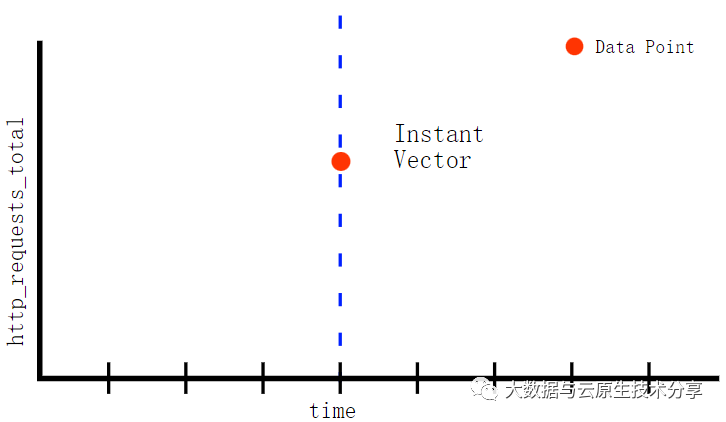
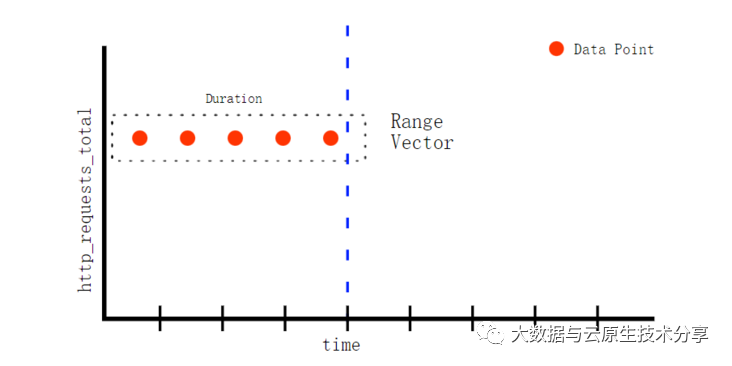
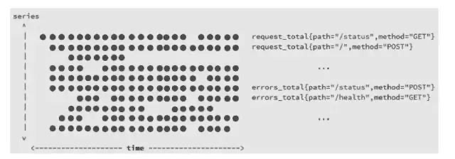
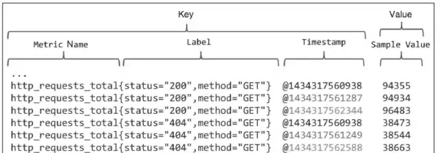
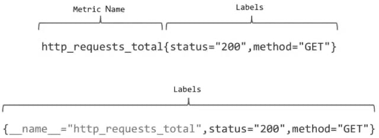
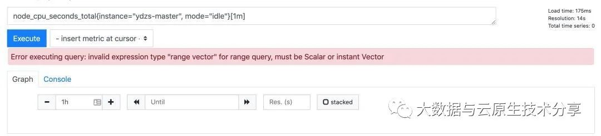
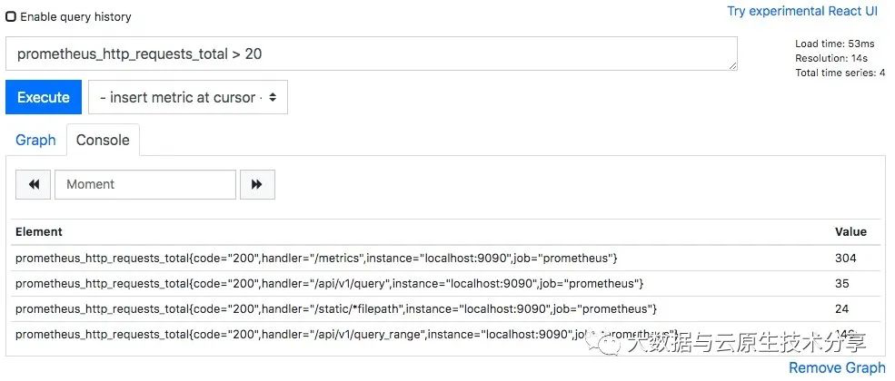

# 一、PromQL介绍

PromQL（Prometheus Query Language）为Prometheus tsdb的查询语言。是结合grafana进行数据展示和告警规则的配置的关键部分。

- 官方文档：https://prometheus.io/docs/prometheus/latest/querying/basics/

# 二、四种指标类型

- counter（计数器）
- gauge （仪表类型）
- histogram（直方图类型）
- summary （摘要类型）

##  counter（计数器）

Counter (只增不减的计数器) 类型的指标其工作方式和计数器一样，只增不减。

常见的监控指标，如 http_requests_total、 node_cpu_seconds_total 都是 Counter 类型的监控指标。

在 node-exporter 返回的样本数据中，其注释中也包含了该样本的类型。例如：

```shell
# HELP node_cpu_seconds_total Seconds the cpus spent in each mode.
# TYPE node_cpu_seconds_total counter
node_cpu_seconds_total{cpu="cpu0",mode="idle"} 362812.7890625

```
- \#HELP：解释当前指标的含义，上面表示在每种模式下node节点的cpu花费的时间，以s为单位。
- \#TYPE：说明当前指标的数据类型，上面是counter类型。

counter 是一个简单但又强大的工具，例如我们可以在应用程序中记录某些事件发生的次数，通过以时间序列的形式存储这些数据，我们可以轻松的了解该事件产生的速率变化。

PromQL 内置的聚合操作和函数可以让用户对这些数据进行进一步的分析，例如，通过 rate() 函数获取 HTTP 请求量的增长率：

```shell
rate(http_requests_total[5m])
```

查询当前系统中，访问量前 10 的 HTTP 请求：

```shell

topk(10, http_requests_total)

```

## gauge （仪表类型）

与 Counter 不同， Gauge（可增可减的仪表盘）类型的指标侧重于反应系统的当前状态。因此这类指标的样本数据可增可减。

常见指标如：node_memory_MemFree_bytes（主机当前空闲的内存大小）、 node_memory_MemAvailable_bytes（可用内存大小）都是 Gauge 类型的监控指标。

通过 Gauge 指标，用户可以直接查看系统的当前状态：

```shell

node_memory_MemFree_bytes

```

对于 Gauge 类型的监控指标，通过 PromQL 内置函数 delta() 可以获取样本在一段时间范围内的变化情况。

例如，计算 CPU 温度在两个小时内的差异：

```shell

delta(cpu_temp_celsius{host="zeus"}[2h])

```

还可以直接使用 predict_linear() 对数据的变化趋势进行预测。

例如，预测系统磁盘空间在4个小时之后的剩余情况：

```shell

predict_linear(node_filesystem_free_bytes[1h], 4 * 3600)

```


## Histogram（直方图类型） 和 Summary（摘要类型）

除了 Counter 和 Gauge 类型的监控指标以外，Prometheus 还定义了 Histogram 和 Summary 的指标类型。

Histogram 和 Summary 主用用于统计和分析样本的分布情况。

- 在大多数情况下人们都倾向于使用某些量化指标的平均值，例如 CPU 的平均使用率、页面的平均响应时间，这种方式也有很明显的问题，以系统 API 调用的平均响应时间为例：如果大多数 API 请求都维持在 100ms 的响应时间范围内，而个别请求的响应时间需要 5s，那么就会导致某些 WEB 页面的响应时间落到中位数上，而这种现象被称为长尾问题。

- 为了区分是平均的慢还是长尾的慢，最简单的方式就是按照请求延迟的范围进行分组。例如，统计延迟在 0~10ms 之间的请求数有多少而 10~20ms 之间的请求数又有多少。通过这种方式可以快速分析系统慢的原因。
- Histogram 和 Summary 都是为了能够解决这样的问题存在的，通过 Histogram 和 Summary 类型的监控指标，我们可以快速了解监控样本的分布情况。


例如，指标 prometheus_tsdb_wal_fsync_duration_seconds 的指标类型为 Summary。它记录了 Prometheus Server 中 wal_fsync 的处理时间，通过访问 Prometheus Server 的 /metrics 地址，可以获取到以下监控样本数据：

```shell

# HELP prometheus_tsdb_wal_fsync_duration_seconds Duration of WAL fsync.
# TYPE prometheus_tsdb_wal_fsync_duration_seconds summary
prometheus_tsdb_wal_fsync_duration_seconds{quantile="0.5"} 0.012352463
prometheus_tsdb_wal_fsync_duration_seconds{quantile="0.9"} 0.014458005
prometheus_tsdb_wal_fsync_duration_seconds{quantile="0.99"} 0.017316173
prometheus_tsdb_wal_fsync_duration_seconds_sum 2.888716127000002
prometheus_tsdb_wal_fsync_duration_seconds_count 216

```

从上面的样本中可以得知当前 Prometheus Server 进行 wal_fsync 操作的总次数为216次，耗时2.888716127000002s。其中中位数（quantile=0.5）的耗时为0.012352463，9分位数（quantile=0.9）的耗时为0.014458005s。


在 Prometheus Server 自身返回的样本数据中，我们还能找到类型为 Histogram 的监控指标 prometheus_tsdb_compaction_chunk_range_seconds_bucket：

```shell

# HELP prometheus_tsdb_compaction_chunk_range_seconds Final time range of chunks on their first compaction
# TYPE prometheus_tsdb_compaction_chunk_range_seconds histogram
prometheus_tsdb_compaction_chunk_range_seconds_bucket{le="100"} 71
prometheus_tsdb_compaction_chunk_range_seconds_bucket{le="400"} 71
prometheus_tsdb_compaction_chunk_range_seconds_bucket{le="1600"} 71
prometheus_tsdb_compaction_chunk_range_seconds_bucket{le="6400"} 71
prometheus_tsdb_compaction_chunk_range_seconds_bucket{le="25600"} 405
prometheus_tsdb_compaction_chunk_range_seconds_bucket{le="102400"} 25690
prometheus_tsdb_compaction_chunk_range_seconds_bucket{le="409600"} 71863
prometheus_tsdb_compaction_chunk_range_seconds_bucket{le="1.6384e+06"} 115928
prometheus_tsdb_compaction_chunk_range_seconds_bucket{le="6.5536e+06"} 2.5687892e+07
prometheus_tsdb_compaction_chunk_range_seconds_bucket{le="2.62144e+07"} 2.5687896e+07
prometheus_tsdb_compaction_chunk_range_seconds_bucket{le="+Inf"} 2.5687896e+07
prometheus_tsdb_compaction_chunk_range_seconds_sum 4.7728699529576e+13
prometheus_tsdb_compaction_chunk_range_seconds_count 2.5687896e+07

```

与 Summary 类型的指标相似之处在于 Histogram 类型的样本同样会反应当前指标的记录的总数(以 _count 作为后缀)以及其值的总量（以 _sum 作为后缀）。

不同在于 Histogram 指标直接反应了在不同区间内样本的个数，区间通过标签 le 进行定义。


# 三、表达式四种数据类型

PromQL查询语句即表达式，实现的四种数据类型：

- 瞬时向量（Instant vector）：一组时间序列，每个时间序列包含单个样本，它们共享相同的时间戳。也就是说，表达式的返回值中只会包含该时间序列中最新的一个样本值。

- 区间向量（Range vector）：一组时间序列，每个时间序列包含一段时间范围内的样本数据。

- 标量（Scalar）：一个浮点型的数据值，没有时序。可以写成[-]（digits）[.（digits）]的形式。需要注意的是，使用表达式count（http_requests_total）返回的数据类型依然是瞬时向量，用户可以通过内置函数scalar()将单个瞬时向量转换为标量。

- 字符串（String）：一个简单的字符串值。字符串可以用单引号（''）、双引号（""）或反引号（``）来指定。


## 瞬时向量（Instant vector）

Instance vector（瞬时向量）表示一个时间序列的集合，但是每个时序只有最近的一个点，而不是线。




## 区间向量（Range vector）

Range vector（范围向量）表示一段时间范围里的时序，每个时序可包含多个点




## 标量（Scalar）

Scalar（标量）通常为数值，可以将只有一个时序的Instance vector转换成Scalar。

## 字符串（String）

一个简单的字符串值。字符串可以用单引号（''）、双引号（""）或反引号（``）来指定。

# 四、时间序列（向量）

按照时间顺序记录系统、设备状态变化的数据，每个数据成为一个样本。

- 数据采集以特定的时间周期进行，因而，随着时间流逝，将这些样本数据记录下来，将生成一个离散的样本数据序列。

- 该序列也称为向量（Vector）,以时间轴为横坐标、序列为纵坐标，这些数据点连接起来就会形成一个矩阵。



1）时间序列的构成

每条时间序列（Time Series）是通过指标名称（Metrics name）和一组标签集（Label set）来命名的。

如果time相同，但是指标名称或者标签集不同，那么时间序列也不同。

2）样本构成

矩阵中每一个点都可称为一个样本（Sample），样本主要由3方面构成。

- 指标（Metrics）：包括指标名称（Metrics name）和一组标签集（Label set）名称，如request_total{path="/status"，method="GET"}。
- 时间戳（TimeStamp）：这个值默认精确到毫秒。
- 样本值（Value）：这个值默认使用Float64浮点类型。

时间序列的指标（Metrics）存储格式为key-value。



http_request_total{status="200"，method="GET"}@1434417560938=>94355为例，在Key-Value关系中，94355作为Value（也就是样本值Sample Value），前面的http_request_total{status="200"，method="GET"}@1434417560938一律作为Key。

3）key的组成

- Metric Name：指标名（例子中的http_request_total）
- Label：标签（例子中的{status="200"，method="GET"}）
- Timestamp：时间戳（例子中的@1434417560938）

Prometheus Metrics两种表现形式：



# 五、标签过滤器4种运算符

- =：与字符串匹配
- !=：与字符串不匹配
- =~：与正则匹配
- !~：与正则不匹配

1）匹配器（Matcher）

匹配器是作用于标签上的，标签匹配器可以对时间序列进行过滤，Prometheus支持完全匹配和正则匹配两种模式：完全匹配和正则表达式匹配。

2）完全匹配

1、相等匹配器（=）

相等匹配器（Equality Matcher），用于选择与提供的字符串完全相同的标签。下面介绍的例子中就会使用相等匹配器按照条件进行一系列过滤。

```shell

node_cpu_seconds_total{instance="yd-master"}
```

2、不相等匹配器（!=）

不相等匹配器（Negative Equality Matcher），用于选择与提供的字符串不相同的标签。它和相等匹配器是完全相反的。举个例子，如果想要查看job并不是HelloWorld的HTTP请求总数，可以使用如下不相等匹配器。

3）正则表达式匹配

1、正则表达式匹配器（=~）

正则表达式匹配器（Regular Expression Matcher），用于选择与提供的字符串进行正则运算后所得结果相匹配的标签。Prometheus的正则运算是强指定的，比如正则表达式a只会匹配到字符串a，而并不会匹配到ab或者ba或者abc。如果你不想使用这样的强指定功能，可以在正则表达式的前面或者后面加上“.*”。

```shell
node_cpu_seconds_total{instance=~"ydzs-.*", mode="idle"}
```

2、正则表达式相反匹配器（!~） 

正则表达式相反匹配器（Negative Regular Expression Matcher），用于选择与提供的字符串进行正则运算后所得结果不匹配的标签。因为PromQL的正则表达式基于RE2的语法，但是RE2不支持向前不匹配表达式，所以!~的出现是作为一种替代方案，以实现基于正则表达式排除指定标签值的功能。在一个选择器当中，可以针对同一个标签来使用多个匹配器。比如下面的例子，可以实现查找job名是node且安装在/prometheus目录下，但是并不在/prometheus/user目录下的所有文件系统并确定其大小。

```shell

node_filesystem_size_bytes{job="node",mountpoint=~"/prometheus/.*", mountpoint!~ "/prometheus/user/.*"}

```


# 六、范围选择器

我们可以通过将时间范围选择器（[]）(https://prometheus.io/docs/prometheus/latest/querying/basics/#range-vector-selectors)附加到查询语句中，指定为每个返回的区间向量样本值中提取多长的时间范围。每个时间戳的值都是按时间倒序记录在时间序列中的，该值是从时间范围内的时间戳获取的对应的值。

时间范围通过数字来表示，单位可以使用以下其中之一的时间单位：

- s - 秒
- m - 分钟
- h - 小时
- d - 天
- w - 周
- y - 年

比如 node_cpu_seconds_total{instance="ydzs-master",mode="idle"} 这个查询语句，如果添加上 [1m] 这个时间范围选择器，则我们可以得到如下所示的信息：

```shell

node_cpu_seconds_total{instance="ydzs-master",mode="idle"}[5m]

```




这是因为现在每一个时间序列中都有多个时间戳多个值，所以没办法渲染，必须是标量或者瞬时向量才可以绘制图形。

不过通常区间向量都会应用一个函数后变成可以绘制的瞬时向量，Prometheus 中对瞬时向量和区间向量有很多操作的函数(https://prometheus.io/docs/prometheus/latest/querying/functions)，不过对于区间向量来说最常用的函数并不多，使用最频繁的有如下几个函数：

- rate(): 计算整个时间范围内区间向量中时间序列的每秒平均增长率。
- irate(): 仅使用时间范围中的最后两个数据点来计算区间向量中时间序列的每秒平均增长率， irate 只能用于绘制快速变化的序列，在长期趋势分析或者告警中更推荐使用 rate 函数。
- increase(): 计算所选时间范围内时间序列的增量，它基本上是速率乘以时间范围选择器中的秒数。

# 七、PromQL 运算符

1）数学运算符

> 数学运算符比较简单，就是简单的加减乘除等。
>

例如：我们通过 prometheus_http_response_size_bytes_sum 可以查询到 Prometheus 这个应用的 HTTP 响应字节总和。但是这个单位是字节，我们希望用 MB 显示。那么我们可以这么设置：prometheus_http_response_size_bytes_sum/8/1024。

PromQL支持的所有数学运算符如下所示：

- \+ (加法)
- \- (减法)
- \* (乘法)
- / (除法)
- % (求余)
- ^ (幂运算)

2）布尔运算符

> 布尔运算符支持用户根据时间序列中样本的值，对时间序列进行过滤
> 
>

例如：我们可以通过 prometheus_http_requests_total 查询出每个接口的请求次数，但是如果我们想筛选出请求次数超过 20 次的接口呢？

此时我们可以用下面的 PromQL 表达式：

```shell
prometheus_http_requests_total > 20

```




从上面的图中我们可以看到，value 的值还是具体的数值。但如果我们希望对符合条件的数据，value 变为 1。不符合条件的数据，value 变为 0。那么我们可以使用bool修饰符。

我们使用下面的 PromQL 表达式：

```shell
prometheus_http_requests_total > bool 20
```

目前，Prometheus支持以下布尔运算符如下：

- ==（相等）
- !=（不相等）
- \>（大于）
- <（小于）
- \>=（大于或等于）
- <=（小于或等于）

3）集合运算符

通过集合运算，可以在两个瞬时向量与瞬时向量之间进行相应的集合操作。目前，Prometheus支持以下集合运算符：

- and 与操作
- or 或操作
- unless 排除操作

1、and 与操作

> vector1 and vector2 进行一个与操作，会产生一个新的集合。该集合中的元素同时在 vector1 和 vector2 中都存在。
>

2、or 或操作

> vector1 and vector2 进行一个或操作，会产生一个新的集合。该集合中包含 vector1 和 vector2 中的所有元素。
>

例如：我们有 vector1 为 A B C，vector2 为 B C D，那么 vector1 or vector2 的结果为：A B C D。


3、unless 排除操作


> vector1 and vector2 进行一个或操作，会产生一个新的集合。该集合首先取 vector1 集合的所有元素，然后排除掉所有在 vector2 中存在的元素。
>

例如：我们有 vector1 为 A B C，vector2 为 B C D，那么 vector1 unless vector2 的结果为：A。


4）操作符优先级

在PromQL操作符中优先级由高到低依次为：

- ^
- *, /, %
- +, -
- ==, !=, <=, <, >=, >
- and, unless


# 八、PromQL 内置函数

Prometheus 提供了其它大量的内置函数，可以对时序数据进行丰富的处理。某些函数有默认的参数，例如：year(v=vector(time()) instant-vector)。其中参数 v 是一个瞬时向量，如果不提供该参数，将使用默认值 vector(time())。instant-vector 表示参数类型。

1） abs()

```shell
abs(v instant-vector) 返回输入向量的所有样本的绝对值。
```
2）absent()

absent(v instant-vector)，如果传递给它的向量参数具有样本数据，则返回空向量；如果传递的向量参数没有样本数据，则返回不带度量指标名称且带有标签的时间序列，且样本值为1。

当监控度量指标时，如果获取到的样本数据是空的， 使用 absent 方法对告警是非常有用的。例如：


```shell

# 这里提供的向量有样本数据
absent(http_requests_total{method="get"})  => no data
absent(sum(http_requests_total{method="get"}))  => no data

# 由于不存在度量指标 nonexistent，所以 返回不带度量指标名称且带有标签的时间序列，且样本值为1
absent(nonexistent{job="myjob"})  => {job="myjob"}  1
# 正则匹配的 instance 不作为返回 labels 中的一部分
absent(nonexistent{job="myjob",instance=~".*"})  => {job="myjob"}  1

# sum 函数返回的时间序列不带有标签，且没有样本数据
absent(sum(nonexistent{job="myjob"}))  => {}  1


```

3）ceil()

ceil(v instant-vector) 将 v 中所有元素的样本值向上四舍五入到最接近的整数。例如：

```shell
node_load5{instance="192.168.1.75:9100"} # 结果为 2.79
ceil(node_load5{instance="192.168.1.75:9100"}) # 结果为 3

```

4）changes()

changes(v range-vector) 输入一个区间向量， 返回这个区间向量内每个样本数据值变化的次数（瞬时向量）。例如：

```shell

# 如果样本数据值没有发生变化，则返回结果为 1
changes(node_load5{instance="192.168.1.75:9100"}[1m]) # 结果为 1


```

5）clamp_max()

clamp_max(v instant-vector, max scalar)函数，输入一个瞬时向量和最大值，样本数据值若大于 max，则改为 max，否则不变。例如：

```shell
node_load5{instance="192.168.1.75:9100"} # 结果为 2.79
clamp_max(node_load5{instance="192.168.1.75:9100"}, 2) # 结果为 2
```

6）clamp_min()

clamp_min(v instant-vector, min scalar)函数，输入一个瞬时向量和最小值，样本数据值若小于 min，则改为 min，否则不变。例如：

```shell
node_load5{instance="192.168.1.75:9100"} # 结果为 2.79
clamp_min(node_load5{instance="192.168.1.75:9100"}, 3) # 结果为 3
```

7）day_of_month()

day_of_month(v=vector(time()) instant-vector)函数，返回被给定 UTC 时间所在月的第几天。返回值范围：1~31。

8）day_of_week()

day_of_week(v=vector(time()) instant-vector) 函数，返回被给定 UTC 时间所在周的第几天。返回值范围：0~6，0 表示星期天。

9）days_in_month()

days_in_month(v=vector(time()) instant-vector)函数，返回当月一共有多少天。返回值范围：28~31。


10）delta()

delta(v range-vector)的参数是一个区间向量，返回一个瞬时向量。它计算一个区间向量 v 的第一个元素和最后一个元素之间的差值。由于这个值被外推到指定的整个时间范围，所以即使样本值都是整数，你仍然可能会得到一个非整数值。

例如，下面的例子返回过去两小时的 CPU 温度差：

```shell
delta(cpu_temp_celsius{host="zeus"}[2h])
```

11）deriv()

deriv(v range-vector)的参数是一个区间向量,返回一个瞬时向量。它使用简单的线性回归计算区间向量 v 中各个时间序列的导数。这个函数一般只用在 Gauge 类型的时间序列上。


12）exp()

exp(v instant-vector) 函数，输入一个瞬时向量，返回各个样本值的 e 的指数值，即 e 的 N 次方。当 N 的值足够大时会返回 +Inf。特殊情况为：

```shell
Exp(+Inf) = +Inf
Exp(NaN) = NaN

```

13）floor()

floor(v instant-vector)函数与 ceil() 函数相反，将 v 中所有元素的样本值向下四舍五入到最接近的整数。

14）histogram_quantile()

histogram_quantile(φ float, b instant-vector) 从 bucket 类型的向量 b 中计算 φ (0 ≤ φ ≤ 1) 分位数（百分位数的一般形式）的样本的最大值。（有关 φ 分位数的详细说明以及直方图指标类型的使用，请参阅直方图和摘要）。向量 b 中的样本是每个 bucket 的采样点数量。每个样本的 labels 中必须要有 le 这个 label 来表示每个 bucket 的上边界，没有 le 标签的样本会被忽略。直方图指标类型自动提供带有 _bucket 后缀和相应标签的时间序列。可以使用 rate() 函数来指定分位数计算的时间窗口。

例如：一个直方图指标名称为 employee_age_bucket_bucket，要计算过去 10 分钟内 第 90 个百分位数，请使用以下表达式：

```shell
histogram_quantile(0.9, rate(employee_age_bucket_bucket[10m]))
```

返回：

```shell
{instance="10.0.86.71:8080",job="prometheus"} 35.714285714285715
```

这表示最近 10 分钟之内 90% 的样本的最大值为 35.714285714285715。

15）holt_winters()

holt_winters(v range-vector, sf scalar, tf scalar)函数基于区间向量 v，生成时间序列数据平滑值。平滑因子 sf 越低, 对旧数据的重视程度越高。趋势因子 tf 越高，对数据的趋势的考虑就越多。其中，0< sf, tf <=1。holt_winters 仅适用于 Gauge 类型的时间序列。

16）hour()

hour(v=vector(time()) instant-vector)函数返回被给定 UTC 时间的当前第几个小时，时间范围：0~23。

17）idelta()

idelta(v range-vector)的参数是一个区间向量, 返回一个瞬时向量。它计算最新的 2 个样本值之间的差值。 这个函数一般只用在 Gauge 类型的时间序列上。

18）increase()

increase(v range-vector)函数获取区间向量中的第一个和最后一个样本并返回其增长量, 它会在单调性发生变化时(如由于采样目标重启引起的计数器复位)自动中断。

由于这个值被外推到指定的整个时间范围，所以即使样本值都是整数，你仍然可能会得到一个非整数值。

例如：以下表达式返回区间向量中每个时间序列过去 5 分钟内 HTTP 请求数的增长数：

```shell
increase(http_requests_total{job="apiserver"}[5m])
```

increase 的返回值类型只能是计数器类型，主要作用是增加图表和数据的可读性。使用 rate 函数记录规则的使用率，以便持续跟踪数据样本值的变化。

19）irate()

irate(v range-vector) 函数用于计算区间向量的增长率，但是其反应出的是瞬时增长率。irate 函数是通过区间向量中最后两个两本数据来计算区间向量的增长速率，它会在单调性发生变化时(如由于采样目标重启引起的计数器复位)自动中断。这种方式可以避免在时间窗口范围内的“长尾问题”，并且体现出更好的灵敏度，通过irate函数绘制的图标能够更好的反应样本数据的瞬时变化状态。

例如：以下表达式返回区间向量中每个时间序列过去 5 分钟内最后两个样本数据的 HTTP 请求数的增长率：

```shell
irate(http_requests_total{job="api-server"}[5m])
```

20）label_join()

label_join(v instant-vector, dst_label string, separator string, src_label_1 string, src_label_2 string, ...)

函数可以将时间序列 v 中多个标签 src_label 的值，通过 separator 作为连接符写入到一个新的标签 dst_label 中。可以有多个 src_label 标签。

例如：以下表达式返回的时间序列多了一个 foo 标签，标签值为 etcd,etcd-k8s：

```shell
up{endpoint="api",instance="192.168.123.248:2379",job="etcd",namespace="monitoring",service="etcd-k8s"}
=> up{endpoint="api",instance="192.168.123.248:2379",job="etcd",namespace="monitoring",service="etcd-k8s"}  1

label_join(up{endpoint="api",instance="192.168.123.248:2379",job="etcd",namespace="monitoring",service="etcd-k8s"}, "foo", ",", "job", "service")
=> up{endpoint="api",foo="etcd,etcd-k8s",instance="192.168.123.248:2379",job="etcd",namespace="monitoring",service="etcd-k8s"}  1

```

21）label_replace()

为了能够让客户端的图标更具有可读性，可以通过 label_replace 函数为时间序列添加额外的标签。label_replace 的具体参数如下：

```shell
label_replace(v instant-vector, dst_label string, replacement string, src_label string, regex string)
```

该函数会依次对 v 中的每一条时间序列进行处理，通过 regex 匹配 src_label 的值，并将匹配部分 relacement 写入到 dst_label 标签中。如下所示：

```shell
label_replace(up, "host", "$1", "instance",  "(.*):.*")
```

函数处理后，时间序列将包含一个 host 标签，host 标签的值为 Exporter 实例的 IP 地址：

```shell
up{host="localhost",instance="localhost:8080",job="cadvisor"}   1
up{host="localhost",instance="localhost:9090",job="prometheus"}   1
up{host="localhost",instance="localhost:9100",job="node"}   1
```

22）ln()

ln(v instant-vector) 计算瞬时向量 v 中所有样本数据的自然对数。特殊情况：

- ln(+Inf) = +Inf
- ln(0) = -Inf
- ln(x < 0) = NaN
- ln(NaN) = NaN

23）log2()

log2(v instant-vector)函数计算瞬时向量 v 中所有样本数据的二进制对数。特殊情况同上。

24）log10()

log10(v instant-vector) 计算瞬时向量 v 中所有样本数据的十进制对数。特殊情况同上。

25）minute()

minute(v=vector(time()) instant-vector)函数返回给定 UTC 时间当前小时的第多少分钟。结果范围：0~59。

26）month()

month(v=vector(time()) instant-vector)函数返回给定 UTC 时间当前属于第几个月，结果范围：0~12。

27）predict_linear()

predict_linear(v range-vector, t scalar)函数可以预测时间序列 v 在 t 秒后的值。它基于简单线性回归的方式，对时间窗口内的样本数据进行统计，从而可以对时间序列的变化趋势做出预测。该函数的返回结果不带有度量指标，只有标签列表。

例如，基于 2 小时的样本数据，来预测主机可用磁盘空间的是否在 4 个小时候被占满，可以使用如下表达式:

```shell
predict_linear(node_filesystem_free{job="node"}[2h], 4 * 3600) < 0
```

28）rate()

rate(v range-vector) 函数可以直接计算区间向量 v 在时间窗口内平均增长速率，它会在单调性发生变化时(如由于采样目标重启引起的计数器复位)自动中断。该函数的返回结果不带有度量指标，只有标签列表。

例如，以下表达式返回区间向量中每个时间序列过去 5 分钟内 HTTP 请求数的每秒增长率：

```shell
rate(http_requests_total[5m])

结果：
{code="200",handler="label_values",instance="120.77.65.193:9090",job="prometheus",method="get"} 0
{code="200",handler="query_range",instance="120.77.65.193:9090",job="prometheus",method="get"}  0
{code="200",handler="prometheus",instance="120.77.65.193:9090",job="prometheus",method="get"}   0.2
...
```

rate() 函数返回值类型只能用计数器，在长期趋势分析或者告警中推荐使用这个函数。

注意：

> 当将 rate() 函数与聚合运算符（例如 sum()）或随时间聚合的函数（任何以 _over_time 结尾的函数）一起使用时，
> 必须先执行rate 函数，然后再进行聚合操作，否则当采样目标重新启动时 rate() 无法检测到计数器是否被重置。

29）resets()


resets(v range-vector)的参数是一个区间向量。对于每个时间序列，它都返回一个计数器重置的次数。两个连续样本之间的值的减少被认为是一次计数器重置。

这个函数一般只用在计数器类型的时间序列上。


30）round()

round(v instant-vector, to_nearest=1 scalar) 函数与 ceil 和 floor 函数类似，返回向量中所有样本值的最接近的整数。

to_nearest 参数是可选的,默认为 1,表示样本返回的是最接近 1 的整数倍的值。你也可以将该参数指定为任意值（也可以是小数），表示样本返回的是最接近它的整数倍的值。


31）scalar()

scalar(v instant-vector)函数的参数是一个单元素的瞬时向量,它返回其唯一的时间序列的值作为一个标量。

如果度量指标的样本数量大于 1 或者等于 0, 则返回 NaN。


32） sort()

sort(v instant-vector)函数对向量按元素的值进行升序排序，返回结果：key: value = 度量指标：样本值[升序排列]。

33）sort_desc()

sort(v instant-vector) 函数对向量按元素的值进行降序排序，返回结果：key: value = 度量指标：样本值[降序排列]。

34） sqrt()

sqrt(v instant-vector) 函数计算向量 v 中所有元素的平方根。


35）time()

time()函数返回从 1970-01-01 到现在的秒数。注意：它不是直接返回当前时间，而是时间戳

36）timestamp()

timestamp(v instant-vector) 函数返回向量 v 中的每个样本的时间戳（从 1970-01-01 到现在的秒数）。

该函数从 Prometheus 2.0 版本开始引入。


37）vector()

vector(s scalar)函数将标量 s 作为没有标签的向量返回，即返回结果为：key: value= {}, s。

38）year()

year(v=vector(time()) instant-vector)函数返回被给定 UTC 时间的当前年份。

39）<aggregation>_over_time()

下面的函数列表允许传入一个区间向量，它们会聚合每个时间序列的范围，并返回一个瞬时向量：

```shell
avg_over_time(range-vector) : 区间向量内每个度量指标的平均值。
min_over_time(range-vector) : 区间向量内每个度量指标的最小值。
max_over_time(range-vector) : 区间向量内每个度量指标的最大值。
sum_over_time(range-vector) : 区间向量内每个度量指标的求和。
count_over_time(range-vector) : 区间向量内每个度量指标的样本数据个数。
quantile_over_time(scalar, range-vector) : 区间向量内每个度量指标的样本数据值分位数，φ-quantile (0 ≤ φ ≤ 1)。
stddev_over_time(range-vector) : 区间向量内每个度量指标的总体标准差。
stdvar_over_time(range-vector) : 区间向量内每个度量指标的总体标准方差。
12345678
```
注意：

> 即使区间向量内的值分布不均匀，它们在聚合时的权重也是相同的。
> 

# 八、PromQL 聚合操作

Prometheus 还提供了聚合操作符，这些操作符作用于瞬时向量。可以将瞬时表达式返回的样本数据进行聚合，形成一个新的时间序列。目前支持的聚合函数有：

- sum (求和)
- min (最小值)
- max (最大值)
- avg (平均值)
- stddev (标准差)
- stdvar (标准方差)
- count (计数)
- count_values (对value进行计数)
- bottomk (后n条时序)
- topk (前n条时序)


1）sum 求和

用于对记录的 value 值进行求和。

例如：sum(prometheus_http_requests_total) 表示统计所有 HTTP 请求的次数。

```shell
sum(prometheus_http_requests_total)
```

2）min 最小值
返回所有记录的最小值。

例如：min(prometheus_http_requests_total) 表示获取数据集合中的最小值。

```shell
min(prometheus_http_requests_total)
```

3）max 最大值

返回所有记录的最大值。

例如：maxmetheus_http_requests_total)` 表示获取数据集合中的最大值。

```shell
max(prometheus_http_requests_total)
```


4）avg 平均值

avg 函数返回所有记录的平均值。

例如：avg(metheus_http_requests_total) 表示获取数据集合中的平均值。

```shell
avg(prometheus_http_requests_total)
```


5）stddev 标准差

标准差（Standard Deviation）常用来描述数据的波动大小。

例如： 统计出不同 HTTP 请求的数量波动情况。
```shell
stddev(prometheus_http_requests_total)

```

6）count 计数

count 函数返回所有记录的计数。

例如：count(prometheus_http_requests_total) 表示统计所有 HTTP 请求的次数。
```shell
count(prometheus_http_requests_total)
```

7）bottomk 后几条

bottomk 用于对样本值进行排序，返回当前样本值后 N 位的时间序列。

例如：获取 HTTP 请求量后 5 位的请求，可以使用表达式：

```shell
bottomk(5, prometheus_http_requests_total)
```


8）topk 前几条

topk 用于对样本值进行排序，返回当前样本值前 N 位的时间序列。

例如：获取 HTTP 请求量前 5 位的请求，可以使用表达式：

```shell
topk(5, prometheus_http_requests_total)
```

# 九、PromQL 非法总结

由于所有的PromQL表达式必须至少包含一个指标名称，或者至少有一个不会匹配到空字符串的标签过滤器，因此结合Prometheus官方文档，可以梳理出如下非法示例。

```shell
{job=~".*"} # 非法！ .*表示任意一个字符,这就包括空字符串，且还没有指标名称

{job=""}    # 非法！

{job!=""}   # 非法！
```

相反，如下表达式是合法的。

```shell
{job=~".+"}               # 合法！.+表示至少一个字符

{job=~".*",method="get"}  # 合法！.*表示任意一个字符

{job="",method="post"}    # 合法！存在一个非空匹配

{job=~".+",method="post"} # 合法！存在一个非空匹配
```


# Reference

* https://mp.weixin.qq.com/s/LT_LmHKptAVawWm227oDuA