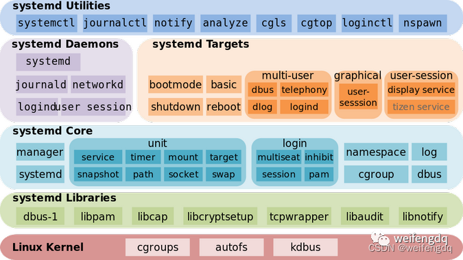

# top 
如何快速定位

1、找到最耗CPU进程

2、找到最耗CPU线程

3、找到线程堆栈信息

4、找到问题代码并处置

定位工具top

top [-] [d] [p] [q] [c] [C] [S] [n]

参数：

d：指定每两次屏幕信息刷新之间的时间间隔，当然用户可以使用s交互命令来改变之

p：通过指定监控进程ID来仅仅监控某个进程的状态

q：该选项将使top没有任何延ch迟的进行刷新。如果调用程序有超级用户权限，那么top将以尽可能高的优先级运行

S：指定累计模式

s：使top命令在安全模式中运行。这将去除交互命令所带来的潜在危险

i：使top不显示任何闲置或者僵死进程

c：显示整个命令行而不只是显示命令名

H：显示线程

1、找到最耗CPU的进程
执行top -c ，显示进程运行信息列表，c参数作用是显示整个命令行
键入P (大写p)，进程按照CPU使用率排序

2、找到最耗CPU的线程
top -Hp 1 显示一个进程的线程运行信息列表，参数H就是显示线程，参数p则是仅仅监控pid
键入P (大写p)，线程按照CPU使用率排序

3、找到线程堆栈信息

3.1 将线程PID转化为16进制，需要使用命令 printf "%x\n" 线程PID

[root@devops-01 /]# printf "%x\n" 750

3.2 根据查到进程下线程750过滤得到堆栈信息，此时需要使用命令

jstack 进程PID | grep '线程PID' -C5 --color

jstack 1 | grep '2ee' -C5 --color


# java 定位


# systemed

Linux 从关闭到运行, 完整的启动和启动过程有三个主要部分:

硬件启动(Hardware boot): 初始化系统硬件
* Linux 引导(Linux boot): 加载 Linux 内核，然后加载 systemd
* Linux 启动(Linux startup): systemd为主机做好生产性工作的准备
* systemd 是一个软件套件, 充当系统和服务管理器, 软件平台, 以及作为应用程序和内核之间的粘合剂. 一般作为 PID 1 运行, 是引导期间启动的第一个进程, 也是关机期间终止的最后一个进程. 常见的发行版 Arch Linux, Debian, Ubuntu, Dedora 等都启用了 systemd.

System and Service Manager (systemd.io)
systemd/systemd: The systemd System and Service Manager (github.com), 目前最新的版本为v252
systemd - Wikipedia



但 systemd 主要作者的 Peottering 说过 systemd 的开发是 never finished, never complete, but tracking progress of technology, 因此组件或架构也在不断变化着, 如现在的12种Unit类型:

* service
* socket
* device (automatically initiated by systemd)
* mount
* automount
* swap
* target
* path
* timer (which can be used as a cron-like job scheduler)
* snapshot
* slice (used to group and manage processes and resources)
* scope (used to group worker processes, isn't intended to be configured via unit files)

## systemctl

常用命令
```shell
# 列出正在运行的Unit, systemctl list-units 或者直接
systemctl

# 列出所有Unit
systemctl list-units --all
# 列出加载失败的Unit, 类型为12种里面的service
systemctl list-units --failed --type=service
# 列出所有ACTIVE   状态为 inactive 的Unit
systemctl list-units --all --state=inactive

# 启动服务
systemctl start xxx.service
# 停止服务
systemctl stop xxx.service
# 重启服务(热启动)
systemctl restart xxx.service
# 重载服务(冷启动)
systemctl reload xxx.service
# 查看状态
systemctl status xxx

# 使能(创建符号链接, 开机启动)
systemctl enable xxx
# 禁止(删除符号链接)
systemctl disable xxx
# 查看是否使能
systemctl is-enabled xxx

# 配置文件修改需要 reload units, 但还不会打断之前服务的运行
sudo systemctl daemon-reload

```

## journalctl

systemd 日志配置文件为 /etc/systemd/journald.conf, 可以直接查看或者通过以下命令查看

```shell

systemd-analyze cat-config systemd/journald.conf

```

日志默认的保存目录是  /var/log/journal/(持久性存储persistent) 或 /run/log/journal(易失性存储volatile) , 里面默认存的是二进制日志以节省空间, 除了记录日志本身外, 还会记录大量元数据, 可以用 journalctl 工具查看日志文本, 然后再配合其它命令筛选, 查询或导出

journalctl, Query the journal. 用于查询日志

```shell

# 从旧到新打印系统日志 journalctl --system 或者
journalctl
# 从新到旧
journalctl -r

# 打印当前用户的日志, 一般开机自启程序当前用户指的root
journalctl --user

# 查看指定服务的日志
journalctl -u xxx

# 查看指定服务的日志, 不分页
journalctl --no-paper -u xxx

# 持续跟踪指定服务的日志
journalctl -f -u xxx
journalctl -f -u xxx -u yyy

# 查看日志占用磁盘空间
journalctl --disk-usage

# 按照 大小 数量 时间 设置/清理日志 1G 1years
journalctl
     --vacuum-size=BYTES     Reduce disk usage below specified size
     --vacuum-files=INT      Leave only the specified number of journal files
     --vacuum-time=TIME      Remove journal files older than specified time
     
# 验证日志文件的完整性
journalctl --verify

# 查看某个时间段的日志, --since today 或者
journalctl --since "2023-01-05 16:50:00" --until "2023-01-05 16:51:00"

# 查看本次启动后的日志, -b 或 
journalctl --boot
# 查看记录的过往启动的简明信息, 如 -9~0
journalctl -list-boots
# 查看上次启动的日志
journalctl --boot=-1
# 查看最新的10行日志
journalctl --boot --lines=10

# 日志级别
# 0 emerg Emerge系统不可用
# 1 alert Alert必须立即采取行动
# 2 crit Crit紧急情况
# 3 err Err非紧急的错误
# 4 warning Warnning警告
# 5 notice Notice普通但值得注意的事件
# 6 info Info信息
# 7 debug Debug调试

# 指定日志级别查看
journalctl -p err --lines=10
journalctl -p 3 -u xxx.service
# 查看上次启动的err信息
journalctl -b -1 -p err
# 查看上次启动的err信息的最后10行
journalctl -b -1 -p err -n 10

# json 输出
journalctl -b -u xxx.service -o json
journalctl -b -u xxx.service -o json-pretty

# 查看内核日志, 和 dmesg 打印出的类似
journalctl -k

```

配置可以参考:

* journalctl 清理journal日志 - Colin88 - 博客园 (cnblogs.com)
* Linux系统查看日志命令journalctl的一些用法 - 知乎 (zhihu.com)
* 使用journalctl查看systemd日志 - 暗无天日 (lujun9972.win)
* 44. 日志管理之systemd日志,持久化设置,journal,systemd-journald,查看日志(journalctl)_51CTO博客_systemd查看日志


